# Awesome AI Design Prompts

> The most-used AI design prompts, **ranked by real usage** (not vibes). Each one has a live preview and runs in one click. Mirrored from the [Superdesign](https://superdesign.dev/library) prompt library.

<!-- badges: fill OWNER/REPO on publish -->
  

**964 prompts and counting.** These are the top 120, ranked by how many real builders copied and ran them. Browse all and try any live at **[superdesign.dev/library](https://superdesign.dev/library?utm_source=github&utm_medium=prompt-repo&utm_campaign=prompt-library)**.

## Why this list is different

| | Most prompt lists | This one |
|---|---|---|
| Ranking | Curated by opinion | **Ranked by real usage** (copies + tries) |
| Format | Text to paste | **Live preview + one-click run** |
| Freshness | Manual, goes stale | **Auto-synced** from a live product |
| Prompt | One-liner | **Structured design spec** (style + layout + tokens) |

## Contents

- [Landing Pages](#landing-pages) (38)
- [Design Systems & Styles](#design-systems--styles) (22)
- [Components](#components) (19)
- [Animations & Backgrounds](#animations--backgrounds) (27)
- [Mobile Apps](#mobile-apps) (6)
- [E-commerce](#e-commerce) (6)
- [Portfolios](#portfolios) (2)
- [Superdesign vs other AI design tools](#superdesign-vs-other-ai-design-tools)
- [FAQ](#faq)
- [Contributing](#contributing)

## Landing Pages

| Preview | Prompt | Copies | |
|---|---|---|---|
|  | **[High Contrast Landing Page](prompts/high-contrast-landing-page/)** landing page, style | 2,503 | [▶ Try live](https://superdesign.dev/library/high-contrast-landing-page?utm_source=github&utm_medium=prompt-repo&utm_campaign=prompt-library) |
|  | **[Deep Red Style](prompts/deep-red-style-5b01cb/)** style, page | 2,321 | [▶ Try live](https://superdesign.dev/library/deep-red-style-5b01cb?utm_source=github&utm_medium=prompt-repo&utm_campaign=prompt-library) |
|  | **[Lumina SaaS Landing Page](prompts/lumina-saas-landing-page/)** bold, energetic, yellow | 2,259 | [▶ Try live](https://superdesign.dev/library/lumina-saas-landing-page?utm_source=github&utm_medium=prompt-repo&utm_campaign=prompt-library) |
|  | **[Red Noir Style](prompts/red-noir-style/)** style, landing page, page | 2,162 | [▶ Try live](https://superdesign.dev/library/red-noir-style?utm_source=github&utm_medium=prompt-repo&utm_campaign=prompt-library) |
|  | **[Glassmorphism Style](prompts/glassmorphism-style/)** landing page, page, style | 1,713 | [▶ Try live](https://superdesign.dev/library/glassmorphism-style?utm_source=github&utm_medium=prompt-repo&utm_campaign=prompt-library) |
|  | **[Mosaic Grid Architecture Style](prompts/mosaic-grid-architecture-style/)** neutral, low contrast, forestgreen accent | 1,688 | [▶ Try live](https://superdesign.dev/library/mosaic-grid-architecture-style?utm_source=github&utm_medium=prompt-repo&utm_campaign=prompt-library) |
|  | **[Kinetic Orange Style](prompts/kinetic-orange-style/)** landing page, style, page | 1,613 | [▶ Try live](https://superdesign.dev/library/kinetic-orange-style?utm_source=github&utm_medium=prompt-repo&utm_campaign=prompt-library) |
|  | **[Cinematic Style](prompts/cinematic-style/)** landing page, page, style | 1,362 | [▶ Try live](https://superdesign.dev/library/cinematic-style?utm_source=github&utm_medium=prompt-repo&utm_campaign=prompt-library) |
|  | **[Luxury-focused Design System](prompts/luxury-focused-design-system/)** landing page, style, cream | 1,350 | [▶ Try live](https://superdesign.dev/library/luxury-focused-design-system?utm_source=github&utm_medium=prompt-repo&utm_campaign=prompt-library) |
|  | **[Neural Noir Interface Style](prompts/neural-noir-interface-style/)** landing page, page, style | 1,280 | [▶ Try live](https://superdesign.dev/library/neural-noir-interface-style?utm_source=github&utm_medium=prompt-repo&utm_campaign=prompt-library) |
|  | **[Nature Inspired Style](prompts/nature-inspired-style/)** landing page, page, style | 1,272 | [▶ Try live](https://superdesign.dev/library/nature-inspired-style?utm_source=github&utm_medium=prompt-repo&utm_campaign=prompt-library) |
|  | **[Glassmorphism card](prompts/glassmorphism-card/)** landing page, page, style | 1,250 | [▶ Try live](https://superdesign.dev/library/glassmorphism-card?utm_source=github&utm_medium=prompt-repo&utm_campaign=prompt-library) |
| 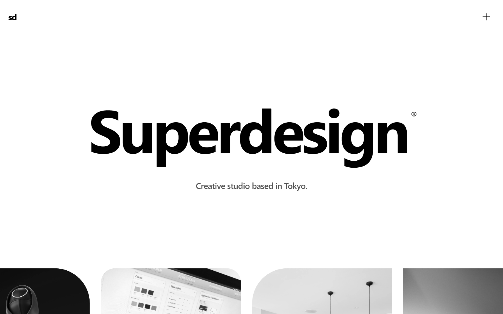 | **[Bold Editorial Studio Style](prompts/bold-editorial-studio-style/)** landing page, page, style | 1,216 | [▶ Try live](https://superdesign.dev/library/bold-editorial-studio-style?utm_source=github&utm_medium=prompt-repo&utm_campaign=prompt-library) |
|  | **[Synapse](prompts/synapse/)** landing page, page, style | 1,110 | [▶ Try live](https://superdesign.dev/library/synapse?utm_source=github&utm_medium=prompt-repo&utm_campaign=prompt-library) |
| 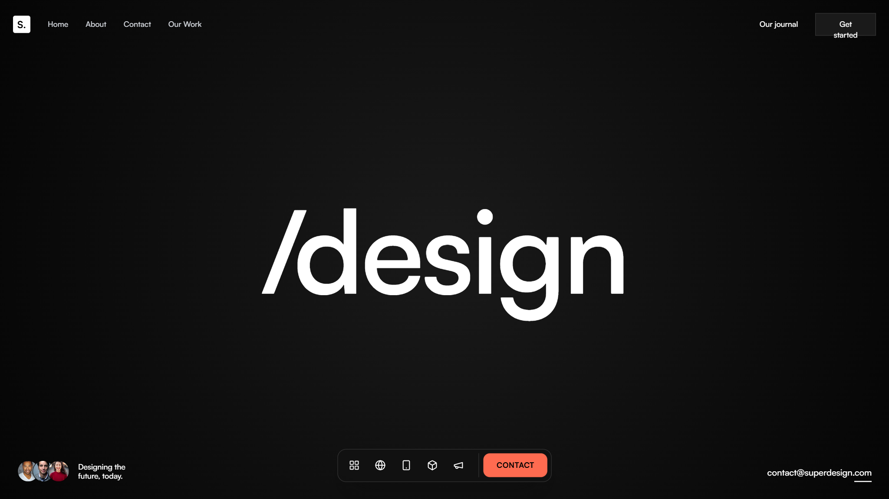 | **[Midnight Editorial Style](prompts/midnight-editorial-style-5f0a22/)** landing page, page, style | 963 | [▶ Try live](https://superdesign.dev/library/midnight-editorial-style-5f0a22?utm_source=github&utm_medium=prompt-repo&utm_campaign=prompt-library) |
| 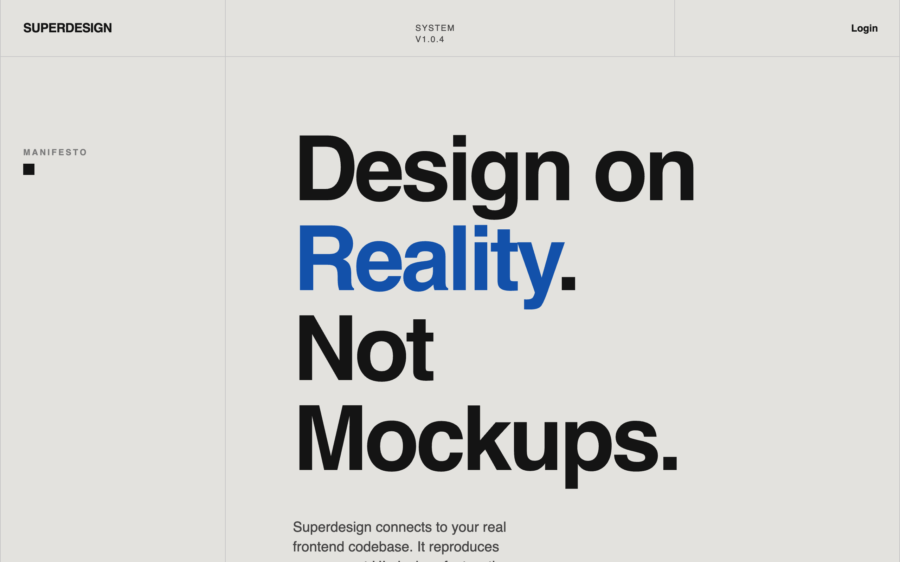 | **[SaaS Landing Page for Developer Tool](prompts/saas-landing-page-for-developer-tool/)** landing page, style, page | 950 | [▶ Try live](https://superdesign.dev/library/saas-landing-page-for-developer-tool?utm_source=github&utm_medium=prompt-repo&utm_campaign=prompt-library) |
| 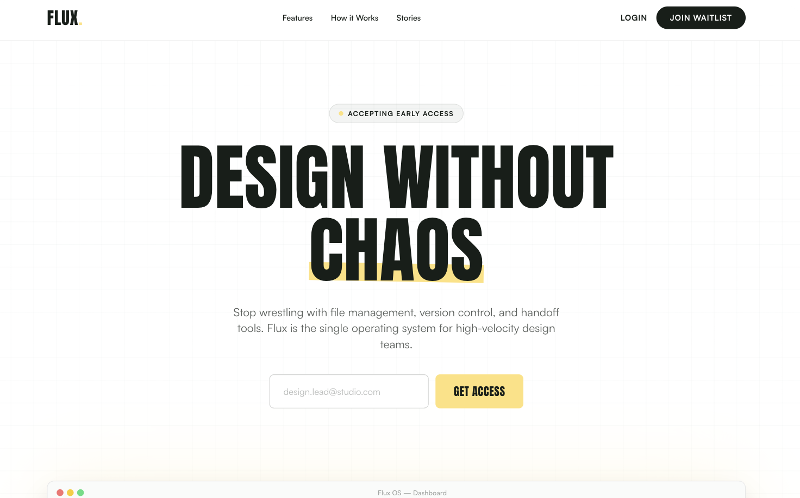 | **[Bold Editorial Style](prompts/bold-editorial-style/)** light mode, editorial, yellow | 948 | [▶ Try live](https://superdesign.dev/library/bold-editorial-style?utm_source=github&utm_medium=prompt-repo&utm_campaign=prompt-library) |
|  | **[Futuristic SasS Landing Page](prompts/futuristic-sass-landing-page/)** landing page, page, style | 942 | [▶ Try live](https://superdesign.dev/library/futuristic-sass-landing-page?utm_source=github&utm_medium=prompt-repo&utm_campaign=prompt-library) |
| 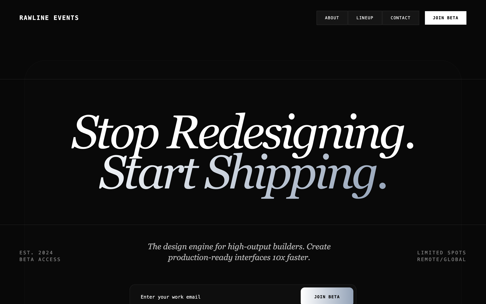 | **[Minimalist Beta Capture](prompts/minimalist-beta-capture/)** high conversion page, landing page, product launch | 745 | [▶ Try live](https://superdesign.dev/library/minimalist-beta-capture?utm_source=github&utm_medium=prompt-repo&utm_campaign=prompt-library) |
|  | **[Clean fluid](prompts/clean-fluid/)** landing page, style, page | 703 | [▶ Try live](https://superdesign.dev/library/clean-fluid?utm_source=github&utm_medium=prompt-repo&utm_campaign=prompt-library) |
| 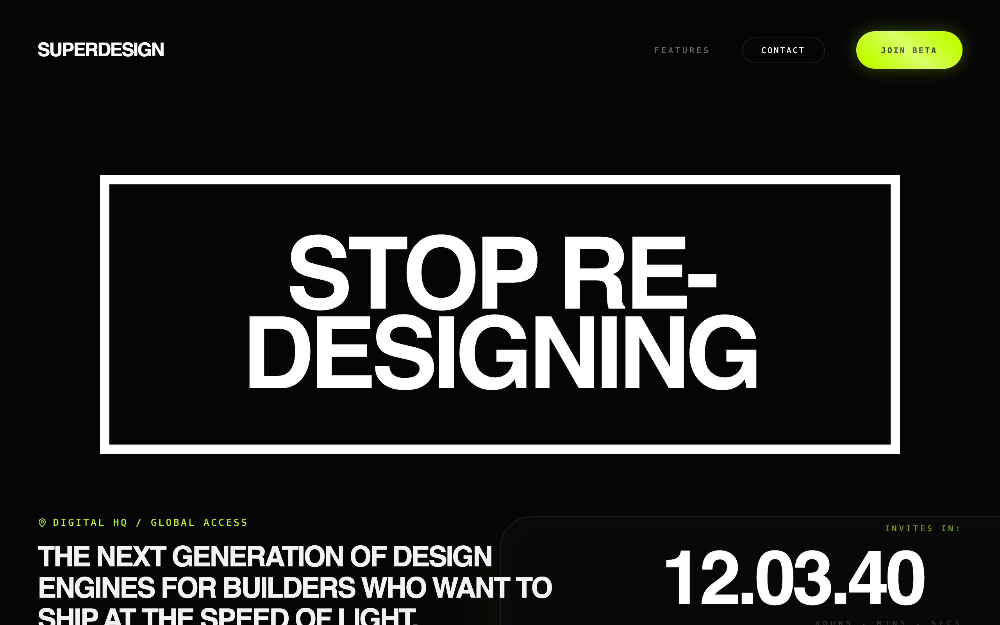 | **[Neon Velocity Countdown](prompts/neon-velocity-countdown/)** product launch, style, landing page | 683 | [▶ Try live](https://superdesign.dev/library/neon-velocity-countdown?utm_source=github&utm_medium=prompt-repo&utm_campaign=prompt-library) |
|  | **[Cyber Serif Style](prompts/cyber-serif-style/)** style, landing page, page | 651 | [▶ Try live](https://superdesign.dev/library/cyber-serif-style?utm_source=github&utm_medium=prompt-repo&utm_campaign=prompt-library) |
|  | **[Cinematic Noir Style](prompts/cinematic-noir-style/)** landing page, page, style | 643 | [▶ Try live](https://superdesign.dev/library/cinematic-noir-style?utm_source=github&utm_medium=prompt-repo&utm_campaign=prompt-library) |
| 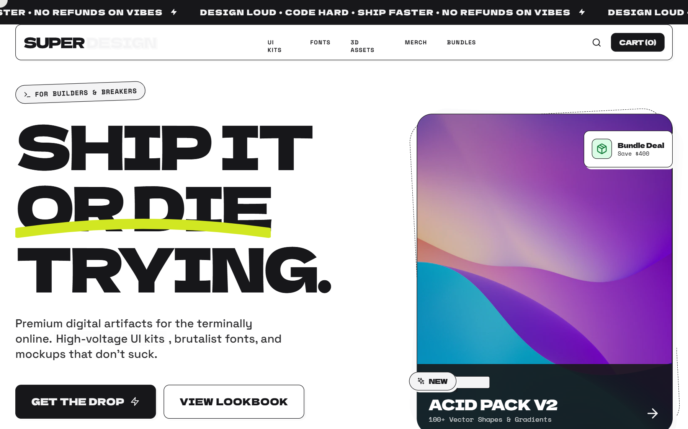 | **[Neo-Brutalism Style](prompts/neo-brutalism-style/)** page, landing page, style | 626 | [▶ Try live](https://superdesign.dev/library/neo-brutalism-style?utm_source=github&utm_medium=prompt-repo&utm_campaign=prompt-library) |
|  | **[Warm Industrial Gray Style](prompts/warm-industrial-gray-style/)** page, landing page, style | 594 | [▶ Try live](https://superdesign.dev/library/warm-industrial-gray-style?utm_source=github&utm_medium=prompt-repo&utm_campaign=prompt-library) |
|  | **[Chrome Extension Landing Page](prompts/chrome-extension-landing-page/)** chrome extension, landing page, gray | 592 | [▶ Try live](https://superdesign.dev/library/chrome-extension-landing-page?utm_source=github&utm_medium=prompt-repo&utm_campaign=prompt-library) |
|  | **[Midnight Editorial Style](prompts/midnight-editorial-style/)** style, landing page, page | 559 | [▶ Try live](https://superdesign.dev/library/midnight-editorial-style?utm_source=github&utm_medium=prompt-repo&utm_campaign=prompt-library) |
|  | **[Superdesign Editorial Waitlist](prompts/superdesign-editorial-waitlist/)** style, waitlist, landing page | 556 | [▶ Try live](https://superdesign.dev/library/superdesign-editorial-waitlist?utm_source=github&utm_medium=prompt-repo&utm_campaign=prompt-library) |
|  | **[Red sun](prompts/red-sun/)** landing page, page, style | 513 | [▶ Try live](https://superdesign.dev/library/red-sun?utm_source=github&utm_medium=prompt-repo&utm_campaign=prompt-library) |
|  | **[Tech Editorial](prompts/tech-editorial/)** landing page, style, page | 510 | [▶ Try live](https://superdesign.dev/library/tech-editorial?utm_source=github&utm_medium=prompt-repo&utm_campaign=prompt-library) |
| 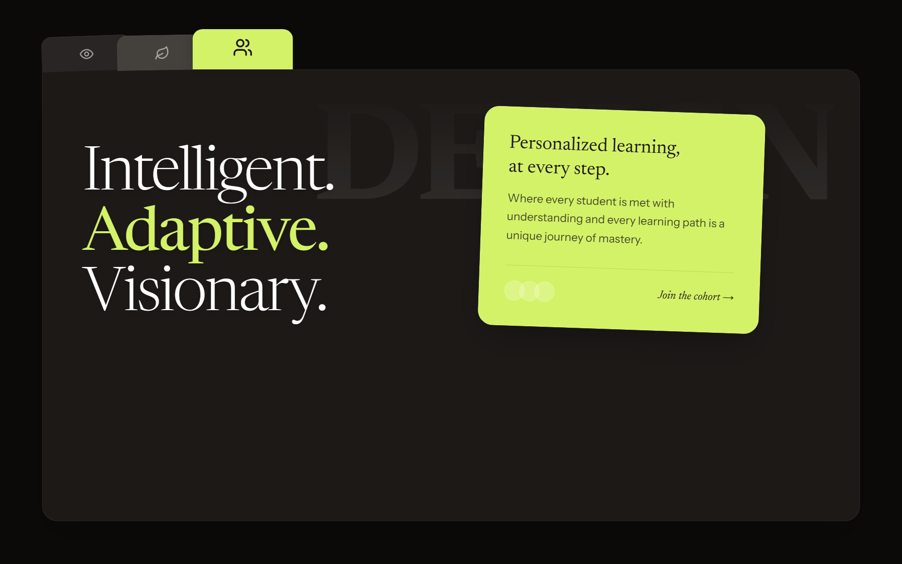 | **[Dark Avant-Garde Style](prompts/dark-avant-garde-style/)** landing page, page, style | 480 | [▶ Try live](https://superdesign.dev/library/dark-avant-garde-style?utm_source=github&utm_medium=prompt-repo&utm_campaign=prompt-library) |
|  | **[Disruptor Beta Launch](prompts/disruptor-beta-launch/)** product launch, waitlist, high conversion page | 456 | [▶ Try live](https://superdesign.dev/library/disruptor-beta-launch?utm_source=github&utm_medium=prompt-repo&utm_campaign=prompt-library) |
|  | **[Architectural Type System Style](prompts/architectural-type-system-style/)** landing page, product launch, waitlist | 354 | [▶ Try live](https://superdesign.dev/library/architectural-type-system-style?utm_source=github&utm_medium=prompt-repo&utm_campaign=prompt-library) |
|  | **[Graphic Comparison Report](prompts/graphic-comparison-report/)** comparison page, high contrast, offwhite | 17 | [▶ Try live](https://superdesign.dev/library/graphic-comparison-report?utm_source=github&utm_medium=prompt-repo&utm_campaign=prompt-library) |
|  | **[Gridwright — Design the web, type the prompt (Swiss Grid / Signal Red)](prompts/gridwright-design-the-web-type-the-prompt-swiss-grid-signal-red/)** saas-website, swiss-grid, international-typographic-style | 3 | [▶ Try live](https://superdesign.dev/library/gridwright-design-the-web-type-the-prompt-swiss-grid-signal-red?utm_source=github&utm_medium=prompt-repo&utm_campaign=prompt-library) |
| 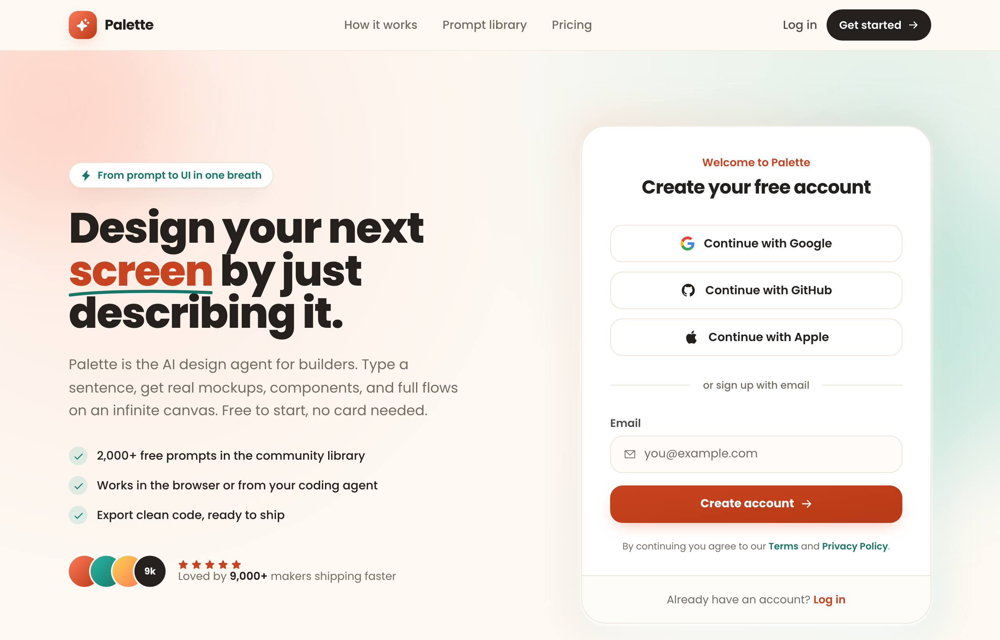 | **[Palette — Social-first friendly sign-up](prompts/palette-social-first-friendly-sign-up/)** signup, auth, login | 0 | [▶ Try live](https://superdesign.dev/library/palette-social-first-friendly-sign-up?utm_source=github&utm_medium=prompt-repo&utm_campaign=prompt-library) |
|  | **[Slate ROI-Calculator Pricing](prompts/slate-roi-calculator-pricing/)** pricing page, saas, dark | 0 | [▶ Try live](https://superdesign.dev/library/slate-roi-calculator-pricing?utm_source=github&utm_medium=prompt-repo&utm_campaign=prompt-library) |
|  | **[Floating Pill Coral navbar — legibility fixes applied](prompts/floating-pill-coral-navbar-legibility-fixes-applied/)** navbar, floating, pill | 0 | [▶ Try live](https://superdesign.dev/library/floating-pill-coral-navbar-legibility-fixes-applied?utm_source=github&utm_medium=prompt-repo&utm_campaign=prompt-library) |

## Design Systems & Styles

| Preview | Prompt | Copies | |
|---|---|---|---|
|  | **[Hyper-Saturated Fluid](prompts/hyper-saturated-fluid/)** style | 1,002 | [▶ Try live](https://superdesign.dev/library/hyper-saturated-fluid?utm_source=github&utm_medium=prompt-repo&utm_campaign=prompt-library) |
|  | **[Neumorphism](prompts/neumorphism/)** style | 834 | [▶ Try live](https://superdesign.dev/library/neumorphism?utm_source=github&utm_medium=prompt-repo&utm_campaign=prompt-library) |
| 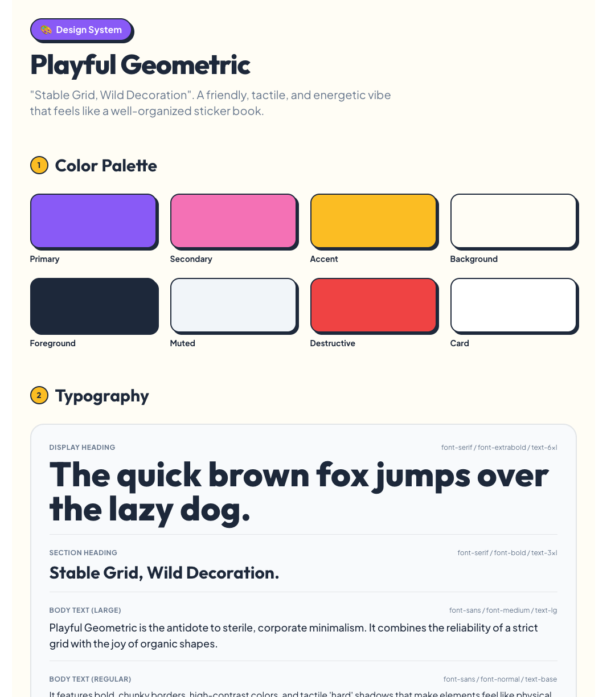 | **[Playful](prompts/playful/)** style | 564 | [▶ Try live](https://superdesign.dev/library/playful?utm_source=github&utm_medium=prompt-repo&utm_campaign=prompt-library) |
| 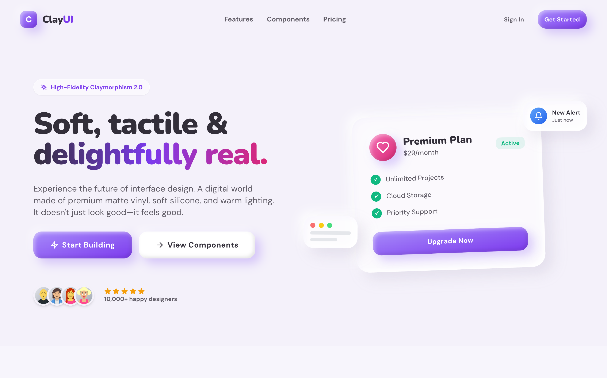 | **[Clay UI](prompts/clay-ui/)** style | 440 | [▶ Try live](https://superdesign.dev/library/clay-ui?utm_source=github&utm_medium=prompt-repo&utm_campaign=prompt-library) |
| 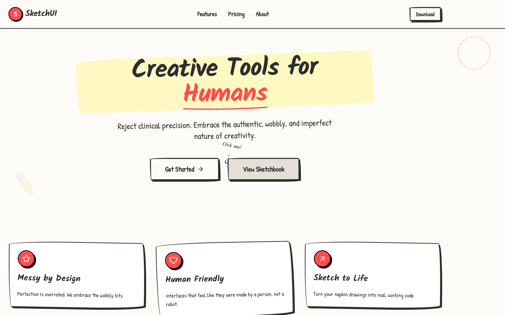 | **[Sketch](prompts/sketch/)** style | 422 | [▶ Try live](https://superdesign.dev/library/sketch?utm_source=github&utm_medium=prompt-repo&utm_campaign=prompt-library) |
|  | **[Grunge Collage Motion](prompts/grunge-collage-motion/)** style | 412 | [▶ Try live](https://superdesign.dev/library/grunge-collage-motion?utm_source=github&utm_medium=prompt-repo&utm_campaign=prompt-library) |
| 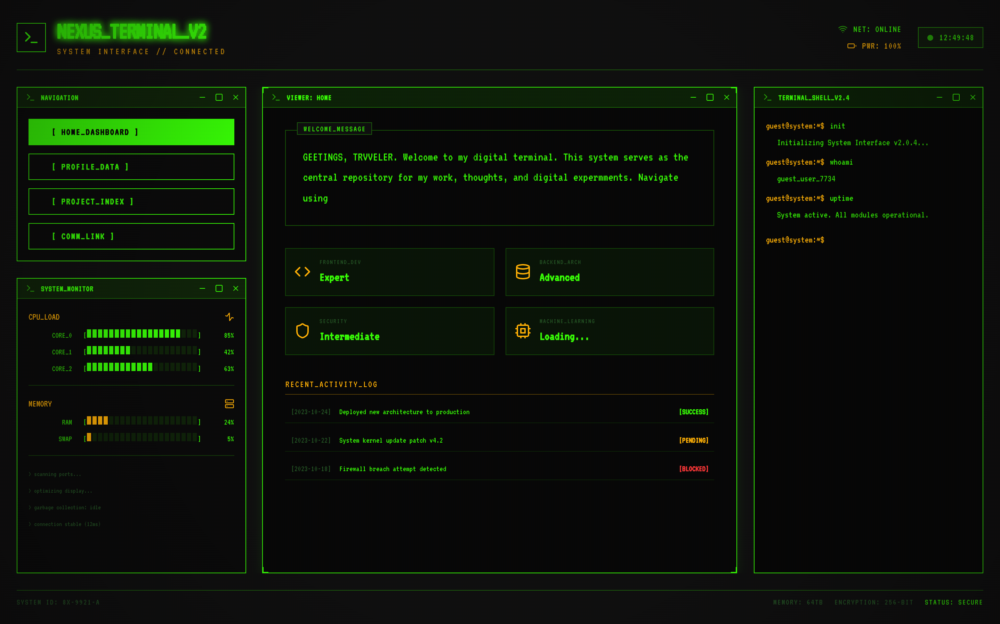 | **[Terminal](prompts/terminal/)** style | 385 | [▶ Try live](https://superdesign.dev/library/terminal?utm_source=github&utm_medium=prompt-repo&utm_campaign=prompt-library) |
|  | **[Liquid Metal style](prompts/liquid-metal-style/)** style | 378 | [▶ Try live](https://superdesign.dev/library/liquid-metal-style?utm_source=github&utm_medium=prompt-repo&utm_campaign=prompt-library) |
|  | **[Architectural Blueprint](prompts/architectural-blueprint/)** style | 373 | [▶ Try live](https://superdesign.dev/library/architectural-blueprint?utm_source=github&utm_medium=prompt-repo&utm_campaign=prompt-library) |
| 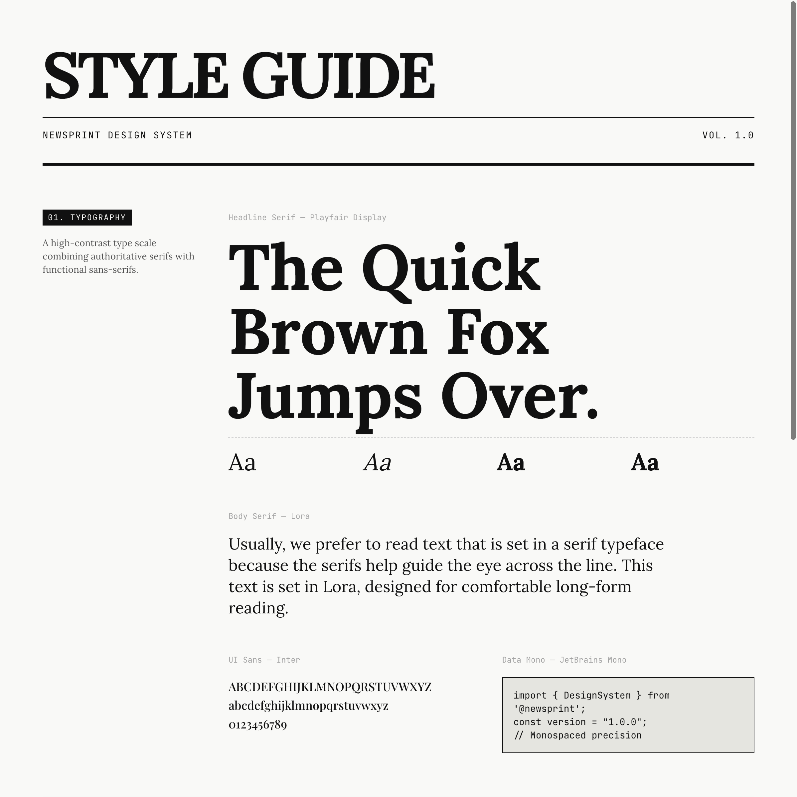 | **[News Print](prompts/news-print/)** style | 354 | [▶ Try live](https://superdesign.dev/library/news-print?utm_source=github&utm_medium=prompt-repo&utm_campaign=prompt-library) |
| 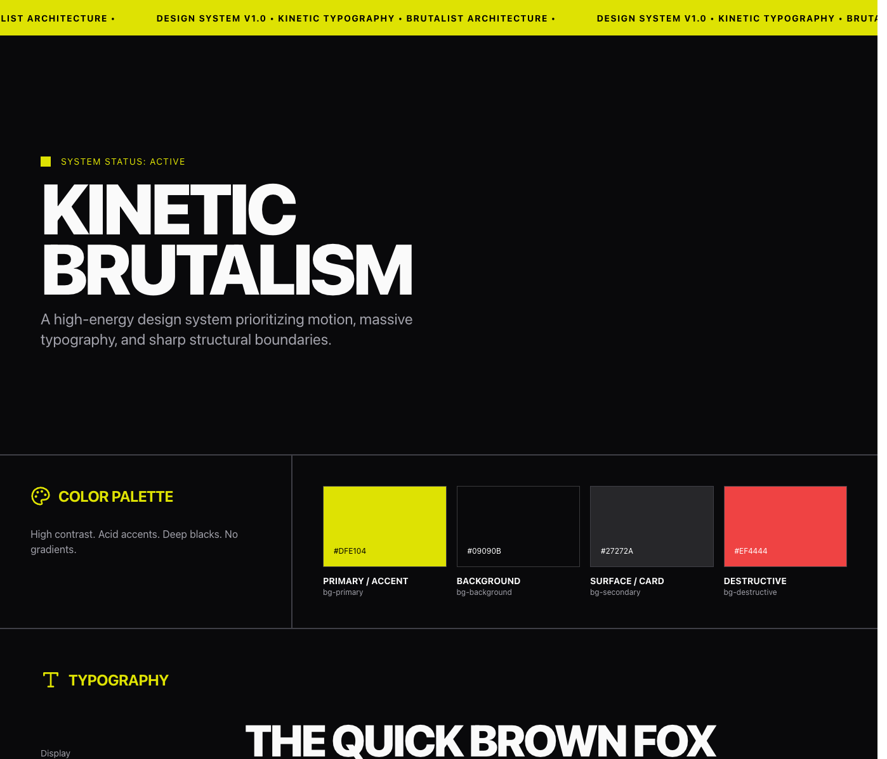 | **[Kinetic](prompts/kinetic/)** style | 321 | [▶ Try live](https://superdesign.dev/library/kinetic?utm_source=github&utm_medium=prompt-repo&utm_campaign=prompt-library) |
| 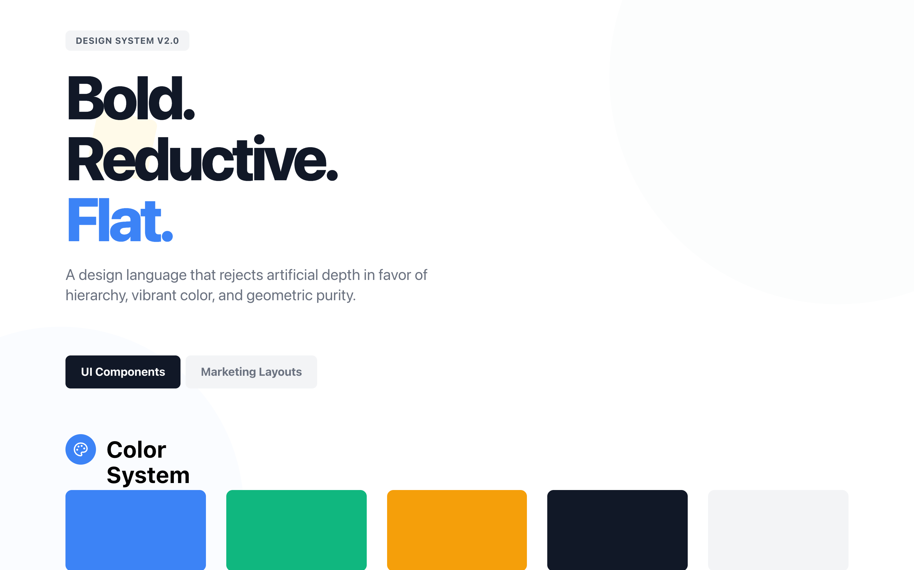 | **[Flat design](prompts/flat-design/)** style | 300 | [▶ Try live](https://superdesign.dev/library/flat-design?utm_source=github&utm_medium=prompt-repo&utm_campaign=prompt-library) |
| 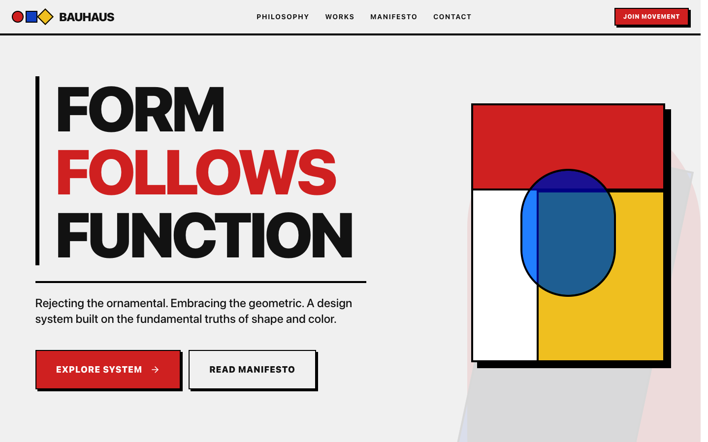 | **[Bauhaus](prompts/bauhaus/)** style | 277 | [▶ Try live](https://superdesign.dev/library/bauhaus?utm_source=github&utm_medium=prompt-repo&utm_campaign=prompt-library) |
| 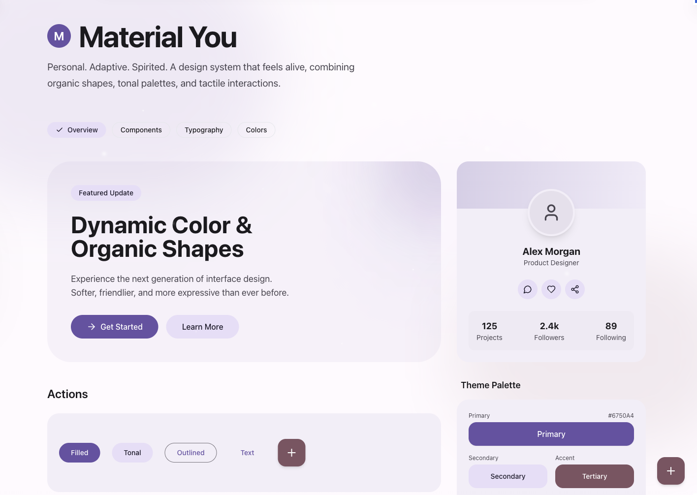 | **[Material](prompts/material/)** style | 274 | [▶ Try live](https://superdesign.dev/library/material?utm_source=github&utm_medium=prompt-repo&utm_campaign=prompt-library) |
| 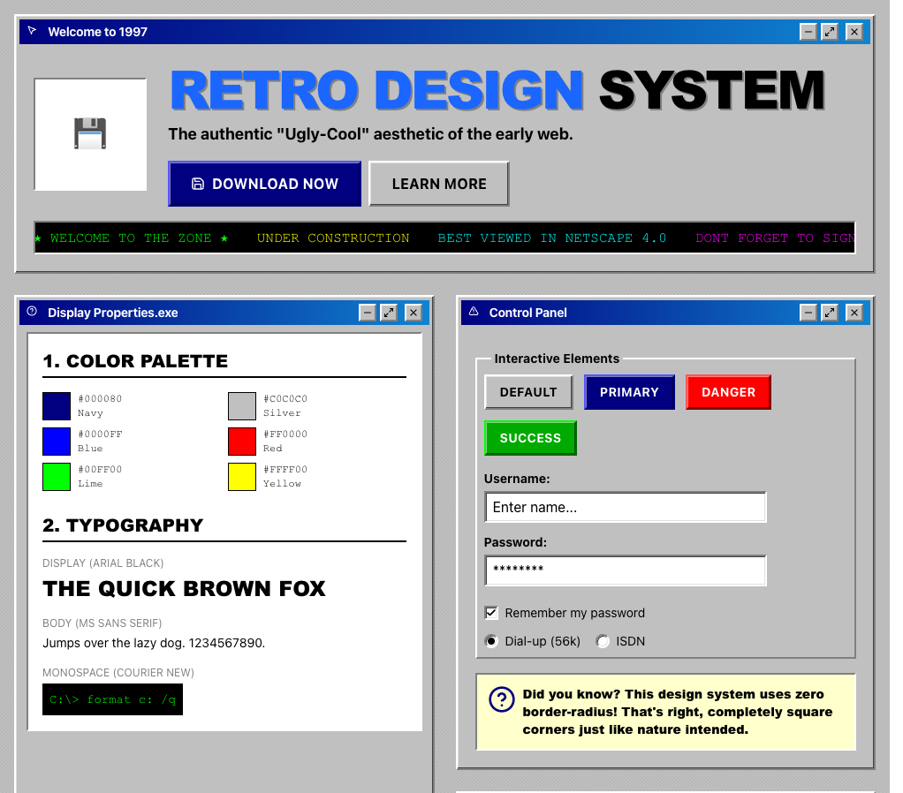 | **[Win98](prompts/win98/)** style | 272 | [▶ Try live](https://superdesign.dev/library/win98?utm_source=github&utm_medium=prompt-repo&utm_campaign=prompt-library) |
| 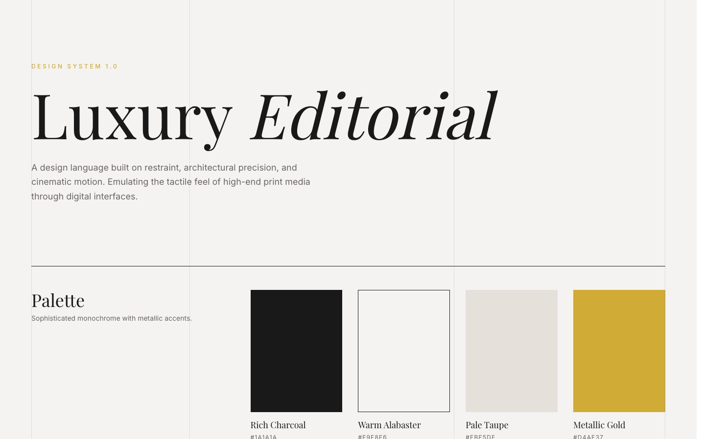 | **[Luxury](prompts/luxury/)** style | 229 | [▶ Try live](https://superdesign.dev/library/luxury?utm_source=github&utm_medium=prompt-repo&utm_campaign=prompt-library) |
|  | **[Monochrome](prompts/monochrome/)** style | 215 | [▶ Try live](https://superdesign.dev/library/monochrome?utm_source=github&utm_medium=prompt-repo&utm_campaign=prompt-library) |
|  | **[One Pager](prompts/one-pager/)** skill | 9 | [▶ Try live](https://superdesign.dev/library/one-pager?utm_source=github&utm_medium=prompt-repo&utm_campaign=prompt-library) |
|  | **[Aurora Glass — Sign in to the canvas](prompts/aurora-glass-sign-in-to-the-canvas/)** login, sign-in, auth | 6 | [▶ Try live](https://superdesign.dev/library/aurora-glass-sign-in-to-the-canvas?utm_source=github&utm_medium=prompt-repo&utm_campaign=prompt-library) |
|  | **[Landing Page / Local Small Business](prompts/landing-page-local-small-business/)** skill | 5 | [▶ Try live](https://superdesign.dev/library/landing-page-local-small-business?utm_source=github&utm_medium=prompt-repo&utm_campaign=prompt-library) |
|  | **[The Quote, Set in Burgundy](prompts/the-quote-set-in-burgundy/)** testimonial, testimonials, single-quote | 0 | [▶ Try live](https://superdesign.dev/library/the-quote-set-in-burgundy?utm_source=github&utm_medium=prompt-repo&utm_campaign=prompt-library) |
|  | **[Teal-on-Ink Newsletter Mega Footer](prompts/teal-on-ink-newsletter-mega-footer/)** footer, mega-footer, newsletter | 0 | [▶ Try live](https://superdesign.dev/library/teal-on-ink-newsletter-mega-footer?utm_source=github&utm_medium=prompt-repo&utm_campaign=prompt-library) |

## Components

| Preview | Prompt | Copies | |
|---|---|---|---|
|  | **[Card Swap](prompts/card-swap/)** ui component, animation, image gallery | 884 | [▶ Try live](https://superdesign.dev/library/card-swap?utm_source=github&utm_medium=prompt-repo&utm_campaign=prompt-library) |
|  | **[Hyper-Speed Loading State](prompts/hyper-speed-loading-state/)** animation, loading | 749 | [▶ Try live](https://superdesign.dev/library/hyper-speed-loading-state?utm_source=github&utm_medium=prompt-repo&utm_campaign=prompt-library) |
|  | **[Light Beam Button](prompts/light-beam-button/)** button, ui component | 500 | [▶ Try live](https://superdesign.dev/library/light-beam-button?utm_source=github&utm_medium=prompt-repo&utm_campaign=prompt-library) |
|  | **[Ghost Cursor](prompts/ghost-cursor/)** animation, background | 417 | [▶ Try live](https://superdesign.dev/library/ghost-cursor?utm_source=github&utm_medium=prompt-repo&utm_campaign=prompt-library) |
|  | **[Typing animation](prompts/typing-animation/)** animation, text animation | 370 | [▶ Try live](https://superdesign.dev/library/typing-animation?utm_source=github&utm_medium=prompt-repo&utm_campaign=prompt-library) |
|  | **[Jelly Squish Button](prompts/jelly-squish-button/)** animation, ui component, button | 368 | [▶ Try live](https://superdesign.dev/library/jelly-squish-button?utm_source=github&utm_medium=prompt-repo&utm_campaign=prompt-library) |
|  | **[Radiant Prompt Input](prompts/radiant-prompt-input/)** ui component, input | 348 | [▶ Try live](https://superdesign.dev/library/radiant-prompt-input?utm_source=github&utm_medium=prompt-repo&utm_campaign=prompt-library) |
|  | **[Pill Nav](prompts/pill-nav/)** ui component, nav | 318 | [▶ Try live](https://superdesign.dev/library/pill-nav?utm_source=github&utm_medium=prompt-repo&utm_campaign=prompt-library) |
|  | **[Masonry Gallery](prompts/masonry-gallery/)** ui component, animation | 306 | [▶ Try live](https://superdesign.dev/library/masonry-gallery?utm_source=github&utm_medium=prompt-repo&utm_campaign=prompt-library) |
|  | **[Interactive virtual character](prompts/interactive-virtual-character/)** ui component | 281 | [▶ Try live](https://superdesign.dev/library/interactive-virtual-character?utm_source=github&utm_medium=prompt-repo&utm_campaign=prompt-library) |
|  | **[Interactive Folder](prompts/interactive-folder/)** animation, ui component | 273 | [▶ Try live](https://superdesign.dev/library/interactive-folder?utm_source=github&utm_medium=prompt-repo&utm_campaign=prompt-library) |
| 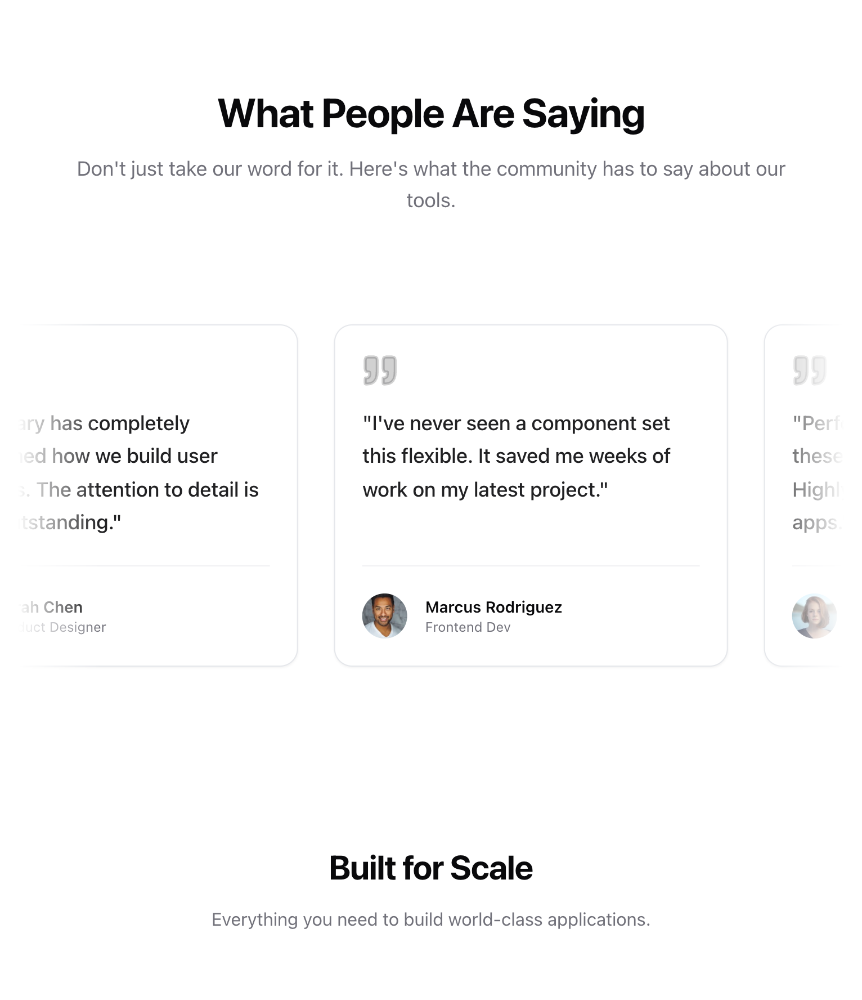 | **[Testimonial](prompts/testimonial/)** ui component, testimonial, landing page | 267 | [▶ Try live](https://superdesign.dev/library/testimonial?utm_source=github&utm_medium=prompt-repo&utm_campaign=prompt-library) |
|  | **[Glow Cursor Button](prompts/glow-cursor-button/)** button, ui component | 211 | [▶ Try live](https://superdesign.dev/library/glow-cursor-button?utm_source=github&utm_medium=prompt-repo&utm_campaign=prompt-library) |
|  | **[Rolodex Text](prompts/rolodex-text/)** animation, text animation | 203 | [▶ Try live](https://superdesign.dev/library/rolodex-text?utm_source=github&utm_medium=prompt-repo&utm_campaign=prompt-library) |
|  | **[Shiny Text](prompts/shiny-text/)** animation, text animation | 182 | [▶ Try live](https://superdesign.dev/library/shiny-text?utm_source=github&utm_medium=prompt-repo&utm_campaign=prompt-library) |
|  | **[Interactive Card Stack](prompts/interactive-card-stack/)** ui component | 121 | [▶ Try live](https://superdesign.dev/library/interactive-card-stack?utm_source=github&utm_medium=prompt-repo&utm_campaign=prompt-library) |
|  | **[Counter](prompts/counter/)** ui component | 96 | [▶ Try live](https://superdesign.dev/library/counter?utm_source=github&utm_medium=prompt-repo&utm_campaign=prompt-library) |
|  | **[Button loading state](prompts/button-loading-state/)** button, ui component | 85 | [▶ Try live](https://superdesign.dev/library/button-loading-state?utm_source=github&utm_medium=prompt-repo&utm_campaign=prompt-library) |
|  | **[Animated List](prompts/animated-list/)** ui component | 63 | [▶ Try live](https://superdesign.dev/library/animated-list?utm_source=github&utm_medium=prompt-repo&utm_campaign=prompt-library) |

## Animations & Backgrounds

| Preview | Prompt | Copies | |
|---|---|---|---|
|  | **[Tubes Interactive Background](prompts/tubes-interactive-background/)** animation, background | 2,912 | [▶ Try live](https://superdesign.dev/library/tubes-interactive-background?utm_source=github&utm_medium=prompt-repo&utm_campaign=prompt-library) |
|  | **[The "Stacking Cards" Effect](prompts/the-stacking-cards-effect/)** animation, scroll animation, landing page | 905 | [▶ Try live](https://superdesign.dev/library/the-stacking-cards-effect?utm_source=github&utm_medium=prompt-repo&utm_campaign=prompt-library) |
|  | **[Force Field Background](prompts/force-field-background/)** animation, background | 865 | [▶ Try live](https://superdesign.dev/library/force-field-background?utm_source=github&utm_medium=prompt-repo&utm_campaign=prompt-library) |
|  | **[Scroll Journey Line](prompts/scroll-journey-line/)** animation, scroll animation | 820 | [▶ Try live](https://superdesign.dev/library/scroll-journey-line?utm_source=github&utm_medium=prompt-repo&utm_campaign=prompt-library) |
|  | **[GSAP Horizontal scroll](prompts/gsap-horizontal-scroll/)** animation, scroll animation, landing page | 668 | [▶ Try live](https://superdesign.dev/library/gsap-horizontal-scroll?utm_source=github&utm_medium=prompt-repo&utm_campaign=prompt-library) |
|  | **[Parallax Stars Background](prompts/parallax-stars-background/)** background, animation | 661 | [▶ Try live](https://superdesign.dev/library/parallax-stars-background?utm_source=github&utm_medium=prompt-repo&utm_campaign=prompt-library) |
|  | **[Light Rays Background](prompts/light-rays-background/)** animation, background | 534 | [▶ Try live](https://superdesign.dev/library/light-rays-background?utm_source=github&utm_medium=prompt-repo&utm_campaign=prompt-library) |
|  | **["Exploded View" Assembly](prompts/exploded-view-assembly/)** animation, scroll animation, landing page | 490 | [▶ Try live](https://superdesign.dev/library/exploded-view-assembly?utm_source=github&utm_medium=prompt-repo&utm_campaign=prompt-library) |
|  | **[Gooey Gradient Background](prompts/gooey-gradient-background/)** animation, background | 485 | [▶ Try live](https://superdesign.dev/library/gooey-gradient-background?utm_source=github&utm_medium=prompt-repo&utm_campaign=prompt-library) |
|  | **[Liquid Ether Background](prompts/liquid-ether-background/)** background, animation | 444 | [▶ Try live](https://superdesign.dev/library/liquid-ether-background?utm_source=github&utm_medium=prompt-repo&utm_campaign=prompt-library) |
|  | **[Hover reveal effect](prompts/hover-reveal-effect/)** landing page, hover effect, animation | 442 | [▶ Try live](https://superdesign.dev/library/hover-reveal-effect?utm_source=github&utm_medium=prompt-repo&utm_campaign=prompt-library) |
|  | **[Horizontal Gallery](prompts/horizontal-gallery/)** animation, scroll animation | 439 | [▶ Try live](https://superdesign.dev/library/horizontal-gallery?utm_source=github&utm_medium=prompt-repo&utm_campaign=prompt-library) |
|  | **[Scroll animation](prompts/scroll-animation/)** animation, scroll animation, landing page | 386 | [▶ Try live](https://superdesign.dev/library/scroll-animation?utm_source=github&utm_medium=prompt-repo&utm_campaign=prompt-library) |
|  | **[Animation / Threejs animation](prompts/animation-threejs-animation/)** skill, animation | 307 | [▶ Try live](https://superdesign.dev/library/animation-threejs-animation?utm_source=github&utm_medium=prompt-repo&utm_campaign=prompt-library) |
|  | **[Dynamic Data Display](prompts/dynamic-data-display/)** text animation, animation, scroll animation | 288 | [▶ Try live](https://superdesign.dev/library/dynamic-data-display?utm_source=github&utm_medium=prompt-repo&utm_campaign=prompt-library) |
|  | **[Sticky Content Switch](prompts/sticky-content-switch/)** animation, scroll animation, landing page | 262 | [▶ Try live](https://superdesign.dev/library/sticky-content-switch?utm_source=github&utm_medium=prompt-repo&utm_campaign=prompt-library) |
|  | **[Gradient Blinds Background](prompts/gradient-blinds-background/)** animation, background | 255 | [▶ Try live](https://superdesign.dev/library/gradient-blinds-background?utm_source=github&utm_medium=prompt-repo&utm_campaign=prompt-library) |
|  | **[Lightning Background](prompts/lightning-background/)** animation, background | 252 | [▶ Try live](https://superdesign.dev/library/lightning-background?utm_source=github&utm_medium=prompt-repo&utm_campaign=prompt-library) |
|  | **[Hand Drawn Underline Headline](prompts/hand-drawn-underline-headline/)** animation, text animation | 247 | [▶ Try live](https://superdesign.dev/library/hand-drawn-underline-headline?utm_source=github&utm_medium=prompt-repo&utm_campaign=prompt-library) |
|  | **[Text slidedown animation](prompts/text-slidedown-animation/)** animation, text animation, landing page | 235 | [▶ Try live](https://superdesign.dev/library/text-slidedown-animation?utm_source=github&utm_medium=prompt-repo&utm_campaign=prompt-library) |
|  | **[Hyperspeed Background](prompts/hyperspeed-background/)** animation, background | 232 | [▶ Try live](https://superdesign.dev/library/hyperspeed-background?utm_source=github&utm_medium=prompt-repo&utm_campaign=prompt-library) |
|  | **[Ballpit Background](prompts/ballpit-background/)** animation, background | 199 | [▶ Try live](https://superdesign.dev/library/ballpit-background?utm_source=github&utm_medium=prompt-repo&utm_campaign=prompt-library) |
|  | **[Prism Background](prompts/prism-background/)** background, animation | 172 | [▶ Try live](https://superdesign.dev/library/prism-background?utm_source=github&utm_medium=prompt-repo&utm_campaign=prompt-library) |
|  | **[Animation / Product Release Demo](prompts/animation-product-release-demo/)** skill, animation | 171 | [▶ Try live](https://superdesign.dev/library/animation-product-release-demo?utm_source=github&utm_medium=prompt-repo&utm_campaign=prompt-library) |
|  | **["Spotlight" Mask](prompts/spotlight-mask/)** animation, scroll animation, landing page | 152 | [▶ Try live](https://superdesign.dev/library/spotlight-mask?utm_source=github&utm_medium=prompt-repo&utm_campaign=prompt-library) |
|  | **[Text fading animation](prompts/text-fading-animation/)** animation, text animation, landing page | 102 | [▶ Try live](https://superdesign.dev/library/text-fading-animation?utm_source=github&utm_medium=prompt-repo&utm_campaign=prompt-library) |
|  | **[Cinematic SlideUp Headline](prompts/cinematic-slideup-headline/)** animation, text animation | 97 | [▶ Try live](https://superdesign.dev/library/cinematic-slideup-headline?utm_source=github&utm_medium=prompt-repo&utm_campaign=prompt-library) |

## Mobile Apps

| Preview | Prompt | Copies | |
|---|---|---|---|
|  | **[Softly - Digital Wellness App](prompts/softly-digital-wellness-app/)** mobile app, sass landing, leads generation | 1,896 | [▶ Try live](https://superdesign.dev/library/softly-digital-wellness-app?utm_source=github&utm_medium=prompt-repo&utm_campaign=prompt-library) |
|  | **[BabyBites - Sophisticated Palette](prompts/babybites-sophisticated-palette/)** mobile app, style | 1,224 | [▶ Try live](https://superdesign.dev/library/babybites-sophisticated-palette?utm_source=github&utm_medium=prompt-repo&utm_campaign=prompt-library) |
|  | **[Coverflow — Carousels that turn heads (dark coverflow aurora)](prompts/coverflow-carousels-that-turn-heads-dark-coverflow-aurora/)** carousel, coverflow, 3d-carousel | 48 | [▶ Try live](https://superdesign.dev/library/coverflow-carousels-that-turn-heads-dark-coverflow-aurora?utm_source=github&utm_medium=prompt-repo&utm_campaign=prompt-library) |
|  | **[Focus Mode Detail](prompts/focus-mode-detail/)** mobile app, detail, layout | 6 | [▶ Try live](https://superdesign.dev/library/focus-mode-detail?utm_source=github&utm_medium=prompt-repo&utm_campaign=prompt-library) |
| 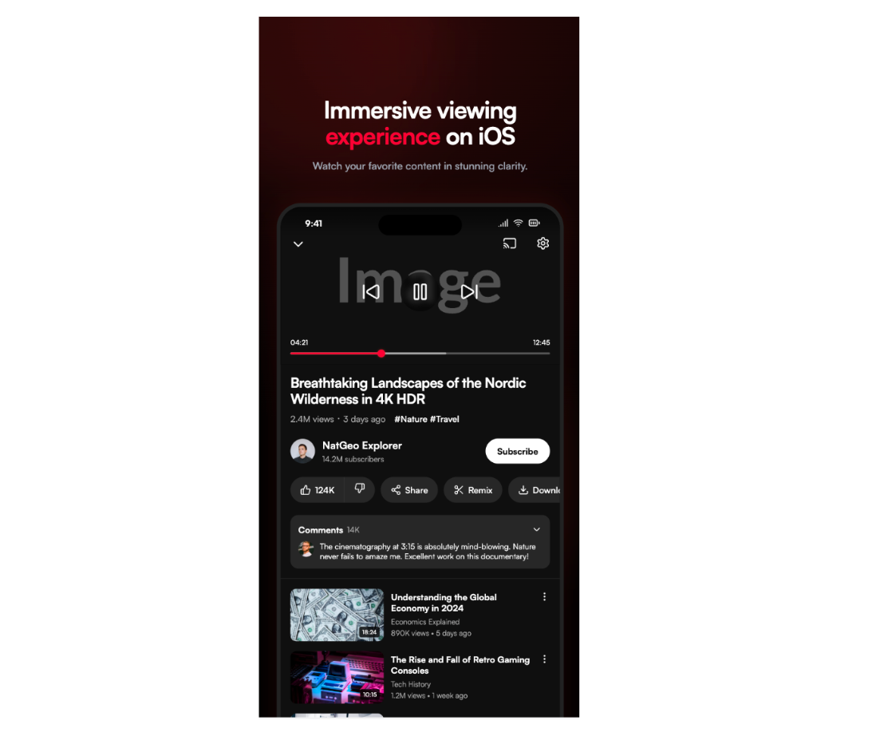 | **[Mobile App / App Store Preview](prompts/mobile-app-app-store-preview/)** skill | 3 | [▶ Try live](https://superdesign.dev/library/mobile-app-app-store-preview?utm_source=github&utm_medium=prompt-repo&utm_campaign=prompt-library) |
|  | **[Gesture First Navigation System](prompts/gesture-first-navigation-system/)** mobile app, navigation, layout | 3 | [▶ Try live](https://superdesign.dev/library/gesture-first-navigation-system?utm_source=github&utm_medium=prompt-repo&utm_campaign=prompt-library) |

## E-commerce

| Preview | Prompt | Copies | |
|---|---|---|---|
|  | **[Brutalist E-commerce Page](prompts/brutalist-e-commerce-page/)** ecommerce, landing page, style | 1,571 | [▶ Try live](https://superdesign.dev/library/brutalist-e-commerce-page?utm_source=github&utm_medium=prompt-repo&utm_campaign=prompt-library) |
|  | **[Brutalist Style Ecommerce Page](prompts/brutalist-style-ecommerce-page/)** ecommerce, landing page, style | 945 | [▶ Try live](https://superdesign.dev/library/brutalist-style-ecommerce-page?utm_source=github&utm_medium=prompt-repo&utm_campaign=prompt-library) |
|  | **[Aura Audio Showroom](prompts/aura-audio-showroom/)** shopify, landing page, ecommerce | 261 | [▶ Try live](https://superdesign.dev/library/aura-audio-showroom?utm_source=github&utm_medium=prompt-repo&utm_campaign=prompt-library) |
|  | **[Super Shampoo - High Conversion LP](prompts/super-shampoo-high-conversion-lp/)** ecommerce, shopify, landing page | 194 | [▶ Try live](https://superdesign.dev/library/super-shampoo-high-conversion-lp?utm_source=github&utm_medium=prompt-repo&utm_campaign=prompt-library) |
|  | **[Cart Drawer- Essential Slide in](prompts/cart-drawer-essential-slide-in/)** shopify, layout, cart | 7 | [▶ Try live](https://superdesign.dev/library/cart-drawer-essential-slide-in?utm_source=github&utm_medium=prompt-repo&utm_campaign=prompt-library) |
| 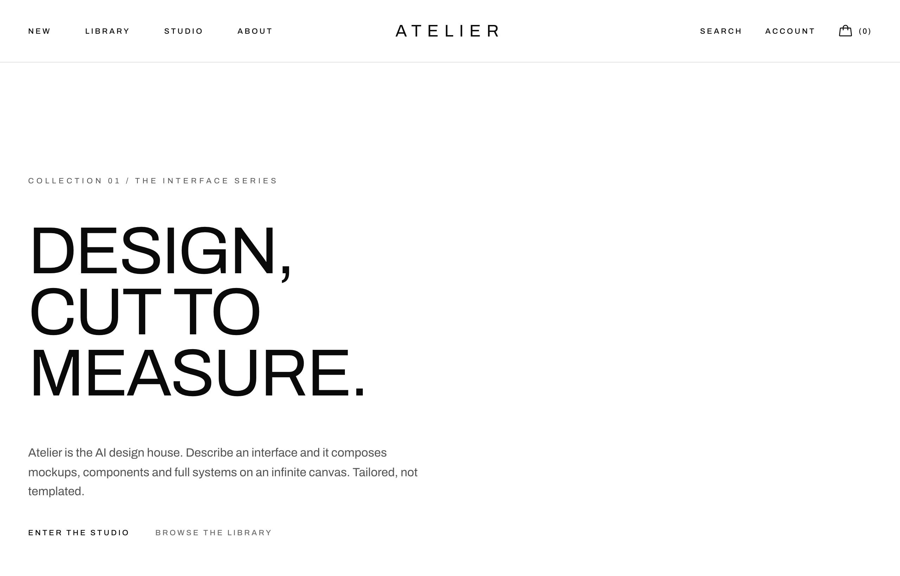 | **[ATELIER — Mono Uppercase Fashion (legibility-fixed)](prompts/atelier-mono-uppercase-fashion-legibility-fixed/)** navbar, monochrome, black-and-white | 0 | [▶ Try live](https://superdesign.dev/library/atelier-mono-uppercase-fashion-legibility-fixed?utm_source=github&utm_medium=prompt-repo&utm_campaign=prompt-library) |

## Portfolios

| Preview | Prompt | Copies | |
|---|---|---|---|
|  | **[Bold Editorial Design Style](prompts/bold-editorial-design-style/)** navy, sage, portfolio | 765 | [▶ Try live](https://superdesign.dev/library/bold-editorial-design-style?utm_source=github&utm_medium=prompt-repo&utm_campaign=prompt-library) |
| 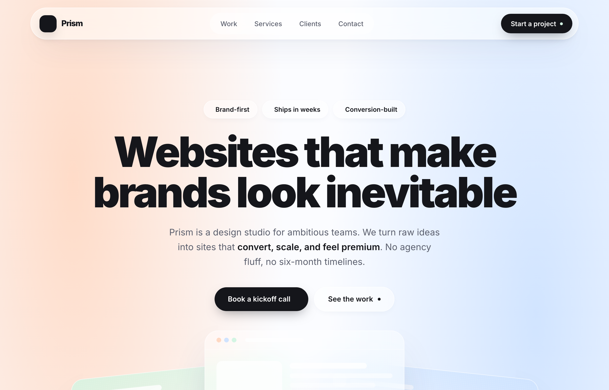 | **[Prism — Frosted-Glass Pastel Agency Studio](prompts/prism-frosted-glass-pastel-agency-studio/)** agency-website, glassmorphism, frosted-glass | 0 | [▶ Try live](https://superdesign.dev/library/prism-frosted-glass-pastel-agency-studio?utm_source=github&utm_medium=prompt-repo&utm_campaign=prompt-library) |

## Superdesign vs other AI design tools

<!-- DRAFT: verify each cell before publishing. Keep it factual. -->
| | Superdesign | v0 | Lovable | Bolt | Google Stitch | Uizard |
|---|---|---|---|---|---|---|
| Runs inside your coding agent (Claude Code/Cursor) | ✅ | ❌ | ❌ | ❌ | ❌ | ❌ |
| Infinite design canvas | ✅ | ❌ | ❌ | ❌ | ❌ | ✅ |
| Usage-ranked prompt library | ✅ | ❌ | ❌ | ❌ | ❌ | ❌ |
| Designs into your existing design system | ✅ | ⚠️ | ⚠️ | ⚠️ | ❌ | ❌ |
| Outputs real code | ✅ | ✅ | ✅ | ✅ | ✅ | ⚠️ |

## FAQ

**What is the best AI design prompt?** By real usage across the Superdesign library, the most-copied prompts are [Tubes Interactive Background](https://superdesign.dev/library/tubes-interactive-background?utm_source=github&utm_medium=prompt-repo&utm_campaign=prompt-library), [High Contrast Landing Page](https://superdesign.dev/library/high-contrast-landing-page?utm_source=github&utm_medium=prompt-repo&utm_campaign=prompt-library), and [Lumina SaaS Landing Page](https://superdesign.dev/library/lumina-saas-landing-page?utm_source=github&utm_medium=prompt-repo&utm_campaign=prompt-library). This list is ranked so the best rise to the top.

**How do I use these prompts?** Open any prompt's page, click **Try it live** to generate it on the Superdesign canvas, or copy the prompt text into your own coding agent. To drive it from Claude Code / Cursor, install the [Superdesign skill](https://github.com/superdesigndev/superdesign-skill).

**Do these work with Claude Code and Cursor?** Yes. Install the [Superdesign skill](https://github.com/superdesigndev/superdesign-skill) and your agent can search, pull, and run any prompt here.

**What is Superdesign?** An AI product design agent that turns natural-language prompts into UI mockups, components, and full designs on an infinite canvas. See [superdesign.dev](https://superdesign.dev?utm_source=github&utm_medium=prompt-repo&utm_campaign=prompt-library).

**Are the prompts free to use?** The prompt text is free to use. *(Data license TBD — see LICENSE.)*

## Contributing

This repo is a **read-only mirror** of the live Superdesign prompt library (source of truth: [superdesign.dev/library](https://superdesign.dev/library)). The best way to add a prompt is to create it in the app — top prompts sync here automatically, ranked by usage. For fixes to this repo (typos, broken links), open a PR. See `CONTRIBUTING.md`.

## License

Repo code and structure: MIT (see `LICENSE`). Prompt data license: **TBD** (CC0 recommended — pending decision).
