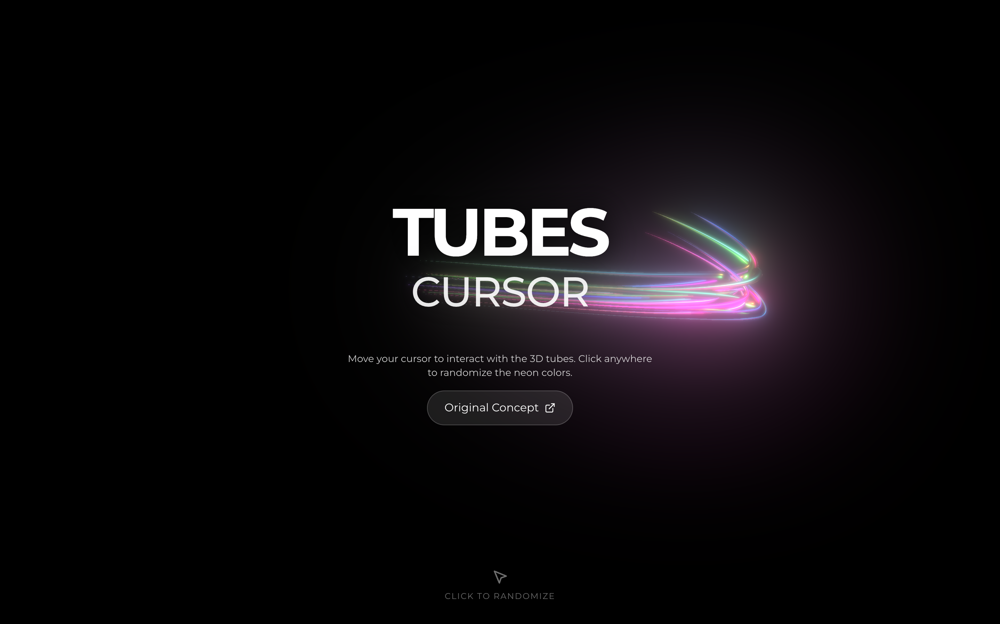
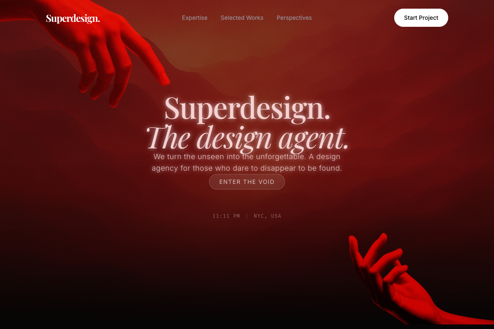
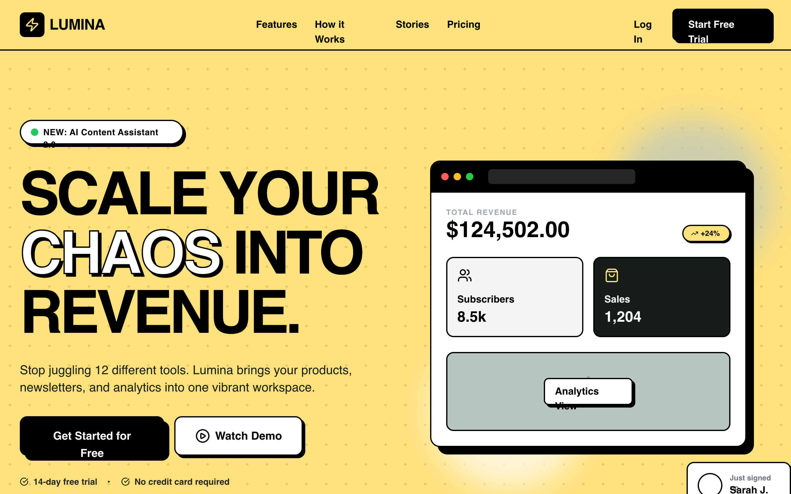
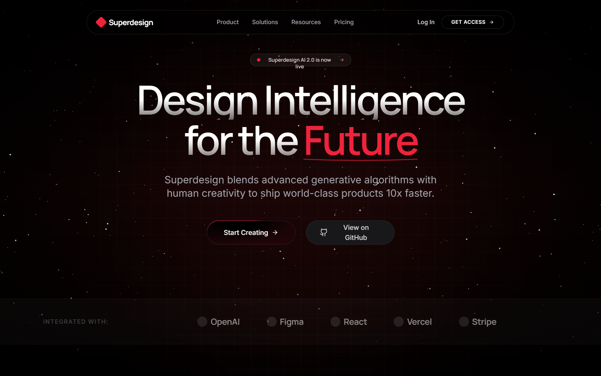
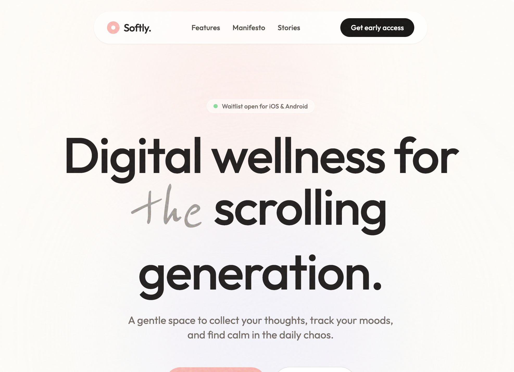
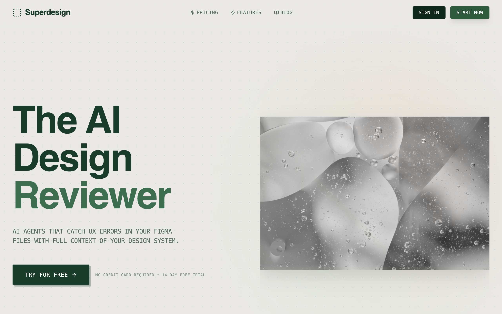
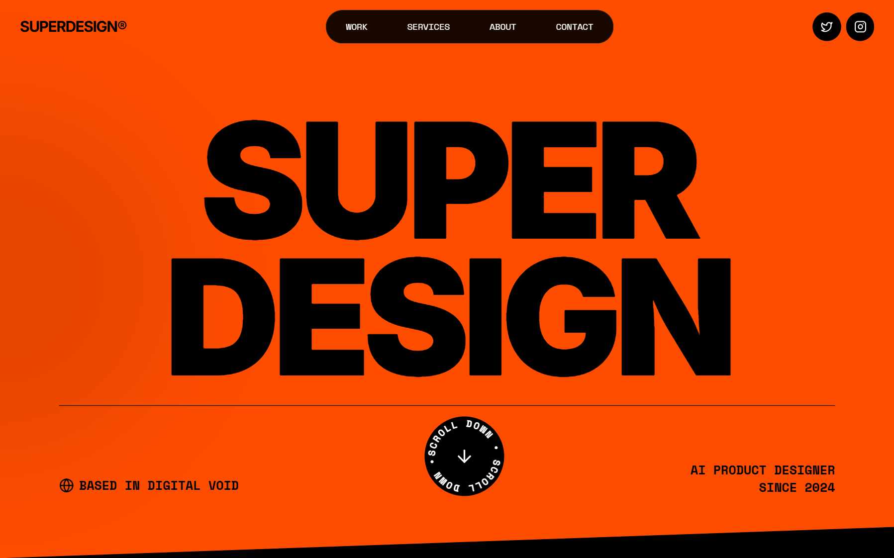
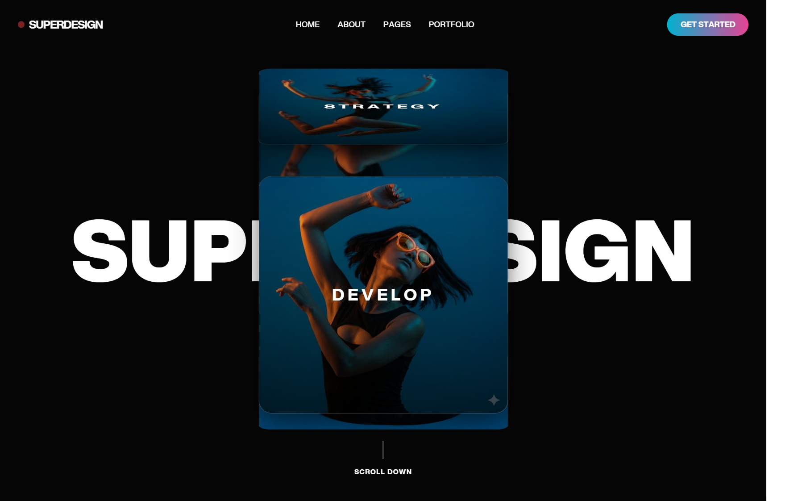
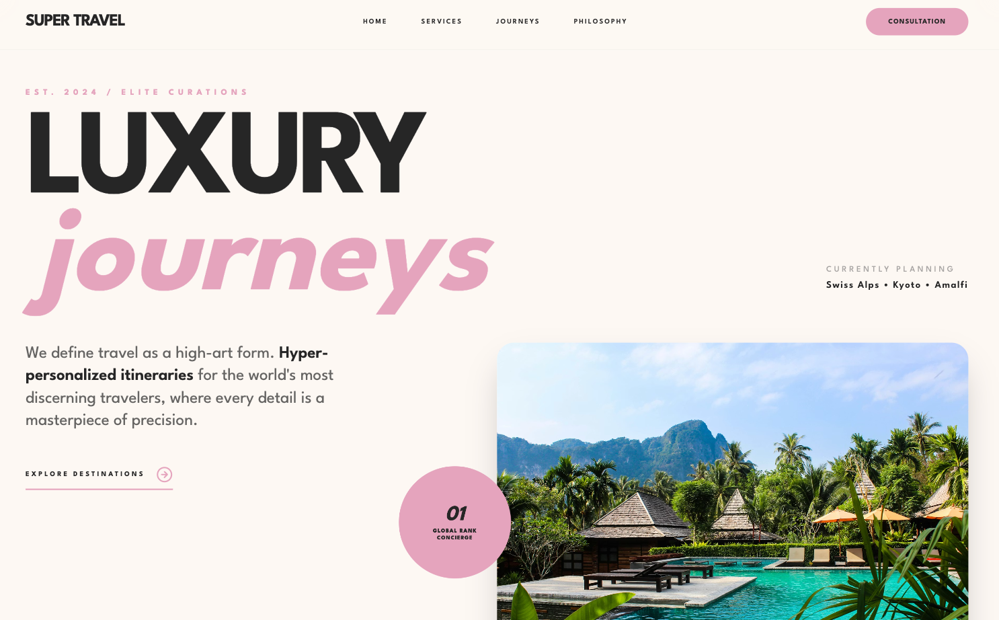

# Stop shipping AI-slop UI

> Coding agents write great code and generic interfaces: default shadcn, same fonts, no taste. This is a library of **design prompts — each a full design spec with a live preview and real usage data** — that give your agent design direction so the UI it ships actually looks designed. Powered by [Superdesign](https://superdesign.dev/library?utm_source=github&utm_medium=prompt-repo&utm_campaign=prompt-library).

    

<div align="center">
<!-- STATS:START -->
  <b>150 top prompts</b> · <b>334K tries</b> · <b>56K copies</b> — hand-picked and category-balanced from a <b>964-prompt live library</b> with <b>1.7M+ tries</b>.<br>
  Browse all and run any live at <b><a href="https://superdesign.dev/library?utm_source=github&utm_medium=prompt-repo&utm_campaign=prompt-library">superdesign.dev/library</a></b>.
<!-- STATS:END -->
</div>

## Why your AI UI looks generic (and how to fix it)

AI-generated UI all looks the same because the agent has **no taste to anchor to** — so it reaches for the same fonts, the same card grid, the same indigo-500. Most prompts here are a **full design spec** (exact colors, type, spacing, motion, layout); a handful are drop-in interactions and effects. Each shows its **real usage** (copies + tries) so you can see what builders actually reach for. Hand one to your agent and it builds to a real spec instead of a default.

## How to use these — 3 ways to de-slop

**1. Copy → paste into your agent** (zero setup, works everywhere)
Find a look below, open it, copy the prompt, then tell Claude Code / Cursor:
> *"Redesign my dashboard using this design spec: [paste]"*

*Tip: some specs name specific fonts (e.g. Sora, Satoshi, Space Grotesk). Install them, or tell your agent to substitute the closest Google/system font so it doesn't silently fall back to Arial.*

**2. Install the skill** (best — your agent picks and applies it for you)
```bash
npx skills add superdesigndev/superdesign-skill
```
Then just ask: *"/superdesign make my pricing page not look like AI slop"*. The agent searches this library, pulls the right prompt, and applies it to your code. [Skill repo](https://github.com/superdesigndev/superdesign-skill).

<details>
<summary><b>▸ What that actually does</b></summary>

Behind that one request, the skill:

1. **Reads your current UI** for context (your components, your stack)
2. **Searches this library** for a fitting look — `superdesign search-prompts --tags "pricing" --json`
3. **Pulls the design spec** — `superdesign get-prompts --slugs "<best match>" --json`
4. **Applies it to your code** — real tokens (exact colors, type, spacing, motion), not "make it nicer"

**Before:** default shadcn, Inter, `indigo-500`, a flat card grid — generic.
**After:** the page rebuilt to a real spec — a proper palette, type scale, spacing, and shadow system, applied to *your* components.

The difference from copy-paste: it picks the right prompt for **your** context and applies it across your **whole app**, not one page at a time.
</details>

**3. Try it live** (see it first, then take the code)
Hit **▶ Try live** on any prompt to generate and iterate it on the Superdesign canvas, then copy the result into your project.

> New to this? Start with [how to make Claude Code UI look good](https://superdesign.dev/blog/how-to-make-claude-code-ui-look-good).

## Why this library is different

Not another static list of design prompts. The difference is what's *behind* each one:

| | Most prompt lists / DESIGN.md repos | This one |
|---|---|---|
| Ranking | Curated by opinion | **Real usage shown** on every prompt (copies + tries); the [leaderboard](#most-used) ranks by it |
| Format | Static text / markdown, no preview | **Live preview + one-click run** on every entry |
| Freshness | Manual, goes stale | **Auto-synced** from a live product |
| Coverage | A few looks | Every **page type** and **style**, browsable |

## How this fits with the Superdesign skill

This repo is the **registry**; the [Superdesign skill](https://github.com/superdesigndev/superdesign-skill) is the **runtime** — like an npm registry and the npm CLI. They stack, they don't compete:

| | This library (registry) | Superdesign skill (runtime) |
|---|---|---|
| Role | Prompts, previews, usage rankings, metadata | Reads the registry, applies a prompt to *your* code |
| You | Browse, discover, copy, cite | Install once, then invoke |
| Analogy | npm registry / Homebrew formulae | npm / brew (the client) |
| Optimized for | Discovery + credibility | In-agent generating & iterating |

`superdesign get-prompts` pulls straight from this library's data. **Browse here, run it there.**

## Top prompts

<!-- GALLERY:START -->
<table>
<tr>
<td width="25%" align="center" valign="top"><a href="https://superdesign.dev/library/tubes-interactive-background?utm_source=github&utm_medium=prompt-repo&utm_campaign=prompt-library"></a><br><sub><b><a href="prompts/tubes-interactive-background/">Tubes Interactive Background</a></b><br>2,912 copies</sub></td>
<td width="25%" align="center" valign="top"><a href="https://superdesign.dev/library/high-contrast-landing-page?utm_source=github&utm_medium=prompt-repo&utm_campaign=prompt-library"></a><br><sub><b><a href="prompts/high-contrast-landing-page/">High Contrast Landing Page</a></b><br>2,503 copies</sub></td>
<td width="25%" align="center" valign="top"><a href="https://superdesign.dev/library/deep-red-style-5b01cb?utm_source=github&utm_medium=prompt-repo&utm_campaign=prompt-library"></a><br><sub><b><a href="prompts/deep-red-style-5b01cb/">Deep Red Style</a></b><br>2,321 copies</sub></td>
<td width="25%" align="center" valign="top"><a href="https://superdesign.dev/library/lumina-saas-landing-page?utm_source=github&utm_medium=prompt-repo&utm_campaign=prompt-library"></a><br><sub><b><a href="prompts/lumina-saas-landing-page/">Lumina SaaS Landing Page</a></b><br>2,259 copies</sub></td>
</tr>
<tr>
<td width="25%" align="center" valign="top"><a href="https://superdesign.dev/library/red-noir-style?utm_source=github&utm_medium=prompt-repo&utm_campaign=prompt-library"></a><br><sub><b><a href="prompts/red-noir-style/">Red Noir Style</a></b><br>2,162 copies</sub></td>
<td width="25%" align="center" valign="top"><a href="https://superdesign.dev/library/softly-digital-wellness-app?utm_source=github&utm_medium=prompt-repo&utm_campaign=prompt-library"></a><br><sub><b><a href="prompts/softly-digital-wellness-app/">Softly - Digital Wellness App</a></b><br>1,896 copies</sub></td>
<td width="25%" align="center" valign="top"><a href="https://superdesign.dev/library/glassmorphism-style?utm_source=github&utm_medium=prompt-repo&utm_campaign=prompt-library"></a><br><sub><b><a href="prompts/glassmorphism-style/">Glassmorphism Style</a></b><br>1,713 copies</sub></td>
<td width="25%" align="center" valign="top"><a href="https://superdesign.dev/library/mosaic-grid-architecture-style?utm_source=github&utm_medium=prompt-repo&utm_campaign=prompt-library"></a><br><sub><b><a href="prompts/mosaic-grid-architecture-style/">Mosaic Grid Architecture Style</a></b><br>1,688 copies</sub></td>
</tr>
<tr>
<td width="25%" align="center" valign="top"><a href="https://superdesign.dev/library/kinetic-orange-style?utm_source=github&utm_medium=prompt-repo&utm_campaign=prompt-library"></a><br><sub><b><a href="prompts/kinetic-orange-style/">Kinetic Orange Style</a></b><br>1,613 copies</sub></td>
<td width="25%" align="center" valign="top"><a href="https://superdesign.dev/library/brutalist-e-commerce-page?utm_source=github&utm_medium=prompt-repo&utm_campaign=prompt-library"></a><br><sub><b><a href="prompts/brutalist-e-commerce-page/">Brutalist E-commerce Page</a></b><br>1,571 copies</sub></td>
<td width="25%" align="center" valign="top"><a href="https://superdesign.dev/library/cinematic-style?utm_source=github&utm_medium=prompt-repo&utm_campaign=prompt-library"></a><br><sub><b><a href="prompts/cinematic-style/">Cinematic Style</a></b><br>1,362 copies</sub></td>
<td width="25%" align="center" valign="top"><a href="https://superdesign.dev/library/luxury-focused-design-system?utm_source=github&utm_medium=prompt-repo&utm_campaign=prompt-library"></a><br><sub><b><a href="prompts/luxury-focused-design-system/">Luxury-focused Design System</a></b><br>1,350 copies</sub></td>
</tr>
</table>
<!-- GALLERY:END -->

## Most-used

<!-- LEADERBOARD:START -->
| # | Prompt | Category | Copies | Tries | |
|---|---|---|---|---|---|
| 1 | **[Tubes Interactive Background](prompts/tubes-interactive-background/)** | Animations & Backgrounds | 2,912 | 1,608 | [▶ Try live](https://superdesign.dev/library/tubes-interactive-background?utm_source=github&utm_medium=prompt-repo&utm_campaign=prompt-library) |
| 2 | **[High Contrast Landing Page](prompts/high-contrast-landing-page/)** | Landing Pages | 2,503 | 2,400 | [▶ Try live](https://superdesign.dev/library/high-contrast-landing-page?utm_source=github&utm_medium=prompt-repo&utm_campaign=prompt-library) |
| 3 | **[Deep Red Style](prompts/deep-red-style-5b01cb/)** | Design Systems & Styles | 2,321 | 1,905 | [▶ Try live](https://superdesign.dev/library/deep-red-style-5b01cb?utm_source=github&utm_medium=prompt-repo&utm_campaign=prompt-library) |
| 4 | **[Lumina SaaS Landing Page](prompts/lumina-saas-landing-page/)** | Landing Pages | 2,259 | 2,271 | [▶ Try live](https://superdesign.dev/library/lumina-saas-landing-page?utm_source=github&utm_medium=prompt-repo&utm_campaign=prompt-library) |
| 5 | **[Red Noir Style](prompts/red-noir-style/)** | Design Systems & Styles | 2,162 | 2,234 | [▶ Try live](https://superdesign.dev/library/red-noir-style?utm_source=github&utm_medium=prompt-repo&utm_campaign=prompt-library) |
| 6 | **[Softly - Digital Wellness App](prompts/softly-digital-wellness-app/)** | Waitlist & Coming Soon | 1,896 | 1,527 | [▶ Try live](https://superdesign.dev/library/softly-digital-wellness-app?utm_source=github&utm_medium=prompt-repo&utm_campaign=prompt-library) |
| 7 | **[Glassmorphism Style](prompts/glassmorphism-style/)** | Design Systems & Styles | 1,713 | 2,451 | [▶ Try live](https://superdesign.dev/library/glassmorphism-style?utm_source=github&utm_medium=prompt-repo&utm_campaign=prompt-library) |
| 8 | **[Mosaic Grid Architecture Style](prompts/mosaic-grid-architecture-style/)** | Design Systems & Styles | 1,688 | 2,122 | [▶ Try live](https://superdesign.dev/library/mosaic-grid-architecture-style?utm_source=github&utm_medium=prompt-repo&utm_campaign=prompt-library) |
| 9 | **[Kinetic Orange Style](prompts/kinetic-orange-style/)** | Design Systems & Styles | 1,613 | 1,624 | [▶ Try live](https://superdesign.dev/library/kinetic-orange-style?utm_source=github&utm_medium=prompt-repo&utm_campaign=prompt-library) |
| 10 | **[Brutalist E-commerce Page](prompts/brutalist-e-commerce-page/)** | E-commerce | 1,571 | 1,531 | [▶ Try live](https://superdesign.dev/library/brutalist-e-commerce-page?utm_source=github&utm_medium=prompt-repo&utm_campaign=prompt-library) |
<!-- LEADERBOARD:END -->

<sub>**Copies** = the prompt text was copied · **Tries** = it was generated on the canvas. Both are real product events — some prompts are *tried* far more than *copied*, so a low copy count doesn't mean low usage.</sub>

## Browse

**By page type** (the structure): [Landing Pages](page-types/landing-pages/) · [Pricing Pages](page-types/pricing-pages/) · [Auth & Login](page-types/auth-login/) · [Dashboards](page-types/dashboards/) · [Onboarding](page-types/onboarding/) · [Waitlist & Coming Soon](page-types/waitlist-coming-soon/) · [Forms & Contact](page-types/forms-contact/) · [Blog & Editorial](page-types/blog-editorial/) · [E-commerce](page-types/e-commerce/) · [Portfolios](page-types/portfolios/) · [Mobile Apps](page-types/mobile-apps/) · [Components](page-types/components/)

**By style** (the look): every prompt *is* a full style spec with a live preview — browse [`prompts/`](prompts/) or the [leaderboard](#most-used) above.

**Everything:** [`prompts/`](prompts/) (all 150) · machine-readable [`prompts.json`](prompts.json) · [`prompts.csv`](prompts.csv) · [`PROMPTS.md`](PROMPTS.md)

<details>
<summary><b>Experimental: recombine any style × any page</b></summary>

Each prompt is being factored into a **style** ([`systems/`](systems/)) and a **structure** ([`page-types/`](page-types/)) so they recombine — one style renders many pages. **This is experimental:** the factored `systems/` are auto-scaffolded drafts (tokens are best-effort and may need fixing), so the prompt READMEs remain the source of truth. See [`examples/recombine-demo.md`](examples/recombine-demo.md).
</details>

## Superdesign vs other AI design tools

<!-- DRAFT: verify each cell before publishing. Keep it factual. -->

| | Superdesign | v0 | Lovable | Bolt | Google Stitch | Uizard |
|---|---|---|---|---|---|---|
| Runs inside your coding agent (Claude Code/Cursor) | ✅ | ❌ | ❌ | ❌ | ❌ | ❌ |
| Infinite design canvas | ✅ | ❌ | ❌ | ❌ | ❌ | ✅ |
| Usage-ranked prompt library | ✅ | ❌ | ❌ | ❌ | ❌ | ❌ |
| Designs into your existing design system | ✅ | ⚠️ | ⚠️ | ⚠️ | ❌ | ❌ |
| Outputs real code | ✅ | ✅ | ✅ | ✅ | ✅ | ⚠️ |

## FAQ

**Why does my AI-generated UI look generic / like AI slop?** Because the agent has no design direction, so it defaults to the same fonts, card grids, and colors every time. Give it a full design spec (like the prompts here) and it builds to that spec instead. See [how to make Claude Code UI look good](https://superdesign.dev/blog/how-to-make-claude-code-ui-look-good).

**How do I use these prompts?** Three ways: copy a prompt and paste it into Claude Code / Cursor; install the [Superdesign skill](https://github.com/superdesigndev/superdesign-skill) and let your agent search + apply them; or click **Try it live** to generate on the Superdesign canvas. (See "How to use" above.)

**Do these work with Claude Code and Cursor?** Yes. Install the [Superdesign skill](https://github.com/superdesigndev/superdesign-skill) and your agent can search, pull, and apply any prompt here to your codebase.

**What is Superdesign?** An AI product design agent that turns prompts into UI mockups, components, and full designs on an infinite canvas. See [superdesign.dev](https://superdesign.dev?utm_source=github&utm_medium=prompt-repo&utm_campaign=prompt-library).

**Are the prompts free to use?** The prompt text is free to use. *(Data license TBD — see LICENSE.)*

## Contributing

This is a read-only mirror of the live [Superdesign prompt library](https://superdesign.dev/library), auto-synced, with real usage shown per prompt. Add prompts by creating them in the app — top prompts sync here automatically. For fixes to this repo (typos, links, categorization), open a PR. See [`CONTRIBUTING.md`](CONTRIBUTING.md).

## License

Repo code and structure: MIT (see [`LICENSE`](LICENSE)). Prompt data license: **TBD** (CC0 recommended — pending decision).

---

<sub>Also available in [简体中文](README.zh-CN.md). The README's gallery, leaderboard, stats, and synced date are auto-generated by `scripts/gen_readme.py` — edit the prose freely, but leave the `<!-- … -->` markers in place.</sub>
