# Stop shipping AI-slop UI

> Coding agents write great code and generic interfaces: default shadcn, same fonts, no taste. This is a library of **design prompts — each a full design spec with a live preview and real usage data** — that give your agent design direction so the UI it ships actually looks designed. Powered by [Superdesign](https://superdesign.dev/library?utm_source=github&utm_medium=prompt-repo&utm_campaign=prompt-library).

    

<div align="center">
<!-- STATS:START -->
  <b>131 top prompts</b> · <b>283K tries</b> · <b>51K copies</b> — hand-picked and category-balanced from a <b>131-prompt live library</b> with <b>283K+ tries</b>.<br>
  Browse all and run any live at <b><a href="https://superdesign.dev/library?utm_source=github&utm_medium=prompt-repo&utm_campaign=prompt-library">superdesign.dev/library</a></b>.
<!-- STATS:END -->
</div>

## Why your AI UI looks generic (and how to fix it)

AI-generated UI all looks the same because the agent has **no taste to anchor to** — so it reaches for the same fonts, the same card grid, the same indigo-500. Most prompts here are a **full design spec** (exact colors, type, spacing, motion, layout); a handful are drop-in interactions and effects. Each shows its **real usage** (copies + tries) so you can see what builders actually reach for. Hand one to your agent and it builds to a real spec instead of a default.

## How to use these — 3 ways to de-slop

**1. Copy → paste into your agent** (zero setup, works everywhere)
Find a look below, open it, copy the prompt, then tell Claude Code / Cursor:
> *"Redesign my dashboard using this design spec: [paste]"*

*Tip: some specs name specific fonts (e.g. Sora, Satoshi, Space Grotesk). Install them, or tell your agent to substitute the closest Google/system font so it doesn't silently fall back to Arial.*

**2. Install the skill** (best — your agent picks and applies it for you)
```bash
npx skills add superdesigndev/superdesign-skill
```
Then just ask: *"/superdesign make my pricing page not look like AI slop"*. The agent searches this library, pulls the right prompt, and applies it to your code. [Skill repo](https://github.com/superdesigndev/superdesign-skill).

<details>
<summary><b>▸ What that actually does</b></summary>

Behind that one request, the skill:

1. **Reads your current UI** for context (your components, your stack)
2. **Searches this library** for a fitting look — `superdesign search-prompts --tags "pricing" --json`
3. **Pulls the design spec** — `superdesign get-prompts --slugs "<best match>" --json`
4. **Applies it to your code** — real tokens (exact colors, type, spacing, motion), not "make it nicer"

**Before:** default shadcn, Inter, `indigo-500`, a flat card grid — generic.
**After:** the page rebuilt to a real spec — a proper palette, type scale, spacing, and shadow system, applied to *your* components.

The difference from copy-paste: it picks the right prompt for **your** context and applies it across your **whole app**, not one page at a time.
</details>

**3. Try it live** (see it first, then take the code)
Hit **▶ Try live** on any prompt to generate and iterate it on the Superdesign canvas, then copy the result into your project.

> New to this? Start with [how to make Claude Code UI look good](https://superdesign.dev/blog/how-to-make-claude-code-ui-look-good).

## Why this library is different

Not another static list of design prompts. The difference is what's *behind* each one:

| | Most prompt lists / DESIGN.md repos | This one |
|---|---|---|
| Ranking | Curated by opinion | **Vision-scored for design quality** (0–10 on the rendered preview) + real usage shown |
| Format | Static text / markdown, no preview | **Live preview + one-click run** on every entry |
| Freshness | Manual, goes stale | **Auto-synced** from a live product |
| Coverage | A few looks | Every **page type** and **style**, browsable |

## How this fits with the Superdesign skill

This repo is the **registry**; the [Superdesign skill](https://github.com/superdesigndev/superdesign-skill) is the **runtime** — like an npm registry and the npm CLI. They stack, they don't compete:

| | This library (registry) | Superdesign skill (runtime) |
|---|---|---|
| Role | Prompts, previews, usage rankings, metadata | Reads the registry, applies a prompt to *your* code |
| You | Browse, discover, copy, cite | Install once, then invoke |
| Analogy | npm registry / Homebrew formulae | npm / brew (the client) |
| Optimized for | Discovery + credibility | In-agent generating & iterating |

`superdesign get-prompts` pulls straight from this library's data. **Browse here, run it there.**

## Top prompts

<!-- GALLERY:START -->
<table>
<tr>
<td width="25%" align="center" valign="top"><a href="https://superdesign.dev/library/acid-yellow-neo-brutalist-mega-footer?utm_source=github&utm_medium=prompt-repo&utm_campaign=prompt-library">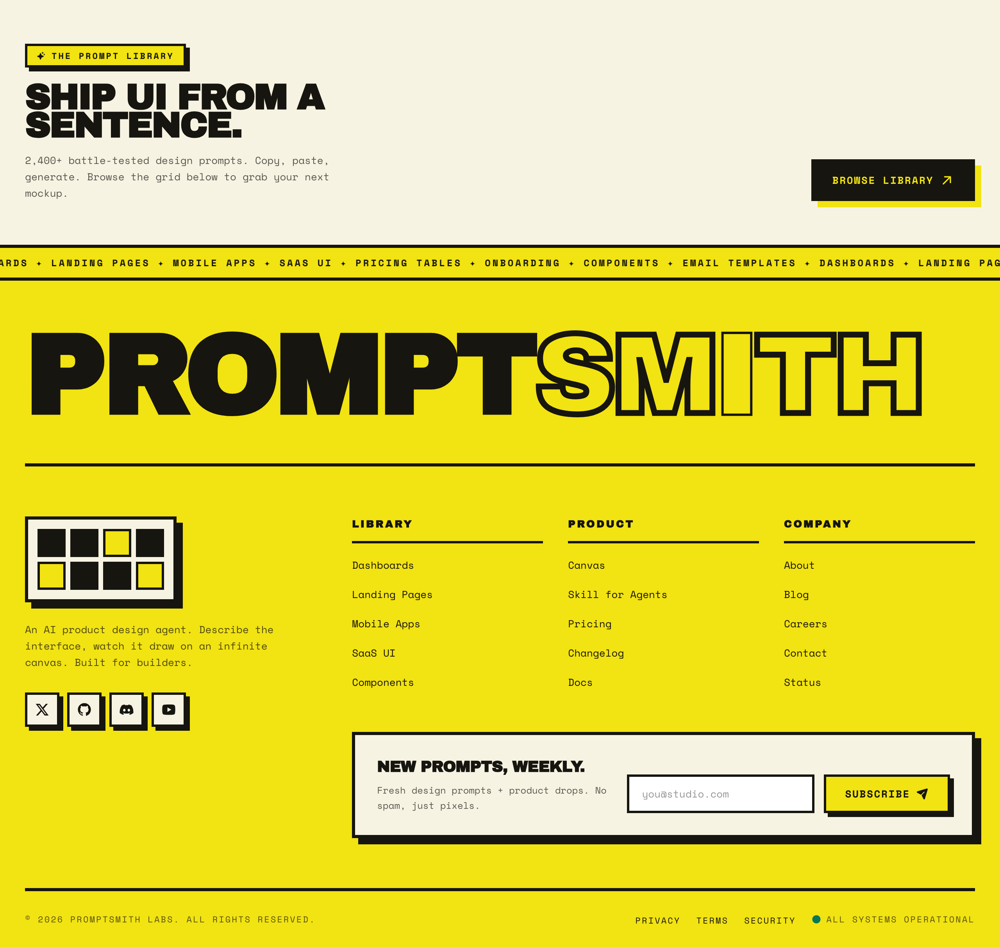</a><br><sub><b><a href="prompts/acid-yellow-neo-brutalist-mega-footer/">Acid-Yellow Neo-Brutalist Mega Footer</a></b><br>2,401 runs</sub></td>
<td width="25%" align="center" valign="top"><a href="https://superdesign.dev/library/high-contrast-landing-page?utm_source=github&utm_medium=prompt-repo&utm_campaign=prompt-library">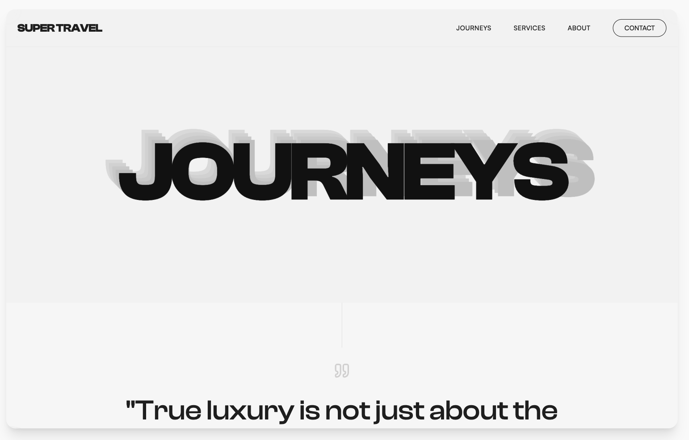</a><br><sub><b><a href="prompts/high-contrast-landing-page/">High Contrast Landing Page</a></b><br>2,400 runs</sub></td>
<td width="25%" align="center" valign="top"><a href="https://p.superdesign.dev/draft/ca3f16bf-3779-43c6-98b6-031c60e7c77e">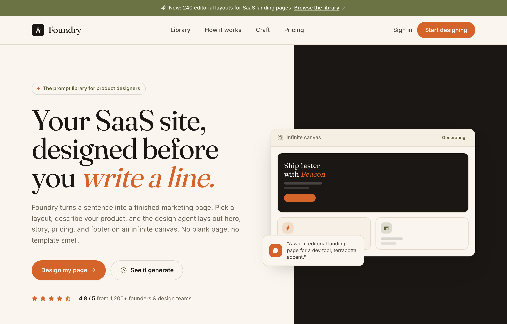</a><br><sub><b><a href="prompts/foundry-your-saas-site-designed-before-you-write-a-line/">Foundry: Your SaaS Site, Designed Before You Write a Line</a></b><br>2,390 runs</sub></td>
<td width="25%" align="center" valign="top"><a href="https://p.superdesign.dev/draft/ce5771e8-084d-4a35-a72d-97d816f7133e">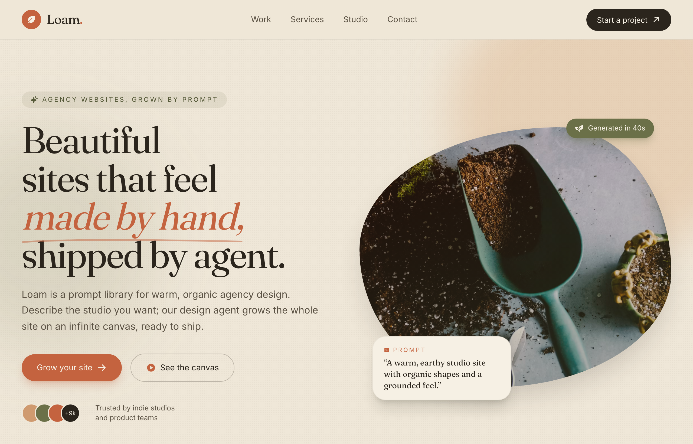</a><br><sub><b><a href="prompts/loam-warm-earthy-organic-agency-website/">Loam — Warm Earthy Organic Agency Website</a></b><br>2,390 runs</sub></td>
</tr>
<tr>
<td width="25%" align="center" valign="top"><a href="https://superdesign.dev/library/ai-system-configuration-console?utm_source=github&utm_medium=prompt-repo&utm_campaign=prompt-library">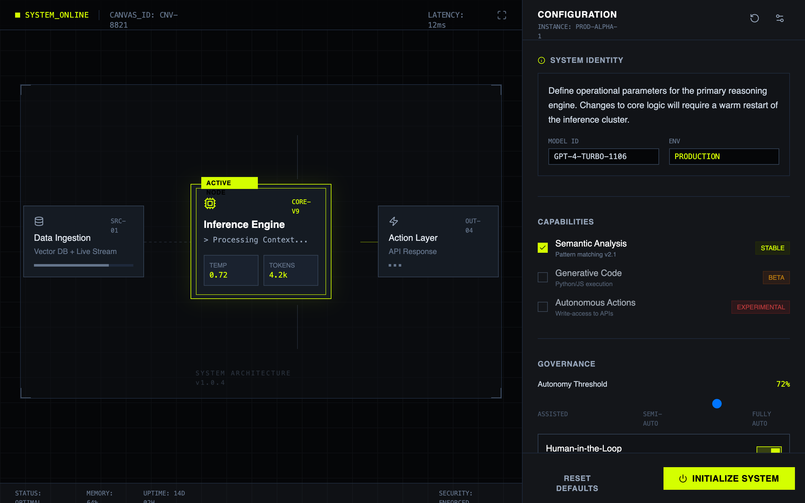</a><br><sub><b><a href="prompts/ai-system-configuration-console/">AI System Configuration Console</a></b><br>2,306 runs</sub></td>
<td width="25%" align="center" valign="top"><a href="https://superdesign.dev/library/superdesign-editorial-waitlist?utm_source=github&utm_medium=prompt-repo&utm_campaign=prompt-library"></a><br><sub><b><a href="prompts/superdesign-editorial-waitlist/">Superdesign Editorial Waitlist</a></b><br>2,262 runs</sub></td>
<td width="25%" align="center" valign="top"><a href="https://superdesign.dev/library/verdance-agency-website-design-studio-dark-emerald?utm_source=github&utm_medium=prompt-repo&utm_campaign=prompt-library">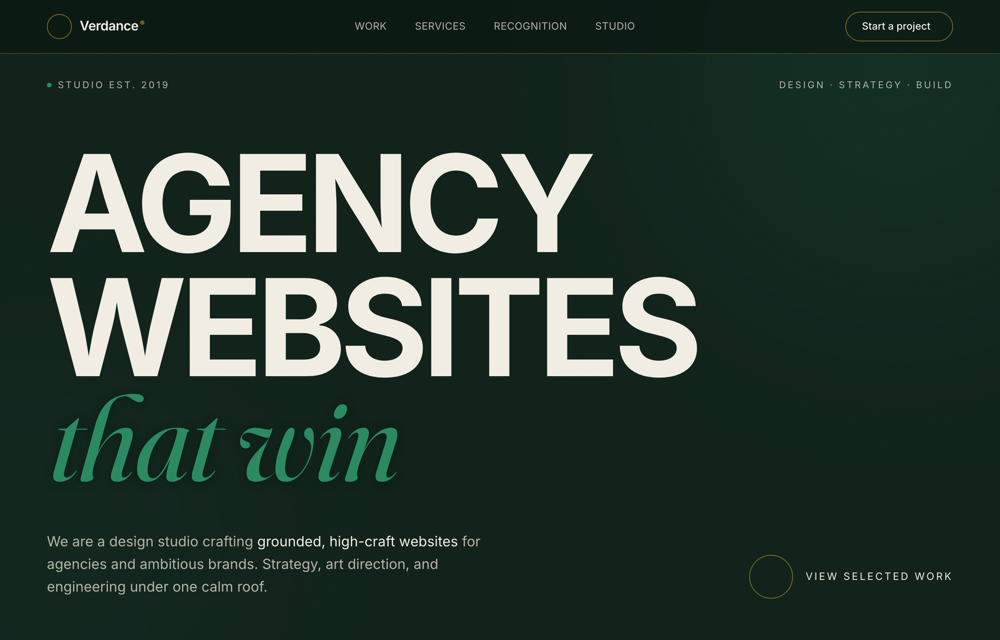</a><br><sub><b><a href="prompts/verdance-agency-website-design-studio-dark-emerald/">Verdance — Agency Website Design Studio (Dark Emerald)</a></b><br>1,997 runs</sub></td>
<td width="25%" align="center" valign="top"><a href="https://superdesign.dev/library/gen-z-social-app?utm_source=github&utm_medium=prompt-repo&utm_campaign=prompt-library">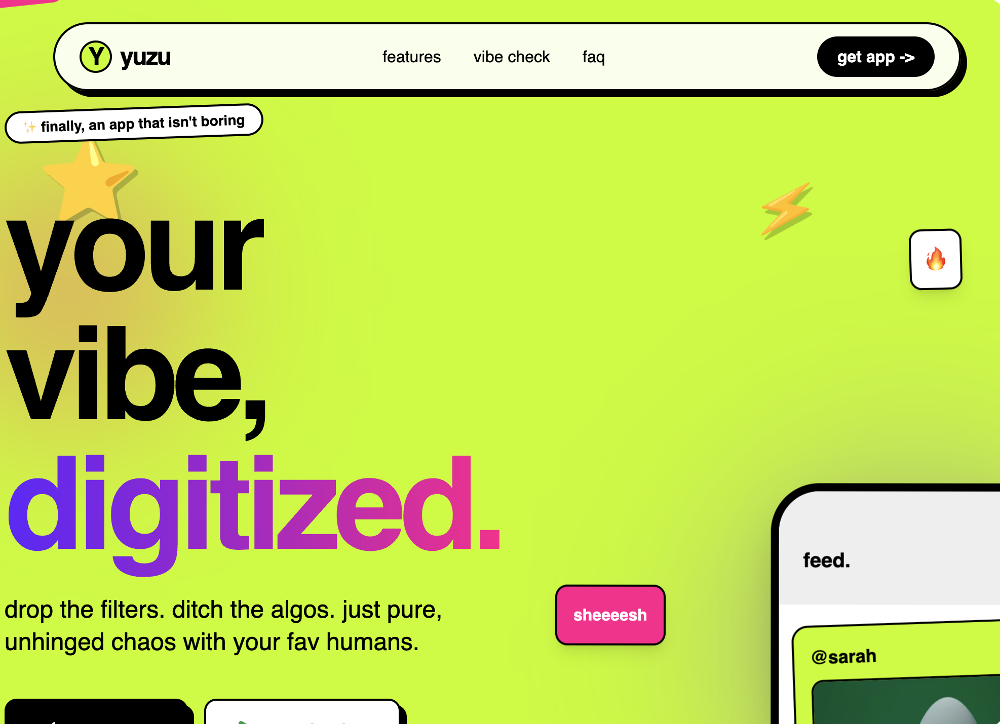</a><br><sub><b><a href="prompts/gen-z-social-app/">Gen-Z Social App</a></b><br>1,664 runs</sub></td>
</tr>
<tr>
<td width="25%" align="center" valign="top"><a href="https://superdesign.dev/library/brutalist-style-ecommerce-page?utm_source=github&utm_medium=prompt-repo&utm_campaign=prompt-library">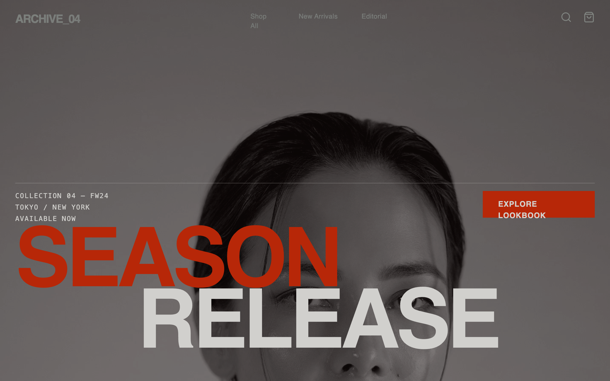</a><br><sub><b><a href="prompts/brutalist-style-ecommerce-page/">Brutalist Style Ecommerce Page</a></b><br>1,568 runs</sub></td>
<td width="25%" align="center" valign="top"><a href="https://superdesign.dev/library/brutalist-e-commerce-page?utm_source=github&utm_medium=prompt-repo&utm_campaign=prompt-library">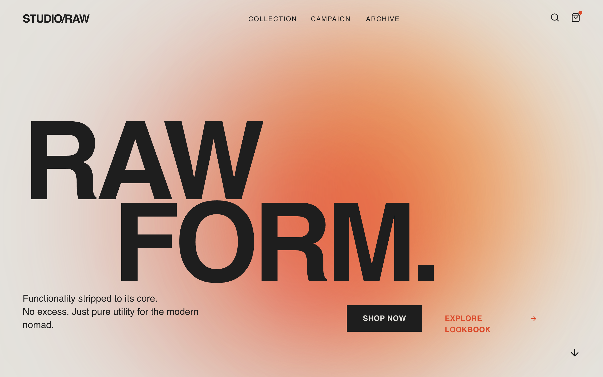</a><br><sub><b><a href="prompts/brutalist-e-commerce-page/">Brutalist E-commerce Page</a></b><br>1,531 runs</sub></td>
<td width="25%" align="center" valign="top"><a href="https://p.superdesign.dev/draft/c98899b2-32ee-4564-afb4-b914e4da709c">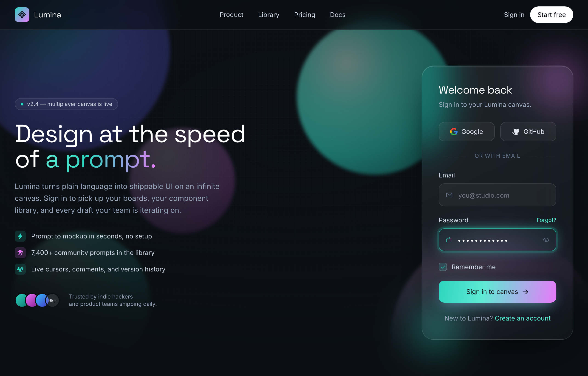</a><br><sub><b><a href="prompts/aurora-glass-sign-in-to-the-canvas/">Aurora Glass — Sign in to the canvas</a></b><br>2,495 runs</sub></td>
<td width="25%" align="center" valign="top"><a href="https://superdesign.dev/library/graphic-comparison-report?utm_source=github&utm_medium=prompt-repo&utm_campaign=prompt-library"></a><br><sub><b><a href="prompts/graphic-comparison-report/">Graphic Comparison Report</a></b><br>2,470 runs</sub></td>
</tr>
</table>
<!-- GALLERY:END -->

## Top-rated prompts

<!-- LEADERBOARD:START -->
| # | Prompt | Category | Design | Runs | |
|---|---|---|---|---|---|
| 1 | **[Acid-Yellow Neo-Brutalist Mega Footer](prompts/acid-yellow-neo-brutalist-mega-footer/)** | Forms & Contact | 9/10 | 2,401 | [▶ Try live](https://superdesign.dev/library/acid-yellow-neo-brutalist-mega-footer?utm_source=github&utm_medium=prompt-repo&utm_campaign=prompt-library) |
| 2 | **[High Contrast Landing Page](prompts/high-contrast-landing-page/)** | Landing Pages | 9/10 | 2,400 | [▶ Try live](https://superdesign.dev/library/high-contrast-landing-page?utm_source=github&utm_medium=prompt-repo&utm_campaign=prompt-library) |
| 3 | **[Foundry: Your SaaS Site, Designed Before You Write a Line](prompts/foundry-your-saas-site-designed-before-you-write-a-line/)** | Landing Pages | 9/10 | 2,390 | [▶ Try live](https://p.superdesign.dev/draft/ca3f16bf-3779-43c6-98b6-031c60e7c77e) |
| 4 | **[Loam — Warm Earthy Organic Agency Website](prompts/loam-warm-earthy-organic-agency-website/)** | Portfolios | 9/10 | 2,390 | [▶ Try live](https://p.superdesign.dev/draft/ce5771e8-084d-4a35-a72d-97d816f7133e) |
| 5 | **[AI System Configuration Console](prompts/ai-system-configuration-console/)** | Dashboards | 9/10 | 2,306 | [▶ Try live](https://superdesign.dev/library/ai-system-configuration-console?utm_source=github&utm_medium=prompt-repo&utm_campaign=prompt-library) |
| 6 | **[Superdesign Editorial Waitlist](prompts/superdesign-editorial-waitlist/)** | Waitlist & Coming Soon | 9/10 | 2,262 | [▶ Try live](https://superdesign.dev/library/superdesign-editorial-waitlist?utm_source=github&utm_medium=prompt-repo&utm_campaign=prompt-library) |
| 7 | **[Verdance — Agency Website Design Studio (Dark Emerald)](prompts/verdance-agency-website-design-studio-dark-emerald/)** | Portfolios | 9/10 | 1,997 | [▶ Try live](https://superdesign.dev/library/verdance-agency-website-design-studio-dark-emerald?utm_source=github&utm_medium=prompt-repo&utm_campaign=prompt-library) |
| 8 | **[Gen-Z Social App](prompts/gen-z-social-app/)** | Waitlist & Coming Soon | 9/10 | 1,664 | [▶ Try live](https://superdesign.dev/library/gen-z-social-app?utm_source=github&utm_medium=prompt-repo&utm_campaign=prompt-library) |
| 9 | **[Brutalist Style Ecommerce Page](prompts/brutalist-style-ecommerce-page/)** | E-commerce | 9/10 | 1,568 | [▶ Try live](https://superdesign.dev/library/brutalist-style-ecommerce-page?utm_source=github&utm_medium=prompt-repo&utm_campaign=prompt-library) |
| 10 | **[Brutalist E-commerce Page](prompts/brutalist-e-commerce-page/)** | E-commerce | 9/10 | 1,531 | [▶ Try live](https://superdesign.dev/library/brutalist-e-commerce-page?utm_source=github&utm_medium=prompt-repo&utm_campaign=prompt-library) |
<!-- LEADERBOARD:END -->

<sub>**Design** = visual-quality score (0–10) from a vision review of the *actual rendered preview* — how premium it looks, not just how the spec reads. **Runs** = times generated on the canvas. Ranked by design quality (runs are near-uniform across the top, so they don't discriminate).</sub>

## Animations & effects

A static screenshot can't show these. They're **motion** prompts, backgrounds, cursors, and transitions you drop into a UI to make it feel alive. Previews loop below; hit **Try live** for the real thing.

<!-- ANIMATIONS:START -->
<table>
<tr>
<td width="33%" align="center" valign="top"><a href="https://superdesign.dev/library/hyperspeed-background?utm_source=github&utm_medium=prompt-repo&utm_campaign=prompt-library">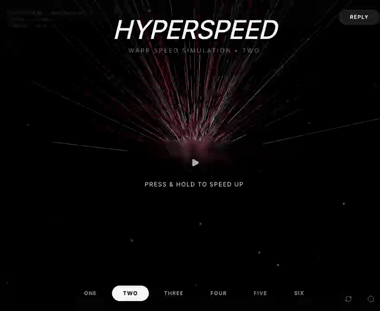</a><br><sub><b><a href="prompts/hyperspeed-background/">Hyperspeed Background</a></b> · 8/10<br>[<a href="https://superdesign.dev/library/hyperspeed-background?utm_source=github&utm_medium=prompt-repo&utm_campaign=prompt-library">▶ Try live</a>]</sub></td>
<td width="33%" align="center" valign="top"><a href="https://superdesign.dev/library/lightning-background?utm_source=github&utm_medium=prompt-repo&utm_campaign=prompt-library">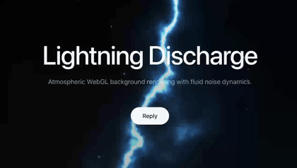</a><br><sub><b><a href="prompts/lightning-background/">Lightning Background</a></b> · 8/10<br>[<a href="https://superdesign.dev/library/lightning-background?utm_source=github&utm_medium=prompt-repo&utm_campaign=prompt-library">▶ Try live</a>]</sub></td>
<td width="33%" align="center" valign="top"><a href="https://superdesign.dev/library/exploded-view-assembly?utm_source=github&utm_medium=prompt-repo&utm_campaign=prompt-library">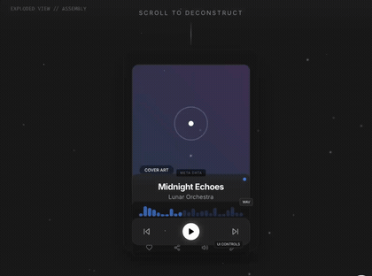</a><br><sub><b><a href="prompts/exploded-view-assembly/">"Exploded View" Assembly</a></b> · 8/10<br>[<a href="https://superdesign.dev/library/exploded-view-assembly?utm_source=github&utm_medium=prompt-repo&utm_campaign=prompt-library">▶ Try live</a>]</sub></td>
</tr>
<tr>
<td width="33%" align="center" valign="top"><a href="https://superdesign.dev/library/gooey-gradient-background?utm_source=github&utm_medium=prompt-repo&utm_campaign=prompt-library">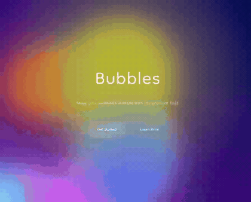</a><br><sub><b><a href="prompts/gooey-gradient-background/">Gooey Gradient Background</a></b> · 7/10<br>[<a href="https://superdesign.dev/library/gooey-gradient-background?utm_source=github&utm_medium=prompt-repo&utm_campaign=prompt-library">▶ Try live</a>]</sub></td>
<td width="33%" align="center" valign="top"><a href="https://superdesign.dev/library/light-rays-background?utm_source=github&utm_medium=prompt-repo&utm_campaign=prompt-library">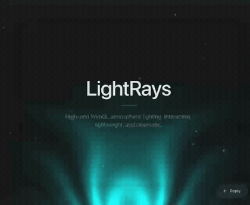</a><br><sub><b><a href="prompts/light-rays-background/">Light Rays Background</a></b> · 7/10<br>[<a href="https://superdesign.dev/library/light-rays-background?utm_source=github&utm_medium=prompt-repo&utm_campaign=prompt-library">▶ Try live</a>]</sub></td>
<td width="33%" align="center" valign="top"><a href="https://superdesign.dev/library/the-stacking-cards-effect?utm_source=github&utm_medium=prompt-repo&utm_campaign=prompt-library">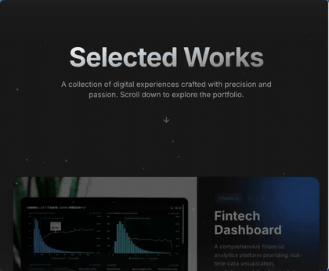</a><br><sub><b><a href="prompts/the-stacking-cards-effect/">The "Stacking Cards" Effect</a></b> · 5/10<br>[<a href="https://superdesign.dev/library/the-stacking-cards-effect?utm_source=github&utm_medium=prompt-repo&utm_campaign=prompt-library">▶ Try live</a>]</sub></td>
</tr>
</table>
<!-- ANIMATIONS:END -->

## Browse

**By page type** (the structure): [Landing Pages](page-types/landing-pages/) · [Pricing Pages](page-types/pricing-pages/) · [Auth & Login](page-types/auth-login/) · [Dashboards](page-types/dashboards/) · [Onboarding](page-types/onboarding/) · [Waitlist & Coming Soon](page-types/waitlist-coming-soon/) · [Forms & Contact](page-types/forms-contact/) · [Blog & Editorial](page-types/blog-editorial/) · [E-commerce](page-types/e-commerce/) · [Portfolios](page-types/portfolios/) · [Mobile Apps](page-types/mobile-apps/) · [Components](page-types/components/)

**By style** (the look): [Glassmorphism](prompts/glassmorphism-style/) · [Brutalist](prompts/brutalist-e-commerce-page/) · [Editorial](prompts/bold-editorial-style/) · [Cinematic](prompts/red-noir-style/) · [Neumorphism](prompts/neumorphism/) · [Luxury](prompts/luxury-focused-design-system/) · [Minimalist](prompts/high-contrast-landing-page/) · [Dark / Neon](prompts/synapse/) · [Kinetic / Bold](prompts/kinetic-orange-style/) · [Organic / Nature](prompts/nature-inspired-style/). Every prompt *is* a full style spec with a live preview — or browse all in [`prompts/`](prompts/).

**Everything:** [`prompts/`](prompts/) (every prompt) · machine-readable [`prompts.json`](prompts.json) · [`prompts.csv`](prompts.csv) · [`PROMPTS.md`](PROMPTS.md)

<details>
<summary><b>Experimental: recombine any style × any page</b></summary>

Each prompt is being factored into a **style** ([`systems/`](systems/)) and a **structure** ([`page-types/`](page-types/)) so they recombine — one style renders many pages. **This is experimental:** the factored `systems/` are auto-scaffolded `DESIGN.md` summaries, so the prompt READMEs remain the source of truth for exact tokens. See [`examples/recombine-demo.md`](examples/recombine-demo.md).
</details>

## Superdesign vs other AI design tools

| | Superdesign | v0 | Lovable | Bolt | Google Stitch | Uizard |
|---|---|---|---|---|---|---|
| Runs inside your coding agent (Claude Code/Cursor) | ✅ | ❌ | ❌ | ❌ | ❌ | ❌ |
| Infinite design canvas | ✅ | ❌ | ❌ | ❌ | ❌ | ✅ |
| Usage-ranked prompt library | ✅ | ❌ | ❌ | ❌ | ❌ | ❌ |
| Designs into your existing design system | ✅ | ⚠️ | ⚠️ | ⚠️ | ❌ | ❌ |
| Outputs real code | ✅ | ✅ | ✅ | ✅ | ✅ | ⚠️ |

## FAQ

**Why does my AI-generated UI look generic / like AI slop?** Because the agent has no design direction, so it defaults to the same fonts, card grids, and colors every time. Give it a full design spec (like the prompts here) and it builds to that spec instead. See [how to make Claude Code UI look good](https://superdesign.dev/blog/how-to-make-claude-code-ui-look-good).

**How do I use these prompts?** Three ways: copy a prompt and paste it into Claude Code / Cursor; install the [Superdesign skill](https://github.com/superdesigndev/superdesign-skill) and let your agent search + apply them; or click **Try it live** to generate on the Superdesign canvas. (See "How to use" above.)

**Do these work with Claude Code and Cursor?** Yes. Install the [Superdesign skill](https://github.com/superdesigndev/superdesign-skill) and your agent can search, pull, and apply any prompt here to your codebase.

**What is Superdesign?** An AI product design agent that turns prompts into UI mockups, components, and full designs on an infinite canvas. See [superdesign.dev](https://superdesign.dev?utm_source=github&utm_medium=prompt-repo&utm_campaign=prompt-library).

**Are the prompts free to use?** Yes — the prompt content is dedicated to the public domain under **CC0 1.0** ([`LICENSE-DATA`](LICENSE-DATA)). Use it freely, even commercially, no attribution required.

## Contributing

This is a read-only mirror of the live [Superdesign prompt library](https://superdesign.dev/library), auto-synced, with real usage shown per prompt. Add prompts by creating them in the app — top prompts sync here automatically. For fixes to this repo (typos, links, categorization), open a PR. See [`CONTRIBUTING.md`](CONTRIBUTING.md).

## License

Dual-licensed: the repo **code and structure** are MIT ([`LICENSE`](LICENSE)); the **prompt content** is dedicated to the public domain under **CC0 1.0** ([`LICENSE-DATA`](LICENSE-DATA)) — use it freely, even commercially, no attribution required.

---

<sub>Also available in [简体中文](README.zh-CN.md). The README's gallery, leaderboard, stats, and synced date are auto-generated by `scripts/gen_readme.py` — edit the prose freely, but leave the `<!-- … -->` markers in place.</sub>
