# Awesome AI Design Prompts

> The most-used AI design prompts, **ranked by real usage** (not vibes). Every one has a live preview and runs in one click. Mirrored from the [Superdesign](https://superdesign.dev/library) prompt library.

<!-- badges: fill OWNER/REPO on publish -->
  

**964 prompts in the live library.** These are the top team-authored ones, **balanced across categories** so every use case is covered, sorted by real usage (copies + tries). Browse all and try any live at **[superdesign.dev/library](https://superdesign.dev/library?utm_source=github&utm_medium=prompt-repo&utm_campaign=prompt-library)**.

## Why this list is different

| | Most prompt lists | This one |
|---|---|---|
| Ranking | Curated by opinion | **Ranked by real usage** |
| Format | Text to paste | **Live preview + one-click run** |
| Freshness | Manual, goes stale | **Auto-synced** from a live product |
| Coverage | A few categories | **Page-type + industry**, Webflow-style |

## Browse by page type

- [Landing Pages](#landing-pages) (12)
- [Pricing Pages](#pricing-pages) (12)
- [Auth & Login](#auth--login) (12)
- [Dashboards](#dashboards) (8)
- [Onboarding](#onboarding) (10)
- [Waitlist & Coming Soon](#waitlist--coming-soon) (10)
- [Forms & Contact](#forms--contact) (12)
- [Blog & Editorial](#blog--editorial) (5)
- [E-commerce](#e-commerce) (12)
- [Portfolios](#portfolios) (4)
- [Mobile Apps](#mobile-apps) (12)
- [Components](#components) (12)
- [Animations & Backgrounds](#animations--backgrounds) (12)
- [Design Systems & Styles](#design-systems--styles) (14)
- [Other](#other) (3)

## Browse by industry

- [SaaS](#by-industry) (21)
- [AI & Tech](#by-industry) (5)
- [Dev Tools](#by-industry) (15)
- [Agency & Studio](#by-industry) (5)
- [Health & Wellness](#by-industry) (2)
- [Fashion & Beauty](#by-industry) (1)
- [Finance & Crypto](#by-industry) (3)
- [E-commerce & Retail](#by-industry) (10)
- [Personal & Portfolio](#by-industry) (1)
- [General](#by-industry) (87)

[Comparison](#superdesign-vs-other-ai-design-tools) · [FAQ](#faq) · [Contributing](#contributing)

## Landing Pages

| Preview | Prompt | Industry | Copies | |
|---|---|---|---|---|
|  | **[High Contrast Landing Page](prompts/high-contrast-landing-page/)** landing page, style | General | 2,503 | [▶ Try live](https://superdesign.dev/library/high-contrast-landing-page?utm_source=github&utm_medium=prompt-repo&utm_campaign=prompt-library) |
|  | **[Lumina SaaS Landing Page](prompts/lumina-saas-landing-page/)** bold, energetic, yellow | SaaS | 2,259 | [▶ Try live](https://superdesign.dev/library/lumina-saas-landing-page?utm_source=github&utm_medium=prompt-repo&utm_campaign=prompt-library) |
|  | **[Synapse](prompts/synapse/)** landing page, page, style | General | 1,110 | [▶ Try live](https://superdesign.dev/library/synapse?utm_source=github&utm_medium=prompt-repo&utm_campaign=prompt-library) |
|  | **[SaaS Landing Page for Developer Tool](prompts/saas-landing-page-for-developer-tool/)** landing page, style, page | Dev Tools | 950 | [▶ Try live](https://superdesign.dev/library/saas-landing-page-for-developer-tool?utm_source=github&utm_medium=prompt-repo&utm_campaign=prompt-library) |
|  | **[Futuristic SasS Landing Page](prompts/futuristic-sass-landing-page/)** landing page, page, style | General | 942 | [▶ Try live](https://superdesign.dev/library/futuristic-sass-landing-page?utm_source=github&utm_medium=prompt-repo&utm_campaign=prompt-library) |
|  | **[Clean fluid](prompts/clean-fluid/)** landing page, style, page | General | 703 | [▶ Try live](https://superdesign.dev/library/clean-fluid?utm_source=github&utm_medium=prompt-repo&utm_campaign=prompt-library) |
|  | **[Red sun](prompts/red-sun/)** landing page, page, style | General | 513 | [▶ Try live](https://superdesign.dev/library/red-sun?utm_source=github&utm_medium=prompt-repo&utm_campaign=prompt-library) |
|  | **[Tech Editorial](prompts/tech-editorial/)** landing page, style, page | General | 510 | [▶ Try live](https://superdesign.dev/library/tech-editorial?utm_source=github&utm_medium=prompt-repo&utm_campaign=prompt-library) |
|  | **[Landing Page / Real-Estate](prompts/landing-page-real-estate/)** skill | General | 30 | [▶ Try live](https://superdesign.dev/library/landing-page-real-estate?utm_source=github&utm_medium=prompt-repo&utm_campaign=prompt-library) |
|  | **[One Pager](prompts/one-pager/)** skill | General | 9 | [▶ Try live](https://superdesign.dev/library/one-pager?utm_source=github&utm_medium=prompt-repo&utm_campaign=prompt-library) |
|  | **[Landing Page / Local Small Business](prompts/landing-page-local-small-business/)** skill | General | 5 | [▶ Try live](https://superdesign.dev/library/landing-page-local-small-business?utm_source=github&utm_medium=prompt-repo&utm_campaign=prompt-library) |
|  | **[Foundry: Your SaaS Site, Designed Before You Write a Line](prompts/foundry-your-saas-site-designed-before-you-write-a-line/)** saas-website, landing-page, editorial | SaaS | 0 | [▶ Try live](https://superdesign.dev/library/foundry-your-saas-site-designed-before-you-write-a-line?utm_source=github&utm_medium=prompt-repo&utm_campaign=prompt-library) |

## Pricing Pages

| Preview | Prompt | Industry | Copies | |
|---|---|---|---|---|
|  | **[Gridwright — Design the web, type the prompt (Swiss Grid / Signal Red)](prompts/gridwright-design-the-web-type-the-prompt-swiss-grid-signal-red/)** saas-website, swiss-grid, international-typographic-style | Dev Tools | 3 | [▶ Try live](https://superdesign.dev/library/gridwright-design-the-web-type-the-prompt-swiss-grid-signal-red?utm_source=github&utm_medium=prompt-repo&utm_campaign=prompt-library) |
| 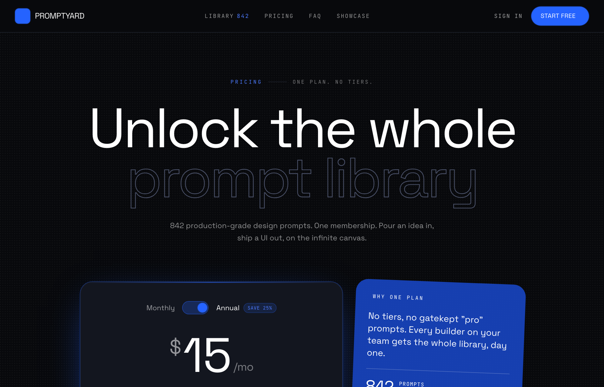 | **[Electric-Blue Studio Pricing](prompts/electric-blue-studio-pricing-188a8f/)** pricing page, saas, dark | Dev Tools | 1 | [▶ Try live](https://superdesign.dev/library/electric-blue-studio-pricing-188a8f?utm_source=github&utm_medium=prompt-repo&utm_campaign=prompt-library) |
| 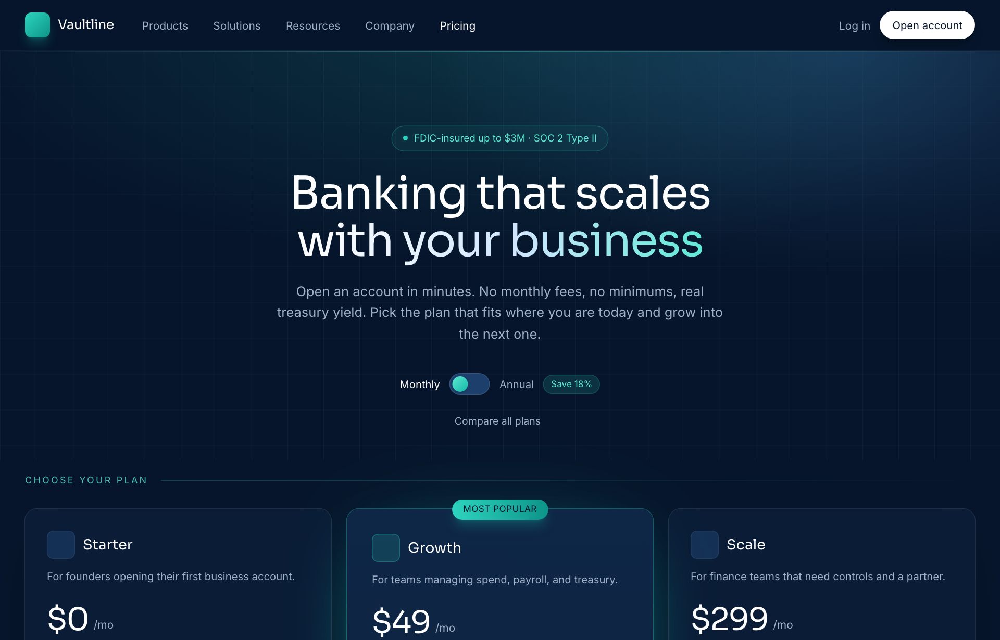 | **[Midnight Navy Fintech Pricing](prompts/midnight-navy-fintech-pricing-656a6d/)** pricing page, saas, fintech | Finance & Crypto | 1 | [▶ Try live](https://superdesign.dev/library/midnight-navy-fintech-pricing-656a6d?utm_source=github&utm_medium=prompt-repo&utm_campaign=prompt-library) |
|  | **[Slate ROI-Calculator Pricing](prompts/slate-roi-calculator-pricing/)** pricing page, saas, dark | Dev Tools | 0 | [▶ Try live](https://superdesign.dev/library/slate-roi-calculator-pricing?utm_source=github&utm_medium=prompt-repo&utm_campaign=prompt-library) |
| 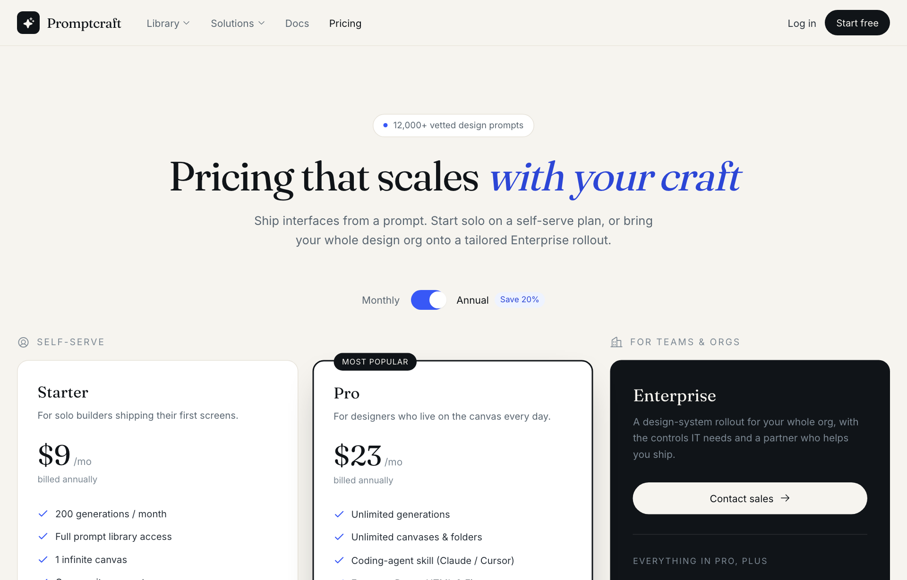 | **[Editorial Cream + Ink Two-Path SaaS Pricing](prompts/editorial-cream-ink-two-path-saas-pricing-3dee65/)** pricing page, saas, light | Dev Tools | 0 | [▶ Try live](https://superdesign.dev/library/editorial-cream-ink-two-path-saas-pricing-3dee65?utm_source=github&utm_medium=prompt-repo&utm_campaign=prompt-library) |
|  | **[Electric-Lime Single-Plan SaaS Pricing](prompts/electric-lime-single-plan-saas-pricing/)** pricing page, saas, single-plan | Dev Tools | 0 | [▶ Try live](https://superdesign.dev/library/electric-lime-single-plan-saas-pricing?utm_source=github&utm_medium=prompt-repo&utm_campaign=prompt-library) |
|  | **[Electric Dark Usage-Based Pricing Calculator](prompts/electric-dark-usage-based-pricing-calculator-20e556/)** pricing page, saas, dark | Dev Tools | 0 | [▶ Try live](https://superdesign.dev/library/electric-dark-usage-based-pricing-calculator-20e556?utm_source=github&utm_medium=prompt-repo&utm_campaign=prompt-library) |
| 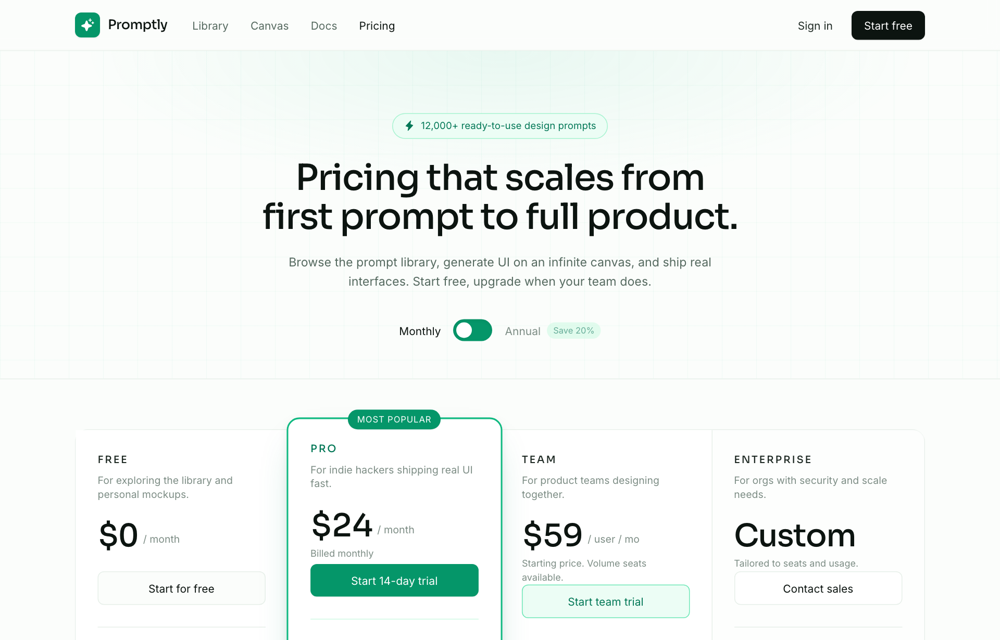 | **[Emerald 4-Tier SaaS Pricing Table](prompts/emerald-4-tier-saas-pricing-table/)** pricing page, saas, light | Dev Tools | 0 | [▶ Try live](https://superdesign.dev/library/emerald-4-tier-saas-pricing-table?utm_source=github&utm_medium=prompt-repo&utm_campaign=prompt-library) |
|  | **[Cream & Sky Playful SaaS Pricing](prompts/cream-and-sky-playful-saas-pricing/)** pricing page, saas, light | Dev Tools | 0 | [▶ Try live](https://superdesign.dev/library/cream-and-sky-playful-saas-pricing?utm_source=github&utm_medium=prompt-repo&utm_campaign=prompt-library) |
|  | **[Editorial Crimson Dev-Tool Pricing](prompts/editorial-crimson-dev-tool-pricing/)** pricing page, saas, light | Dev Tools | 0 | [▶ Try live](https://superdesign.dev/library/editorial-crimson-dev-tool-pricing?utm_source=github&utm_medium=prompt-repo&utm_campaign=prompt-library) |
|  | **[Champagne Noir Paywall](prompts/champagne-noir-paywall-65a2fd/)** mobile app, paywall, subscription | General | 0 | [▶ Try live](https://superdesign.dev/library/champagne-noir-paywall-65a2fd?utm_source=github&utm_medium=prompt-repo&utm_campaign=prompt-library) |
|  | **[Editorial Violet SaaS Pricing Matrix](prompts/editorial-violet-saas-pricing-matrix/)** pricing page, comparison-table, saas | Dev Tools | 0 | [▶ Try live](https://superdesign.dev/library/editorial-violet-saas-pricing-matrix?utm_source=github&utm_medium=prompt-repo&utm_campaign=prompt-library) |

## Auth & Login

| Preview | Prompt | Industry | Copies | |
|---|---|---|---|---|
| 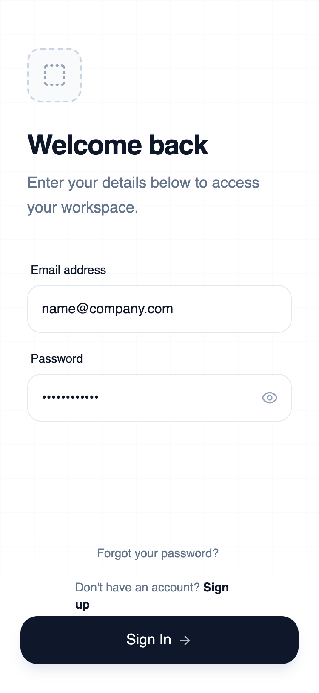 | **[Minimalist Wireframe Login](prompts/minimalist-wireframe-login/)** mobile app, login, auth | General | 8 | [▶ Try live](https://superdesign.dev/library/minimalist-wireframe-login?utm_source=github&utm_medium=prompt-repo&utm_campaign=prompt-library) |
|  | **[Aurora Glass — Sign in to the canvas](prompts/aurora-glass-sign-in-to-the-canvas/)** login, sign-in, auth | SaaS | 6 | [▶ Try live](https://superdesign.dev/library/aurora-glass-sign-in-to-the-canvas?utm_source=github&utm_medium=prompt-repo&utm_campaign=prompt-library) |
|  | **[Verify it's you · Aperture (OTP / 2FA, graphite-platinum)](prompts/verify-its-you-aperture-otp-2fa-graphite-platinum/)** login, otp, 2fa | SaaS | 4 | [▶ Try live](https://superdesign.dev/library/verify-its-you-aperture-otp-2fa-graphite-platinum?utm_source=github&utm_medium=prompt-repo&utm_campaign=prompt-library) |
| 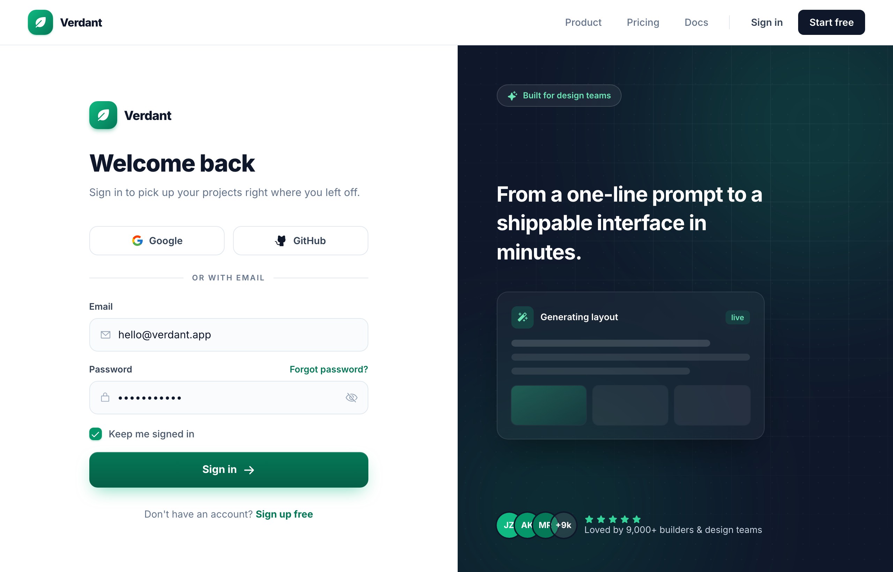 | **[Sign in to Verdant — Classic Split (Emerald)](prompts/sign-in-to-verdant-classic-split-emerald/)** login, sign-in, auth | SaaS | 3 | [▶ Try live](https://superdesign.dev/library/sign-in-to-verdant-classic-split-emerald?utm_source=github&utm_medium=prompt-repo&utm_campaign=prompt-library) |
|  | **[Design at the Speed of Thought — Editorial Split Sign-Up](prompts/design-at-the-speed-of-thought-editorial-split-sign-up/)** signup, auth, sign-up | SaaS | 1 | [▶ Try live](https://superdesign.dev/library/design-at-the-speed-of-thought-editorial-split-sign-up?utm_source=github&utm_medium=prompt-repo&utm_campaign=prompt-library) |
|  | **[Welcome back · Lumen — centered-card (true cobalt)](prompts/welcome-back-lumen-centered-card-true-cobalt/)** login, sign-in, auth | SaaS | 1 | [▶ Try live](https://superdesign.dev/library/welcome-back-lumen-centered-card-true-cobalt?utm_source=github&utm_medium=prompt-repo&utm_campaign=prompt-library) |
|  | **[Palette — Social-first friendly sign-up](prompts/palette-social-first-friendly-sign-up/)** signup, auth, login | SaaS | 0 | [▶ Try live](https://superdesign.dev/library/palette-social-first-friendly-sign-up?utm_source=github&utm_medium=prompt-repo&utm_campaign=prompt-library) |
|  | **[Create your account · Promptly — split-image emerald sign-up](prompts/create-your-account-promptly-split-image-emerald-sign-up/)** signup, sign-up, create-account | SaaS | 0 | [▶ Try live](https://superdesign.dev/library/create-your-account-promptly-split-image-emerald-sign-up?utm_source=github&utm_medium=prompt-repo&utm_campaign=prompt-library) |
| 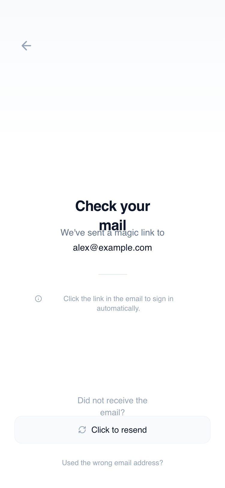 | **[Magic Link Confirmation](prompts/magic-link-confirmation/)** mobile app, auth, layout | General | 0 | [▶ Try live](https://superdesign.dev/library/magic-link-confirmation?utm_source=github&utm_medium=prompt-repo&utm_campaign=prompt-library) |
|  | **[Atlas Studio — Charting Your Account, Step One of Three](prompts/atlas-studio-charting-your-account-step-one-of-three/)** signup, onboarding, multi-step | Agency & Studio | 0 | [▶ Try live](https://superdesign.dev/library/atlas-studio-charting-your-account-step-one-of-three?utm_source=github&utm_medium=prompt-repo&utm_campaign=prompt-library) |
|  | **[Atelier · Early Access (waitlist-minimal-graphite)](prompts/atelier-early-access-waitlist-minimal-graphite/)** signup, waitlist, early-access | SaaS | 0 | [▶ Try live](https://superdesign.dev/library/atelier-early-access-waitlist-minimal-graphite?utm_source=github&utm_medium=prompt-repo&utm_campaign=prompt-library) |
|  | **[Plume · Sign in to your design canvas](prompts/plume-sign-in-to-your-design-canvas/)** login, sign-in, auth | SaaS | 0 | [▶ Try live](https://superdesign.dev/library/plume-sign-in-to-your-design-canvas?utm_source=github&utm_medium=prompt-repo&utm_campaign=prompt-library) |

## Dashboards

| Preview | Prompt | Industry | Copies | |
|---|---|---|---|---|
| 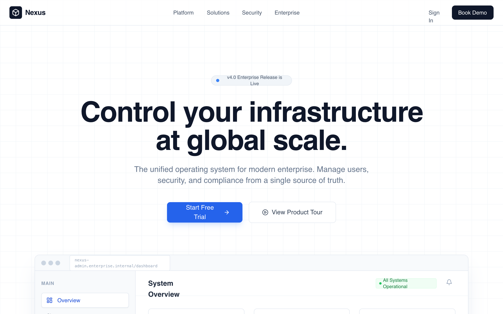 | **[Enterprise Admin Platform](prompts/enterprise-admin-platform/)** slate colour, high contrast, enterprise software | SaaS | 363 | [▶ Try live](https://superdesign.dev/library/enterprise-admin-platform?utm_source=github&utm_medium=prompt-repo&utm_campaign=prompt-library) |
| 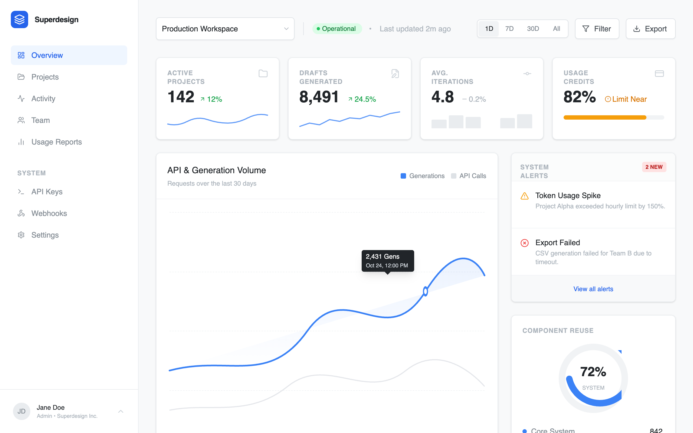 | **[Analytics dashboard](prompts/analytics-dashboard/)** dashboard, analytics dashboard, neutral | General | 85 | [▶ Try live](https://superdesign.dev/library/analytics-dashboard?utm_source=github&utm_medium=prompt-repo&utm_campaign=prompt-library) |
| 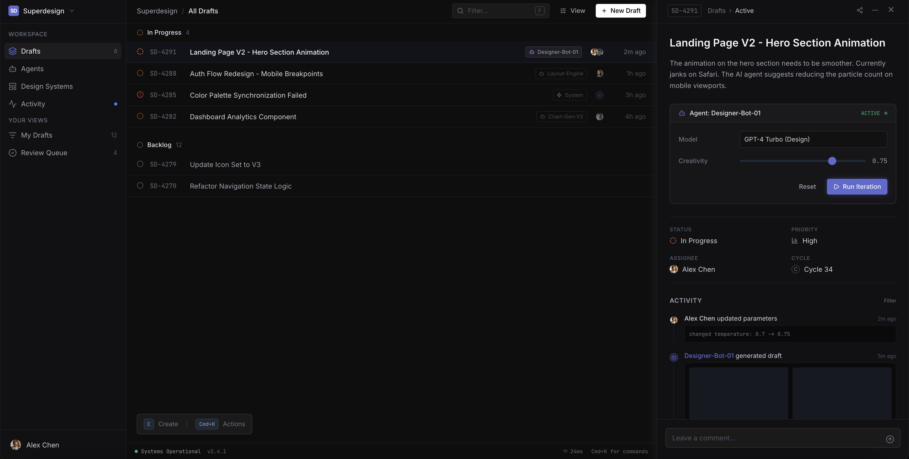 | **[Linear inspired developer tool dashboard](prompts/linear-inspired-developer-tool-dashboard/)** dark mode, linear inspired, minimalist | Dev Tools | 33 | [▶ Try live](https://superdesign.dev/library/linear-inspired-developer-tool-dashboard?utm_source=github&utm_medium=prompt-repo&utm_campaign=prompt-library) |
|  | **[AI System Configuration Console](prompts/ai-system-configuration-console/)** technical dashboard, dark mode, acid green accent | Dev Tools | 32 | [▶ Try live](https://superdesign.dev/library/ai-system-configuration-console?utm_source=github&utm_medium=prompt-repo&utm_campaign=prompt-library) |
|  | **[Developer tool dashboard/onboarding](prompts/developer-tool-dashboardonboarding/)** monochromatic, dark mode, high contrast | Dev Tools | 14 | [▶ Try live](https://superdesign.dev/library/developer-tool-dashboardonboarding?utm_source=github&utm_medium=prompt-repo&utm_campaign=prompt-library) |
|  | **[Volt — Electric-Lime Fitness Dashboard](prompts/volt-electric-lime-fitness-dashboard-a7544c/)** mobile app, fitness, health | Health & Wellness | 5 | [▶ Try live](https://superdesign.dev/library/volt-electric-lime-fitness-dashboard-a7544c?utm_source=github&utm_medium=prompt-repo&utm_campaign=prompt-library) |
| 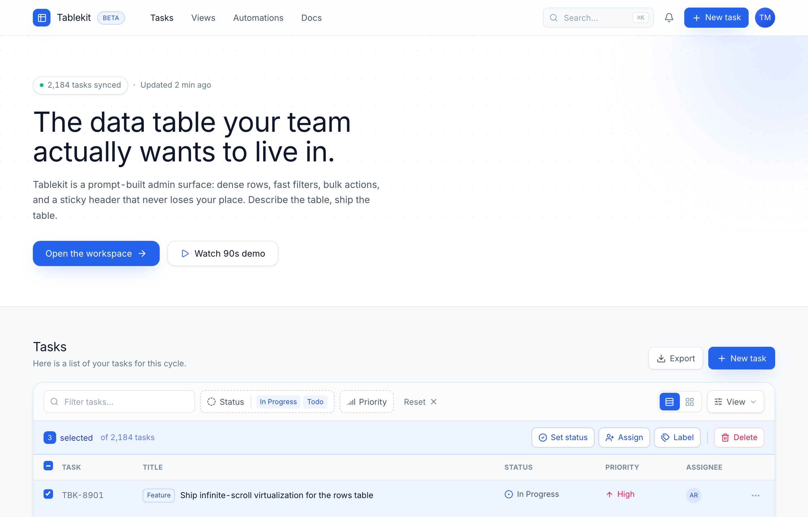 | **[Tablekit — The data table your team actually wants to live in](prompts/tablekit-the-data-table-your-team-actually-wants-to-live-in/)** table, admin, dashboard | SaaS | 0 | [▶ Try live](https://superdesign.dev/library/tablekit-the-data-table-your-team-actually-wants-to-live-in?utm_source=github&utm_medium=prompt-repo&utm_campaign=prompt-library) |
| 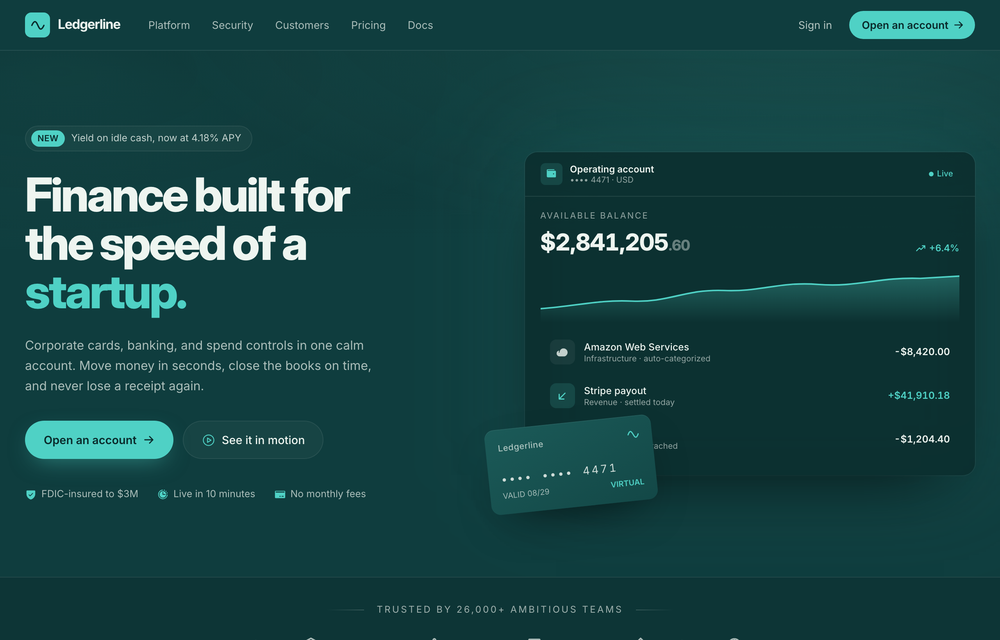 | **[Ledgerline — fintech teal/mint startup landing page](prompts/ledgerline-fintech-tealmint-startup-landing-page/)** startup-website, landing-page, fintech | Finance & Crypto | 0 | [▶ Try live](https://superdesign.dev/library/ledgerline-fintech-tealmint-startup-landing-page?utm_source=github&utm_medium=prompt-repo&utm_campaign=prompt-library) |

## Onboarding

| Preview | Prompt | Industry | Copies | |
|---|---|---|---|---|
| 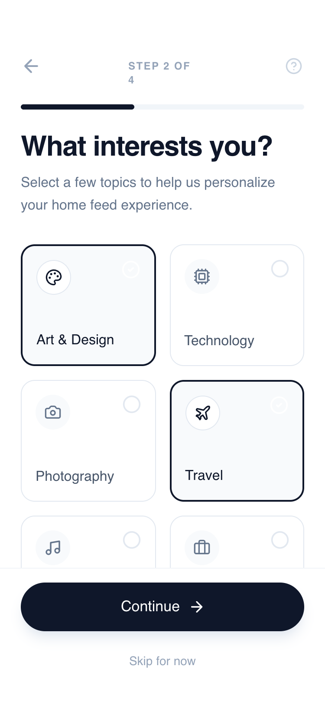 | **[Interactive Multi-Step Onboarding Flow](prompts/interactive-multi-step-onboarding-flow/)** mobile app, account setup, layout | General | 16 | [▶ Try live](https://superdesign.dev/library/interactive-multi-step-onboarding-flow?utm_source=github&utm_medium=prompt-repo&utm_campaign=prompt-library) |
|  | **[Editorial SaaS Onboarding](prompts/editorial-saas-onboarding/)** sass, onboarding, modern | SaaS | 16 | [▶ Try live](https://superdesign.dev/library/editorial-saas-onboarding?utm_source=github&utm_medium=prompt-repo&utm_campaign=prompt-library) |
| 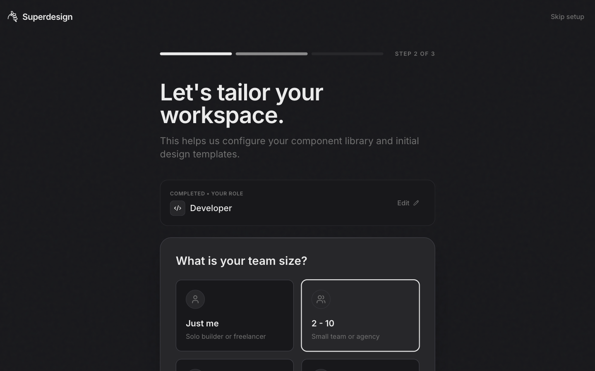 | **[Web App / Onboarding](prompts/web-app-onboarding/)** skill | General | 15 | [▶ Try live](https://superdesign.dev/library/web-app-onboarding?utm_source=github&utm_medium=prompt-repo&utm_campaign=prompt-library) |
|  | **[System Initialization - Trust & Transparency](prompts/system-initialization-trust-and-transparency/)** onboarding, page, trust-building | AI & Tech | 12 | [▶ Try live](https://superdesign.dev/library/system-initialization-trust-and-transparency?utm_source=github&utm_medium=prompt-repo&utm_campaign=prompt-library) |
|  | **[Luminous Ethereal Glassmorphism Onboarding](prompts/luminous-ethereal-glassmorphism-onboarding/)** onboarding, fintech, glassmorphic | Finance & Crypto | 12 | [▶ Try live](https://superdesign.dev/library/luminous-ethereal-glassmorphism-onboarding?utm_source=github&utm_medium=prompt-repo&utm_campaign=prompt-library) |
| 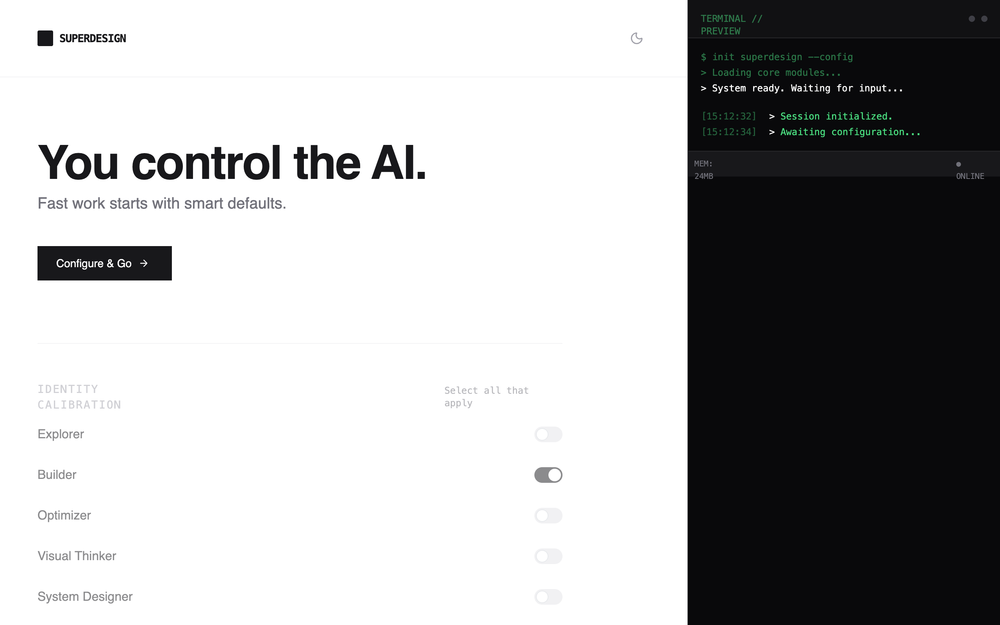 | **[Superdesign Setup - Inline Preview](prompts/superdesign-setup-inline-preview/)** onboarding, developer, high contrast | AI & Tech | 10 | [▶ Try live](https://superdesign.dev/library/superdesign-setup-inline-preview?utm_source=github&utm_medium=prompt-repo&utm_campaign=prompt-library) |
| 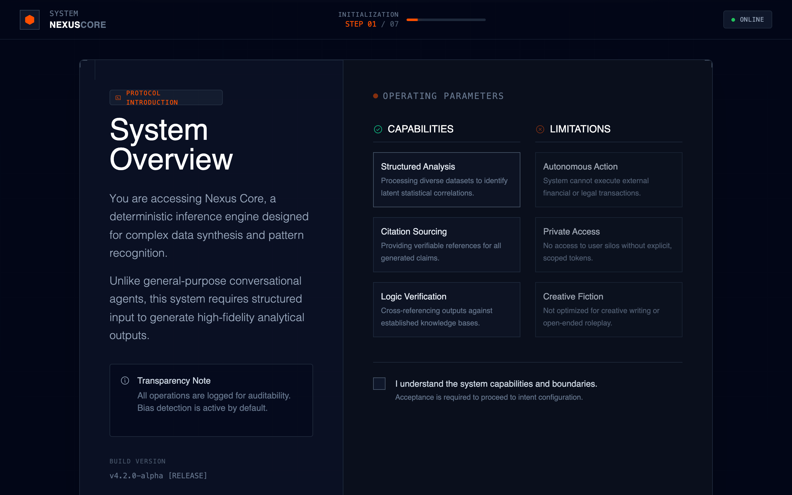 | **[Technical System Onboarding](prompts/technical-system-onboarding/)** onboarding, page, dark mode | AI & Tech | 8 | [▶ Try live](https://superdesign.dev/library/technical-system-onboarding?utm_source=github&utm_medium=prompt-repo&utm_campaign=prompt-library) |
| 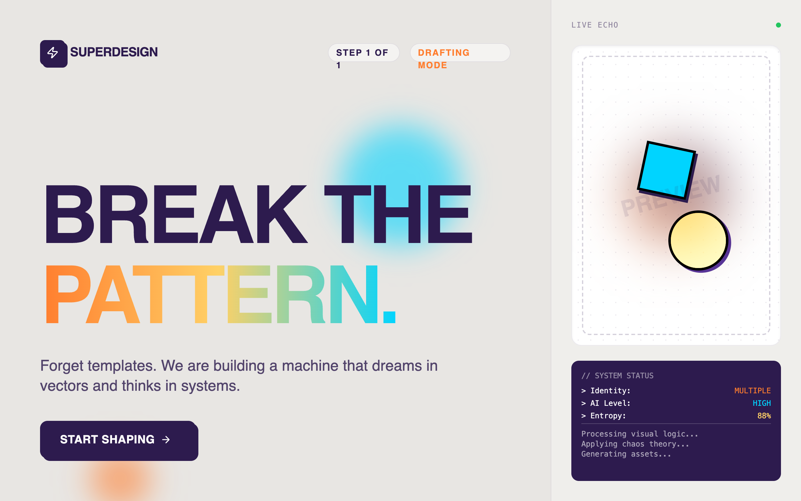 | **[High energy onboarding](prompts/high-energy-onboarding/)** onboarding, page, maximalist | General | 6 | [▶ Try live](https://superdesign.dev/library/high-energy-onboarding?utm_source=github&utm_medium=prompt-repo&utm_campaign=prompt-library) |
| 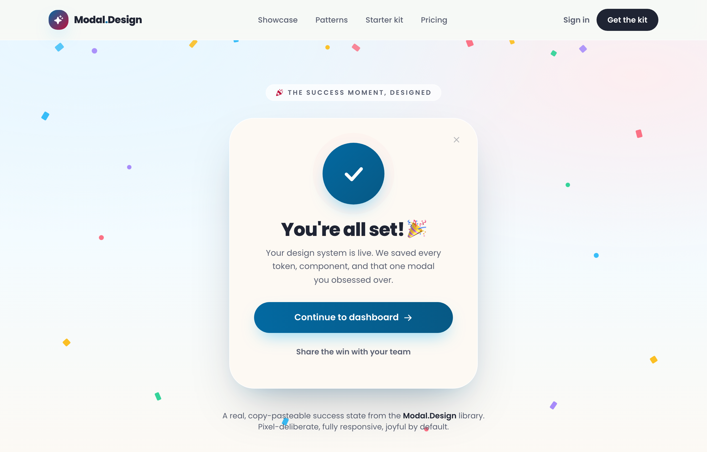 | **[Modal Design · success-celebration (pastel) — legibility fixed](prompts/modal-design-success-celebration-pastel-legibility-fixed-9fbd65/)** modal, success, celebration | General | 0 | [▶ Try live](https://superdesign.dev/library/modal-design-success-celebration-pastel-legibility-fixed-9fbd65?utm_source=github&utm_medium=prompt-repo&utm_campaign=prompt-library) |
|  | **[Modal Design · success-celebration (pastel) — legibility fixed](prompts/modal-design-success-celebration-pastel-legibility-fixed/)** modal, success, celebration | General | 0 | [▶ Try live](https://superdesign.dev/library/modal-design-success-celebration-pastel-legibility-fixed?utm_source=github&utm_medium=prompt-repo&utm_campaign=prompt-library) |

## Waitlist & Coming Soon

| Preview | Prompt | Industry | Copies | |
|---|---|---|---|---|
|  | **[Softly - Digital Wellness App](prompts/softly-digital-wellness-app/)** mobile app, sass landing, leads generation | Health & Wellness | 1,896 | [▶ Try live](https://superdesign.dev/library/softly-digital-wellness-app?utm_source=github&utm_medium=prompt-repo&utm_campaign=prompt-library) |
|  | **[Bold Editorial Style](prompts/bold-editorial-style/)** light mode, editorial, yellow | SaaS | 948 | [▶ Try live](https://superdesign.dev/library/bold-editorial-style?utm_source=github&utm_medium=prompt-repo&utm_campaign=prompt-library) |
|  | **[Minimalist Beta Capture](prompts/minimalist-beta-capture/)** high conversion page, landing page, product launch | General | 745 | [▶ Try live](https://superdesign.dev/library/minimalist-beta-capture?utm_source=github&utm_medium=prompt-repo&utm_campaign=prompt-library) |
|  | **[Neon Velocity Countdown](prompts/neon-velocity-countdown/)** product launch, style, landing page | General | 683 | [▶ Try live](https://superdesign.dev/library/neon-velocity-countdown?utm_source=github&utm_medium=prompt-repo&utm_campaign=prompt-library) |
|  | **[Superdesign Editorial Waitlist](prompts/superdesign-editorial-waitlist/)** style, waitlist, landing page | General | 556 | [▶ Try live](https://superdesign.dev/library/superdesign-editorial-waitlist?utm_source=github&utm_medium=prompt-repo&utm_campaign=prompt-library) |
|  | **[Disruptor Beta Launch](prompts/disruptor-beta-launch/)** product launch, waitlist, high conversion page | General | 456 | [▶ Try live](https://superdesign.dev/library/disruptor-beta-launch?utm_source=github&utm_medium=prompt-repo&utm_campaign=prompt-library) |
|  | **[Architectural Type System Style](prompts/architectural-type-system-style/)** landing page, product launch, waitlist | General | 354 | [▶ Try live](https://superdesign.dev/library/architectural-type-system-style?utm_source=github&utm_medium=prompt-repo&utm_campaign=prompt-library) |
|  | **[Gen-Z Social App](prompts/gen-z-social-app/)** acid lime accent, high contrast, neon accents | General | 224 | [▶ Try live](https://superdesign.dev/library/gen-z-social-app?utm_source=github&utm_medium=prompt-repo&utm_campaign=prompt-library) |
|  | **[Apple-inspired Waitlist](prompts/apple-inspired-waitlist/)** waitlist, beta access, product launch | General | 16 | [▶ Try live](https://superdesign.dev/library/apple-inspired-waitlist?utm_source=github&utm_medium=prompt-repo&utm_campaign=prompt-library) |
|  | **[Momentum — Ship Your Startup Launch Before the Idea Cools](prompts/momentum-ship-your-startup-launch-before-the-idea-cools/)** startup-website, landing-page, waitlist | SaaS | 0 | [▶ Try live](https://superdesign.dev/library/momentum-ship-your-startup-launch-before-the-idea-cools?utm_source=github&utm_medium=prompt-repo&utm_campaign=prompt-library) |

## Forms & Contact

| Preview | Prompt | Industry | Copies | |
|---|---|---|---|---|
|  | **[Acid-Yellow Neo-Brutalist Mega Footer](prompts/acid-yellow-neo-brutalist-mega-footer/)** footer, mega-footer, neo-brutalist | General | 1 | [▶ Try live](https://superdesign.dev/library/acid-yellow-neo-brutalist-mega-footer?utm_source=github&utm_medium=prompt-repo&utm_campaign=prompt-library) |
|  | **[Atelier — Design, Spoken Into Being (editorial serif / burgundy)](prompts/atelier-design-spoken-into-being-editorial-serif-burgundy/)** cta, editorial, serif | General | 1 | [▶ Try live](https://superdesign.dev/library/atelier-design-spoken-into-being-editorial-serif-burgundy?utm_source=github&utm_medium=prompt-repo&utm_campaign=prompt-library) |
|  | **[Teal-on-Ink Newsletter Mega Footer](prompts/teal-on-ink-newsletter-mega-footer/)** footer, mega-footer, newsletter | SaaS | 0 | [▶ Try live](https://superdesign.dev/library/teal-on-ink-newsletter-mega-footer?utm_source=github&utm_medium=prompt-repo&utm_campaign=prompt-library) |
|  | **[The Atelier Brief — an editorial intake form, set like a letter](prompts/the-atelier-brief-an-editorial-intake-form-set-like-a-letter/)** form, contact-form, intake-form | General | 0 | [▶ Try live](https://superdesign.dev/library/the-atelier-brief-an-editorial-intake-form-set-like-a-letter?utm_source=github&utm_medium=prompt-repo&utm_campaign=prompt-library) |
|  | **[Send Us the Brief — Brutalist Contact Form](prompts/send-us-the-brief-brutalist-contact-form/)** contact-form, contact, brutalist | General | 0 | [▶ Try live](https://superdesign.dev/library/send-us-the-brief-brutalist-contact-form?utm_source=github&utm_medium=prompt-repo&utm_campaign=prompt-library) |
|  | **[Validar — Forms that catch mistakes before they cost you](prompts/validar-forms-that-catch-mistakes-before-they-cost-you/)** form, validation, saas | SaaS | 0 | [▶ Try live](https://superdesign.dev/library/validar-forms-that-catch-mistakes-before-they-cost-you?utm_source=github&utm_medium=prompt-repo&utm_campaign=prompt-library) |
|  | **[Ink & Acid Mono Sitemap Footer](prompts/ink-and-acid-mono-sitemap-footer/)** footer, mega-footer, newsletter | General | 0 | [▶ Try live](https://superdesign.dev/library/ink-and-acid-mono-sitemap-footer?utm_source=github&utm_medium=prompt-repo&utm_campaign=prompt-library) |
|  | **[Cream Paper & Coral Mega Footer](prompts/cream-paper-and-coral-mega-footer/)** footer, mega-footer, newsletter | General | 0 | [▶ Try live](https://superdesign.dev/library/cream-paper-and-coral-mega-footer?utm_source=github&utm_medium=prompt-repo&utm_campaign=prompt-library) |
|  | **[Forms that feel effortless to fill — Fieldcraft](prompts/forms-that-feel-effortless-to-fill-fieldcraft/)** form, forms, settings | SaaS | 0 | [▶ Try live](https://superdesign.dev/library/forms-that-feel-effortless-to-fill-fieldcraft?utm_source=github&utm_medium=prompt-repo&utm_campaign=prompt-library) |
| 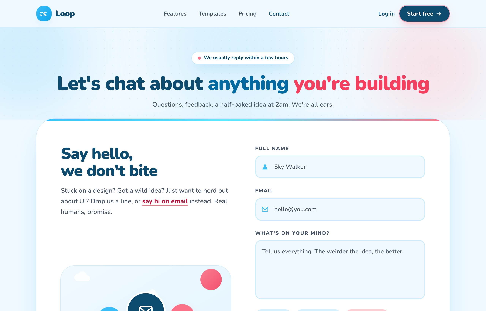 | **[Loop · Say hello, we don't bite (friendly illustrated sky)](prompts/loop-say-hello-we-dont-bite-friendly-illustrated-sky/)** contact-form, contact, light | General | 0 | [▶ Try live](https://superdesign.dev/library/loop-say-hello-we-dont-bite-friendly-illustrated-sky?utm_source=github&utm_medium=prompt-repo&utm_campaign=prompt-library) |
|  | **[Formcraft — Workspace Settings (cobalt two-column)](prompts/formcraft-workspace-settings-cobalt-two-column/)** form, settings, saas | SaaS | 0 | [▶ Try live](https://superdesign.dev/library/formcraft-workspace-settings-cobalt-two-column?utm_source=github&utm_medium=prompt-repo&utm_campaign=prompt-library) |
| 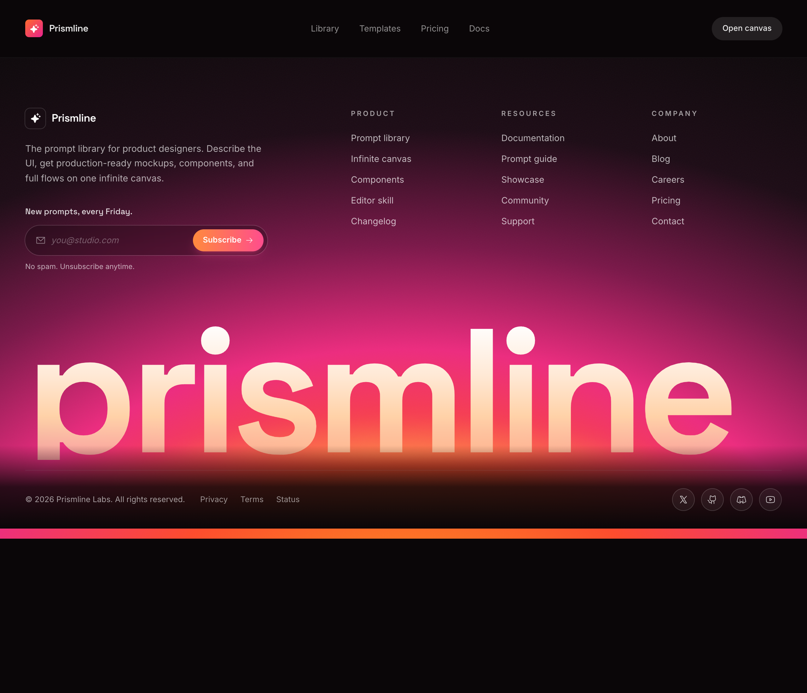 | **[Sunset Glow Wordmark Mega Footer](prompts/sunset-glow-wordmark-mega-footer/)** footer, mega-footer, newsletter | General | 0 | [▶ Try live](https://superdesign.dev/library/sunset-glow-wordmark-mega-footer?utm_source=github&utm_medium=prompt-repo&utm_campaign=prompt-library) |

## Blog & Editorial

| Preview | Prompt | Industry | Copies | |
|---|---|---|---|---|
|  | **[Blog Page - Editorial Grid Magazine](prompts/blog-page-editorial-grid-magazine/)** shopify, ecommerce, layout | E-commerce & Retail | 20 | [▶ Try live](https://superdesign.dev/library/blog-page-editorial-grid-magazine?utm_source=github&utm_medium=prompt-repo&utm_campaign=prompt-library) |
|  | **[Chronological Content Feed](prompts/chronological-content-feed/)** shopify, blog, layout | E-commerce & Retail | 1 | [▶ Try live](https://superdesign.dev/library/chronological-content-feed?utm_source=github&utm_medium=prompt-repo&utm_campaign=prompt-library) |
|  | **[Editorial Image Lightbox](prompts/editorial-image-lightbox/)** modal, lightbox, image-lightbox | General | 1 | [▶ Try live](https://superdesign.dev/library/editorial-image-lightbox?utm_source=github&utm_medium=prompt-repo&utm_campaign=prompt-library) |
|  | **[The Quote, Set in Burgundy](prompts/the-quote-set-in-burgundy/)** testimonial, testimonials, single-quote | General | 0 | [▶ Try live](https://superdesign.dev/library/the-quote-set-in-burgundy?utm_source=github&utm_medium=prompt-repo&utm_campaign=prompt-library) |
|  | **[Questions, Set in Serif — An Editorial FAQ](prompts/questions-set-in-serif-an-editorial-faq/)** faq, help-center, accordion | General | 0 | [▶ Try live](https://superdesign.dev/library/questions-set-in-serif-an-editorial-faq?utm_source=github&utm_medium=prompt-repo&utm_campaign=prompt-library) |

## E-commerce

| Preview | Prompt | Industry | Copies | |
|---|---|---|---|---|
|  | **[Mosaic Grid Architecture Style](prompts/mosaic-grid-architecture-style/)** neutral, low contrast, forestgreen accent | AI & Tech | 1,688 | [▶ Try live](https://superdesign.dev/library/mosaic-grid-architecture-style?utm_source=github&utm_medium=prompt-repo&utm_campaign=prompt-library) |
|  | **[Brutalist E-commerce Page](prompts/brutalist-e-commerce-page/)** ecommerce, landing page, style | E-commerce & Retail | 1,571 | [▶ Try live](https://superdesign.dev/library/brutalist-e-commerce-page?utm_source=github&utm_medium=prompt-repo&utm_campaign=prompt-library) |
|  | **[Brutalist Style Ecommerce Page](prompts/brutalist-style-ecommerce-page/)** ecommerce, landing page, style | E-commerce & Retail | 945 | [▶ Try live](https://superdesign.dev/library/brutalist-style-ecommerce-page?utm_source=github&utm_medium=prompt-repo&utm_campaign=prompt-library) |
|  | **[Chrome Extension Landing Page](prompts/chrome-extension-landing-page/)** chrome extension, landing page, gray | Dev Tools | 592 | [▶ Try live](https://superdesign.dev/library/chrome-extension-landing-page?utm_source=github&utm_medium=prompt-repo&utm_campaign=prompt-library) |
|  | **[Aura Audio Showroom](prompts/aura-audio-showroom/)** shopify, landing page, ecommerce | E-commerce & Retail | 261 | [▶ Try live](https://superdesign.dev/library/aura-audio-showroom?utm_source=github&utm_medium=prompt-repo&utm_campaign=prompt-library) |
|  | **[Super Shampoo - High Conversion LP](prompts/super-shampoo-high-conversion-lp/)** ecommerce, shopify, landing page | E-commerce & Retail | 194 | [▶ Try live](https://superdesign.dev/library/super-shampoo-high-conversion-lp?utm_source=github&utm_medium=prompt-repo&utm_campaign=prompt-library) |
|  | **[Graphic Comparison Report](prompts/graphic-comparison-report/)** comparison page, high contrast, offwhite | SaaS | 17 | [▶ Try live](https://superdesign.dev/library/graphic-comparison-report?utm_source=github&utm_medium=prompt-repo&utm_campaign=prompt-library) |
| 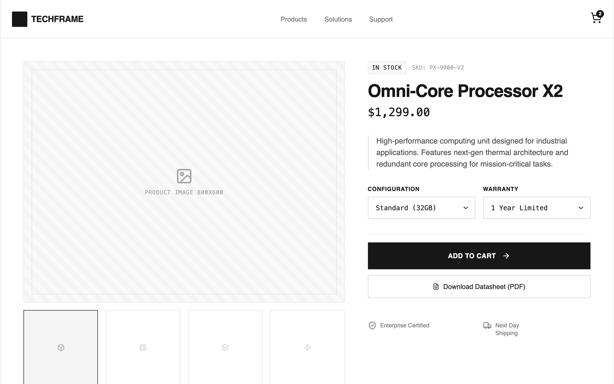 | **[Specs-First Breakdown Product Page](prompts/specs-first-breakdown-product-page/)** shopify, layout, ecommerce | E-commerce & Retail | 9 | [▶ Try live](https://superdesign.dev/library/specs-first-breakdown-product-page?utm_source=github&utm_medium=prompt-repo&utm_campaign=prompt-library) |
| 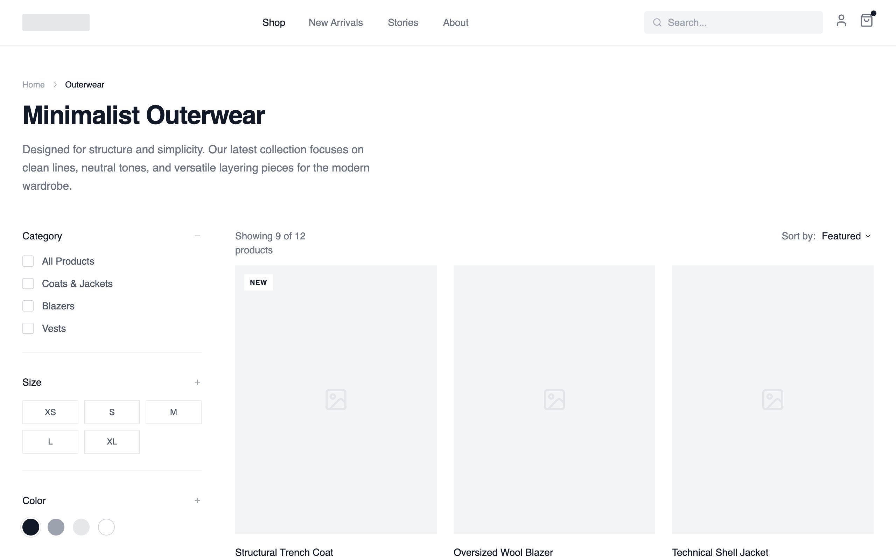 | **[Collection Page- Filtered Product Grid](prompts/collection-page-filtered-product-grid/)** shopify, collection page, ecommerce | E-commerce & Retail | 9 | [▶ Try live](https://superdesign.dev/library/collection-page-filtered-product-grid?utm_source=github&utm_medium=prompt-repo&utm_campaign=prompt-library) |
|  | **[Cart Drawer- Essential Slide in](prompts/cart-drawer-essential-slide-in/)** shopify, layout, cart | E-commerce & Retail | 7 | [▶ Try live](https://superdesign.dev/library/cart-drawer-essential-slide-in?utm_source=github&utm_medium=prompt-repo&utm_campaign=prompt-library) |
|  | **[Mobile App / App Store Preview](prompts/mobile-app-app-store-preview/)** skill | E-commerce & Retail | 3 | [▶ Try live](https://superdesign.dev/library/mobile-app-app-store-preview?utm_source=github&utm_medium=prompt-repo&utm_campaign=prompt-library) |
|  | **[ATELIER — Mono Uppercase Fashion (legibility-fixed)](prompts/atelier-mono-uppercase-fashion-legibility-fixed/)** navbar, monochrome, black-and-white | Fashion & Beauty | 0 | [▶ Try live](https://superdesign.dev/library/atelier-mono-uppercase-fashion-legibility-fixed?utm_source=github&utm_medium=prompt-repo&utm_campaign=prompt-library) |

## Portfolios

| Preview | Prompt | Industry | Copies | |
|---|---|---|---|---|
|  | **[Bold Editorial Design Style](prompts/bold-editorial-design-style/)** navy, sage, portfolio | Personal & Portfolio | 765 | [▶ Try live](https://superdesign.dev/library/bold-editorial-design-style?utm_source=github&utm_medium=prompt-repo&utm_campaign=prompt-library) |
|  | **[Swiss Grid Agency Layout](prompts/swiss-grid-agency-layout/)** agency-website, swiss-grid, international-typographic-style | Agency & Studio | 1 | [▶ Try live](https://superdesign.dev/library/swiss-grid-agency-layout?utm_source=github&utm_medium=prompt-repo&utm_campaign=prompt-library) |
|  | **[Prism — Frosted-Glass Pastel Agency Studio](prompts/prism-frosted-glass-pastel-agency-studio/)** agency-website, glassmorphism, frosted-glass | Agency & Studio | 0 | [▶ Try live](https://superdesign.dev/library/prism-frosted-glass-pastel-agency-studio?utm_source=github&utm_medium=prompt-repo&utm_campaign=prompt-library) |
|  | **[Loam — Warm Earthy Organic Agency Website](prompts/loam-warm-earthy-organic-agency-website/)** agency-website, landing-page, organic | Agency & Studio | 0 | [▶ Try live](https://superdesign.dev/library/loam-warm-earthy-organic-agency-website?utm_source=github&utm_medium=prompt-repo&utm_campaign=prompt-library) |

## Mobile Apps

| Preview | Prompt | Industry | Copies | |
|---|---|---|---|---|
|  | **[BabyBites - Sophisticated Palette](prompts/babybites-sophisticated-palette/)** mobile app, style | General | 1,224 | [▶ Try live](https://superdesign.dev/library/babybites-sophisticated-palette?utm_source=github&utm_medium=prompt-repo&utm_campaign=prompt-library) |
|  | **[Coverflow — Carousels that turn heads (dark coverflow aurora)](prompts/coverflow-carousels-that-turn-heads-dark-coverflow-aurora/)** carousel, coverflow, 3d-carousel | AI & Tech | 48 | [▶ Try live](https://superdesign.dev/library/coverflow-carousels-that-turn-heads-dark-coverflow-aurora?utm_source=github&utm_medium=prompt-repo&utm_campaign=prompt-library) |
| 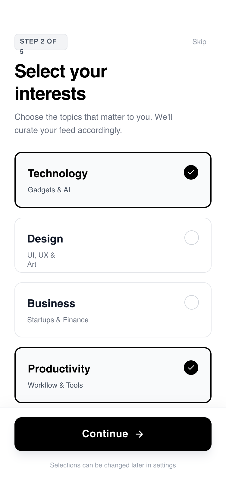 | **[Account Setup Flow — Goals / Interests (Card-Based)](prompts/account-setup-flow-goals-interests-card-based/)** mobile app, layout, account setup | General | 14 | [▶ Try live](https://superdesign.dev/library/account-setup-flow-goals-interests-card-based?utm_source=github&utm_medium=prompt-repo&utm_campaign=prompt-library) |
|  | **[Sectioned Index Page](prompts/sectioned-index-page/)** mobile app, index, browse | General | 13 | [▶ Try live](https://superdesign.dev/library/sectioned-index-page?utm_source=github&utm_medium=prompt-repo&utm_campaign=prompt-library) |
|  | **[Compact Control Grid](prompts/compact-control-grid/)** mobile app, home, layout | General | 11 | [▶ Try live](https://superdesign.dev/library/compact-control-grid?utm_source=github&utm_medium=prompt-repo&utm_campaign=prompt-library) |
| 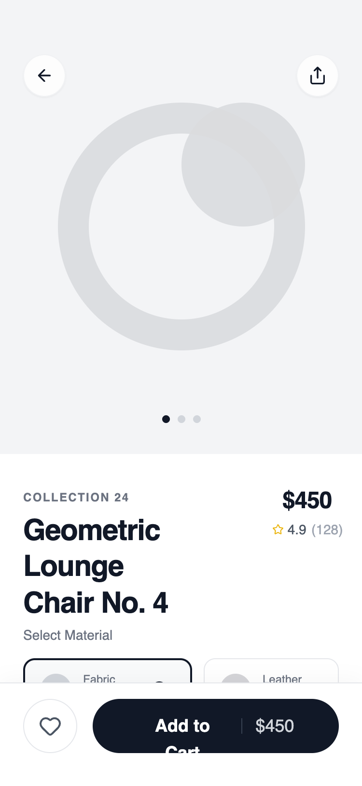 | **[Hero + Sticky Action Detail](prompts/hero-sticky-action-detail/)** mobile app, detail, layout | General | 7 | [▶ Try live](https://superdesign.dev/library/hero-sticky-action-detail?utm_source=github&utm_medium=prompt-repo&utm_campaign=prompt-library) |
|  | **[Focus Mode Detail](prompts/focus-mode-detail/)** mobile app, detail, layout | General | 6 | [▶ Try live](https://superdesign.dev/library/focus-mode-detail?utm_source=github&utm_medium=prompt-repo&utm_campaign=prompt-library) |
| 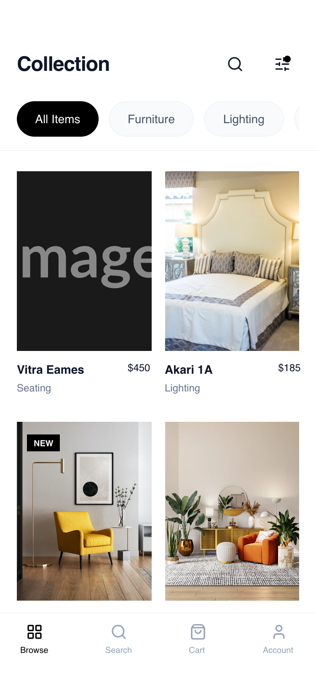 | **[Card Grid Browse](prompts/card-grid-browse/)** mobile app, index, browse | General | 6 | [▶ Try live](https://superdesign.dev/library/card-grid-browse?utm_source=github&utm_medium=prompt-repo&utm_campaign=prompt-library) |
| 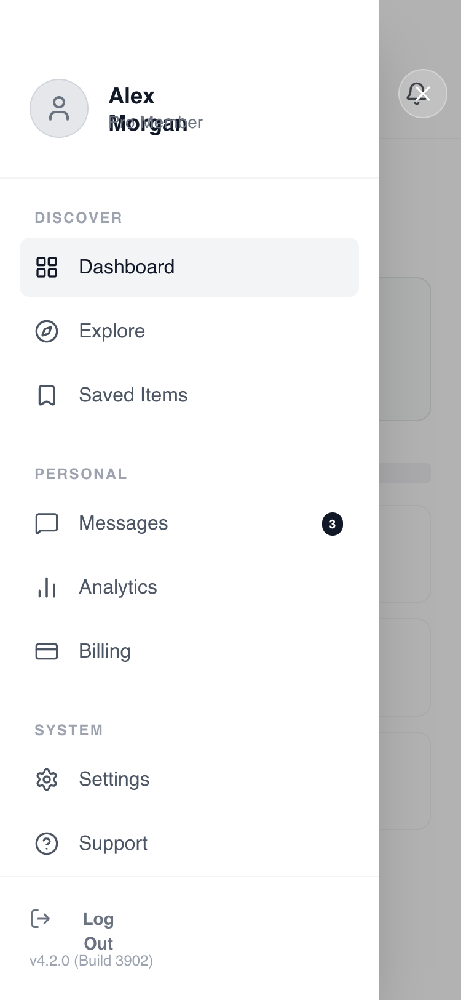 | **[Side drawer navigation](prompts/side-drawer-navigation/)** mobile app, navigation, layout | General | 4 | [▶ Try live](https://superdesign.dev/library/side-drawer-navigation?utm_source=github&utm_medium=prompt-repo&utm_campaign=prompt-library) |
|  | **[Gesture First Navigation System](prompts/gesture-first-navigation-system/)** mobile app, navigation, layout | General | 3 | [▶ Try live](https://superdesign.dev/library/gesture-first-navigation-system?utm_source=github&utm_medium=prompt-repo&utm_campaign=prompt-library) |
|  | **[Editorial Music Player (Now Playing)](prompts/editorial-music-player-now-playing/)** mobile app, music player, now playing | General | 1 | [▶ Try live](https://superdesign.dev/library/editorial-music-player-now-playing?utm_source=github&utm_medium=prompt-repo&utm_campaign=prompt-library) |
| 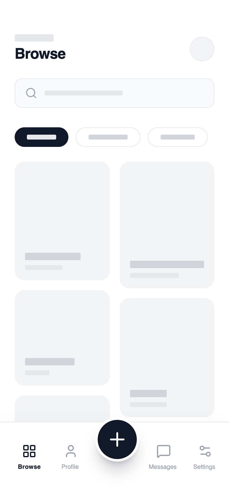 | **[Bottom Tab Navigation — Core App Shell](prompts/bottom-tab-navigation-core-app-shell/)** mobile app, navigation, layout | General | 1 | [▶ Try live](https://superdesign.dev/library/bottom-tab-navigation-core-app-shell?utm_source=github&utm_medium=prompt-repo&utm_campaign=prompt-library) |

## Components

| Preview | Prompt | Industry | Copies | |
|---|---|---|---|---|
|  | **[Card Swap](prompts/card-swap/)** ui component, animation, image gallery | General | 884 | [▶ Try live](https://superdesign.dev/library/card-swap?utm_source=github&utm_medium=prompt-repo&utm_campaign=prompt-library) |
|  | **[Hyper-Speed Loading State](prompts/hyper-speed-loading-state/)** animation, loading | General | 749 | [▶ Try live](https://superdesign.dev/library/hyper-speed-loading-state?utm_source=github&utm_medium=prompt-repo&utm_campaign=prompt-library) |
|  | **[Light Beam Button](prompts/light-beam-button/)** button, ui component | General | 500 | [▶ Try live](https://superdesign.dev/library/light-beam-button?utm_source=github&utm_medium=prompt-repo&utm_campaign=prompt-library) |
|  | **[Ghost Cursor](prompts/ghost-cursor/)** animation, background | General | 417 | [▶ Try live](https://superdesign.dev/library/ghost-cursor?utm_source=github&utm_medium=prompt-repo&utm_campaign=prompt-library) |
|  | **[Typing animation](prompts/typing-animation/)** animation, text animation | General | 370 | [▶ Try live](https://superdesign.dev/library/typing-animation?utm_source=github&utm_medium=prompt-repo&utm_campaign=prompt-library) |
|  | **[Jelly Squish Button](prompts/jelly-squish-button/)** animation, ui component, button | General | 368 | [▶ Try live](https://superdesign.dev/library/jelly-squish-button?utm_source=github&utm_medium=prompt-repo&utm_campaign=prompt-library) |
|  | **[Radiant Prompt Input](prompts/radiant-prompt-input/)** ui component, input | General | 348 | [▶ Try live](https://superdesign.dev/library/radiant-prompt-input?utm_source=github&utm_medium=prompt-repo&utm_campaign=prompt-library) |
|  | **[Pill Nav](prompts/pill-nav/)** ui component, nav | General | 318 | [▶ Try live](https://superdesign.dev/library/pill-nav?utm_source=github&utm_medium=prompt-repo&utm_campaign=prompt-library) |
|  | **[Interactive Folder](prompts/interactive-folder/)** animation, ui component | General | 273 | [▶ Try live](https://superdesign.dev/library/interactive-folder?utm_source=github&utm_medium=prompt-repo&utm_campaign=prompt-library) |
|  | **[Glow Cursor Button](prompts/glow-cursor-button/)** button, ui component | General | 211 | [▶ Try live](https://superdesign.dev/library/glow-cursor-button?utm_source=github&utm_medium=prompt-repo&utm_campaign=prompt-library) |
|  | **[Rolodex Text](prompts/rolodex-text/)** animation, text animation | General | 203 | [▶ Try live](https://superdesign.dev/library/rolodex-text?utm_source=github&utm_medium=prompt-repo&utm_campaign=prompt-library) |
|  | **[Shiny Text](prompts/shiny-text/)** animation, text animation | General | 182 | [▶ Try live](https://superdesign.dev/library/shiny-text?utm_source=github&utm_medium=prompt-repo&utm_campaign=prompt-library) |

## Animations & Backgrounds

| Preview | Prompt | Industry | Copies | |
|---|---|---|---|---|
|  | **[Tubes Interactive Background](prompts/tubes-interactive-background/)** animation, background | General | 2,912 | [▶ Try live](https://superdesign.dev/library/tubes-interactive-background?utm_source=github&utm_medium=prompt-repo&utm_campaign=prompt-library) |
|  | **[The "Stacking Cards" Effect](prompts/the-stacking-cards-effect/)** animation, scroll animation, landing page | General | 905 | [▶ Try live](https://superdesign.dev/library/the-stacking-cards-effect?utm_source=github&utm_medium=prompt-repo&utm_campaign=prompt-library) |
|  | **[Force Field Background](prompts/force-field-background/)** animation, background | General | 865 | [▶ Try live](https://superdesign.dev/library/force-field-background?utm_source=github&utm_medium=prompt-repo&utm_campaign=prompt-library) |
|  | **[Scroll Journey Line](prompts/scroll-journey-line/)** animation, scroll animation | General | 820 | [▶ Try live](https://superdesign.dev/library/scroll-journey-line?utm_source=github&utm_medium=prompt-repo&utm_campaign=prompt-library) |
|  | **[GSAP Horizontal scroll](prompts/gsap-horizontal-scroll/)** animation, scroll animation, landing page | General | 668 | [▶ Try live](https://superdesign.dev/library/gsap-horizontal-scroll?utm_source=github&utm_medium=prompt-repo&utm_campaign=prompt-library) |
|  | **[Parallax Stars Background](prompts/parallax-stars-background/)** background, animation | General | 661 | [▶ Try live](https://superdesign.dev/library/parallax-stars-background?utm_source=github&utm_medium=prompt-repo&utm_campaign=prompt-library) |
|  | **["Exploded View" Assembly](prompts/exploded-view-assembly/)** animation, scroll animation, landing page | General | 490 | [▶ Try live](https://superdesign.dev/library/exploded-view-assembly?utm_source=github&utm_medium=prompt-repo&utm_campaign=prompt-library) |
|  | **[Gooey Gradient Background](prompts/gooey-gradient-background/)** animation, background | General | 485 | [▶ Try live](https://superdesign.dev/library/gooey-gradient-background?utm_source=github&utm_medium=prompt-repo&utm_campaign=prompt-library) |
|  | **[Hover reveal effect](prompts/hover-reveal-effect/)** landing page, hover effect, animation | General | 442 | [▶ Try live](https://superdesign.dev/library/hover-reveal-effect?utm_source=github&utm_medium=prompt-repo&utm_campaign=prompt-library) |
|  | **[Horizontal Gallery](prompts/horizontal-gallery/)** animation, scroll animation | General | 439 | [▶ Try live](https://superdesign.dev/library/horizontal-gallery?utm_source=github&utm_medium=prompt-repo&utm_campaign=prompt-library) |
|  | **[Animation / Threejs animation](prompts/animation-threejs-animation/)** skill, animation | General | 307 | [▶ Try live](https://superdesign.dev/library/animation-threejs-animation?utm_source=github&utm_medium=prompt-repo&utm_campaign=prompt-library) |
|  | **[Dynamic Data Display](prompts/dynamic-data-display/)** text animation, animation, scroll animation | General | 288 | [▶ Try live](https://superdesign.dev/library/dynamic-data-display?utm_source=github&utm_medium=prompt-repo&utm_campaign=prompt-library) |

## Design Systems & Styles

| Preview | Prompt | Industry | Copies | |
|---|---|---|---|---|
|  | **[Deep Red Style](prompts/deep-red-style-5b01cb/)** style, page | General | 2,321 | [▶ Try live](https://superdesign.dev/library/deep-red-style-5b01cb?utm_source=github&utm_medium=prompt-repo&utm_campaign=prompt-library) |
|  | **[Red Noir Style](prompts/red-noir-style/)** style, landing page, page | General | 2,162 | [▶ Try live](https://superdesign.dev/library/red-noir-style?utm_source=github&utm_medium=prompt-repo&utm_campaign=prompt-library) |
|  | **[Glassmorphism Style](prompts/glassmorphism-style/)** landing page, page, style | General | 1,713 | [▶ Try live](https://superdesign.dev/library/glassmorphism-style?utm_source=github&utm_medium=prompt-repo&utm_campaign=prompt-library) |
|  | **[Kinetic Orange Style](prompts/kinetic-orange-style/)** landing page, style, page | General | 1,613 | [▶ Try live](https://superdesign.dev/library/kinetic-orange-style?utm_source=github&utm_medium=prompt-repo&utm_campaign=prompt-library) |
|  | **[Cinematic Style](prompts/cinematic-style/)** landing page, page, style | General | 1,362 | [▶ Try live](https://superdesign.dev/library/cinematic-style?utm_source=github&utm_medium=prompt-repo&utm_campaign=prompt-library) |
|  | **[Luxury-focused Design System](prompts/luxury-focused-design-system/)** landing page, style, cream | General | 1,350 | [▶ Try live](https://superdesign.dev/library/luxury-focused-design-system?utm_source=github&utm_medium=prompt-repo&utm_campaign=prompt-library) |
|  | **[Neural Noir Interface Style](prompts/neural-noir-interface-style/)** landing page, page, style | General | 1,280 | [▶ Try live](https://superdesign.dev/library/neural-noir-interface-style?utm_source=github&utm_medium=prompt-repo&utm_campaign=prompt-library) |
|  | **[Nature Inspired Style](prompts/nature-inspired-style/)** landing page, page, style | General | 1,272 | [▶ Try live](https://superdesign.dev/library/nature-inspired-style?utm_source=github&utm_medium=prompt-repo&utm_campaign=prompt-library) |
|  | **[Glassmorphism card](prompts/glassmorphism-card/)** landing page, page, style | General | 1,250 | [▶ Try live](https://superdesign.dev/library/glassmorphism-card?utm_source=github&utm_medium=prompt-repo&utm_campaign=prompt-library) |
|  | **[Bold Editorial Studio Style](prompts/bold-editorial-studio-style/)** landing page, page, style | Agency & Studio | 1,216 | [▶ Try live](https://superdesign.dev/library/bold-editorial-studio-style?utm_source=github&utm_medium=prompt-repo&utm_campaign=prompt-library) |
|  | **[Hyper-Saturated Fluid](prompts/hyper-saturated-fluid/)** style | General | 1,002 | [▶ Try live](https://superdesign.dev/library/hyper-saturated-fluid?utm_source=github&utm_medium=prompt-repo&utm_campaign=prompt-library) |
|  | **[Midnight Editorial Style](prompts/midnight-editorial-style-5f0a22/)** landing page, page, style | General | 963 | [▶ Try live](https://superdesign.dev/library/midnight-editorial-style-5f0a22?utm_source=github&utm_medium=prompt-repo&utm_campaign=prompt-library) |
|  | **[Neumorphism](prompts/neumorphism/)** style | General | 834 | [▶ Try live](https://superdesign.dev/library/neumorphism?utm_source=github&utm_medium=prompt-repo&utm_campaign=prompt-library) |
|  | **[Cinematic Noir Style](prompts/cinematic-noir-style/)** landing page, page, style | General | 643 | [▶ Try live](https://superdesign.dev/library/cinematic-noir-style?utm_source=github&utm_medium=prompt-repo&utm_campaign=prompt-library) |

## Other

| Preview | Prompt | Industry | Copies | |
|---|---|---|---|---|
|  | **[Slide Deck](prompts/slide-deck/)** skill | General | 16 | [▶ Try live](https://superdesign.dev/library/slide-deck?utm_source=github&utm_medium=prompt-repo&utm_campaign=prompt-library) |
| 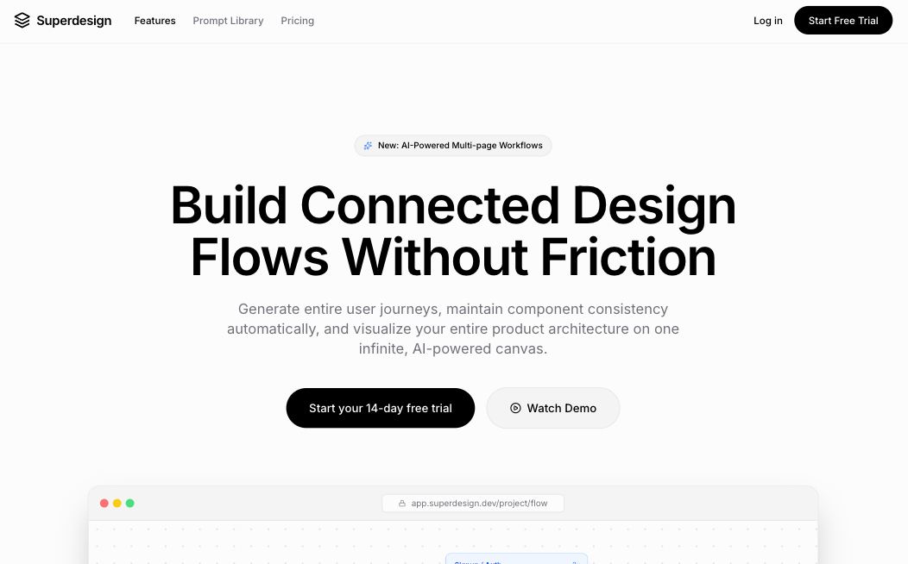 | **[Product Feature](prompts/product-feature/)** skill | General | 3 | [▶ Try live](https://superdesign.dev/library/product-feature?utm_source=github&utm_medium=prompt-repo&utm_campaign=prompt-library) |
| 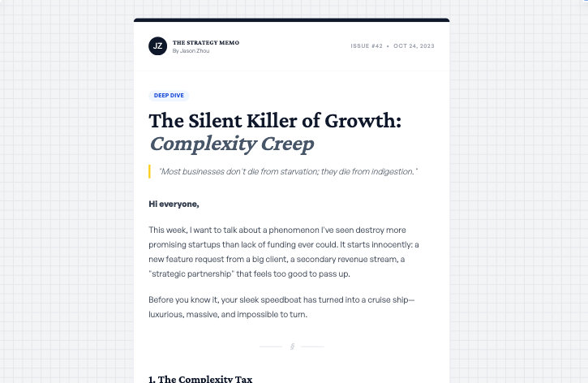 | **[Email Template](prompts/email-template/)** skill | General | 2 | [▶ Try live](https://superdesign.dev/library/email-template?utm_source=github&utm_medium=prompt-repo&utm_campaign=prompt-library) |

## By industry

**SaaS** (21): [Lumina SaaS Landing Page](prompts/lumina-saas-landing-page/) · [Bold Editorial Style](prompts/bold-editorial-style/) · [Enterprise Admin Platform](prompts/enterprise-admin-platform/) · [Graphic Comparison Report](prompts/graphic-comparison-report/) · [Editorial SaaS Onboarding](prompts/editorial-saas-onboarding/) · [Aurora Glass — Sign in to the canvas](prompts/aurora-glass-sign-in-to-the-canvas/) · [Verify it's you · Aperture (OTP / 2FA, graphite-platinum)](prompts/verify-its-you-aperture-otp-2fa-graphite-platinum/) · [Sign in to Verdant — Classic Split (Emerald)](prompts/sign-in-to-verdant-classic-split-emerald/) · [Design at the Speed of Thought — Editorial Split Sign-Up](prompts/design-at-the-speed-of-thought-editorial-split-sign-up/) · [Welcome back · Lumen — centered-card (true cobalt)](prompts/welcome-back-lumen-centered-card-true-cobalt/) · [Palette — Social-first friendly sign-up](prompts/palette-social-first-friendly-sign-up/) · [Teal-on-Ink Newsletter Mega Footer](prompts/teal-on-ink-newsletter-mega-footer/) · [Validar — Forms that catch mistakes before they cost you](prompts/validar-forms-that-catch-mistakes-before-they-cost-you/) · [Foundry: Your SaaS Site, Designed Before You Write a Line](prompts/foundry-your-saas-site-designed-before-you-write-a-line/) · [Create your account · Promptly — split-image emerald sign-up](prompts/create-your-account-promptly-split-image-emerald-sign-up/)

**AI & Tech** (5): [Mosaic Grid Architecture Style](prompts/mosaic-grid-architecture-style/) · [Coverflow — Carousels that turn heads (dark coverflow aurora)](prompts/coverflow-carousels-that-turn-heads-dark-coverflow-aurora/) · [System Initialization - Trust & Transparency](prompts/system-initialization-trust-and-transparency/) · [Superdesign Setup - Inline Preview](prompts/superdesign-setup-inline-preview/) · [Technical System Onboarding](prompts/technical-system-onboarding/)

**Dev Tools** (15): [SaaS Landing Page for Developer Tool](prompts/saas-landing-page-for-developer-tool/) · [Chrome Extension Landing Page](prompts/chrome-extension-landing-page/) · [Linear inspired developer tool dashboard](prompts/linear-inspired-developer-tool-dashboard/) · [AI System Configuration Console](prompts/ai-system-configuration-console/) · [Developer tool dashboard/onboarding](prompts/developer-tool-dashboardonboarding/) · [Gridwright — Design the web, type the prompt (Swiss Grid / Signal Red)](prompts/gridwright-design-the-web-type-the-prompt-swiss-grid-signal-red/) · [Electric-Blue Studio Pricing](prompts/electric-blue-studio-pricing-188a8f/) · [Slate ROI-Calculator Pricing](prompts/slate-roi-calculator-pricing/) · [Editorial Cream + Ink Two-Path SaaS Pricing](prompts/editorial-cream-ink-two-path-saas-pricing-3dee65/) · [Electric-Lime Single-Plan SaaS Pricing](prompts/electric-lime-single-plan-saas-pricing/) · [Electric Dark Usage-Based Pricing Calculator](prompts/electric-dark-usage-based-pricing-calculator-20e556/) · [Emerald 4-Tier SaaS Pricing Table](prompts/emerald-4-tier-saas-pricing-table/) · [Cream & Sky Playful SaaS Pricing](prompts/cream-and-sky-playful-saas-pricing/) · [Editorial Crimson Dev-Tool Pricing](prompts/editorial-crimson-dev-tool-pricing/) · [Editorial Violet SaaS Pricing Matrix](prompts/editorial-violet-saas-pricing-matrix/)

**Agency & Studio** (5): [Bold Editorial Studio Style](prompts/bold-editorial-studio-style/) · [Swiss Grid Agency Layout](prompts/swiss-grid-agency-layout/) · [Prism — Frosted-Glass Pastel Agency Studio](prompts/prism-frosted-glass-pastel-agency-studio/) · [Loam — Warm Earthy Organic Agency Website](prompts/loam-warm-earthy-organic-agency-website/) · [Atlas Studio — Charting Your Account, Step One of Three](prompts/atlas-studio-charting-your-account-step-one-of-three/)

**Health & Wellness** (2): [Softly - Digital Wellness App](prompts/softly-digital-wellness-app/) · [Volt — Electric-Lime Fitness Dashboard](prompts/volt-electric-lime-fitness-dashboard-a7544c/)

**Fashion & Beauty** (1): [ATELIER — Mono Uppercase Fashion (legibility-fixed)](prompts/atelier-mono-uppercase-fashion-legibility-fixed/)

**Finance & Crypto** (3): [Luminous Ethereal Glassmorphism Onboarding](prompts/luminous-ethereal-glassmorphism-onboarding/) · [Midnight Navy Fintech Pricing](prompts/midnight-navy-fintech-pricing-656a6d/) · [Ledgerline — fintech teal/mint startup landing page](prompts/ledgerline-fintech-tealmint-startup-landing-page/)

**E-commerce & Retail** (10): [Brutalist E-commerce Page](prompts/brutalist-e-commerce-page/) · [Brutalist Style Ecommerce Page](prompts/brutalist-style-ecommerce-page/) · [Aura Audio Showroom](prompts/aura-audio-showroom/) · [Super Shampoo - High Conversion LP](prompts/super-shampoo-high-conversion-lp/) · [Blog Page - Editorial Grid Magazine](prompts/blog-page-editorial-grid-magazine/) · [Specs-First Breakdown Product Page](prompts/specs-first-breakdown-product-page/) · [Collection Page- Filtered Product Grid](prompts/collection-page-filtered-product-grid/) · [Cart Drawer- Essential Slide in](prompts/cart-drawer-essential-slide-in/) · [Mobile App / App Store Preview](prompts/mobile-app-app-store-preview/) · [Chronological Content Feed](prompts/chronological-content-feed/)

**Personal & Portfolio** (1): [Bold Editorial Design Style](prompts/bold-editorial-design-style/)

**General** (87): [Tubes Interactive Background](prompts/tubes-interactive-background/) · [High Contrast Landing Page](prompts/high-contrast-landing-page/) · [Deep Red Style](prompts/deep-red-style-5b01cb/) · [Red Noir Style](prompts/red-noir-style/) · [Glassmorphism Style](prompts/glassmorphism-style/) · [Kinetic Orange Style](prompts/kinetic-orange-style/) · [Cinematic Style](prompts/cinematic-style/) · [Luxury-focused Design System](prompts/luxury-focused-design-system/) · [Neural Noir Interface Style](prompts/neural-noir-interface-style/) · [Nature Inspired Style](prompts/nature-inspired-style/) · [Glassmorphism card](prompts/glassmorphism-card/) · [BabyBites - Sophisticated Palette](prompts/babybites-sophisticated-palette/) · [Synapse](prompts/synapse/) · [Hyper-Saturated Fluid](prompts/hyper-saturated-fluid/) · [Midnight Editorial Style](prompts/midnight-editorial-style-5f0a22/)

## Superdesign vs other AI design tools

<!-- DRAFT: verify each cell before publishing. Keep it factual. -->
| | Superdesign | v0 | Lovable | Bolt | Google Stitch | Uizard |
|---|---|---|---|---|---|---|
| Runs inside your coding agent (Claude Code/Cursor) | ✅ | ❌ | ❌ | ❌ | ❌ | ❌ |
| Infinite design canvas | ✅ | ❌ | ❌ | ❌ | ❌ | ✅ |
| Usage-ranked prompt library | ✅ | ❌ | ❌ | ❌ | ❌ | ❌ |
| Designs into your existing design system | ✅ | ⚠️ | ⚠️ | ⚠️ | ❌ | ❌ |
| Outputs real code | ✅ | ✅ | ✅ | ✅ | ✅ | ⚠️ |

## FAQ

**What is the best AI design prompt?** Ranked by real usage across the Superdesign library, the most-copied are [Tubes Interactive Background](https://superdesign.dev/library/tubes-interactive-background?utm_source=github&utm_medium=prompt-repo&utm_campaign=prompt-library), [High Contrast Landing Page](https://superdesign.dev/library/high-contrast-landing-page?utm_source=github&utm_medium=prompt-repo&utm_campaign=prompt-library), and [Lumina SaaS Landing Page](https://superdesign.dev/library/lumina-saas-landing-page?utm_source=github&utm_medium=prompt-repo&utm_campaign=prompt-library).

**How do I use these prompts?** Open any prompt, click **Try it live** to generate it on the Superdesign canvas, or copy the prompt into your coding agent via the [Superdesign skill](https://github.com/superdesigndev/superdesign-skill).

**Do these work with Claude Code and Cursor?** Yes, via the [Superdesign skill](https://github.com/superdesigndev/superdesign-skill).

**What is Superdesign?** An AI product design agent that turns prompts into UI mockups, components, and full designs on an infinite canvas. See [superdesign.dev](https://superdesign.dev?utm_source=github&utm_medium=prompt-repo&utm_campaign=prompt-library).

**Are the prompts free to use?** The prompt text is free to use. *(Data license TBD — see LICENSE.)*

## Contributing

Read-only mirror of the live [Superdesign prompt library](https://superdesign.dev/library). Add prompts by creating them in the app (top prompts sync here, ranked by usage). Fixes: open a PR. See `CONTRIBUTING.md`.

## License

Repo code/structure: MIT (`LICENSE`). Prompt data: **TBD** (CC0 recommended).
