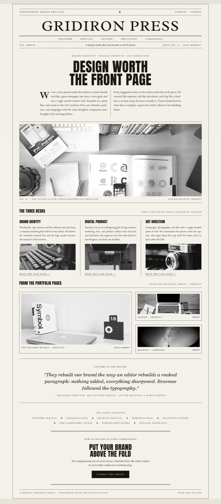

# Agency Website: Bold Editorial Newspaper Broadsheet Studio Site

An agency website design prompt in a bold editorial, newspaper-broadsheet style: a vintage front page turned studio homepage. One ink only (near-black on off-white newsprint with paper grain), grayscale photography, and three type voices in high contrast: a delicate old-style serif masthead nameplate between double rules, heavy condensed-sans headlines, and a justified vintage-serif body with a drop cap. Hairline rules do all the structure: edition bar, dateline, ruled nav, three-column services, framed portfolio plates, a letters-to-the-editor pull quote, a classified-style client register, and a double-rule commission CTA. An editorial noir look for any design studio, agency, or portfolio site.

Reference: a measured vintage newspaper-poster template (reverse-engineered in the Canva editor), transposed to an agency website and re-authored.



## Prompt

```text
{
  "summary": "A desktop AGENCY / STUDIO WEBSITE art-directed as a vintage NEWSPAPER FRONT PAGE, where the entire personality is ONE INK (near-black) on an off-white NEWSPRINT ground (~#f4f1ea) with a subtle paper-grain texture, grayscale/B&W photography only, and no other color anywhere. Three type voices in HIGH CONTRAST carry it: a delicate high-contrast old-style serif (Radley) for the masthead nameplate and all small-caps furniture; a heavy CONDENSED grotesque sans (Anton) for the hero headline and section headers, all caps; and a vintage display serif (Lancelot, or Playfair as fallback) for justified body copy. The page reads top-to-bottom like a broadsheet inside a thin hairline page frame: (1) an EDITION BAR between rules (small-caps studio descriptor left, a fleuron ornament center, cities right); (2) the studio wordmark as a giant serif MASTHEAD (~96px) over a double rule; (3) a small-caps NAV set as a rules-row (The Work / Services / Letters / The Studio / Commission); (4) a three-up DATELINE row (EST year | italic serif tagline | issue number and date); (5) a small-caps KICKER listing the disciplines, then a huge Anton HEADLINE (~88px, 2 lines, e.g. 'DESIGN WORTH THE FRONT PAGE'); (6) a TWO-COLUMN justified LEDE with a drop cap and a vertical column rule; (7) a full-width framed B&W FIGURE with a 'Fig. 01' caption row; (8) a 'THE THREE DESKS' services section: three justified columns split by vertical hairline rules, each with a condensed-sans sub-header, body, inset B&W photo, and a small-caps 'READ THE CASE FILES' link; (9) 'FROM THE PORTFOLIO PAGES': bordered photo PLATES (one large + two stacked small) with small-caps title + italic year caption rows; (10) a 'LETTERS TO THE EDITOR' testimonial pull quote in large italic serif between rules; (11) 'THE CLIENT REGISTER': client names in tracked small caps separated by fleuron ornaments; (12) a double-rule COMMISSION box (kicker, Anton headline 'PUT YOUR BRAND ABOVE THE FOLD', italic note, solid-ink button 'SUBMIT THE BRIEF'); (13) a ruled colophon footer ('PAGE ONE OF ONE'). Bold editorial / editorial-noir craft: rules do the structure, type does the drama, no boxes-with-shadows, no gradients, no color.",
  "style": {
    "description": "Bold editorial, vintage-broadsheet register: one ink (near-black ~#181410) on aged off-white newsprint (~#f4f1ea) with a faint paper-grain noise overlay, and strictly grayscale photography (filter: grayscale). The whole aesthetic is TYPE CONTRAST plus RULES: a delicate high-contrast serif nameplate voice (Radley, small caps with wide tracking ~0.22em), one loud condensed grotesque sans voice (Anton, all caps) for headlines, and a vintage serif voice (Lancelot) for justified body. Structure comes entirely from 1px hairline rules, double rules, framed plates, and a page-frame border; zero border-radius, zero shadows, zero gradients, zero accent color. Editorial noir mood: dense, inky, confident, print-first.",
    "prompt": "Design a desktop agency/studio website styled as a vintage newspaper front page. Use ONE INK only: near-black (#181410) type and rules on an off-white newsprint ground (#f4f1ea) with a subtle paper-grain texture overlay, and force every photo to grayscale. Build a three-voice type system: masthead and all small-caps labels in a high-contrast old-style serif (Radley) with wide letter-spacing (~0.22em); the hero headline and section headers in a heavy CONDENSED grotesque sans (Anton), all caps, tight leading; body copy in a vintage display serif (Lancelot, or Playfair fallback) ~18-19px, JUSTIFIED with hyphenation. Let hairline rules do all the structure: 1px rules between every band, a 4px double rule under the masthead and around the CTA box, thin vertical rules between text columns, 1px borders framing photo plates, and a 1px page frame around the whole sheet. No rounded corners, no shadows, no gradients, no color accents. Scope large display sizes to classes (masthead ~96px, headline ~88px) so they hold. The mood is bold editorial / editorial noir: a confident print object rendered as a website."
  },
  "layout_and_structure": {
    "description": "A single centered 'sheet' (max-width ~1280px, 1px page frame) on a slightly darker page ground, reading top to bottom like a broadsheet: edition bar; giant serif masthead over a double rule; small-caps nav rules-row; three-up dateline; kicker + huge condensed-sans headline; two-column justified drop-cap lede; full-width framed figure with caption row; three-column ruled services section; portfolio plates (one large + two stacked); a pull-quote band; a client register; a double-rule CTA box; a ruled colophon footer. On mobile the columns collapse to one, the masthead and headline step down, and all rules stay hairline.",
    "prompts": [
      {
        "part": "Edition bar + masthead + nav + dateline",
        "prompt": "Open with an EDITION BAR between two 1px rules: a wide-tracked small-caps serif label left (e.g. 'INDEPENDENT DESIGN PRACTICE'), a small fleuron/printer's ornament centered, and the studio cities right ('LONDON . SYDNEY'). Below it, the studio wordmark as a newspaper MASTHEAD: a high-contrast old-style serif (Radley), all caps, ~96px, centered, sitting on a 4px DOUBLE RULE. Then a small-caps NAV row between rules with 5 links (The Work / Services / Letters / The Studio / Commission), generous gaps, underline on hover. Then a three-up DATELINE row between rules: 'EST. MMXIX' small caps left, an italic serif tagline centered ('A design studio that sets brands in ink & pixels'), and 'ISSUE NO. 47' plus the month right."
      },
      {
        "part": "Front-page hero: kicker, headline, drop-cap lede, framed figure",
        "prompt": "Center a small-caps KICKER listing the three disciplines ('BRAND IDENTITY . DIGITAL PRODUCT . ART DIRECTION'), then the hero HEADLINE in the condensed grotesque sans (Anton), all caps, ~88px, two lines, line-height ~0.96 (e.g. 'DESIGN WORTH THE FRONT PAGE'). Below, a LEDE set in TWO justified serif columns (~920px max) separated by a 1px vertical column rule, with a large serif DROP CAP on the first paragraph. Then a full-width FIGURE between two 1px rules: a wide black-and-white photo (~470px tall, object-fit cover) with a caption row underneath split left/right in tracked small caps ('Fig. 01 - The studio floor, photographed on press day' | 'Silver gelatin, MMXXVI')."
      },
      {
        "part": "Services: The Three Desks",
        "prompt": "A section header row between rules: a condensed-sans title ('THE THREE DESKS') left and a small-caps note right ('WHAT THE STUDIO SETS, COLUMN BY COLUMN'). Below, THREE equal text columns separated by 1px vertical hairline rules (no boxes): each column stacks a condensed-sans all-caps sub-header (~23px, e.g. 'BRAND IDENTITY'), a justified serif paragraph describing the service, an inset grayscale photo (~170px tall) whose subject matches the service (type/typewriter for identity, workstation for product, camera for art direction), and a tracked small-caps text link 'READ THE CASE FILES ->' with a 1px underline."
      },
      {
        "part": "Portfolio plates: From the Portfolio Pages",
        "prompt": "A section header row ('FROM THE PORTFOLIO PAGES' | 'SELECTED EDITIONS, MMXIX - PRESENT'), then an asymmetric plate grid: one large plate (~62% width) beside a stacked pair of small plates. Each PLATE is a 1px-bordered box with ~12px inner padding holding a grayscale project photo and a caption row: project + deliverable in tracked small caps left ('THE FOUNDRY HOTELS - IDENTITY'), an italic serif year right ('Edition of MMXXV'). Choose photos that read as real deliverables (a brand book, a product screen on a laptop, a campaign still)."
      },
      {
        "part": "Letters, client register, commission CTA, colophon",
        "prompt": "A LETTERS TO THE EDITOR band between rules: a small-caps eyebrow, one large italic-serif pull quote (~34px, max ~900px, centered) from a client, and a small-caps attribution line with a received date. Then THE CLIENT REGISTER: a centered small-caps eyebrow and client names in tracked small caps separated by small fleuron ornaments, wrapping over two lines. Then the COMMISSION box: a centered ~780px block framed by 4px double rules top and bottom, holding a small-caps availability kicker ('NOW ACCEPTING AUTUMN COMMISSIONS'), a condensed-sans headline ('PUT YOUR BRAND ABOVE THE FOLD', ~44px), a short italic serif note about engagement slots and reply time, and a solid near-black button with newsprint-colored tracked small-caps text ('SUBMIT THE BRIEF'). Close with a ruled COLOPHON footer: copyright left ('(c) MMXXVI ... Published from the studio floor'), 'PAGE ONE OF ONE' right."
      }
    ]
  },
  "special_ui_components": [
    {
      "component": "Serif masthead nameplate as studio wordmark",
      "description": "The newspaper nameplate device carrying the brand: giant high-contrast serif over a double rule.",
      "prompt": "Set the studio name as a newspaper MASTHEAD: a high-contrast old-style serif (Radley), all caps, ~96px desktop (~48px mobile), centered, letter-spacing ~0.045em, sitting directly on a 4px DOUBLE RULE that spans the sheet. Scope the size to a class so host styles cannot shrink it. This nameplate voice must stay delicate and engraved, in maximal contrast to the heavy condensed-sans headline below."
    },
    {
      "component": "Rules-row navigation and dateline",
      "description": "Site nav and metadata set as broadsheet furniture rows between hairlines.",
      "prompt": "Build the site NAV as a broadsheet rules-row: 5 tracked small-caps serif links centered in one line between 1px rules, underline-on-hover only. Directly below, a DATELINE row as a 3-column grid between rules: founding year in small caps left, an italic serif tagline centered, issue number and date right, all ~12.5px with wide tracking."
    },
    {
      "component": "Two-column drop-cap lede",
      "description": "The intro paragraph set as justified newspaper columns with an oversized initial.",
      "prompt": "Set the intro as a TWO-COLUMN justified serif lede (CSS columns, ~42px gap) separated by a 1px column-rule, with hyphenation on. Give the first paragraph a DROP CAP: first-letter in the masthead serif at ~64px, floated left. Keep total width ~920px so lines stay readable."
    },
    {
      "component": "Framed figure with split caption row",
      "description": "A full-width editorial photo band with archival-style captions.",
      "prompt": "Place a full-width grayscale photo (~470px tall, object-fit cover) between two 1px rules, then a caption row split left/right in ~12px tracked small caps: a 'Fig. 01' descriptive caption left and a wry archival note right ('Silver gelatin, MMXXVI'). Force grayscale with a CSS filter so any image conforms to the one-ink system."
    },
    {
      "component": "Hairline-ruled service columns",
      "description": "Three services set as ruled newspaper columns instead of cards.",
      "prompt": "Lay services out as THREE text columns divided ONLY by 1px vertical hairline rules (no card boxes, no fills, no shadows). Each column: a condensed-sans all-caps sub-header, a justified serif paragraph, one inset grayscale photo, and a tracked small-caps link with a hairline underline. The restraint is the point: rules and type only."
    },
    {
      "component": "Bordered portfolio plates",
      "description": "Project shots framed like printed photo plates with small-caps caption rows.",
      "prompt": "Present portfolio pieces as PLATES: 1px-bordered boxes with ~12px inner padding around each grayscale photo, captioned by a row with the project name + deliverable in tracked small caps left and an italic serif year right. Arrange one large plate beside two stacked small ones for an asymmetric spread."
    },
    {
      "component": "Fleuron-separated client register",
      "description": "The client list set like a line of classified small-caps names divided by printer's ornaments.",
      "prompt": "Set client names in ~13px tracked small caps, all on centered wrapping lines, separated by small fleuron / printer's-ornament glyphs in ink. No logos, no grids: the typographic register IS the social proof."
    },
    {
      "component": "Double-rule commission box with ink-block button",
      "description": "The CTA framed by double rules with a solid one-ink button.",
      "prompt": "Frame the CTA block with 4px DOUBLE RULES above and below (no side borders). Inside: a small-caps availability kicker, a condensed-sans all-caps headline (~44px), a short italic serif supporting line, and a rectangular SOLID near-black button with newsprint-colored tracked small-caps label, square corners, darkening slightly on hover."
    }
  ]
}
```
