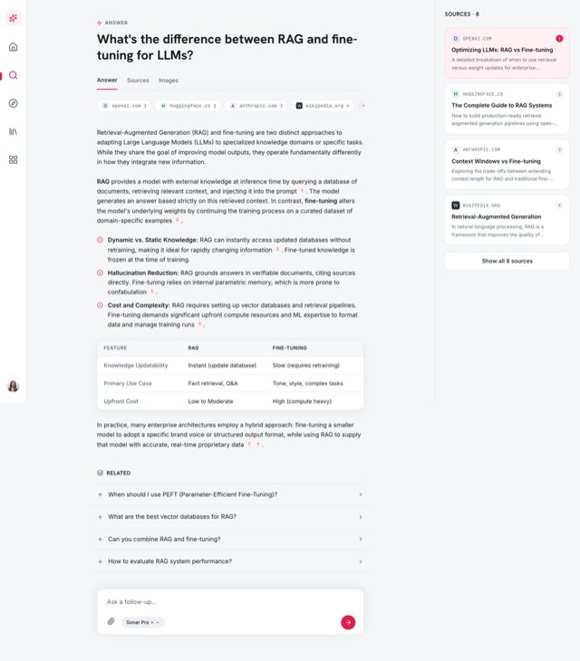

# AI Answer Engine UI (Rose Research Assistant with Cited Answers + Sources)

A clean, light AI answer engine UI, a Perplexity-style research assistant that answers a question with a synthesized, cited answer. Inline numbered citations trace to a Sources rail of source cards, a two-column comparison table sits inside the answer, and Answer/Sources/Images tabs, a source-chip strip, related follow-up questions, and an Ask bar with a model picker round it out. Cool paper canvas, ink text, and one confident rose accent, with Hanken Grotesk + Inter + JetBrains Mono. A slim left icon rail and a right Sources rail frame the answer column; fully responsive (the rail stacks below the answer on mobile). Copy it for any AI search, research assistant, RAG answer surface, or chatbot answer screen.

Source: https://www.perplexity.ai



## Prompt

```text
{
  "summary": "A clean, light AI answer engine (a Perplexity-style AI research assistant) app screen, frameless and responsive. Three zones. LEFT: a slim 64px icon-only nav rail on white (rose sparkle brand glyph on top; Home, Search active with a rose left-edge indicator, Discover, Library, Spaces icons; a user avatar pinned bottom; collapses to a top hamburger bar below md). CENTER: a max-760px answer column with an 'ANSWER' eyebrow (rose sparkle), the user's question as a large Hanken Grotesk 700 heading, an Answer / Sources / Images tab set (Answer active, rose underline), a horizontal source-chip strip (favicon square + domain in mono + a rose citation number, plus a '+3' overflow), then the synthesized answer: two to three editorial paragraphs carrying small inline rose superscript numbered citation chips, a three-item check-bullet list, a clean two-column comparison card (Feature / RAG / Fine-tuning rows), and a closing hybrid-takeaway paragraph; below sits a RELATED block of four hairline-divided follow-up question rows (leading plus, trailing chevron) and, at the end of the column, an 'Ask a follow-up' composer (rounded white card, auto-grow input, paperclip, a 'Sonar Pro' model chip with a rose dot and caret, and a round rose send button). RIGHT: a 320px Sources rail (hidden below lg, stacks below the answer on mobile) headed 'Sources 8' with a scrollable list of source cards (favicon + site title + domain.com in mono + a one-line snippet + a citation number badge); the card matching citation 1 is tinted rose with a rose border; a 'Show all 8 sources' footer button.",
  "style": {
    "description": "Cool, crisp, light-mode product design, deliberately not the dark-violet/indigo AI cliche and not a warm-ivory editorial look. A cool paper canvas (#f5f6f8) with white surfaces (#ffffff), near-black ink (#14161b), muted slate meta text (#5b6472), hairline borders (#e6e8ec), and a subtle neutral fill (#eef0f3). ONE brand accent, rose/raspberry (#e11d48, hover #be123c), used sparingly for the brand glyph, inline citation number chips, links, the active source card (tinted #fff1f3 with a #fbcfd8 border), the active tab underline, and the send button. Three typefaces with clear jobs: Hanken Grotesk (600/700) for the question heading and section labels, Inter for all body and UI, JetBrains Mono for citation numerals, source domains, and URLs. Soft restrained shadows on white cards, rounded-2xl cards, rounded-full chips, hairline dividers, generous whitespace, an editorial rhythm rather than a dense dashboard.",
    "prompt": "Design a cool, crisp, light-mode AI answer engine. Canvas is cool paper #f5f6f8, surfaces white #ffffff, text near-black #14161b, muted slate #5b6472, hairlines #e6e8ec, subtle fill #eef0f3, with ONE accent, rose #e11d48 (hover #be123c), used sparingly for the brand glyph, inline citation number chips, links, the active source card (tinted #fff1f3, border #fbcfd8), the active tab underline, and the send button. Use Hanken Grotesk (600/700) for the question heading and section labels, Inter for all body and UI, and JetBrains Mono for citation numerals, source domains, and URLs. Soft restrained shadows on white cards, rounded-2xl cards, rounded-full chips, hairline dividers, generous whitespace. Keep it light-mode and frameless (the app screen fills the viewport, no browser or device frame). Do NOT use any purple / indigo / violet, do NOT use a dark app background, do NOT use teal or emerald, and do NOT center everything."
  },
  "layout_and_structure": {
    "description": "A three-zone frameless app shell: a slim left icon nav rail, a centered max-760px answer column, and a right Sources rail. The answer column is a single vertical read (question, tabs, source-chip strip, cited answer with an in-answer comparison card, related follow-ups, ask composer) so the eye trace is answer-first with citations traceable to the right-rail source cards. Fully responsive: below lg the Sources rail drops out of the row, and on mobile the left rail becomes a top hamburger bar while the Sources content stacks below the answer as its own section; no fixed element overlaps the answer.",
    "prompts": [
      "Root: a min-h-screen flex row capped at max-w-1440 and centered. Left: a 64px white nav rail (border-r hairline), sticky and viewport-tall, hidden below md and replaced by a fixed top hamburger bar. Center: a flex-1 main column, max-w-760, mx-auto, with min-w-0 and comfortable top/bottom padding. Right: a 320px (xl:360px) Sources aside (border-l hairline), sticky and viewport-tall with its own internal scroll, hidden below lg.",
      "Answer column order: an 'ANSWER' eyebrow row (rose sparkle + uppercase label), the question as a large Hanken 700 heading, a hairline tab row (Answer / Sources / Images with the active tab underlined rose), a horizontal source-chip strip (overflow-x auto on mobile), the answer body (paragraphs + check-bullet list + comparison card + hybrid paragraph), a RELATED block, then the Ask-a-follow-up composer.",
      "Mobile: the source-chip strip scrolls horizontally; the comparison card cells stack to a readable two-column grid; the Sources rail content re-appears BELOW the answer as a stacked 'Sources' section; the composer sits at the end of the column. Guarantee zero horizontal overflow at 390px."
    ]
  },
  "special_ui_components": [
    {
      "component": "Inline citation chips",
      "description": "Small rose superscript numbered badges embedded directly in the answer sentences (1, 2, 3, 4), in JetBrains Mono, that echo the numbering on the right-rail source cards so a reader can trace any claim to its source. This is the signature copy-worthy primitive of the answer-engine pattern.",
      "prompt": "In the answer prose, render inline citations as small rose (#e11d48) superscript numbers in JetBrains Mono, sitting just after the clause they support with a hair of left margin. Keep them subtle (about 10-11px) but tappable. The same numbers appear as badges on the matching source cards in the right rail."
    },
    {
      "component": "Source-chip strip",
      "description": "A horizontal row of small pill chips above the answer, each a favicon square + the site domain in mono + a rose citation number, ending in a '+3' overflow chip. A compact preview of the cited sources.",
      "prompt": "Above the answer body, lay out a horizontal strip of rounded-full white chips with a hairline border: each chip has a 16px favicon square, the domain in mono muted text, and a small rose citation number. Add a trailing '+3' overflow chip. On mobile the strip scrolls horizontally with hidden scrollbars."
    },
    {
      "component": "Sources rail with active-source card",
      "description": "A right rail headed 'Sources 8' listing source cards (favicon + site title + domain.com in mono + a one-line snippet + a citation number badge). The card matching the currently-referenced citation is tinted rose with a rose border; a 'Show all 8 sources' button closes the list.",
      "prompt": "Build a 320px right rail titled 'Sources 8'. Stack source cards, each a rounded-2xl white card with a favicon, the site title in semibold, the domain in mono muted, a two-line clamped snippet, and a small circular citation-number badge. Make the card for citation 1 tinted #fff1f3 with a #fbcfd8 border and a filled rose badge; the rest are neutral. End with a full-width 'Show all 8 sources' button."
    },
    {
      "component": "In-answer comparison card",
      "description": "A clean two/three-column comparison table rendered inside the answer (Feature / RAG / Fine-tuning), so the synthesized answer contains a scannable structured block, not just prose.",
      "prompt": "Inside the answer, place a rounded-2xl white comparison card with a hairline header row (Feature / RAG / Fine-tuning) and three hairline-divided body rows (e.g. Knowledge Updatability, Primary Use Case, Upfront Cost). Left column labels in muted slate, values in ink. Keep it clean and scannable; on mobile keep it a readable two-column grid."
    },
    {
      "component": "Related follow-up list",
      "description": "A RELATED block of four clickable follow-up question rows, each with a leading plus icon (rose on hover) and a trailing chevron, hairline-divided, that suggest next queries.",
      "prompt": "Under a 'RELATED' label (with a layers icon), list four follow-up question rows separated by hairlines. Each row: a leading plus icon that turns rose on hover, the question text in ink, and a trailing chevron in muted. Full-row hover highlight."
    },
    {
      "component": "Ask-a-follow-up composer",
      "description": "A rounded white card at the end of the answer column with an auto-grow input ('Ask a follow-up...'), a paperclip attach, a 'Sonar Pro' model chip (rose dot + caret), and a round rose send button. In normal flow (not fixed) so it never covers the answer.",
      "prompt": "At the end of the answer column render a rounded-2xl white composer card with a soft shadow: an auto-grow textarea placeholder 'Ask a follow-up...', then a bottom row with a paperclip attach button, a pill model chip reading 'Sonar Pro' with a small rose dot and a caret, and a round rose (#e11d48) send button with a right-arrow icon. Keep it in normal document flow at the bottom of the column."
    }
  ]
}
```
