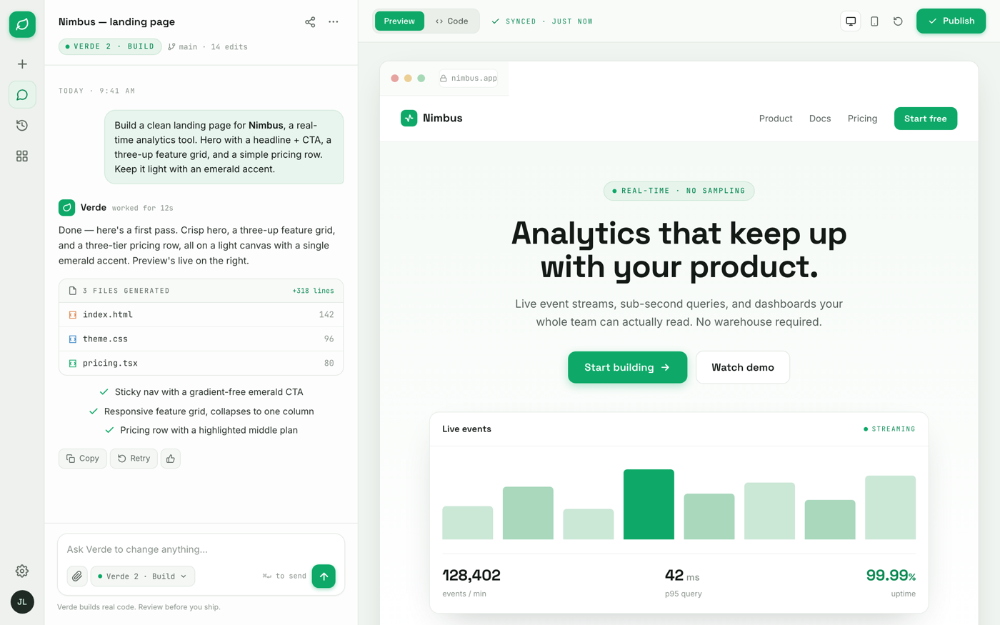

# AI Chat Workspace UI: Emerald Agent Builder with Live Preview

An AI chat interface for an AI builder / agent workspace, the kind of UI you would copy to ship an AI product or coding agent. A slim icon rail, a chat thread where a "Verde" assistant streams a reply, drops a generated-files card (index.html, theme.css, pricing.tsx), and lists what it built, then a composer with an attach button, a "Verde 2 . Build" model picker, and a round emerald send button. On the right, a live Preview/Code panel frames the generated landing page (nav, hero, real-time stats, feature grid, pricing) inside a browser chrome with a Publish button, so it reads as the artifact the AI just built. Fresh emerald-on-porcelain palette, Space Grotesk display + Inter UI + JetBrains Mono, light mode, frameless. Reusable for any AI assistant, chatbot, LLM playground, agent builder, coding-agent front end, or copilot product.

Source: https://dribbble.com/shots/26274219-AI-Assistant-Sidebar-Interaction



## Prompt

```text
{
  "summary": "An AI chat interface for an AI builder / agent workspace, the kind of UI you would copy to ship an AI product or coding-agent front end. Three zones on a light emerald-on-porcelain canvas. LEFT: a slim 64px icon rail with an emerald leaf brand mark, stacked nav icons (new build, chats [active emerald pill], history, templates), and a settings gear + circular initials avatar pinned to the bottom. CENTER: a 452px chat column. Its sticky header shows the project title 'Nimbus - landing page' in a geometric-sans, a 'VERDE 2 . BUILD' model pill, and a 'main . 14 edits' branch chip. The thread opens with a 'TODAY . 9:41 AM' separator, a right-aligned soft-emerald user prompt bubble, then a frameless assistant turn: an emerald mark + 'Verde' name + 'worked for 12s', an editorial paragraph, a bordered 'generated files' card (index.html, theme.css, pricing.tsx with per-language icon colors and line counts, header '3 FILES GENERATED / +318 lines'), a green-check bullet list of what it built, and a hover action row (Copy / Retry / thumbs). A sticky composer sits at the base: a rounded card with an 'Ask Verde to change anything...' field and a bottom row of an attach button, a 'Verde 2 . Build' model picker chip, a 'Cmd+Enter to send' hint, and a round emerald send button, over a small 'Verde builds real code. Review before you ship.' disclaimer. RIGHT: a flex live-preview panel on pale mint-grey. Its sticky toolbar has a Preview / Code segmented toggle (Preview active), a 'SYNCED . JUST NOW' status, device + refresh icons, and an emerald 'Publish' button. Below, a browser-framed canvas (three dots + a 'nimbus.app' URL pill) renders the generated landing page: a nav, a centered hero (mono eyebrow, big two-line headline, sub, emerald 'Start building' + outline 'Watch demo' CTAs), a live-events product mock (a mini bar chart + a 128,402 / 42ms / 99.99% stat row), a three-up feature grid, and a three-tier pricing row with a highlighted 'Team' plan. The landing page reads as the artifact the AI just built, not the product itself.",
  "style": {
    "description": "Fresh, calm, premium modern-SaaS AI product aesthetic that deliberately rejects the default indigo/violet/blue AI cliche in favor of a single confident emerald accent on a cool porcelain canvas. Canvas is near-white #fcfdfc, ink is a cool near-black #131815, muted text #5b655e, hairlines #e4e9e4; the icon rail is porcelain #eef1ed and the preview stage is pale mint-grey #f1f5f1. ONE accent, emerald #0ea968 (deep #0b8a54 for text-on-light), used sparingly for the brand mark, the active nav pill, the model dot, links, checks, and every primary button; tints are #e7f4ec fill with #cde7d7 borders, and the user bubble is #e8f4ee with a #d2e9db border. Three typefaces with clear jobs: Space Grotesk (geometric display) for the brand, project title, assistant name, headings and big numbers; Inter for all body and UI; JetBrains Mono for meta labels, file names, model chips, and the URL pill. Generous whitespace, soft 10-16px radii, hairline dividers, and restrained soft shadows (emerald-tinted only on primary buttons and the preview frame). Light mode, frameless: the app fills the whole viewport as a real desktop workspace, no browser or device chrome around it.",
    "prompt": "Design a light, modern AI builder / chat workspace. Canvas near-white #fcfdfc, ink cool near-black #131815, muted #5b655e, hairline #e4e9e4; icon rail #eef1ed, preview stage pale mint-grey #f1f5f1. Use ONE accent, emerald #0ea968 (deep #0b8a54 on light), sparingly: brand mark, active nav pill, model dot, links, checks, primary buttons. Tints #e7f4ec with #cde7d7 borders; user bubble #e8f4ee / #d2e9db. Type: Space Grotesk for brand, titles, headings and big numbers; Inter for body and UI; JetBrains Mono for meta labels, file names, model chips, the URL pill. Soft 10-16px radii, hairline dividers, restrained emerald-tinted shadows only on primary buttons and the preview frame. Keep it light-mode and frameless, filling the viewport as a real desktop app. Do NOT use purple / indigo / violet, do NOT wrap it in a browser or device mockup, and do NOT let the accent green turn neon."
  },
  "layout_and_structure": {
    "description": "A three-zone desktop workspace that fills the viewport (height:100vh, panes scroll internally, no page scroll): a fixed 64px icon rail, a fixed 452px chat column, and a flexible live-preview panel. The chat column has a sticky header, a scrolling thread, and a sticky composer so the conversation scrolls between two pinned bars. The preview panel has a sticky toolbar over a scrolling canvas that holds a browser-framed render of the generated page. On narrow screens the icon rail and chat column collapse and the preview goes full-width.",
    "prompts": [
      {
        "part": "Icon rail",
        "prompt": "A fixed 64px left rail on porcelain #eef1ed with a right hairline. Top: an emerald rounded-square leaf brand mark, then a stack of 40px icon buttons (new/plus, chats [active: emerald tint fill + #cde7d7 border + emerald icon], history, templates). Bottom: a settings gear and a 34px circular initials avatar in dark green on a mint tone."
      },
      {
        "part": "Chat header",
        "prompt": "A sticky 452px-wide header over a hairline: the project title in Space Grotesk ~15px on the left with share + more icons on the right, then a second row with a mono 'VERDE 2 . BUILD' pill (emerald dot, tint fill) and a mono 'main . 14 edits' branch chip."
      },
      {
        "part": "Message thread",
        "prompt": "A scrolling thread padded 20px. A centered mono 'TODAY . 9:41 AM' separator, then a right-aligned user bubble (max ~84% width, soft-emerald #e8f4ee, #d2e9db border, 16px radii with a small bottom-right tail). Then a frameless assistant turn: a 24px emerald mark + 'Verde' in Space Grotesk + mono 'worked for 12s', an editorial paragraph, a generated-files card, a green-check bullet list, and a hover action row of Copy / Retry / thumbs pill buttons."
      },
      {
        "part": "Composer",
        "prompt": "A sticky bottom composer over a hairline: a rounded 15px white card with a soft shadow holding a placeholder 'Ask Verde to change anything...' and a bottom row: a paperclip attach button and a mono 'Verde 2 . Build' model-picker chip (emerald dot + caret) on the left; a mono 'Cmd+Enter to send' hint and a 34px round emerald send button (up-arrow) on the right. A small centered 'Verde builds real code. Review before you ship.' disclaimer sits below."
      },
      {
        "part": "Preview toolbar",
        "prompt": "A sticky toolbar on the preview panel (translucent, blurred): a segmented Preview / Code toggle (Preview active = emerald fill, Code = a code-brackets icon), a mono 'SYNCED . JUST NOW' check status, a group of device / mobile / refresh icon buttons, and a solid emerald 'Publish' button with a check icon on the right."
      },
      {
        "part": "Generated preview (artifact)",
        "prompt": "A max-w-1000px browser-framed card centered on the mint stage: a fake browser bar (three colored dots + a mono 'nimbus.app' URL pill) over the rendered landing page. Inside, in order: a nav (leaf logo + wordmark left, Product / Docs / Pricing + an emerald 'Start free' pill right); a centered hero (mono 'REAL-TIME . NO SAMPLING' eyebrow, a big two-line Space Grotesk headline, a muted sub, an emerald 'Start building' CTA + an outline 'Watch demo'); a 'Live events' product mock (an 8-bar mini chart with one emerald bar + a 128,402 / 42ms / 99.99% stat row); a three-up feature grid (tinted icon tile + title + line); and a three-tier pricing row (Hobby / Team [highlighted, emerald border + POPULAR tab] / Scale)."
      }
    ]
  },
  "special_ui_components": [
    {
      "component": "Generated-files card",
      "description": "A manifest of the files the AI just produced, with per-language icon colors and line counts.",
      "prompt": "A bordered rounded-12px card. Header row (tinted): a mono 'N FILES GENERATED' label with a file icon on the left, an emerald '+NNN lines' count on the right. Body: mono rows for each file (a small code-brackets icon colored per language: orange html, blue css, green tsx; the file name; a right-flush line count), divided by hairlines."
    },
    {
      "component": "Model-picker chip",
      "description": "A compact model selector used in both the header and the composer.",
      "prompt": "A pill with a small emerald status dot, a mono model label ('Verde 2 . Build'), and a caret. In the header render it as a tinted emerald pill; in the composer render it as a neutral #f4f7f4 chip with a hairline border."
    },
    {
      "component": "Preview / Code toggle",
      "description": "A segmented control that switches the right panel between the rendered artifact and its source.",
      "prompt": "A segmented control in a #eaefe9 track: 'Preview' as an active emerald-filled segment and 'Code' as an inactive segment with a code-brackets icon. Pair it with a mono 'SYNCED . JUST NOW' check-status label to signal the preview is live."
    },
    {
      "component": "Browser-framed artifact canvas",
      "description": "The device frame that makes the AI's output read as a live preview, not the product itself.",
      "prompt": "A max-width card with a subtle shadow and a fake browser top bar: three colored traffic-light dots and a centered mono URL pill with a small lock icon ('nimbus.app'). Render the generated page inside it so it clearly reads as an embedded, in-progress preview."
    },
    {
      "component": "Assistant turn with checklist",
      "description": "A frameless AI reply that shows reasoning as a scannable list of what it did.",
      "prompt": "No bubble. A small emerald square mark + the assistant name in a geometric-sans + a mono 'worked for Ns' meta, then an editorial paragraph, then a list where each item is a 2.4-weight emerald check icon + a short line. Close with a subtle hover action row (Copy / Retry / thumbs) as small pill buttons."
    },
    {
      "component": "Live-events stat mock",
      "description": "The mini product screenshot inside the generated hero that sells the analytics story.",
      "prompt": "A card with a 'Live events' title + a mono 'STREAMING' status (emerald dot). Body: an 8-bar mini bar chart in graded mint tones with a single full-emerald peak bar, then a hairline-topped three-up stat row (big Space Grotesk numbers 128,402 / 42 ms / 99.99% over muted labels events per min / p95 query / uptime)."
    }
  ]
}
```

**▶ [Try it live →](https://superdesign.dev/library/ai-chat-workspace-ui-emerald-agent-builder-with-live-preview?utm_source=github&utm_medium=prompt-repo&utm_campaign=prompt-library)**

**Use it in your coding agent:** install the [Superdesign skill](https://github.com/superdesigndev/superdesign-skill), then:

```bash
superdesign get-prompts --slugs "ai-chat-workspace-ui-emerald-agent-builder-with-live-preview" --json
```

*0 copies · 0 tries · AI Chat · AI & Tech · ai-chat, ai-app, chatbot-ui, chat-interface*
