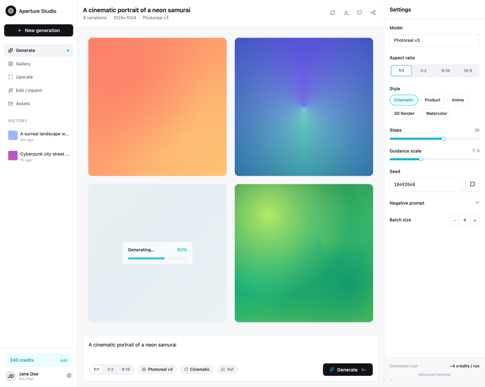

# AI Image Generator UI: Light Studio App with Prompt Composer

A clean, light AI image generation studio you can actually ship. It's a three-pane app: a left rail (brand, New-generation, nav, run history, credits), a center canvas with a prompt composer and a 2x2 grid of generated images (one mid-generation at 62%), and a right settings inspector with Model, Aspect ratio, Style, Steps, Guidance, Seed and Batch controls. Cool off-white chrome, a single cyan accent, flat border-only hairlines, one Geist grotesk. The generated tiles are pure-CSS generative art so there are no stock photos, and it is fully responsive. No default indigo/purple slop. Reusable for any text-to-image or AI creative tool.

Source: https://ui.shadcn.com/examples/dashboard (app-shell furniture anchor; measured corpus item DP-281)



## Prompt

```text
{
  "summary": "A LIGHT, refined AI IMAGE-GENERATION STUDIO web app - a real working creative tool, not a marketing page - built as a THREE-PANE APP SHELL on a cool off-white #f7f8fa canvas. ONE grotesk typeface (Geist) does all the work with hierarchy from size and weight; a mono is used only for the seed number and dimensions. The chrome is strictly FLAT and BORDER-ONLY: 1px #e6e8ec hairlines separate the three panes and every card, radii are tight (10 to 12px cards, 8px inputs and pills), and there are NO drop shadows on the app chrome. The palette is neutral - ground #f7f8fa, white panels, ink #111318, muted #6b7280, hairlines #e6e8ec - with a SINGLE rationed CYAN accent #06b6d4 (active nav dot, selected-aspect ring, slider tracks, the Generating progress bar, the credits pill, the Generate spark) and a darker cyan #0891b2 for cyan text on white. The ONE filled control is the near-black #111318 Generate pill. All saturated color lives ONLY inside the generated-image tiles, which are pure-CSS generative art (layered conic + radial + linear gradients with a subtle feTurbulence grain), each a different vivid palette (sunset coral-amber, teal-indigo, emerald-lime, plus one in-progress skeleton) so the app reads as a real image tool with no external photos. LEFT RAIL (~230px, fixed): a circular brand mark + wordmark, a dark New-generation pill, a nav group (Generate active with a cyan dot, Gallery, Upscale, Edit / Inpaint, Assets), a HISTORY label and a scrollable list of recent runs (tiny gradient thumbnail + truncated prompt + relative time), and a footer with a cyan-tinted credits pill + Settings + a user card. CENTER CANVAS (fluid, the hero): a top strip echoing the current prompt with a '4 variations, 1024x1024, Photoreal v3' meta line and small icon actions (regenerate, download all, favorite, share); a 2x2 GRID of large generated-image tiles, each hover-revealing a toolbar (upscale, variations, download, favorite) and a mono SEED chip, with ONE tile in a 'Generating... 62%' state (cyan progress bar over a skeleton); and a pinned PROMPT COMPOSER (a rounded textarea 'Describe the image you want to create...', quick chips for aspect 1:1 / 3:2 / 9:16, model, style, and +reference image, and the near-black Generate pill with a cyan spark and a 'cmd+enter' hint). RIGHT INSPECTOR (~300px, fixed): a 'Settings' title over labeled controls - Model, Aspect ratio (segmented 1:1 / 3:2 / 9:16 / 16:9, the selected one cyan-ringed), Style chips (Cinematic, Product, Anime, 3D Render, Watercolor), a Steps slider (cyan track + value), a Guidance-scale slider, a mono Seed field with a randomize die, a Negative-prompt disclosure, a Batch-size stepper, and an estimated-cost line. Fully responsive: on mobile 390px the left rail collapses to a top bar (hamburger + brand + credits), the image grid becomes one column, and the composer stays pinned full-width; nothing clips or overflows. No default indigo/purple chrome and no dark-violet cliche - neutral chrome, cyan accent, color only inside the generated-art tiles.",
  "style": {
    "description": "Calm, precise, content-forward creative-tool product UI - a real working AI image studio, not a landing page. Neutral chrome so the generated art carries all the color: a cool off-white #f7f8fa ground, white panels, ONE grotesk (Geist) in near-black #111318 with hierarchy from size and weight (14px/400 body, 500 labels and nav, 16 to 18px/600 panel titles), muted #6b7280 captions, and a mono only for the seed and dimensions. The shape language is FLAT and BORDER-ONLY: 1px #e6e8ec hairlines separate the three panes and every card, radii are tight (10 to 12px cards, 8px inputs and pills, 999px chips), and NO drop shadows sit on the app chrome. Color is rationed to a SINGLE channel - a cyan accent #06b6d4 on interactive and active states (active nav dot, selected-aspect ring, slider tracks, the Generating progress bar, the credits pill, the Generate spark), with a darker cyan #0891b2 for cyan text on white; the one filled control is the near-black #111318 Generate pill. Every saturated hue lives INSIDE the generated-image tiles, which are pure-CSS generative art, so the register stays quiet, neutral, and precise while the content pops. Anti-slop: never the default indigo/purple gradient chrome and never the dark-violet AI-chat cliche.",
    "prompt": "Design a LIGHT, refined AI image-generation studio web app as a THREE-PANE app shell on a cool off-white #f7f8fa canvas, generically branded. Use ONE grotesk typeface (Geist) with hierarchy from size and weight, and a mono only for the seed and dimensions. Keep the chrome strictly FLAT and BORDER-ONLY: 1px #e6e8ec hairlines separate the panes and cards, tight radii (10 to 12px cards, 8px inputs and pills), NO drop shadows on chrome. Ration color to a SINGLE cyan accent #06b6d4 on active and interactive states (with darker cyan #0891b2 for cyan text on white); the only filled control is a near-black #111318 Generate pill. Put ALL saturated color inside the generated-image tiles only, rendered as pure-CSS generative art (layered conic + radial + linear gradients + a subtle feTurbulence grain), each a different vivid palette, never a stock photo. Build the three panes exactly: a fixed left rail (brand, New-generation pill, nav with Generate active, a HISTORY list), a fluid center canvas (prompt echo + meta line, a 2x2 generated-image grid with per-tile hover toolbars + mono seed chips + one in-progress tile, and a pinned prompt composer with aspect/model/style/reference chips + the Generate pill), and a fixed right settings inspector (Model, Aspect ratio segmented, Style chips, Steps + Guidance sliders, a mono Seed with randomize, Negative-prompt disclosure, Batch-size stepper, estimated cost). Make it fully responsive (mobile collapses the rail to a top bar, the grid to one column, the composer pinned full-width) and do NOT lock the root to h-screen/overflow-hidden in a way that clips a full-page screenshot. No default indigo/purple chrome, no dark-violet cliche."
  },
  "layout_and_structure": {
    "description": "A three-pane creative-tool app shell on a cool off-white #f7f8fa canvas: a fixed ~230px left rail, a fluid center generation canvas, and a fixed ~300px right settings inspector, separated by 1px #e6e8ec hairlines. LEFT: brand mark + wordmark, a dark New-generation pill, a nav group (Generate active with a cyan dot, Gallery, Upscale, Edit / Inpaint, Assets), a HISTORY list of recent runs (tiny gradient thumb + truncated prompt + time), and a footer (cyan credits pill + Settings + user card). CENTER: a top strip (prompt echo + '4 variations, 1024x1024, Photoreal v3' meta + regenerate/download/favorite/share icons), a 2x2 grid of large generated-image tiles (per-tile hover toolbar + mono seed chip; one tile Generating... 62% over a skeleton), and a pinned prompt composer (textarea + aspect/model/style/reference chips + Generate pill). RIGHT: Settings - Model, Aspect ratio (segmented, selected cyan-ringed), Style chips, Steps + Guidance sliders (cyan tracks), a mono Seed with a randomize die, a Negative-prompt disclosure, a Batch-size stepper, and an estimated cost. On mobile the rail collapses to a top bar, the grid is one column, and the composer stays pinned full-width; nothing clips or overflows horizontally.",
    "prompts": [
      {
        "part": "Left rail (~230px, fixed)",
        "prompt": "Build a fixed ~230px left rail on white with a 1px #e6e8ec right hairline: a circular near-black brand mark + a medium-weight wordmark; a full-width dark #111318 'New generation' pill with a plus icon; a nav group (Generate active with a subtle #f1f3f6 fill and a small cyan #06b6d4 dot, then Gallery, Upscale, Edit / Inpaint, Assets - each a 16px icon + 14px/500 label); a 'HISTORY' eyebrow (12px/500 uppercase tracked #9aa1ac) over a list of recent runs (a 28px rounded gradient thumbnail + a truncated prompt + a muted relative time); and a footer with a cyan-tinted '240 credits' pill + 'Add', Settings, and a user card (avatar + name + plan). On mobile collapse this rail to a top bar (hamburger + brand + credits)."
      },
      {
        "part": "Center generation grid + top strip",
        "prompt": "In the fluid center, add a top strip: the current prompt as a 16 to 18px/600 title, a 13px muted meta line ('4 variations, 1024x1024, Photoreal v3'), and a small right-aligned icon row (regenerate, download all, favorite, share). Below it, a max-w-4xl 2x2 GRID (md:grid-cols-2, single column on mobile) of aspect-square generated-image TILES at ~12px radius, each a DIFFERENT pure-CSS generative-art gradient (sunset coral-amber; teal-indigo conic; emerald-lime), each hover-revealing a small frosted toolbar (upscale, variations, download, favorite) top-right and a mono SEED chip bottom-left. Make ONE tile an in-progress state: a soft cool skeleton with a gentle pan animation and a centered frosted card reading 'Generating...' with a cyan '62%' and a cyan progress bar."
      },
      {
        "part": "Pinned prompt composer",
        "prompt": "Pin a prompt COMPOSER at the bottom of the center canvas over a soft canvas-to-transparent fade: a white 1px #e6e8ec card at ~12px radius holding a borderless multi-line textarea (15px/400) prefilled 'A cinematic portrait of a neon samurai' with placeholder 'Describe the image you want to create...', then a control row - quick chips for aspect (1:1 / 3:2 / 9:16), a model chip (Photoreal v3), a style chip (Cinematic), and a '+ Ref' reference-image chip - and a near-black #111318 GENERATE pill (white text, 8px radius, a cyan spark icon, a muted mono 'cmd+enter' hint, a cyan focus ring). Give the grid enough bottom padding that the composer never overlaps a tile."
      },
      {
        "part": "Right settings inspector (~300px, fixed)",
        "prompt": "Build a fixed ~300px right inspector on white with a 1px #e6e8ec left hairline: a 'Settings' title, then labeled controls - Model (a select showing 'Photoreal v3'); Aspect ratio (a segmented 1:1 / 3:2 / 9:16 / 16:9 control with the selected segment cyan-ringed); Style (chips Cinematic active + Product, Anime, 3D Render, Watercolor); Steps (a slider with a cyan track + a right-aligned value 30); Guidance scale (a slider + value 7.5); Seed (a mono field '18492048' + a randomize die button); a 'Negative prompt' disclosure row with a chevron; a Batch size stepper (minus / 4 / plus); and a bottom estimated-cost line ('~4 credits / run') over an 'Advanced settings' disclosure. Hide this inspector on mobile (its key controls also live as composer chips)."
      }
    ]
  },
  "special_ui_components": [
    {
      "component": "Generated-image tile (pure-CSS generative art)",
      "description": "A large aspect-square result tile whose image is layered CSS gradients (conic + radial + linear) plus a subtle feTurbulence grain overlay, so it reads as an AI-generated image with zero external assets. Hover reveals a frosted toolbar (upscale, variations, download, favorite) top-right and a mono seed chip bottom-left.",
      "prompt": "Render each result tile as an aspect-square, ~12px-radius container with NO : stack a couple of radial-gradient hotspots + a conic-gradient sweep + a linear base gradient in a distinct vivid palette per tile (e.g. sunset coral-amber; teal-to-indigo conic; emerald-to-lime), and add a faint SVG feTurbulence fractal-noise overlay at ~5% opacity for grain. On group-hover, fade in a white/90 backdrop-blur toolbar (upscale, variations, download, favorite icon buttons) at top-right and a black/50 backdrop-blur mono seed chip at bottom-left. Keep all saturated color confined to these tiles."
    },
    {
      "component": "In-progress generation tile",
      "description": "The loading state of a result: a soft cool skeleton with a gentle background pan and a centered frosted card showing 'Generating...', a cyan percentage, and a cyan progress bar - so an empty slot reads as an image forming, not a blank card.",
      "prompt": "Give one grid tile a skeleton background: a light cool linear-gradient (#eef2f6 to #eaf7f9) with background-size 200% and a slow ease-in-out pan keyframe. Center a frosted card (white/70 + backdrop-blur, 1px #e6e8ec, ~10px radius) containing a row 'Generating...' (14px/500 ink) with a cyan '62%' at right, over a thin rounded track (#f1f3f6) filled to 62% in cyan #06b6d4 with a soft inner pulse."
    },
    {
      "component": "Prompt composer with quick chips",
      "description": "The docked input: a bordered white card with a borderless textarea and a row of quick chips (aspect / model / style / reference) plus the near-black Generate pill with a cyan spark and a keyboard hint.",
      "prompt": "Build a white 1px #e6e8ec card at ~12px radius: a full-width borderless resize-none textarea (15px/400, muted placeholder), then a wrap row of pill chips - aspect segmented 1:1 / 3:2 / 9:16 (selected cyan-ringed), a model chip with a cpu icon, a style chip with a palette icon, and a muted '+ Ref' chip - and a near-black #111318 Generate pill (white text, 8px radius, a cyan sparkles icon, a 50%-opacity mono 'cmd+enter', a 2px cyan focus ring). The chips mirror the right inspector's current selections."
    },
    {
      "component": "Settings inspector control stack",
      "description": "The right-pane diffusion controls: Model select, segmented Aspect ratio, Style chips, Steps + Guidance sliders on a cyan track, a mono Seed field with a randomize die, a Negative-prompt disclosure, a Batch-size stepper, and an estimated cost - the taxonomy a real text-to-image tool exposes.",
      "prompt": "Stack labeled controls in the right inspector, each a 12 to 13px/500 label over its control: a Model select; a segmented Aspect-ratio control (1:1 / 3:2 / 9:16 / 16:9, selected segment ringed in cyan #06b6d4); Style chips (one filled/cyan-ringed active); two range SLIDERS (Steps, Guidance scale) each with a cyan-filled track, a cyan thumb, and a right-aligned mono value; a mono Seed input with a trailing randomize die button; a 'Negative prompt' disclosure row with a chevron; a Batch-size stepper (minus / value / plus); and a muted 'Estimated cost ~4 credits / run' line above an 'Advanced settings' disclosure."
    }
  ]
}
```
