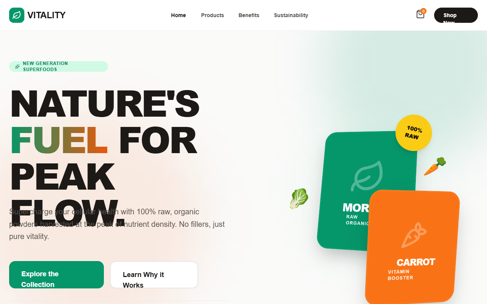

# AMANTRA ORGANICS | Premium Organic Superfoods

A premium, energetic organic wellness brand style featuring high-contrast typography, vibrant organic colors (emerald and orange), and advanced 3D-transform interactions. This aesthetic is ideal for modern D2C health brands, superfood companies, and bio-hacking startups seeking a high-performance, scientific yet natural aesthetic. It uses a clean 'Stone' background to allow bold product colors and fluid, scroll-triggered animations to take center stage. Key elements include bento-grid layouts, floating card stacks, and glassmorphism accents.



## Prompt

```text
{
  "summary": "A high-end, vibrant wellness design system called 'AMANTRA ORGANICS' that blends natural emerald greens with energetic oranges. It features bold, ultra-thick 'Cabinet Grotesk' headings, smooth 'Satoshi' body text, and interactive 3D elements that respond to mouse movement and scroll. The layout is spacious, using heavy border radii (up to 40px) and subtle depth through shadows and 3D rotations.",
  "style": {
    "description": "The style is 'Premium Energetic Organic'. It pairs the technical precision of a lab with the raw vibrancy of nature. Typography utilizes a high-contrast pairing of Cabinet Grotesk for impact and Satoshi for readability. The color palette uses #059669 (Emerald) and #ea580c (Orange) as primary action colors against a #fafaf9 (Stone) canvas. Animations include floating keyframes, 3D tilt effects using perspective-1000, and scroll-reveal transitions.",
    "prompt": "Create a design system using a background of #fafaf9. Use 'Cabinet Grotesk' (Weights: 700, 800, 900) for all headings with tracking-tighter and leading-[0.9]. Use 'Satoshi' (Weights: 400, 500, 700) for body copy. Primary Colors: Emerald Green (#059669) for growth/health and Burnt Orange (#ea580c) for energy. Implement a specific gradient: linear-gradient(90deg, #059669, #ea580c) for headline accents. UI elements should have a border-radius of 24px to 40px. Interactive elements must feature 'perspective-1000' and 'preserve-3d' CSS properties. Include a 'hero-float' animation that translates Y by -20px and rotates 2deg over 6 seconds. Buttons should have a transition-duration of 300ms and scale 0.95 on click. Use subtle shadows (shadow-xl shadow-stone-200/50) and glassmorphism (backdrop-blur, white/90 background) for overlays."
  },
  "layout_and_structure": {
    "description": "A vertical-scrolling landing page structure characterized by distinct high-contrast sections, wide margins, and asymmetrical 3D hero compositions.",
    "prompts": [
      {
        "part": "Sticky Header",
        "prompt": "A 20rem (80px) tall sticky header with a white background and a very subtle bottom border (#stone-200/60). Left-aligned logo with a 40px emerald square icon (rounded-xl) containing a white leaf. Center-aligned navigation links in Satoshi 14px font, stone-600 color, hovering to emerald-600. Right-aligned 'Shop Now' button (black background, white text, fully rounded)."
      },
      {
        "part": "3D Floating Hero",
        "prompt": "Split layout: Left side features an 8xl font-size heading 'NATURE'S FUEL FOR PEAK FLOW' with gradient accents. Below, a 2-column button layout (emerald primary, white border secondary). Right side features a 3D interactive container (perspective-1000) with two overlapping cards (Emerald #059669 and Orange #ea580c) tilted on X and Y axes. Add floating icons (leaf, carrot) using a 'hero-float' keyframe animation. Include a social proof badge with a stacked avatar group and '5,000+' text."
      },
      {
        "part": "Dark Benefits Grid",
        "prompt": "A full-width section with background #1c1917 (Stone 900). 3-column grid of cards with #292524 (Stone 800) backgrounds and 1px borders (#44403c). Each card features a 56px icon container (bg-opacity 10%) with a colored icon (Emerald, Orange, Yellow) that scales 1.1x on hover."
      },
      {
        "part": "Product Bento Gallery",
        "prompt": "Heading section with large 5xl title and circular navigation buttons. A 3-column product grid. Two columns feature large product cards with 40px corner radii, a colored background inset (emerald-50, orange-50), a large emoji/icon representation, and a 'Best Seller' floating badge. The third column is a high-contrast dark card (bg-stone-900) with a CTA to 'Build My Box'."
      },
      {
        "part": "Newsletter Injection",
        "prompt": "A high-impact orange (#ea580c) section with a 45-degree rotated background icon. Large white heading 'STAY RADIANT'. Form layout: Wide input field (400px width) with 16px corner radii and a black 'SIGN ME UP' button that hovers to emerald-600."
      },
      {
        "part": "Detailed Footer",
        "prompt": "6-column grid structure on white background. Column 1-2: Logo, description, and circular social icons. Column 3: 'Shop' links. Column 4: 'Resources' links. Column 5-6: 'Visit Us' text with bold contact email. Bottom copyright bar separated by a stone-100 border."
      }
    ]
  },
  "special_ui_components": [
    {
      "component": "3D Interactive Card Stack",
      "description": "A mouse-tracking parallax element used in the hero section to create depth.",
      "prompt": "Construct a container with 'perspective-1000' and 'preserve-3d'. Inside, place two div 'cards' (256x320px). Card A (Emerald) is base layer with rotateY(-15deg) rotateX(10deg). Card B (Orange) is offset with 'translateZ(50px) rotateY(15deg) rotateX(-5deg)'. Add a JS mouse-move listener that calculates the mouse position relative to the center of the container and updates the container's rotateX and rotateY values dynamically (e.g., rotateX = (mouseY - center) / 20)."
    },
    {
      "component": "Bento Product Card",
      "description": "High-radius product display card with nested background shapes.",
      "prompt": "Create a card with 40px padding and a white background. Inside, a 1:1 aspect ratio div with a soft colored background (e.g., emerald-50) and 32px radius. Place the main visual icon inside this div; on parent hover, scale the icon by 1.25x and rotate it by 12 degrees. Use a heavy stone-200/50 shadow that intensifies and shifts on hover."
    }
  ]
}
```

**▶ Try it live → [https://superdesign.dev/library/amantra-organics-or-premium-organic-superfoods](https://superdesign.dev/library/amantra-organics-or-premium-organic-superfoods?utm_source=github&utm_medium=prompt-repo&utm_campaign=prompt-library)**

**Use it in your coding agent:** install the [Superdesign skill](https://github.com/superdesigndev/superdesign-skill), then:

```bash
superdesign get-prompts --slugs "amantra-organics-or-premium-organic-superfoods" --json
```

*167 copies · 2,415 tries · *
