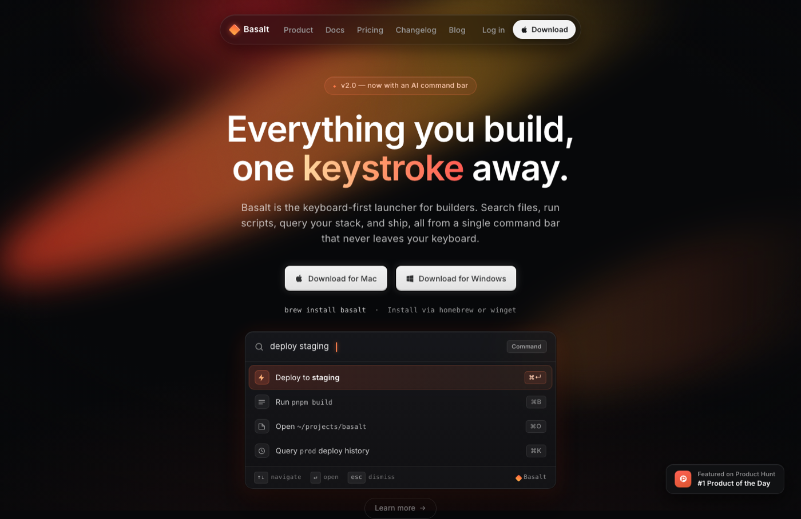

# Animated Aurora Background Hero: Dark Developer-Tool Landing Page

A dark developer-tool landing page hero built around a living, animated aurora background: warm crimson, coral and amber light-blades that drift and breathe across a near-black #07080a canvas, all pure CSS keyframes over an SVG-grain texture. On top sit a floating pill nav, a two-line Inter headline with a warm gradient accent word, tactile keycap-raised OS download buttons, a GeistMono install caption, and a glassy command-bar launcher mockup with an active result row and keyboard shortcuts. Warm aurora only, no purple. Reusable as a drop-in animated hero background for any dark dev tool, CLI, launcher, IDE, or SaaS landing.

Reference: raycast.com hero (reverse-engineered), re-authored.



## Prompt

```text
{
  "summary": "A premium DARK developer-tool LANDING-PAGE HERO (single desktop viewport, 1440-wide) on a near-black #07080a canvas whose signature is a LIVING ANIMATED AURORA BACKGROUND. Behind the centered content, several large diagonal 'light-blade' gradient streaks glow warm crimson ~#ff2f3a at their cores and blend through coral ~#ff6b4a into warm amber ~#ffb347 at the tips, fading into the #07080a ground; they slowly DRIFT (translate + slight rotate) and BREATHE (opacity/scale pulse) on staggered ~15-22s pure-CSS @keyframes loops, layered under a subtle SVG feTurbulence film-grain and a vignette so it never reads as a flat CSS gradient. The 0% keyframe is set to full bloom so a single still captures the richest frame. Strictly WARM, no purple/indigo/violet anywhere. On top: (1) a FLOATING PILL NAV near top-center (dark translucent rounded container, hairline border + inner-top highlight) with a warm diamond logo glyph + wordmark left, muted #9c9c9d 14px/500 center links (Product, Docs, Pricing, Changelog, Blog), and a muted 'Log in' + a small near-white 'Download' pill with an OS glyph right; (2) a small eyebrow chip ('v2.0 - now with an AI command bar'); (3) an H1 in Inter ~64px / weight 600 / line-height ~1.1 in pure white #ffffff on two lines, with ONE word set in a warm amber->crimson text gradient; (4) an 18px/400 muted-white subtitle, ~2 lines, max ~640px; (5) a ROW of two tactile KEYCAP-RAISED near-white OS download buttons ('Download for Mac' + Apple glyph, 'Download for Windows' + Windows glyph) - background #e6e6e6, text #2f3031, 8px radius, a layered shadow stack (black ring + soft white outer glow + inset top-white/bottom-dark highlights) so they feel like physical keys; (6) a GeistMono 12px #9c9c9d install caption ('brew install basalt - Install via homebrew or winget'); (7) a dark-glass COMMAND-BAR / LAUNCHER MOCKUP (backdrop-blur, hairline border, warm-tinted drop shadow, ~14px radius) holding a search-glyph input row with a typed query and a blinking warm caret + a 'Command' mode pill, four result rows (icon + label + a right-aligned keyboard-shortcut chip like Cmd+Enter, Cmd+B, Cmd+O, Cmd+K) with the FIRST row in an active state tinted from the aurora (warm, never purple), and a footer strip of mono hints; (8) a small floating dark 'Featured on Product Hunt' badge card bottom-right; (9) a single centered ghost pill ('Learn more ->') at the very bottom. ONE Inter typeface for all UI (GeistMono only for the mono caption + shortcut chips); the only chroma is the warm aurora, everything else strictly neutral (#ffffff / #9c9c9d / #07080a). Cinematic, high-contrast, product-forward.",
  "style": {
    "description": "Cinematic dark developer-tool marketing hero built around a LIVING WARM AURORA background as the whole personality. A near-black #07080a canvas carries several soft-focus, grain-textured diagonal light-blades glowing crimson->coral->amber that drift and breathe on staggered pure-CSS keyframes; everything else is strictly neutral (#ffffff type, #9c9c9d muted, #07080a ground). ONE Inter typeface does all UI with hierarchy from SIZE + WEIGHT (a big 64px/600 white headline with a single warm-gradient accent word over a quiet 18px/400 muted-white subtitle); GeistMono appears ONLY as a small install caption + the keyboard-shortcut chips. The shape language is flat with two deliberate exceptions: the download buttons are tactile KEYCAP-RAISED (near-white #e6e6e6 fill, dark #2f3031 text, 8px radius, a layered shadow stack of a black ring + soft white outer glow + inset highlights) so they read as physical keys, and a dark-glass COMMAND-PALETTE mockup (backdrop-blur, hairline border, warm active row) anchors the lower half and shows what the product does. Chrome floats: a translucent hairline pill nav at top, a dark product-badge card bottom-right, a single ghost pill at the bottom. WARM ONLY - crimson/coral/amber; never a purple/indigo gradient (that reads as AI slop). No stock photos, no second color family.",
    "prompt": "Design a premium DARK developer-tool landing-page HERO for a single 1440-wide desktop viewport on a near-black #07080a canvas, making a LIVING ANIMATED AURORA the entire personality. Paint the backdrop as several large, soft-focus, grain-textured diagonal 'light-blade' gradient streaks that glow warm crimson ~#ff2f3a at their cores and blend through coral ~#ff6b4a into warm amber ~#ffb347 at the tips, fading into the #07080a ground; animate them with PURE CSS @keyframes only (no JS needed for the visible frame) so they slowly DRIFT (translate + slight rotate) and BREATHE (opacity/scale pulse) on staggered ~15-22s loops, and layer a subtle SVG feTurbulence film-grain + a vignette over them so it never looks like a flat CSS gradient. Set the 0% keyframe to full bloom so a single still still looks complete. Keep the palette strictly WARM - absolutely no purple/indigo/violet. Use ONE sans typeface (Inter) for all UI and build hierarchy from SIZE + WEIGHT: a big two-line H1 at 64px / weight 600 / line-height ~1.1 in pure white #ffffff with ONE word set in a warm amber->crimson text gradient, over a quiet 18px / weight 400 muted-white subtitle; reserve a monospace (GeistMono) ONLY for a small install caption + the shortcut chips. Keep everything flat EXCEPT: (a) the download buttons, which must be tactile KEYCAP-RAISED (near-white #e6e6e6 fill, dark #2f3031 text, 8px radius, a black ring + soft white outer glow + inset top-white/bottom-dark highlights); and (b) a dark-glass COMMAND-BAR launcher mockup that anchors the lower half. Confine all chroma to the warm aurora and the buttons; keep every other element strictly neutral (#ffffff / #9c9c9d / #07080a). No stock photos, high-contrast, cinematic, product-forward."
  },
  "layout_and_structure": {
    "description": "A single centered hero viewport, read top-to-bottom: (1) a floating translucent PILL NAV near top-center; (2) a small eyebrow chip; (3) a two-line 64px/600 white H1 with a warm gradient accent word; (4) an 18px muted-white subtitle; (5) a ROW of two keycap-raised OS download buttons; (6) a GeistMono install caption; (7) a dark-glass COMMAND-BAR / LAUNCHER mockup that fills the lower band and shows the product; (8) a single centered ghost 'Learn more ->' pill beneath it. A living warm aurora fills the whole canvas behind everything, and a small floating dark product-badge card sits bottom-right. On a narrow viewport the nav collapses to a compact bar, the headline steps down in size, the two download buttons stack full-width, and the command-bar mockup shrinks to fit.",
    "prompts": [
      {
        "part": "Animated aurora background",
        "prompt": "Fill the entire near-black #07080a canvas with a LIVING warm aurora: several large, soft-focus diagonal 'light-blade' gradient streaks glowing crimson ~#ff2f3a at their cores, blending through coral ~#ff6b4a into warm amber ~#ffb347 at the tips and fading to the ground. Blend them with 'screen', animate each with pure CSS @keyframes (translate + slight rotate drift, opacity/scale breathing) on staggered ~15-22s loops, and set the 0% keyframe to full bloom. Overlay a subtle SVG feTurbulence film-grain + a vignette so it reads as crafted light, not a flat gradient. Keep it strictly warm - no purple/indigo. This aurora is the ONLY chroma and the hero's signature."
      },
      {
        "part": "Floating pill nav",
        "prompt": "Pin a FLOATING PILL NAV near the top center: a dark translucent (backdrop-blurred) ROUNDED container with a 1px hairline border and a faint inner-top highlight, NOT a full-width bar. Left: a small warm diamond logo glyph + a white ~600 wordmark. Center: muted #9c9c9d 14px/500 Inter links (Product, Docs, Pricing, Changelog, Blog). Right: a muted 'Log in' link and a small NEAR-WHITE 'Download' pill button with an Apple/OS glyph."
      },
      {
        "part": "Headline + subtitle",
        "prompt": "Above the headline, a small subtle eyebrow chip/pill ('v2.0 - now with an AI command bar'). Center a two-line H1 in Inter 64px / weight 600 / line-height ~1.1 in pure white #ffffff, with ONE word set in a warm amber->crimson text gradient (e.g. 'Everything you build, one keystroke away.'). IMPORTANT: scope the headline to a CLASS with explicit font-size !important - do not rely on a bare h1 selector (preview hosts override bare tags). Directly below, a centered SUBTITLE in Inter 18px / weight 400, muted white, 0.2px letter-spacing, wrapping to ~2 lines at max ~640px."
      },
      {
        "part": "Keycap download button row",
        "prompt": "Below the subtitle, a ROW of two side-by-side TACTILE RAISED buttons, each with an OS glyph: 'Download for Mac' (Apple glyph) and 'Download for Windows' (Windows glyph). Style both as keycaps: background #e6e6e6, text #2f3031, Inter 14px/500, 8px radius, ~10-14px padding, and a layered shadow stack (a ~2px black ring, a soft white outer glow, inset top-white + bottom-dark highlights) so they feel physically raised off the dark canvas. Use real inline-SVG OS marks, not emoji. Under the row, a small centered GeistMono 12px #9c9c9d caption ('brew install basalt - Install via homebrew or winget')."
      },
      {
        "part": "Command-bar launcher mockup",
        "prompt": "Fill the lower band with a dark-glass COMMAND-BAR / LAUNCHER mockup: a backdrop-blurred rounded (~14px) panel with a hairline border and a warm-tinted drop shadow. Top row: a search glyph + a typed query ('deploy staging') with a blinking WARM caret, and a small 'Command' mode pill on the right. Below: four result rows (an inline-SVG icon + a label with a mono argument + a right-aligned keyboard-shortcut chip like Cmd+Enter / Cmd+B / Cmd+O / Cmd+K), with the FIRST row in an ACTIVE state tinted from the aurora (a warm crimson-tint highlight, never purple). Footer strip: mono hints ('up/down navigate - enter open - esc dismiss') + the wordmark. Keep clear spacing so it never overlaps the buttons above or the badge."
      },
      {
        "part": "Floating badge + bottom pill",
        "prompt": "Bottom-right, a small FLOATING dark rounded product-badge card ('Featured on Product Hunt' with a small logo mark + a rank like '#1 Product of the Day'), hairline border + subtle depth, muted and unobtrusive. Centered directly beneath the command-bar mockup, a single low-emphasis GHOST PILL - transparent fill, thin ring border, muted text, trailing arrow ('Learn more ->'). Exactly one ghost pill; nothing floating orphaned in a void."
      }
    ]
  },
  "special_ui_components": [
    {
      "component": "Animated warm aurora light-blade background",
      "description": "A living, breathing warm-gradient backdrop built as pure CSS keyframes over grain - the hero's signature and the copy-worthy asset.",
      "prompt": "Build a hero backdrop of several large, soft-focus diagonal 'light-blade' gradient streaks on a near-black #07080a ground, glowing crimson ~#ff2f3a at the cores and blending through coral ~#ff6b4a into warm amber ~#ffb347 at the tips before fading out. Blend the blades with 'screen'. Animate EACH with pure CSS @keyframes (a slow translate + slight rotate drift plus an opacity/scale 'breathing' pulse) on staggered ~15-22s loops so the whole field feels alive, and set the 0% keyframe to full bloom so a single frozen frame still looks rich (survives a static template reproduction). Layer a subtle SVG feTurbulence film-grain + a radial vignette over the gradients so it reads as crafted light rather than a flat CSS gradient. Keep it STRICTLY warm - never introduce purple/indigo/violet (that reads as AI slop). This aurora is the only chroma in the composition; keep it BEHIND the type and desaturated at the tips so white text stays legible."
    },
    {
      "component": "Dark-glass command-bar / launcher mockup",
      "description": "A realistic command-palette panel that shows what the product does and doubles as a drop-in UI a builder can copy.",
      "prompt": "Create a dark-glass COMMAND-BAR / LAUNCHER mockup: a backdrop-blurred rounded (~14px) panel with a 1px hairline border and a warm-tinted drop shadow, floating over the dark canvas. Top: a search-glyph input row with a typed query and a blinking WARM caret, plus a small 'Command' mode pill on the right. Middle: four result rows, each an inline-SVG icon + a label (mix in a mono argument like 'pnpm build' or '~/projects/app') + a right-aligned keyboard-shortcut chip (Cmd+Enter, Cmd+B, Cmd+O, Cmd+K); render the FIRST row in an ACTIVE/selected state with a warm aurora-tinted highlight (never purple). Bottom: a thin footer strip of muted mono hints ('up/down navigate - enter open - esc dismiss') and the brand mark. Keep the whole thing legible and clear of surrounding elements."
    },
    {
      "component": "Keycap-raised download button",
      "description": "A tactile near-white button on a dark canvas whose layered shadow stack makes it feel like a physical key.",
      "prompt": "Build a TACTILE, physically-raised button on a dark canvas: near-white #e6e6e6 fill, dark #2f3031 text, Inter 14px / weight 500, 8px radius, ~10-14px padding, with a real inline-SVG OS glyph (Apple or Windows) left of the label. Layer the depth with a shadow stack - an outer ~2px black ring, a soft white outer glow (~0 0 14px rgba(255,255,255,.19)), and inset highlights (top ~1px white, bottom ~1px dark) - so it reads like a keycap pressed up off the surface. Use it for OS-specific download CTAs; pair two side by side."
    },
    {
      "component": "Floating translucent pill nav",
      "description": "A rounded dark-glass nav container that floats near the top rather than spanning the full width.",
      "prompt": "Create a FLOATING PILL NAV: a dark translucent (backdrop-blurred) rounded container with a 1px hairline border and a faint inner-top highlight, centered near the top with generous horizontal padding - NOT a full-bleed bar. Left: a small warm logo glyph + white wordmark. Center: a row of muted #9c9c9d 14px/500 text links. Right: a muted secondary link and one small near-white pill CTA button with an OS glyph. It should look like it hovers above the dark hero."
    },
    {
      "component": "Warm-gradient accent word",
      "description": "A single word in the headline set in a warm text gradient to tie the type to the aurora.",
      "prompt": "In an otherwise pure-white Inter 64px/600 headline, set ONE key word in a warm text gradient (amber ~#ffb347 -> coral ~#ff6b4a -> crimson ~#ff2f3a) via background-clip:text, so it echoes the aurora behind it. Keep the rest of the headline plain white; use the accent on exactly one word for emphasis, never the whole line."
    },
    {
      "component": "Ghost pill link",
      "description": "A minimal outline pill with transparent fill for a low-emphasis secondary link.",
      "prompt": "Create a low-emphasis GHOST PILL link: transparent fill, a thin ~1px ring border, muted white text, fully rounded, with a trailing arrow ('Learn more ->'). Center it directly beneath the command-bar mockup as a secondary path, visually subordinate to the raised download buttons. Use exactly one - never leave a duplicate floating in empty space."
    }
  ]
}
```
