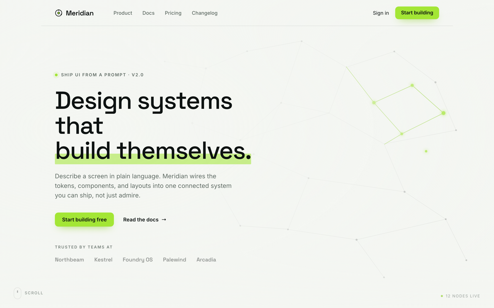

# Animated Hero Section: Constellation Network Landing Page

An animated landing-page hero built around a living constellation of connected nodes. A cool pale canvas carries near-black ink type and a single acid-lime accent: a thin nav with a solid-lime CTA, then a left-aligned editorial column with a tracked eyebrow, a huge two-line Space Grotesk headline (with a lime highlight sweep behind the second line), a muted subhead, a solid-lime primary button beside a ghost 'Read the docs' link, and a quiet 'trusted by' wordmark row. Behind everything, a full-bleed SVG node-network drifts on pure CSS keyframes: most nodes and links are faint ink, one small cluster glows acid-lime as the 'live' part of the graph, and a radial fade keeps the headline perfectly legible. Two typefaces by role (Space Grotesk display + Inter body), one restrained accent, no gradient and no glass. Copy this hero for any SaaS, AI, or developer-tool landing page that wants real motion without looking like generic AI slop. Responsive down to a single-column mobile hero.



## Prompt

```text
{
  "summary": "An ANIMATED landing-page HERO SECTION built around a living CONSTELLATION / connected-node NETWORK background — a real marketing hero for a generic developer/AI product ('Meridian'), NOT an app UI. The register is cool-neutral + one acid-lime accent: a pale cool canvas #f4f6f2 (a hair of green undertone, NOT warm ivory, NOT pure white), near-black ink #0d1211, muted text #5f6b64, hairlines rgba(13,18,17,0.10). Color is rationed to a SINGLE acid-lime accent #a3e635 (deeper #84cc16 where dark text needs contrast), used ONLY for the primary CTA fill (ink text on lime), the small eyebrow status dot, one glowing 'live' node cluster, and the headline highlight sweep — NO purple/indigo/blue gradient anywhere, NO frosted glass. TWO typefaces by role: Space Grotesk for the display headline and wordmark (big, tight, confident), Inter for nav/subhead/labels/buttons. TOP: a thin transparent NAV over the canvas — a ring-glyph 'Meridian' wordmark on the left, center links Product / Docs / Pricing / Changelog, and on the right a ghost 'Sign in' plus a SOLID LIME 'Start building' button (ink text), with a 1px bottom hairline. HERO (left-aligned in a max-width column, NOT centered): a tracked all-caps EYEBROW (~12.5px / +0.14em, muted) led by a small lime status dot — 'SHIP UI FROM A PROMPT · V2.0'; a two-line Space Grotesk HEADLINE ~72px / line-height 1.02 / letter-spacing -0.03em, weight ~500-600 — 'Design systems that / build themselves.' — with a translucent acid-lime HIGHLIGHT SWEEP painted behind the second line; a muted Inter SUBHEAD 18px / line-height 1.55, max ~48ch — 'Describe a screen in plain language. Meridian wires the tokens, components, and layouts into one connected system you can ship, not just admire.'; a CTA ROW of a SOLID LIME primary button 'Start building free' (ink text, pill) beside a ghost/text 'Read the docs →'; then a TRUST ROW — a tracked muted caps label 'TRUSTED BY TEAMS AT' over ~5 small monochrome muted wordmarks (Northbeam · Kestrel · Foundry OS · Palewind · Arcadia). BACKGROUND: a full-bleed CONSTELLATION behind all content (absolute, inset 0, pointer-events none, z-index behind) — an inline-SVG field of ~48 small nodes across 3-4 layered <g> groups with thin connecting lines between near neighbors; most nodes and links are FAINT INK at low opacity (rgba(13,18,17,0.12-0.28)), and ONE small 5-6 node CLUSTER in the right-side negative space is the ACCENT — lime #a3e635 nodes, slightly larger, with lime connecting lines and a soft glow, reading as the 'active/live' part of the network. The field is denser toward the right and sparser behind the text, with a radial + vertical fade so the headline stays perfectly legible. Small bottom cues: a 'SCROLL' hint bottom-left and a '● 12 NODES LIVE' tag bottom-right. Full-bleed to 100vh, nothing clipped.",
  "style": {
    "description": "Cool-neutral, editorial, single-accent hero minimalism with motion — a crisp 2026 SaaS/AI landing hero, not a 2015 dark particle cliché. A pale cool canvas #f4f6f2 with near-black ink #0d1211 and muted #5f6b64; hierarchy comes from an aggressive type scale (a ~72px Space Grotesk display headline against ~12.5px tracked caps eyebrows/labels) and from left-aligned editorial rhythm, never from color. Color is rationed to a SINGLE acid-lime accent #a3e635 (deeper #84cc16 for dark-text contrast) confined to the primary CTA, the eyebrow dot, the headline highlight sweep, and one glowing 'live' node cluster — everything else is ink / muted / hairline. TWO typefaces by role: Space Grotesk (display headline + wordmark, tight negative tracking) and Inter (nav, subhead, labels, buttons). The shape language is flat and airy: pill CTAs, hairline nav divider, generous negative space, and a full-bleed animated node-network that stays subtle behind the copy. Motion is quiet and pure-CSS (drifting/breathing layers, a gently pulsing accent cluster) — animated-feeling but calm, and legible with motion disabled. The mood is confident, techy, and premium without a single gradient or frosted panel.",
    "prompt": "Design an animated landing-page hero in a cool-neutral, single-accent register. Use a pale cool canvas #f4f6f2 (NOT warm ivory, NOT pure white), ink #0d1211, muted #5f6b64, and hairlines rgba(13,18,17,0.10). Ration color to a SINGLE acid-lime accent #a3e635 (use deeper #84cc16 where dark text sits on lime) — use it ONLY for the primary CTA fill (ink text), the small eyebrow status dot, a translucent highlight sweep behind the second headline line, and one glowing 'live' node cluster in the background. Set the display headline and wordmark in Space Grotesk (big ~72px, line-height ~1.02, letter-spacing -0.03em, weight 500-600) and everything else in Inter; drive hierarchy from the aggressive type scale and a LEFT-ALIGNED editorial column, never from extra color. Keep it flat and airy: pill buttons, a 1px nav hairline, generous whitespace. Do NOT use any purple/indigo/blue gradient, any frosted glass, any warm terracotta/ivory, a second display face, or drop shadows on the type. Keep all motion quiet and pure-CSS so the frame reads complete and legible even with animation disabled."
  },
  "layout_and_structure": {
    "description": "A full-viewport (100vh) hero: (1) a thin transparent top NAV over the canvas — a ring-glyph wordmark left, center nav links, and right a ghost 'Sign in' + a solid-lime CTA, with a 1px bottom hairline; (2) a LEFT-ALIGNED hero column in a max-width container — a tracked eyebrow with a lime dot, a two-line Space Grotesk headline with a lime highlight sweep behind the second line, a muted Inter subhead (~48ch), a CTA row (solid-lime primary + ghost secondary), and a muted 'trusted by' wordmark row; (3) a full-bleed animated CONSTELLATION background behind all content (inline-SVG node-network, denser to the right, faded behind the text); and (4) small bottom cues (a 'SCROLL' hint and a 'live nodes' tag). On a narrow viewport the nav links collapse to a menu, the headline drops to ~40-54px, the constellation thins and shifts fully behind the copy, and the trust wordmarks wrap — the hero stays full-bleed and single-column.",
    "prompts": [
      {
        "part": "Top nav",
        "prompt": "A thin TRANSPARENT top NAV sitting over the pale canvas with a 1px bottom hairline rgba(13,18,17,0.10). Left: a small ring/target glyph + a 'Meridian' wordmark in Space Grotesk (~16px, weight 600, letter-spacing -0.01em, ink). Center (or left-of-center): text links Product / Docs / Pricing / Changelog in Inter ~14.5px, muted, ink on hover. Right: a ghost 'Sign in' text link + a SOLID LIME 'Start building' button (#a3e635 fill, ink #0d1211 text, ~14.5px/weight 600, pill radius, ~10px/16px padding) — the only filled control in the nav. No shadows."
      },
      {
        "part": "Hero column (eyebrow → headline → subhead → CTAs)",
        "prompt": "A LEFT-ALIGNED hero column in a max-width container (do NOT center everything). Top: a tracked all-caps EYEBROW (~12.5px, letter-spacing +0.14em, muted #5f6b64) led by a small solid lime dot — 'SHIP UI FROM A PROMPT · V2.0'. Then a two-line Space Grotesk HEADLINE (~72px desktop, line-height 1.02, letter-spacing -0.03em, weight 500-600, ink #0d1211) — 'Design systems that' / 'build themselves.' — with a translucent acid-lime HIGHLIGHT SWEEP (a low-opacity lime bar) painted BEHIND the second line so the ink stays fully readable over it. Then a muted Inter SUBHEAD (18px, line-height 1.55, #5f6b64, max ~48ch). Then a CTA ROW: a SOLID LIME primary button 'Start building free' (#a3e635, ink text, pill) beside a ghost/text secondary 'Read the docs →' (ink, underline-on-hover). Scale the headline down to ~54px (tablet) / ~40px (mobile)."
      },
      {
        "part": "Trust row",
        "prompt": "Below the CTAs, a TRUST ROW: a tracked muted caps label 'TRUSTED BY TEAMS AT' (~11.5px, letter-spacing +0.16em, #5f6b64) over a single row of ~5 small MONOCHROME muted wordmarks rendered as styled text (no external logos) — e.g. Northbeam · Kestrel · Foundry OS · Palewind · Arcadia — set in Inter ~14px, a muted ink-gray, evenly spaced. Keep them quiet (they are a trust signal, not a focal point), but legible; a slightly darker muted gray reads better than the palest gray."
      },
      {
        "part": "Animated constellation background",
        "prompt": "A FULL-BLEED CONSTELLATION behind ALL content: position absolute, inset 0, pointer-events none, z-index behind the hero. Render it as INLINE SVG — a field of ~48 small circular NODES across 3-4 layered <g> groups, with thin straight LINES connecting near neighbors (a network graph). Most nodes and links are FAINT INK at low opacity (rgba(13,18,17,0.12-0.28)); ONE small 5-6 node CLUSTER in the RIGHT-side negative space is the ACCENT — lime #a3e635 nodes, slightly larger, with lime #84cc16 connecting lines and a soft feGaussianBlur glow, reading as the 'active/live' part of the network. Make the field denser toward the right and sparser behind the text, and lay a radial + vertical FADE over the canvas so the left text column stays clean. CRITICAL: the field must be fully visible and complete as a STATIC frame with NO JavaScript. Animate it with CSS KEYFRAMES ONLY — group nodes into 2-3 layers that slowly translate a few px and breathe opacity on independent 22-34s ease-in-out infinite-alternate cycles, gently scale-pulse the accent cluster (~6.5s), and stagger a soft glow pulse on the accent nodes (~3.6s). Respect prefers-reduced-motion (freeze the field). An optional tiny script may add cursor parallax on the accent cluster, but the design must look complete and animated-feeling with scripts disabled."
      }
    ]
  },
  "special_ui_components": [
    {
      "component": "Animated SVG constellation / node-network background",
      "description": "A full-bleed inline-SVG field of ~48 faint-ink nodes and connecting lines with one glowing acid-lime 'live' cluster, animated on pure CSS keyframes so a still frame is complete and legible.",
      "prompt": "Build a full-bleed animated CONSTELLATION background as inline SVG (absolute, inset 0, pointer-events none, behind all content). Place ~48 small circular nodes across 2-3 layered <g> groups and connect near neighbors with thin straight lines; keep most nodes and links faint ink at rgba(13,18,17,0.12-0.28). Make ONE 5-6 node cluster the accent: lime #a3e635 nodes (slightly larger), lime #84cc16 links, and a soft feGaussianBlur glow, sitting in the right-side negative space as the 'live' part of the graph. Fade the field with a radial + vertical mask so it is dense to the right and clean behind the text. Animate with CSS keyframes ONLY (no canvas/JS dependency for the visible result): translate + opacity-breathe each layer on independent 22-34s ease-in-out infinite-alternate cycles, scale-pulse the accent cluster ~6.5s, and stagger a glow pulse on the accent nodes ~3.6s. Freeze everything under prefers-reduced-motion."
    },
    {
      "component": "Oversized Space-Grotesk headline with lime highlight sweep",
      "description": "A two-line display headline in Space Grotesk with a translucent acid-lime bar painted behind the second line, so the ink type stays fully legible while the accent adds energy.",
      "prompt": "Set a two-line display HEADLINE in Space Grotesk (~72px desktop, line-height 1.02, letter-spacing -0.03em, weight 500-600, ink #0d1211). Behind the SECOND line only, paint a translucent acid-lime HIGHLIGHT SWEEP — a low-opacity #a3e635 bar (box-shadow or a positioned pseudo-element clipped to the text run) that sits under the glyphs so the near-black ink stays fully readable over it. Keep the first line un-highlighted. Scale the headline down responsively (~54px tablet / ~40px mobile) and keep the tight negative tracking at every size."
    },
    {
      "component": "Single acid-lime CTA system (solid primary + ghost secondary)",
      "description": "A restrained action pair — one solid-lime pill primary with ink text and one ghost/text secondary — plus a matching solid-lime nav button, the only filled controls on the page.",
      "prompt": "Build a CTA pair: a SOLID LIME primary button (#a3e635 fill, ink #0d1211 text, Inter ~15px/weight 600, pill radius, ~14px/24px padding) labeled 'Start building free', beside a ghost/text SECONDARY 'Read the docs →' (ink text, no fill, underline or arrow-nudge on hover). Mirror the primary as a smaller solid-lime 'Start building' button in the nav. These solid-lime fills (with ink text that must pass contrast) are the ONLY filled controls on the page — do not add a second accent color or a gradient. Keep hover states subtle (slight darken toward #84cc16 or a small lift)."
    },
    {
      "component": "Tracked eyebrow + muted trust-logo row",
      "description": "A tracked all-caps eyebrow with a small lime status dot above the headline, and a quiet monochrome 'trusted by' wordmark row below the CTAs as a low-key trust signal.",
      "prompt": "Above the headline, render an EYEBROW: a small solid lime dot + tracked all-caps text (~12.5px, letter-spacing +0.14em, muted #5f6b64), e.g. 'SHIP UI FROM A PROMPT · V2.0'. Below the CTAs, render a TRUST ROW: a tracked caps label 'TRUSTED BY TEAMS AT' (~11.5px, letter-spacing +0.16em, muted) over a single row of ~5 monochrome muted WORDMARKS as styled text (no external logos), evenly spaced in Inter ~14px. Keep both quiet and secondary to the headline, but legible — prefer a mid muted gray over the palest gray for the wordmarks."
    }
  ]
}
```

**▶ [Try it live →](https://superdesign.dev/library/animated-hero-section-constellation-network-landing-page?utm_source=github&utm_medium=prompt-repo&utm_campaign=prompt-library)**

**Use it in your coding agent:** install the [Superdesign skill](https://github.com/superdesigndev/superdesign-skill), then:

```bash
superdesign get-prompts --slugs "animated-hero-section-constellation-network-landing-page" --json
```

*0 copies · 0 tries · Landing Pages · General · landing page, hero, animation, style*
