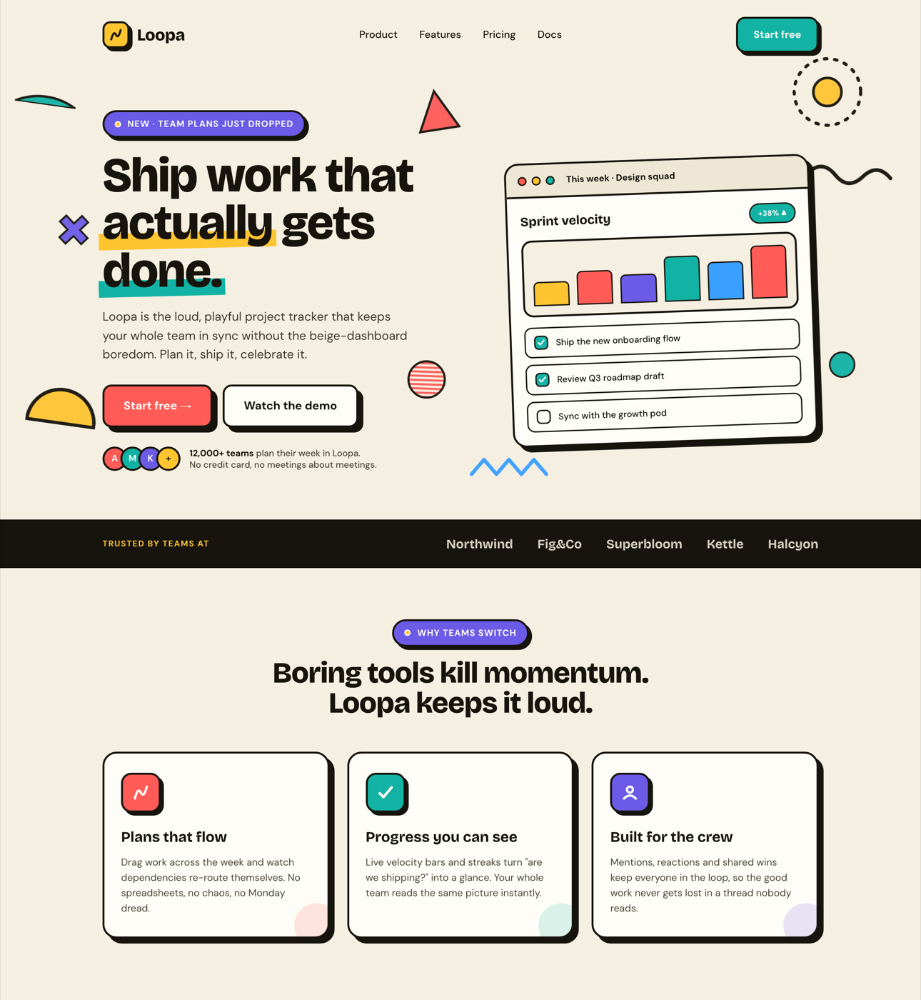

# Animated Memphis Landing Page Hero (Bold Postmodern Product Site)

A loud, playful ANIMATED landing page hero in the MEMPHIS / postmodern style for a bold SaaS or product site. A warm cream canvas is scattered with animated geometric confetti (squiggles, triangles, dotted circles, quarter-arcs, zigzags, a striped circle) that drift and spin via CSS keyframes, behind an asymmetric hero: a chunky bold-grotesk headline with marker-highlight underlines, a violet eyebrow pill, two candy-outlined CTAs (a coral "Start free" + a ghost "Watch the demo") with thick black outlines and hard offset shadows, an avatar trust row, and a tilted product-dashboard mockup (bar chart + checklist). Below: a black full-bleed "Trusted by" logo strip and a three-up feature-card row. Every shape has a thick black outline and a flat hard offset shadow, no gradients. Reusable for any bold, playful product / SaaS / app landing that wants postmodern personality.



## Prompt

```text
{
  "summary": "A loud, playful ANIMATED LANDING PAGE HERO in the MEMPHIS / postmodern style for a bold SaaS / product site (single desktop viewport into a scrolling page, 1440-wide) on a warm CREAM #f5efe2 canvas with near-black #17140d ink. The whole background is scattered with ANIMATED GEOMETRIC CONFETTI in flat Memphis colors, each a thick-black-outlined inline SVG drifting / spinning / bobbing via CSS keyframes (NO JS): a coral #ff5b57 triangle, a teal #12b3a4 quarter-arc, a mustard #ffc531 dotted circle, a violet #6b5be6 spinning plus-sign, a black squiggle 'bacteria' line, a mustard half-circle, a small teal dot, a sky-blue #3aa0ff zigzag, and a coral striped circle. TOP: a minimal nav (a mustard rounded-square logo tile with a black squiggle glyph + 'Loopa' wordmark in Bricolage Grotesque 800, four center links, and a teal 'Start free' pill CTA with a black outline + hard offset shadow). HERO (asymmetric 2-column, copy left / product card right): a violet eyebrow PILL ('NEW - Team plans just dropped' with a mustard dot), a huge Bricolage Grotesque 800 HEADLINE at 76px / line-height .98 ('Ship work that actually gets done.') where two words wear flat MARKER-HIGHLIGHT bars (a mustard bar under 'actually', a teal bar under 'done.'), a ~19px muted lead paragraph, a DUAL CTA row (a PRIMARY coral #ff5b57 pill 'Start free ->' + a SECONDARY white ghost pill 'Watch the demo', both with a 3px black outline and a hard 8px 8px 0 black OFFSET SHADOW that presses in on hover), and a TRUST ROW (four overlapping circular avatars with black outlines + a two-line '12,000+ teams' proof line). The right column holds a TILTED (-2deg) PRODUCT DASHBOARD MOCKUP: a white browser-chrome card (three outlined traffic-light dots + a 'This week - Design squad' title bar) over a body with a 'Sprint velocity' title + a teal '+38%' pill, a six-bar CHART (mustard / coral / violet / teal / sky / coral bars, each black-outlined, rounded tops), and a three-item CHECKLIST (two teal-checked rows + one empty). LOGO STRIP: a full-bleed BLACK band with a mustard 'TRUSTED BY TEAMS AT' label and five cream wordmarks. FEATURES: a centered section (a violet eyebrow pill + a two-line Bricolage 800 heading 'Boring tools kill momentum. Loopa keeps it loud.') over a THREE-UP CARD ROW, each a white outlined card with a hard offset shadow, an outlined color icon-chip (coral / teal / violet), a Bricolage title, a line of copy, and a soft translucent corner-circle accent. Signature system: a warm cream ground, a flat teal/coral/mustard/violet + sky palette, THICK BLACK OUTLINES on every element, flat HARD OFFSET SHADOWS (no blur, no gradients), scattered animated geometric confetti, and marker-highlight underlines. No em-dashes.",
  "style": {
    "description": "Bold, playful MEMPHIS / postmodern product-landing aesthetic - loud, flat, and characterful, the opposite of a beige corporate dashboard. A warm CREAM #f5efe2 ground carries near-black #17140d ink and a flat, saturated Memphis palette: teal #12b3a4, coral #ff5b57, mustard #ffc531, violet #6b5be6, and a sky-blue #3aa0ff, each used as a solid fill (never a gradient). The defining move is the MEMPHIS GRAPHIC LANGUAGE scattered across the background: geometric CONFETTI shapes (triangles, quarter-arcs, half-circles, dotted circles, plus-signs), a black SQUIGGLE 'bacteria' line, a ZIGZAG, and a STRIPED / terrazzo pattern-filled circle, every one wearing a thick black outline. Depth comes from craft, not realism: every button, card, chip, and shape has a 3px BLACK OUTLINE and a flat HARD OFFSET SHADOW (box-shadow 8px 8px 0 #17140d on hero elements, 5px 5px 0 on smaller ones, collapsing on hover as the element nudges down) - no blur, no soft shadow, no gradient anywhere. Type is a two-face system: Bricolage Grotesque (700/800) does the big display headings and the wordmark with tight tracking; DM Sans (400/500/700) does body, labels, and UI. Hierarchy is aggressive (76px hero display vs 14-16px labels). Accent MARKER-HIGHLIGHT bars sit behind chosen headline words (a flat mustard or teal rectangle, slightly rotated). Motion is gentle and looping via CSS keyframes only (drift, spin, bob, sway on the background confetti) so the page feels alive but the visible frame is always legible. Flat vector + pattern only, no photography.",
    "prompt": "Design a bold, playful MEMPHIS / postmodern ANIMATED landing page HERO for a SaaS / product site on a single 1440-wide desktop viewport, on a warm CREAM #f5efe2 canvas with near-black #17140d ink. Use a flat, saturated Memphis palette of SOLID fills only (no gradients anywhere): teal #12b3a4, coral #ff5b57, mustard #ffc531, violet #6b5be6, sky #3aa0ff. Scatter the background with ANIMATED GEOMETRIC CONFETTI - a coral triangle, a teal quarter-arc, a mustard dotted circle, a violet plus-sign, a black squiggle 'bacteria' line, a mustard half-circle, a small teal dot, a sky zigzag, and a coral striped/terrazzo circle - each a thick-black-outlined inline SVG animated by CSS keyframes (gentle drift / spin / bob / sway, NO JS) so the page feels alive while the visible frame stays legible. Give EVERY button, card, chip, and shape a 3px BLACK OUTLINE and a flat HARD OFFSET SHADOW (box-shadow 8px 8px 0 #17140d on hero elements, 5px 5px 0 on smaller ones, pressing in on hover) - never a blur or a soft shadow. Use a two-typeface system: Bricolage Grotesque 700/800 for the big display headline and the wordmark (tight tracking), DM Sans 400/500/700 for body, labels, and UI, with an aggressive scale ratio (a 76px hero display vs 14-16px labels). Put flat MARKER-HIGHLIGHT bars (a mustard or teal rectangle, slightly rotated) behind one or two chosen headline words. Keep the standard landing furniture fully legible THROUGH the style so a stranger still reads it as a product landing: a minimal nav with a pill CTA, an asymmetric hero (copy + dual CTA + trust row on the left, a tilted product-dashboard mockup on the right), a full-bleed black 'trusted by' logo strip, and a three-up feature-card row. Flat vector and pattern only, no photography, no gradients, no em-dashes."
  },
  "layout_and_structure": {
    "description": "A vertical scroll on cream: (1) a minimal top nav - logo tile + wordmark left, four center links, a teal 'Start free' pill CTA right; (2) an asymmetric HERO grid (~1.05fr copy / .95fr product card): left column = a violet eyebrow pill, a 76px Bricolage headline with marker-highlight words, a lead paragraph, a dual CTA row, and an avatar trust row; right column = a tilted (-2deg) product-dashboard mockup card (browser chrome + sprint-velocity bar chart + checklist), with animated Memphis confetti shapes scattered across the whole hero background; (3) a full-bleed BLACK logo strip ('TRUSTED BY TEAMS AT' + five cream wordmarks); (4) a centered FEATURES section (violet eyebrow pill + two-line Bricolage heading) over a three-column feature-card row. On a narrow viewport the hero stacks to one column (product card below copy), the headline steps down to ~52px, the nav links collapse, and the feature grid becomes one column.",
    "prompts": [
      {
        "part": "Top nav",
        "prompt": "A minimal nav on cream: left = a 42px mustard #ffc531 rounded-square logo tile (3px black outline, 5px hard offset shadow) holding a small black squiggle glyph, next to a 'Loopa' wordmark in Bricolage Grotesque 800 / 26px. Center = four DM Sans 500 links (Product, Features, Pricing, Docs) that turn coral on hover. Right = a teal #12b3a4 'Start free' pill button, white text, 3px black outline, 5px hard offset shadow, pressing in on hover. Airy, no heavy bar."
      },
      {
        "part": "Hero copy + dual CTA",
        "prompt": "Left hero column. A violet #6b5be6 EYEBROW PILL (white uppercase 14px, a mustard dot, 3px black outline, hard offset shadow): 'NEW - Team plans just dropped'. Then a huge Bricolage Grotesque 800 HEADLINE at 76px / line-height .98 / tight tracking: 'Ship work that actually gets done.' - put a flat MARKER-HIGHLIGHT bar behind two words (a mustard rectangle behind 'actually', a teal rectangle behind 'done.', each slightly rotated, sitting behind the text). A ~19px DM Sans lead paragraph in muted charcoal. A DUAL CTA row: a PRIMARY coral #ff5b57 pill 'Start free ->' (white text) and a SECONDARY white ghost pill 'Watch the demo', both 3px black outline + hard 8px 8px 0 #17140d offset shadow, translating in on hover. Below, a TRUST ROW: four overlapping circular avatars (coral / teal / violet / mustard, black outlines, single-letter initials) + a two-line proof line ('12,000+ teams plan their week in Loopa. No credit card, no meetings about meetings.')."
      },
      {
        "part": "Product dashboard mockup",
        "prompt": "Right hero column. A TILTED (-2deg) white product card with a 3px black outline and an 8px hard offset shadow, rounded ~22px. A browser-chrome top bar: three outlined traffic-light dots (coral / mustard / teal) + a bold 'This week - Design squad' title on a cream sub-bar. Body: a row with a Bricolage 'Sprint velocity' title and a teal '+38% up' pill; a black-outlined chart panel holding SIX vertical bars (mustard 44%, coral 62%, violet 52%, teal 82%, sky 70%, coral 96%), each with a 2px black outline and rounded top; then a CHECKLIST of three outlined rows - two with a teal-filled checkbox + white checkmark ('Ship the new onboarding flow', 'Review Q3 roadmap draft') and one empty ('Sync with the growth pod')."
      },
      {
        "part": "Animated Memphis confetti background",
        "prompt": "Scatter ~9 flat Memphis SHAPES across the hero background, each a thick-black-outlined inline SVG animated by a CSS keyframe (NO JS): a coral triangle, a teal quarter-arc, a mustard dotted-ring circle, a violet plus-sign (slow spin), a black squiggle 'bacteria' line (gentle sway), a mustard half-circle, a small solid teal dot, a sky-blue zigzag (bob), and a coral striped/terrazzo-filled circle (spin). Keep them behind the content (pointer-events none, low z-index) and positioned asymmetrically so the composition feels lively but never crowds the text; body overflow-x hidden so drifting shapes never cause horizontal scroll."
      },
      {
        "part": "Logo strip",
        "prompt": "A full-bleed BLACK #17140d band (3px black top+bottom rule) spanning the viewport: left = a mustard #ffc531 uppercase tracked label 'TRUSTED BY TEAMS AT'; right = five cream Bricolage 700 wordmarks (e.g. Northwind, Fig&Co, Superbloom, Kettle, Halcyon) at ~85% opacity."
      },
      {
        "part": "Features section",
        "prompt": "A centered section on cream: a violet eyebrow pill ('WHY TEAMS SWITCH') over a two-line Bricolage Grotesque 800 / 46px heading ('Boring tools kill momentum. Loopa keeps it loud.'). Below, a THREE-COLUMN card row: each card is white, 3px black outline, 22px radius, 8px hard offset shadow, with a 62px outlined ICON-CHIP (coral / teal / violet fill, white glyph, its own hard shadow), a Bricolage 700 title ('Plans that flow', 'Progress you can see', 'Built for the crew'), a ~15px DM Sans copy line, and a soft translucent corner-circle accent bleeding off the bottom-right. Stacks to one column on mobile."
      }
    ]
  },
  "special_ui_components": [
    {
      "component": "Animated Memphis confetti shape",
      "description": "The signature background motif: flat, black-outlined geometric shapes that drift and spin via CSS keyframes only.",
      "prompt": "Build each decorative shape as a self-contained inline SVG (triangle, quarter-arc, dotted circle, plus-sign, squiggle line, half-circle, zigzag, striped circle) filled with ONE flat Memphis color and stroked with a 3-7px black outline. Animate it with a CSS keyframe (drift = translateY + rotate; spin = 360deg over ~26s; bob = translateY; sway = small rotate around top-center) - no JavaScript, so the visible frame is always captured. Give the parent an overflow-x hidden body and pointer-events none, low z-index, so shapes never scroll or block clicks."
    },
    {
      "component": "Candy CTA pill with hard offset shadow",
      "description": "The tactile button system - a solid fill on a thick black outline sitting on a flat offset shadow.",
      "prompt": "A pill button (14px radius) with a 3px solid black outline and a FLAT hard offset shadow (box-shadow 8px 8px 0 #17140d for large, 5px 5px 0 for small - no blur). Primary = coral #ff5b57 fill / white text; secondary = white fill / black text; nav CTA = teal #12b3a4 fill / white text. On hover, translate(2px,2px) and shrink the shadow to 3px 3px 0 so the button presses in like a physical key."
    },
    {
      "component": "Marker-highlight headline word",
      "description": "A flat colored bar behind a chosen headline word, like a highlighter swipe.",
      "prompt": "Wrap a headline word in a span with a pseudo-element bar positioned behind the text (z-index -1): a flat mustard #ffc531 or teal #12b3a4 rectangle ~26px tall, spanning slightly past the word edges, rotated ~-1.5deg. Use it on one or two words only for emphasis, never the whole line."
    },
    {
      "component": "Tilted product dashboard mockup",
      "description": "An in-page app screenshot that makes the hero read as a real product landing.",
      "prompt": "A white card rotated -2deg with a 3px black outline, 22px radius, and an 8px hard offset shadow. Top: a browser-chrome bar with three outlined traffic-light dots and a bold title. Body: a section title + a colored status pill, a black-outlined bar chart (6 rounded, outlined, multi-color bars at varied heights), and a checklist of outlined rows with teal-filled checkboxes + white checkmarks. Keep every inner element outlined and flat to match the Memphis system."
    },
    {
      "component": "Outlined feature card with corner accent",
      "description": "The reusable feature-row card unit.",
      "prompt": "A white card, 3px black outline, 22px radius, 8px hard offset shadow. Top-left: a 62px rounded icon-chip in a solid accent (coral / teal / violet) with a 3px outline, its own 5px hard shadow, and a white line-icon glyph. Then a Bricolage Grotesque 700 title, a ~15px DM Sans copy line in muted charcoal, and a large soft translucent circle in the same accent bleeding off the bottom-right corner (low opacity) for a playful finish."
    },
    {
      "component": "Full-bleed black logo strip",
      "description": "A social-proof band that breaks the cream with a hard black block.",
      "prompt": "A viewport-wide black #17140d band with 3px black top and bottom rules: a mustard uppercase tracked label on the left and a row of five cream Bricolage 700 wordmarks on the right at reduced opacity. Provides a strong tonal break between the hero and the features."
    }
  ]
}
```
