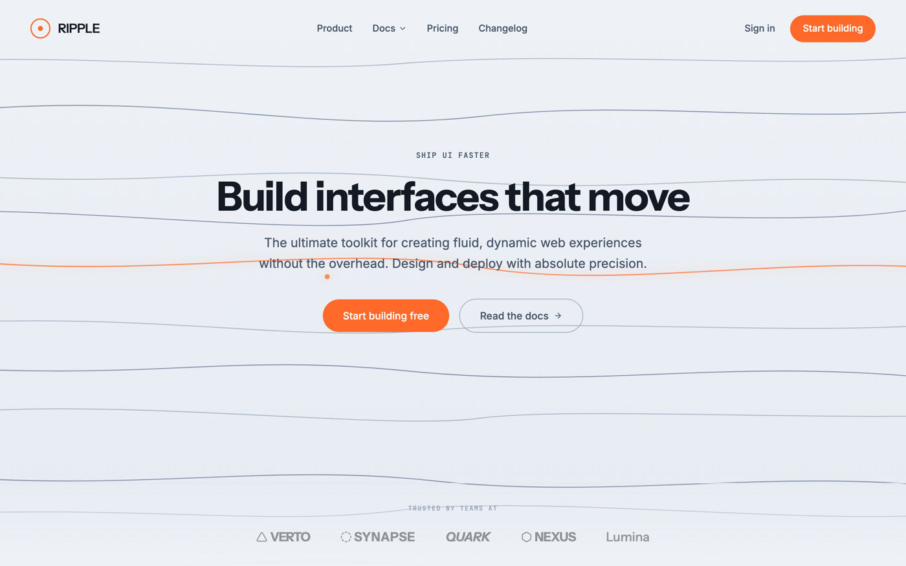

# Animated Wave-Line Landing Hero

An animated developer-tool / SaaS landing hero whose signature is an ambient animated background: a full-bleed field of flowing horizontal wave-lines that undulate in pure CSS and inline SVG (no JavaScript). Light cool ice-white ground, one electric-tangerine accent ridge with a locator dot, a clean Instrument Sans headline, dual CTAs, and a quiet trusted-by logo strip. Copy the animated background or the whole hero layout.



## Prompt

```text
{
  "summary": "An ANIMATED full-bleed landing-page HERO for a modern developer-tool / SaaS product, for a 1440-wide desktop viewport that must also reflow cleanly to 390px mobile. The star is an AMBIENT ANIMATED BACKGROUND: a full-bleed inline SVG stack of ~12 smooth horizontal wave-lines (crisp 1.4px strokes in quiet slate #94a3b8 / #5b6b8c) that slowly undulate via CSS @keyframes only, with NO JavaScript needed for the visible frame - a slow horizontal translateX drift with a per-line phase offset plus a gentle vertical breathing, long ease-in-out durations (18-30s) infinite, so the whole field reads like calm sound-wave contours. ONE 'active' ridge near the vertical center is drawn in electric tangerine #ff6a2b with a soft glow (drop-shadow), and a small solid tangerine locator DOT rides that ridge; freeze the animation at a natural mid-frame so a still shows it clearly. The palette is intentionally LIGHT and calm: a cool ice-white ground #eef2f7 (a faint gradient to #e6ebf2 is fine), near-black ink #141a24 for the headline, slate #475569 for body, and EXACTLY ONE saturated accent - tangerine #ff6a2b - used only on the active ridge, the locator dot, and the primary CTA. No indigo/violet/purple, no second bright hue. Over the field float three layers: (1) a TRANSPARENT top nav with no bar fill - a small tangerine-outlined circular emblem + a wordmark on the left, center menu links (one with a small down-chevron), and a text link + a solid tangerine pill CTA on the right; (2) a centered hero stack in the upper-third-to-middle - a JetBrains-Mono uppercase letter-spaced eyebrow, a one-line ~64px/700 Instrument Sans headline in near-black, a two-line ~20px Inter subtitle (max 640px), then TWO CTAs side by side (a solid tangerine pill + a ghost/outline button with a small arrow); (3) a quiet full-width bottom strip - a JetBrains-Mono caption + a muted single-color row of 5-6 placeholder wordmark logos. Hierarchy comes from SIZE and WEIGHT only. Fully responsive: at 390px the nav collapses to emblem + a compact menu button, the headline steps to ~40px, the two CTAs stack full-width, and the logo row wraps; no horizontal overflow at either width. A real full-viewport web hero, no device frame.",
  "style": {
    "description": "Modern, crisp, techy, a little kinetic - the opposite of a dark neon hero. The whole character comes from a calm animated LINE field plus one warm accent on a cool light ground. Everything is neutral except a single electric-tangerine accent, so the composition stays quiet and premium while the moving wave-lines give it life. The lines are crisp STROKES (a wave-LINE field), never blurred gradient blobs or an aurora glow. Type is a clean grotesk system: an Instrument Sans display headline for weight and character, Inter for body, and a JetBrains-Mono micro-label for the eyebrow and captions, so hierarchy is built from size and weight, never color. The register to hit is light, airy, confident, and subtly in motion.",
    "prompt": "Design a modern developer-tool / SaaS landing-page HERO whose entire canvas is a LIGHT cool ice-white ground (#eef2f7, optionally a faint gradient to #e6ebf2) filled by an AMBIENT ANIMATED BACKGROUND of flowing horizontal wave-lines. Build the field as a single full-bleed inline SVG (explicit viewBox 0 0 1440 900, preserveAspectRatio slice) of ~12 smooth cubic wave-line paths, 1.4px strokes in quiet slate (#94a3b8 and #5b6b8c), spaced down the whole height. Animate them with CSS @keyframes ONLY (no JavaScript): a slow horizontal translateX drift with a different phase offset per line plus a gentle vertical breathing, 18-30s ease-in-out infinite, so it undulates like calm sound-wave contours. Draw ONE 'active' ridge near the vertical center in electric tangerine #ff6a2b with a soft drop-shadow glow, and put a small solid tangerine locator DOT on that ridge; make sure a frozen mid-frame reads cleanly. Keep EXACTLY ONE saturated accent (tangerine) - the active ridge, the dot, and the primary CTA - and make every other element neutral (near-black #141a24 headline, slate #475569 body). NO indigo/violet/purple gradient, no second bright hue, no blurred aurora glow. Use Instrument Sans for the display headline, Inter for body, and JetBrains Mono for the small eyebrow/caption; build hierarchy from size and weight only. Keep it a real frameless full-viewport web hero (no phone frame, no device mockup) and fully responsive."
  },
  "layout_and_structure": {
    "description": "A single full-bleed hero viewport: the animated wave-line SVG is the whole background canvas (z-0), and everything else floats over it. Top: a floating TRANSPARENT nav (emblem + wordmark left, center menu links with one dropdown chevron, a 'Sign in' text link + a tangerine pill CTA right). Middle: a centered stack - a mono uppercase eyebrow, a one-line display headline, a two-line subtitle (max 640px), and two CTAs side by side (a solid tangerine pill + a ghost/outline button with an arrow). Bottom: a quiet full-width 'trusted by' strip with a mono caption over a muted single-color row of 5-6 placeholder wordmark logos. On a narrow viewport the nav collapses to emblem + a compact menu button, the headline steps down (~40px), the two CTAs stack full-width, and the logo row wraps.",
    "prompts": [
      {
        "part": "Animated wave-line background canvas",
        "prompt": "Fill the ENTIRE hero with a single full-bleed inline SVG background at z-0 (position absolute, width/height 100% of the hero, overflow hidden, pointer-events none). Give it viewBox='0 0 1440 900' and preserveAspectRatio='xMidYMid slice'. Draw ~12 smooth horizontal wave-lines as cubic <path> strokes (stroke-width 1.4, fill none, group opacity ~0.72) in quiet slate #94a3b8 and #5b6b8c, spaced evenly down the full height and extending past both edges (e.g. x from -100 to 1540) so no line-end shows. Animate each path with CSS @keyframes ONLY - a slow translateX drift (a few % each way) with a per-line phase offset and a small translateY breathing, 18-30s ease-in-out infinite, some reversed - so the field undulates gently. Add a .freeze class that sets animation-play-state: paused so a screenshot captures a clean mid-frame."
      },
      {
        "part": "Active tangerine ridge + locator dot",
        "prompt": "Among the wave-lines, make ONE ridge near the vertical center the 'active' one: draw it in electric tangerine #ff6a2b at stroke-width ~1.9 with a soft glow (filter: drop-shadow(0 0 8px rgba(255,106,43,0.6))). Put a small solid tangerine circle (r~4) as a locator DOT sitting on that ridge, and let it drift along the line via CSS keyframes. This ridge + dot is the ONLY saturated color in the background - everything else stays slate. Freeze it at a natural mid-path position so the still shows the dot clearly on the ridge, roughly under the headline."
      },
      {
        "part": "Floating transparent nav",
        "prompt": "Pin a FLOATING TRANSPARENT top nav over the canvas with NO bar fill (z above the background). Left: a small circular emblem with a 2px tangerine #ff6a2b border and a tiny tangerine dot inside, next to a wordmark in Instrument Sans semibold, near-black #141a24. Center (hidden on mobile): menu links in Inter 15px/500 slate (e.g. Product, Docs with a small chevron-down, Pricing, Changelog), hover to near-black. Right (hidden on mobile): a 'Sign in' text link and a solid tangerine #ff6a2b pill CTA (white 15px text, rounded-full, ~px-5 py-2.5). On mobile, collapse the center + right into a single hamburger menu button."
      },
      {
        "part": "Centered hero stack",
        "prompt": "Center a hero stack in the upper-third-to-middle (max ~800px wide). Top: a JetBrains-Mono eyebrow, uppercase, letter-spaced, 12px, slate #475569. Then a one-line H1 in Instrument Sans ~64px / 700 / line-height 1.05 / tight tracking, near-black #141a24 (steps to ~40px on mobile, may wrap to two lines). Then a two-line subtitle in Inter ~20px, slate #475569, max 640px. Then two CTAs side by side: a solid tangerine #ff6a2b pill 'Start building free' (white text, rounded-full, ~px-8 py-3.5) and a ghost/outline button 'Read the docs' with a 1px slate border, slate text, and a small right-arrow icon. On mobile the two CTAs stack full-width."
      },
      {
        "part": "Trusted-by logo strip",
        "prompt": "Pin a quiet full-width strip near the bottom with a hairline top border and a faint top gradient from the ground color. Center a JetBrains-Mono caption, uppercase, letter-spaced, ~10px, muted slate #94a3b8 (e.g. 'Trusted by teams at'), over a row of 5-6 placeholder wordmark logos in a single muted slate color (opacity ~0.6, grayscale) - each a bold Instrument Sans wordmark with a small line-icon (no real brand names). On mobile the row wraps to two lines."
      }
    ]
  },
  "special_ui_components": [
    {
      "component": "Animated wave-line background field",
      "description": "The signature: a full-bleed field of flowing horizontal wave-lines that undulate via CSS keyframes, with no JavaScript, so it is freeze-safe and drop-in.",
      "prompt": "Build a full-bleed animated background as one inline SVG (viewBox='0 0 1440 900', preserveAspectRatio slice, absolute, 100% x 100%, overflow hidden, pointer-events none, z-0). Draw ~12 smooth cubic <path> wave-lines (stroke-width 1.4, fill none, group opacity ~0.72) in slate #94a3b8 / #5b6b8c, spanning past both edges. Give each line its own CSS @keyframes drift (translateX a few % + a small translateY, 18-30s ease-in-out infinite, some reversed, phase-offset) so the field breathes. Add a .freeze class (animation-play-state: paused) for clean stills. Crisp strokes only - never blurred gradient blobs."
    },
    {
      "component": "Tangerine active ridge + locator dot",
      "description": "The single accent in the background: one wave-line highlighted in glowing tangerine with a small dot riding it, telegraphing that the field is in motion.",
      "prompt": "Pick one wave-line near the vertical center and render it in electric tangerine #ff6a2b at stroke-width ~1.9 with filter: drop-shadow(0 0 8px rgba(255,106,43,0.6)). Add a small solid tangerine circle (r~4) as a locator dot on that ridge and animate it drifting along the line with CSS keyframes. Freeze it mid-path for the still. Keep this the ONLY saturated color in the whole background."
    },
    {
      "component": "Single-accent tangerine pill CTA",
      "description": "The one saturated UI accent - a solid tangerine pill reused for the nav CTA and the hero primary CTA, paired with a neutral ghost button.",
      "prompt": "Create a solid PILL CTA in tangerine #ff6a2b with white text (Inter 15-16px/500), fully rounded, ~px-8 py-3.5, no border, subtle hover to a slightly darker #e55920. Reuse the exact same tangerine for the nav's smaller pill and for the active-ridge accent - never introduce a second bright hue. Pair the hero primary pill with a GHOST secondary button: transparent fill, 1px slate #94a3b8 border, slate text, a small right-arrow icon, hover border/text to near-black."
    },
    {
      "component": "Floating transparent nav with dropdown",
      "description": "A top nav with no background fill that floats directly over the animated canvas, its center menu carrying a small dropdown chevron.",
      "prompt": "Create a floating TRANSPARENT nav (no bar fill) over the animated canvas: a small circular emblem with a 2px tangerine border + inner dot next to an Instrument Sans wordmark on the left, center menu links in Inter 15px/500 slate with a small chevron-down on the one that expands, and a 'Sign in' text link + a tangerine pill CTA on the right. It must feel weightless over the field, not a solid bar. Collapse to emblem + a hamburger button on mobile."
    }
  ]
}
```
