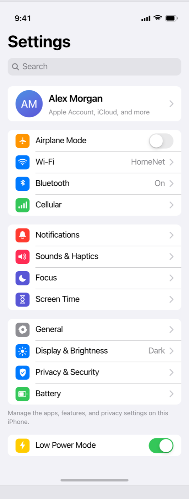

# Apple Design System UI: Native iOS Settings Screen

A native iOS 17 Settings screen built to the Apple design system (Human Interface Guidelines). It opens on a large 34px bold "Settings" title, a rounded system-gray search field, and an inset profile card (circular gradient avatar with initials, name, "Apple Account, iCloud, and more" subtitle, disclosure chevron). Below are three inset grouped lists on a #F2F2F7 background: connectivity (Airplane Mode with a pill toggle, Wi-Fi "HomeNet", Bluetooth "On", Cellular), system (Notifications, Sounds & Haptics, Focus, Screen Time), and general (General, Display & Brightness "Dark", Privacy & Security, Battery). Each category row carries a 29px rounded-square colored icon tile with a white SF-Symbol-style glyph, a 17px label, and either a native toggle, a gray value detail, or a thin disclosure chevron; separators are hairlines inset after the tile. Uses the exact iOS system colors (systemBlue #007AFF, green #34C759, red #FF3B30, orange #FF9500, indigo #5856D6, pink #FF2D55) and the SF Pro system font. Reusable for any iOS settings, account, or preferences screen.



## Prompt

```text
{
  "summary": "A native iOS 17 Settings screen that demonstrates the Apple design system (Human Interface Guidelines). Top to bottom: a status bar (9:41 + signal/wifi/battery), a left-aligned Large Title 'Settings' (34px, weight 700), a rounded system-gray search field with a magnifier glyph and 'Search' placeholder, then an inset profile card (a 56px circular avatar with a soft blue-to-indigo gradient and white initials, a 20px/600 name 'Alex Morgan', a 14px gray subtitle 'Apple Account, iCloud, and more', and a trailing disclosure chevron). Below are three inset grouped lists on a #F2F2F7 grouped background: (1) connectivity — Airplane Mode with a native pill toggle (off), Wi-Fi with a gray 'HomeNet' value + chevron, Bluetooth 'On', Cellular; (2) system — Notifications, Sounds & Haptics, Focus, Screen Time; (3) general — General, Display & Brightness ('Dark'), Privacy & Security, Battery. A small gray footer note sits under the general group, followed by a standalone Low Power Mode row with an on (green) pill toggle, and a home-indicator pill closes the screen. Each category row has a 29x29 rounded-7 colored icon tile with a white SF-Symbol-style glyph (airplane/orange, wifi/blue, bluetooth/blue, cellular/green, bell/red, speaker/pink, moon/indigo, hourglass/indigo, gear/gray, sun/blue, shield/blue, battery/green), a 17px label, and a trailing toggle, gray value detail, or thin chevron. It is clean light Apple system UI: flat, precise, generous whitespace, exact system color tokens.",
  "style": {
    "description": "Clean, flat, precise Apple system UI in the light appearance — this is the iOS design language, not a stylized theme. Uses the exact iOS system color tokens: systemBackground #FFFFFF for cells, grouped background #F2F2F7 for the page, label #000000, secondaryLabel #3C3C43 at 60%, hairline separator #C6C6C8, and the accent hues systemBlue #007AFF, systemGreen #34C759, systemRed #FF3B30, systemOrange #FF9500, systemIndigo #5856D6, systemPink #FF2D55 for the icon tiles. Typography is the SF Pro system stack (-apple-system, 'SF Pro Text', 'SF Pro Display', system-ui) on a HIG type ramp: Large Title 34/700, cell label 17/400, value/secondary 13-17 in gray, profile name 20/600. Structure comes from the inset grouped list: white rounded-10 groups on the gray page, 16px page margins, ~44px rows, hairline separators inset to start after the icon tile. Real native controls: 51x31 pill toggles (gray track off, green track on, white knob with a soft shadow) and thin #C7C7CC disclosure chevrons. Zero AI-slop tells: no purple/indigo page gradient, no centered-everything, no emoji, no lorem, no heavy drop shadows; the only gradient is the small avatar fill. Generous 8pt spacing grid.",
    "prompt": "Design a native iOS 17 mobile screen in a 390px-wide column using the Apple design system (Human Interface Guidelines) in the light appearance. Use the SF Pro system font stack (-apple-system, 'SF Pro Text', 'SF Pro Display', system-ui). Page background is the grouped background #F2F2F7; cells are white #FFFFFF inside rounded-10 inset groups with 16px page margins. Text: label #000000, secondaryLabel #3C3C43 at 60%. Type ramp: Large Title 34px/700 left-aligned, cell labels 17px/400, secondary 13-15px. Build the inset grouped list as the hero pattern: ~44px rows, hairline #C6C6C8 separators inset to START AFTER a leading 29x29 rounded-7 colored icon tile that holds a white SF-Symbol-style glyph. Use the exact iOS system accent colors for the tiles (systemBlue #007AFF, green #34C759, red #FF3B30, orange #FF9500, indigo #5856D6, pink #FF2D55). Add real native controls: 51x31 pill toggles (gray track off, green #34C759 track on, white knob with a subtle shadow) and thin #C7C7CC right-chevrons for disclosure rows; put gray value text before a chevron where relevant. Do NOT use a purple/indigo page gradient, emoji, lorem, or heavy shadows — keep it flat, precise, and generous. Draw every icon as inline SVG, no icon fonts."
  },
  "layout_and_structure": {
    "description": "A single vertical mobile scroll at 390px: (1) status bar, (2) Large Title 'Settings' + rounded search field, (3) inset profile card, (4) connectivity group (Airplane Mode toggle, Wi-Fi/Bluetooth/Cellular), (5) system group (Notifications, Sounds & Haptics, Focus, Screen Time), (6) general group (General, Display & Brightness, Privacy & Security, Battery) + a gray footer note, (7) a standalone Low Power Mode toggle row, (8) home-indicator pill. Everything is fully visible in one screenshot; nothing is behind a fixed element.",
    "prompts": [
      {
        "part": "Status bar + title + search",
        "prompt": "At the very top, a status bar: '9:41' left in black, and inline-SVG cellular + wifi + battery glyphs right. Below it, a left-aligned Large Title 'Settings' at 34px weight 700 with tight letter-spacing. Under the title, a full-width rounded (10px) systemGray5 #E3E3E8 search field ~36px tall with a leading gray magnifier glyph and a gray 'Search' placeholder."
      },
      {
        "part": "Profile card",
        "prompt": "The first inset group is a single tall (~72px) cell: a 56px circular avatar filled with a soft blue-to-indigo gradient and white 20px initials ('AM'), then a 20px/600 name ('Alex Morgan') over a 14px gray subtitle ('Apple Account, iCloud, and more'), and a trailing thin #C7C7CC disclosure chevron. White cell, rounded-10, 16px page margins."
      },
      {
        "part": "Connectivity group",
        "prompt": "An inset group of four rows, each with a 29x29 rounded-7 icon tile + white glyph: Airplane Mode (orange tile, airplane glyph) with a native pill toggle OFF (gray track); Wi-Fi (blue tile, wifi arcs) with a gray 'HomeNet' value + chevron; Bluetooth (blue tile, bluetooth glyph) with 'On' + chevron; Cellular (green tile, signal bars) with a chevron. Hairline separators inset to start after the icon tile."
      },
      {
        "part": "System group",
        "prompt": "An inset group of four rows: Notifications (red tile, bell), Sounds & Haptics (pink #FF2D55 tile, speaker waves), Focus (indigo tile, crescent moon), Screen Time (indigo tile, hourglass). Each = icon tile + 17px label + thin disclosure chevron, hairline separators inset after the tile."
      },
      {
        "part": "General group + footer",
        "prompt": "An inset group: General (gray tile, gear), Display & Brightness (blue tile, sun) with a gray 'Dark' value + chevron, Privacy & Security (blue tile, shield-check), Battery (green tile, battery glyph). Below the group, a 13px gray footer note ('Manage the apps, features, and privacy settings on this iPhone.')."
      },
      {
        "part": "Low Power Mode + home indicator",
        "prompt": "A standalone inset group with one row: Low Power Mode (yellow tile, lightning bolt) with a native pill toggle ON (green #34C759 track, white knob). Close the screen with a centered home-indicator pill (a ~140px wide, 5px tall rounded bar at ~25% black)."
      }
    ]
  },
  "special_ui_components": [
    {
      "component": "Inset grouped list",
      "description": "The hero pattern of the Apple design system on iOS.",
      "prompt": "Group related rows into white rounded-10 blocks on a #F2F2F7 page with 16px side margins. Rows are ~44px tall; separators are hairlines (#C6C6C8) that START AFTER the leading icon tile (inset), never full-bleed across the cell. Multiple groups stack with ~35px of gray gutter between them."
    },
    {
      "component": "Colored icon tile",
      "description": "The iconic iOS Settings category glyph tile.",
      "prompt": "A 29x29px rounded-7 square filled with a single iOS system color (blue #007AFF, green #34C759, red #FF3B30, orange #FF9500, indigo #5856D6, pink #FF2D55, or gray #8E8E93), centering a ~17px white SF-Symbol-style glyph drawn as inline SVG. One tile leads each category row."
    },
    {
      "component": "Native pill toggle",
      "description": "The iOS switch control.",
      "prompt": "A 51x31px pill switch with a 27px white knob (subtle shadow) inset 2px. Off = gray track #E9E9EA, knob left. On = green track #34C759, knob right. Vertically centered at the trailing edge of a row."
    },
    {
      "component": "Disclosure row (value + chevron)",
      "description": "A tappable row that drills into a subscreen.",
      "prompt": "A row ending in an optional gray (secondaryLabel) value string (e.g. 'HomeNet', 'On', 'Dark') followed by a thin #C7C7CC right-pointing chevron ~13px, 16px from the trailing edge, vertically centered."
    },
    {
      "component": "Profile card cell",
      "description": "The account header row unique to iOS Settings.",
      "prompt": "A taller (~72px) first cell: a 56px circular gradient avatar with white initials, a 20px/600 name over a 14px gray subtitle, and a trailing disclosure chevron. It reads as the account entry point above the settings groups."
    },
    {
      "component": "Large Title + search field",
      "description": "The iOS navigation header in its expanded state.",
      "prompt": "A left-aligned 34px/700 Large Title with tight tracking, sitting on the systemBackground below the status bar, over a full-width rounded systemGray5 search pill with a leading magnifier glyph and a gray placeholder."
    }
  ]
}
```

**▶ [Try it live →](https://superdesign.dev/library/apple-design-system-ui-native-ios-settings-screen?utm_source=github&utm_medium=prompt-repo&utm_campaign=prompt-library)**

**Use it in your coding agent:** install the [Superdesign skill](https://github.com/superdesigndev/superdesign-skill), then:

```bash
superdesign get-prompts --slugs "apple-design-system-ui-native-ios-settings-screen" --json
```

*0 copies · 0 tries · Mobile Apps · General · mobile-app-design, ios, apple, apple-design-system*
