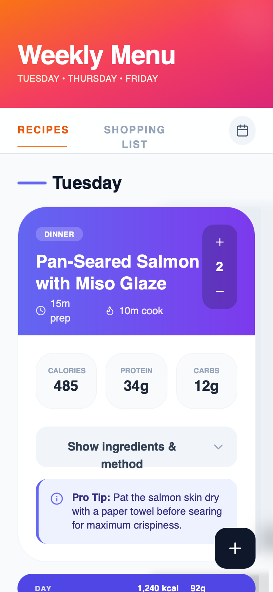

# Apple HIG Dark Theme Meal Planner

An authentic Apple Human Interface Guidelines (HIG) inspired dark theme featuring 'Liquid Glass' surfaces, SF Pro typography, and premium glassmorphism. It uses a deep #1d1d1f background with translucent overlays, backdrop filters (blur(40px)), and high-contrast Apple blue accents (#0071e3). This design system is ideal for high-end lifestyle apps, health/fitness dashboards, premium SaaS, and fintech platforms that require a sophisticated, native macOS/iOS feel.



## Prompt

```text
{
  "summary": "A premium Apple-native dark mode UI focused on high-density data visualization and elegant information hierarchy. It utilizes layered glassmorphism, semantic typography, and subtle micro-interactions to create a 'Liquid Glass' aesthetic that feels deeply integrated with modern operating systems.",
  "style": {
    "description": "The style is defined by its deep dark background (#1d1d1f) and sophisticated use of translucent layers. Typography uses SF Pro for high legibility with wide tracking (0.2em) for labels. Colors are strictly semantic: Primary Text (#f5f5f7), Secondary Text (#a1a1a6), and Apple Blue (#0071e3) for focus states. Surfaces use 'Liquid Glass' with backdrop-filter: blur(40px) saturate(180%) and thin 1px white borders at low opacity (10%). Animations are smooth, using a standard cubic-bezier(0.4, 0, 0.2, 1) for transitions.",
    "prompt": "Create a design following Apple's Human Interface Guidelines in Dark Mode. \n\n### Colors\n- Background: #1d1d1f\n- Primary Accent (Blue): #0071e3\n- Text Primary: #f5f5f7\n- Text Secondary: #a1a1a6\n- Text Tertiary: #86868b\n- Borders: rgba(255, 255, 255, 0.08)\n\n### Surfaces (Liquid Glass)\n- Standard Card: rgba(255, 255, 255, 0.07) background, backdrop-filter: blur(40px) saturate(180%), 1px solid rgba(255, 255, 255, 0.1)\n- Elevated Surface: rgba(255, 255, 255, 0.09) background, 1px solid rgba(255, 255, 255, 0.12)\n- Inner Wells: rgba(255, 255, 255, 0.04) background, 1px solid rgba(255, 255, 255, 0.06)\n\n### Typography\n- Headings: SF Pro Display, font-weight: 600, tracking: tight\n- Body: SF Pro Text, font-weight: 400\n- Labels/Captions: Font-size: 10px, uppercase, tracking: 0.2em, font-weight: 600\n\n### Shadows & Depth\n- Card Shadows: 0 4px 24px rgba(0,0,0,0.3)\n- Ambient Glow: Radial gradient at top of page: rgba(0, 113, 227, 0.04) reaching 400px diameter"
  },
  "layout_and_structure": {
    "description": "A vertical-scrolling layout with a fixed header and sticky tab navigation. Content is organized into semantic sections (e.g., days of the week) with nested cards providing high-density information.",
    "prompts": [
      {
        "part": "Header",
        "prompt": "Create a clean header section with a large Title (36px-48px) in SF Pro Display. Below it, include a tertiary text label in all-caps with wide tracking (0.2em). Padding should be generous: pt-16, pb-10."
      },
      {
        "part": "Sticky Tab Navigation",
        "prompt": "Implement a pill-shaped navigation bar using a glass surface (rgba(45, 45, 49, 0.85)) with 30px blur. The bar should contain equal-width buttons. Active states should use a subtle white/10 background overlay. Include an icon button on the right in a glass square."
      },
      {
        "part": "Data Cards",
        "prompt": "Design high-fidelity cards with a border-bottom separator at the header. The header should include a category tag (subtle blue background, blue text), a large title (26px), and a metadata row with icons. Below the header, include a grid of 'Inner Wells' for numeric data (e.g., nutrition, prices), each with a tiny uppercase label and large value."
      },
      {
        "part": "Expandable Details",
        "prompt": "Inside the cards, include a 'Details' toggle button using the 'glass-button' style. On click, expand a section using a cubic-bezier(0.4, 0, 0.2, 1) transition with a max-height animation. Contents should be organized into lists with dot or number indicators in Apple Blue."
      }
    ]
  },
  "special_ui_components": [
    {
      "component": "Vertical Stepper",
      "description": "A compact control for adjusting quantities or values.",
      "prompt": "Create a vertical stepper using an 'inner well' container. Place a '+' glass button at the top, a centered numeric value in the middle (size 16px, bold), and a '-' glass button at the bottom. The entire component should be compact (approx 40px wide)."
    },
    {
      "component": "Glass Pill Summary",
      "description": "A full-width decorative summary bar used to separate sections.",
      "prompt": "A rounded-full pill (height 48px) with rgba(255, 255, 255, 0.06) background. It should justify content between: an uppercase label on the left and a group of metrics on the right. High contrast between primary and tertiary text is essential."
    },
    {
      "component": "Floating Action Button (FAB)",
      "description": "Primary action trigger that follows the user.",
      "prompt": "A 52x52px circle button with a solid Apple Blue (#0071e3) background. Include a strong shadow: 0 4px 16px rgba(0, 113, 227, 0.4). Icon should be white, 20px. Add an active state scale(0.95) effect."
    }
  ]
}
```

**▶ Try it live → [https://superdesign.dev/library/apple-hig-dark-theme-meal-planner](https://superdesign.dev/library/apple-hig-dark-theme-meal-planner)**

*38 copies · 2,496 tries · tags: *
