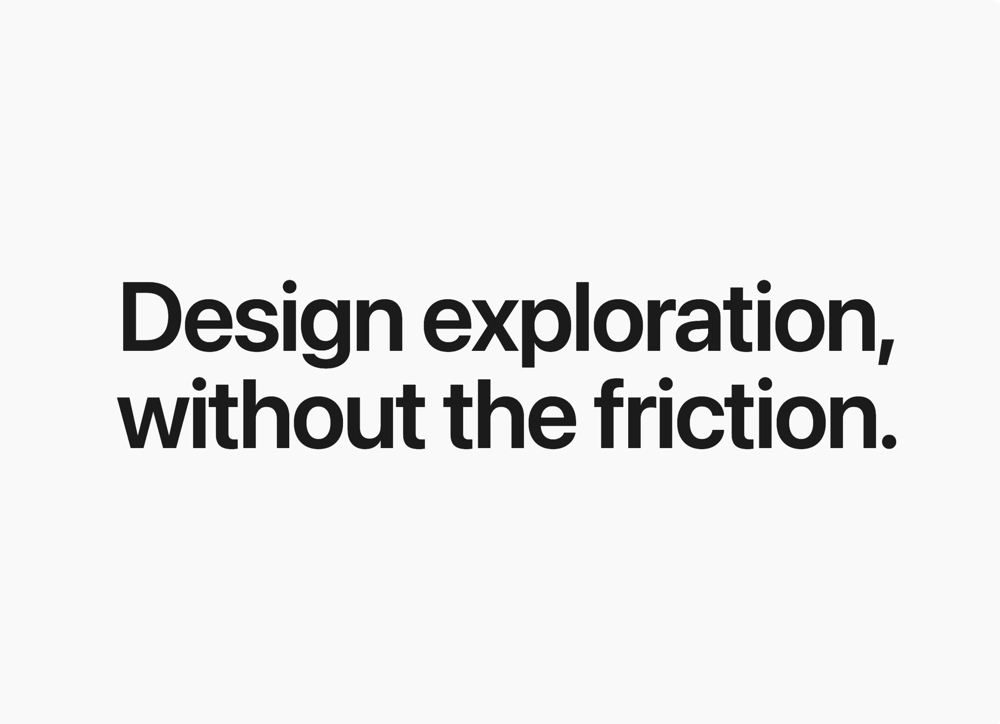

# Apple-inspired Waitlist

A refined, premium waitlist page design system inspired by Apple's minimalist aesthetic. It features a sophisticated muted blue-gray accent (#4F6BA6) on a light grey background (#FAFAFA). Key elements include editorial typography with tight line heights, slow-motion scroll animations (1.5s), layered soft shadows, and subtle gradient dividers. Ideal for high-end SaaS, design tools, fintech, and professional services looking for a 'quiet luxury' digital presence.



## Prompt

```text
{
  "summary": "A high-end, minimalist waitlist and landing page design system characterized by sophisticated muted colors, slow-motion reveal animations, and meticulous attention to spacing and typographic hierarchy.",
  "style": {
    "description": "The style is 'Quiet Premium'. It uses an Apple-system font stack (SF Pro Display) for a native feel. Colors are anchored in #FAFAFA (background) and #1D1D1F (text), with #4F6BA6 as a muted blue-gray accent. Animation is central: a 1.5s cubic-bezier reveal creates a sense of weight and inevitability. Visual depth is achieved through layered box-shadows rather than borders.",
    "prompt": "Apply a 'Quiet Premium' aesthetic. **Color Palette**: Background: #FAFAFA; Primary Text: #1D1D1F; Secondary Text: #86868B; Accent: #4F6BA6; Muted Accent: #E1E8F5; Dividers: #D2D2D7 at 40% opacity. **Typography**: Use -apple-system stack. Hero headers: font-size 80-128px, font-weight 600, tracking-tight, line-height 1.1. Body context: font-size 24-30px, font-weight 500, line-height 1.6. **Animations**: All section entries must use `transition: all 1.5s cubic-bezier(0.16, 1, 0.3, 1)` with a 30px Y-axis translate and 0.98 scale-up. **Shadows**: Use layered shadows for UI cards: `0 2px 8px rgba(0,0,0,0.04), 0 24px 48px -8px rgba(0,0,0,0.06), 0 48px 80px -12px rgba(0,0,0,0.04)`. **Borders**: Use 1px width with gradient effects for interactive elements."
  },
  "layout_and_structure": {
    "description": "A vertical, centered flow that guides the user through an emotional narrative before the final call to action. It uses full-screen heights for the hero and generous whitespace between sections.",
    "prompts": [
      {
        "part": "Hero Section",
        "prompt": "Create a `min-h-[100vh]` section. Center-align a massive typographic statement. Use font-size 96px (responsive to 48px on mobile). Ensure the leading is exactly 1.1. No other elements should be in this section to maintain impact."
      },
      {
        "part": "Section Dividers",
        "prompt": "Separate major sections with a horizontal line. The line must be a 1px height div with a background gradient: `linear-gradient(to right, transparent, rgba(210, 210, 215, 0.4), transparent)`. Limit width to max-w-2xl."
      },
      {
        "part": "Context & Features",
        "prompt": "Use a max-w-2xl container. Text should be medium-large (text-2xl to 3xl) in #86868B (secondary gray). For feature callouts, use bold #1D1D1F headers (text-5xl) with massive vertical spacing (gap-48) to create a rhythmic scrolling experience."
      },
      {
        "part": "Visual Preview Card",
        "prompt": "A 16:10 aspect ratio card with 24px rounded corners. Background #FFFFFF. Apply the layered shadow spec. Include a header bar with three dots (circles) representing window controls. Fill the interior with abstract skeletal UI elements using #F5F5F7 background blocks."
      },
      {
        "part": "Workflow/Process",
        "prompt": "A horizontal sequence of text labels and icons. Use Lucide icons (arrow-right). Labels in #1D1D1F font-medium. On mobile, stack vertically and switch icons to arrow-down."
      },
      {
        "part": "Waitlist Form",
        "prompt": "Center-aligned form with a max-width of 448px. Input and button should both be `rounded-full` and `h-16`. The input should have a 1px border gradient wrapper that turns blue-gray (#4F6BA6) on focus."
      }
    ]
  },
  "special_ui_components": [
    {
      "component": "Gradient-Border Input",
      "description": "An input field that appears to have a glowing gradient border on interaction.",
      "prompt": "Wrap the input in a div with 1px padding. Apply `bg-gradient-to-br from-[#E5E5EA] to-[#E5E5EA]`. On `:hover` or `:focus-within`, change gradient to `from-[#4F6BA6] to-[#7C95C8]`. The internal input must be `rounded-full` and white. Add a 300ms transition."
    },
    {
      "component": "Shimmer Action Button",
      "description": "A CTA button with a sophisticated moving gradient.",
      "prompt": "Apply `background: linear-gradient(135deg, #4F6BA6 0%, #5D7BB8 100%)`. Set `background-size: 200% 100%`. On hover, shift `background-position: 100% 0` and apply a soft blue shadow: `0 10px 30px -10px rgba(79, 107, 166, 0.4)`. Use a 0.6s ease transition."
    }
  ],
  "special_notes": "MUST: Maintain the 1.5s animation duration for all reveals; faster durations will break the premium feel. MUST: Use only the specified blue-gray #4F6BA6; do not use standard bright 'Apple Blue' (#0071E3). DO NOT: Use sharp borders; use gradient opacities for dividers. DO NOT: Over-saturate the success state; keep it quiet with a check icon and soft fade."
}
```

**▶ Try it live → [https://superdesign.dev/library/apple-inspired-waitlist](https://superdesign.dev/library/apple-inspired-waitlist?utm_source=github&utm_medium=prompt-repo&utm_campaign=prompt-library)**

**Use it in your coding agent:** install the [Superdesign skill](https://github.com/superdesigndev/superdesign-skill), then:

```bash
superdesign get-prompts --slugs "apple-inspired-waitlist" --json
```

*16 copies · 2,407 tries · Waitlist & Coming Soon · General · waitlist, beta access, product launch, sass*
