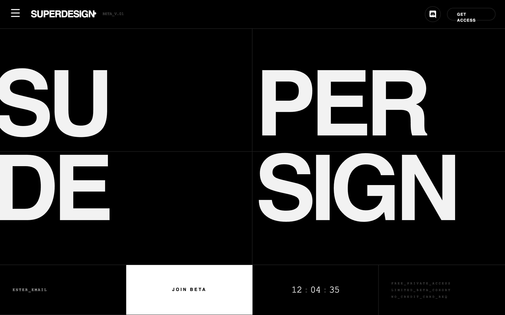

# Architectural Type System Style

A high-contrast, architectural design system rooted in Swiss Modernism and Brutalist minimalism. Characterized by a monochrome palette, massive 'Inter Tight' display typography, and a rigid grid defined by 0.5px hairlines. Features a technical 'JetBrains Mono' font for metadata and system status indicators, creating an engineering-first aesthetic. Suitable for high-end SaaS, developer tools, fintech, architecture portfolios, and design agencies. Includes a persistent noise overlay for texture and grid-based layouts that utilize viewport-relative sizing for maximalist impact.



## Prompt

```text
{
  "summary": "Architectural Type System is a minimalist, monochrome aesthetic focusing on rigid grid structures, hairline borders, and extreme typographic hierarchy. It blends the precision of an IDE with the boldness of editorial design.",
  "style": {
    "description": "The style is built on a foundation of pure black (#000000) and white (#FFFFFF) with a single functional accent (Indigo #6366f1). Typography is the primary visual element, using 'Inter Tight' for massive, tightly-spaced headlines and 'JetBrains Mono' for technical data. Layouts are strictly divided by 0.5px hairlines. A subtle noise grain (5% opacity) is layered over the entire interface to provide an organic, tactile feel to the digital canvas.",
    "prompt": "Apply an architectural, Swiss-brutalist style. Palette: Background #000000, Foreground #FFFFFF, Accents #6366f1. Typography: Headlines use 'Inter Tight' (Weight 900, Tracking -0.06em, Uppercase). Metadata and labels use 'JetBrains Mono' (Weight 500, Tracking 0.2em to 0.4em, Size 8px-11px). Body text uses 'Inter' (Weights 300-400). UI Borders: Use 'hairlines' (0.5px width, color rgba(255, 255, 255, 0.15)). Effects: Apply a global noise texture overlay using a fractal noise SVG at 0.05 opacity. Interactions: Hover states should transition over 300ms, typically swapping black/white or shifting to #6366f1. Components should have 0px border-radius unless they are 'pill' buttons."
  },
  "layout_and_structure": {
    "description": "The layout follows a 'Grid Matrix' philosophy where the screen is divided into quadrants and zones using hairline borders. Sections are often 100vh on desktop to create a focused 'fold' experience. Content is pinned to corners or centered within grid cells.",
    "prompts": [
      {
        "part": "Navigation",
        "prompt": "Full-width bar, height ~72px. Background #000000 at 80% opacity with backdrop-blur. 0.5px bottom border. Left side: Brand name in 'Inter Tight' 900, uppercase, followed by a 6px white dot and 'JetBrains Mono' versioning tag (e.g., BETA_V.01). Right side: Social icons in 40px circular hairline containers and a pill-shaped 'GET ACCESS' button with 10px bold mono text."
      },
      {
        "part": "Hero Section (The Grid)",
        "prompt": "A 2x2 grid filling the remaining viewport height. Each cell is separated by a 0.5px white hairline. Each cell contains one segment of a large word (e.g., 'SU', 'PER', 'DE', 'SIGN') set in 'Inter Tight' 900. Font-size: clamp(5rem, 18vw, 24vw). Align segments to the bottom-left or top-left corners of their respective cells, allowing for slight overflow/clipping to create an architectural look."
      },
      {
        "part": "Command Bar",
        "prompt": "A horizontal 4-column strip (collapses to 1 or 2 columns on mobile). Cell 1: Email input with 'JetBrains Mono' placeholder text, no borders. Cell 2: Full-width 'JOIN' button in #FFFFFF with #000000 text, tracking 0.3em. Cell 3: Real-time countdown timer using 'JetBrains Mono' font-size 24px. Cell 4: Vertical stack of three system labels (e.g., 'FREE_ACCESS') in 8px mono text with 0.4em tracking."
      },
      {
        "part": "Bento Feature Grid",
        "prompt": "A 3-column grid of equal-height cards (e.g., 400px). Each card separated by 0.5px hairlines. Top-left of each card: Mono-spaced tag (e.g., SYSTEM_01). Center: Large icon or geometric shape with low opacity (20%). Bottom-left: Title in 'Inter Tight' 900 (24px) and subtext in 'Inter' 400 (14px, 40% opacity). Hover state: Increase icon opacity to 100% and subtle background shift to #FFFFFF05."
      }
    ]
  },
  "special_ui_components": [
    {
      "component": "Status Countdown",
      "description": "A technical timer indicating urgency or system status.",
      "prompt": "Use 'JetBrains Mono' font. Format as HH : MM : SS. Separators (:) should be at 20% opacity. Characters should have fixed-width to prevent jittering. Color: #FFFFFF. Size: 24px."
    },
    {
      "component": "The Hairline Border",
      "description": "A specific border style used to define all containers.",
      "prompt": "Border-width: 0.5px. Border-color: rgba(255, 255, 255, 0.15). Apply to sides individually (hairline-b, hairline-r) to build complex grids without doubling line thickness."
    },
    {
      "component": "Interactive Geometric Card",
      "description": "A card containing a rotating geometric element.",
      "prompt": "Square container with 0.5px hairline. Inside, a 45-degree rotated square (hairline) that rotates to 90-degrees on parent hover. Transition: transform 700ms cubic-bezier(0.4, 0, 0.2, 1)."
    }
  ],
  "special_notes": "MUST: Maintain strict monochrome balance; only use the accent color for one primary action or specific data points. MUST: Use underscores instead of spaces in mono-spaced metadata labels (e.g., NO_CREDIT_CARD). MUST: Align text to the very edges of grid cells for the 'architectural' feel. DO NOT: Use rounded corners on grid cells or input fields. DO NOT: Use shadows or gradients; depth is achieved solely through line-work and contrast."
}
```

**▶ Try it live → [https://superdesign.dev/library/architectural-type-system-style](https://superdesign.dev/library/architectural-type-system-style?utm_source=github&utm_medium=prompt-repo&utm_campaign=prompt-library)**

**Use it in your coding agent:** install the [Superdesign skill](https://github.com/superdesigndev/superdesign-skill), then:

```bash
superdesign get-prompts --slugs "architectural-type-system-style" --json
```

*354 copies · 2,189 tries · landing page, product launch, waitlist, high conversion page, style*
