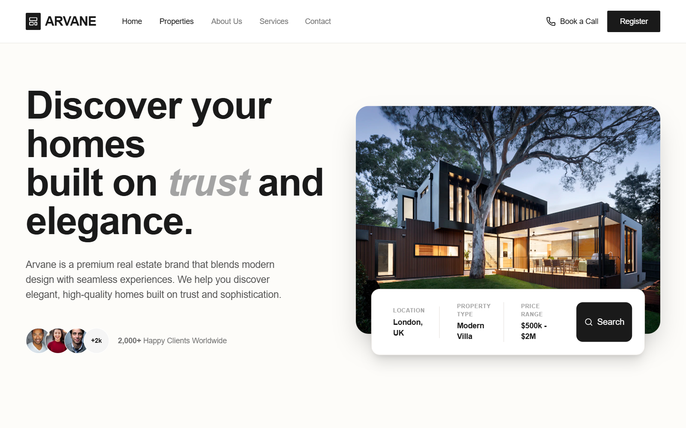

# Arvane Luxury Real Estate Portfolio

A luxury real estate landing page design featuring a sophisticated, minimalist aesthetic with an earth-toned palette of charcoal, cream, and gold. This style utilizes editorial typography (Cabinet Grotesk and Satoshi) and high-impact layouts like bento-style grids and floating search bars. Ideal for high-end residential agencies, interior design portfolios, or architectural firms. Key features include scroll-triggered hover effects, glassmorphism elements in the navigation, and a focus on lead generation through prominent CTA forms and property search tools.



## Prompt

```text
{
  "summary": "Create a high-end luxury real estate portfolio landing page with a minimalist, editorial design. Use a neutral earth-tone palette (#FDFCF9, #1A1A1A, #8B7D6B) combined with gold accents (#D4AF37). Incorporate bold sans-serif typography, generous whitespace, and a sophisticated lead-capture form.",
  "style": {
    "description": "The style is defined by a clean, upscale 'Modern Luxury' aesthetic. It pairs the heavy weights of 'Cabinet Grotesk' for headlines with the clean, geometric readability of 'Satoshi' for body text. The color scheme is predominantly cream and charcoal, creating a high-contrast yet warm atmosphere. Micro-interactions focus on smooth transitions, such as image scaling and sliding underlines.",
    "prompt": "Design a luxury aesthetic using a palette of Cream (#FDFCF9) for backgrounds, Charcoal (#1A1A1A) for primary text and dark sections, Warm Taupe (#8B7D6B) for borders and accents, and Gold (#D4AF37) for highlights. Typography: Headlines in 'Cabinet Grotesk' (Bold, 700-800 weight), body text in 'Satoshi' (Regular 400, Medium 500). Use consistent border radii of 24px for cards and 12px for buttons. Include backdrop-blur (10px) on sticky navigation. Implement hover states: buttons should transition opacity 90% or scale 102%; image cards should use scale(1.05) on hover with a 500ms ease-in-out curve. Borders should be subtle (1px, 20% opacity of Taupe)."
  },
  "layout_and_structure": {
    "description": "A vertical-scrolling landing page structure beginning with a 2-column hero and moving into structured content grids (stats, properties, process) before concluding with a dark-themed lead capture section.",
    "prompts": [
      {
        "part": "Navigation Bar",
        "prompt": "Sticky header (h-20) with #FFFFFF/95 background and backdrop-blur. Left: Uppercase logo with a small charcoal square icon. Center: Nav links with a 1px charcoal underline that expands from center on hover. Right: 'Book a Call' text link with phone icon and a primary 'Register' button (bg-charcoal, text-white, px-6, py-2.5, rounded-sm)."
      },
      {
        "part": "Hero Section",
        "prompt": "2-column layout. Left: H1 (text-7xl) with a mix of bold and italic neutral-400 text; body paragraph (text-lg, text-neutral-600); social proof stack with three avatar images and a '+2k' badge. Right: Large aspect-[4/3] image with 3xl rounded corners and a shadow-2xl. Floating Search Bar: Overlapping the bottom of the image, 90% width, white background, 4-column grid (Location, Type, Price, Search Button) separated by thin taupe borders."
      },
      {
        "part": "About & Statistics",
        "prompt": "Section with a 2-column header (Title left, Stats right). Stats: Three items showing bold 4xl numbers and uppercase tracking-widest subtext. Below: 3-column card grid. Each card: p-8, border-taupe, icon in a neutral-100 rounded-xl square that turns charcoal on group-hover."
      },
      {
        "part": "Featured Properties",
        "prompt": "3x2 grid of property cards. Each card: aspect-[4/3] image with a wishlist heart icon (top-right, blur-background) and a 'New Listing' badge (bottom-left). Below image: Title (text-xl), Location (icon + text), and bold Price. Bottom: Icon row for Bed/Bath/Sqft separated by a thin top border."
      },
      {
        "part": "How It Works",
        "prompt": "4-column grid. Each step: bg-neutral-50, p-10, 2xl rounded. Top-right: Large overlay text (01, 02, etc.) in 10% opacity charcoal. Center-left: Gold icon (#D4AF37). Content: Bold H4 and description text."
      },
      {
        "part": "CTA Lead Capture",
        "prompt": "Dark section (bg-charcoal, text-white) with a subtle radial dot grid background (10% opacity). Left: H2 (text-6xl) and subtext. Right: White card (p-10, 3xl rounded) containing a contact form. Inputs: border-b only (no boxes), uppercase tracking-wider labels, charcoal text focus. Button: Full-width charcoal, py-4, with a flight/send icon that translates on hover."
      }
    ]
  },
  "special_ui_components": [
    {
      "component": "Floating Search Bar",
      "description": "An interactive filter bar that overlaps hero images.",
      "prompt": "Container: bg-white, p-6, rounded-2xl, shadow-xl, border border-taupe. Structure: 4 segments. Segments 1-3: Label (uppercase, 10px, tracking-widest, neutral-400) above a bold value. Segment 4: Primary search button (bg-charcoal, text-white, h-full, rounded-xl, flex center gap-2)."
    },
    {
      "component": "Property Specs Bar",
      "description": "Small icons with metadata at the bottom of property cards.",
      "prompt": "Flex row, gap-6, border-t border-taupe, pt-4. Elements: Iconify icons (bed, bath, maximize) followed by 'X Beds', 'Y Baths', 'Z sqft' in text-sm neutral-500."
    }
  ],
  "special_notes": "MUST use 'Cabinet Grotesk' for all headings to maintain the luxury feel. MUST maintain a minimum of 96px (24 units) of vertical padding between major sections. MUST NOT use bright colors outside the defined gold accent. DO ensure all image containers have a consistent overflow-hidden property to facilitate the zoom animation."
}
```

**▶ Try it live → [https://superdesign.dev/library/arvane-luxury-real-estate-portfolio](https://superdesign.dev/library/arvane-luxury-real-estate-portfolio)**

*80 copies · 2,391 tries · tags: *
