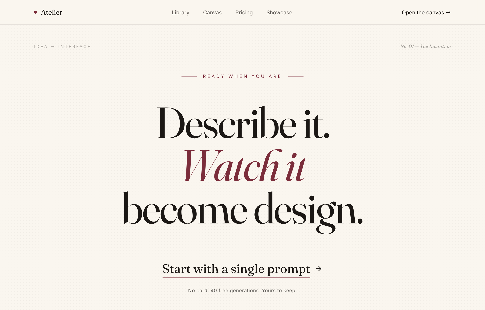

# Atelier — Design, Spoken Into Being (editorial serif / burgundy)

An editorial, print-magazine CTA: an oversized Fraunces serif statement with a single burgundy italic line on warm cream paper, closed by an understated text-link call to action and a no-card trust line, framed by a sticky nav and a newsletter footer.



## Prompt

```text
{"summary": "A quiet, editorial CTA section that fills a near-full-viewport canvas: an oversized three-line serif statement ('Describe it. / Watch it / become design.') with the middle line set in burgundy italic, introduced by a centered hairline eyebrow and closed by a single understated text-link call to action ('Start with a single prompt') plus a no-risk trust line. It is framed top and bottom as a real page: a sticky translucent nav with a burgundy dot logo, a faint uppercase editorial index line, and a footer carrying a newsletter capture field and social links. The whole thing sits on a warm cream paper background with a barely-there printed-grain texture.", "style": {"description": "Print-editorial / luxury-magazine aesthetic translated to the web: warm cream paper canvas, near-black ink, and ONE muted burgundy accent. The voice is the typography itself \u2014 an oversized optical serif (Fraunces) for the statement and links set against quiet Inter sans for nav, labels and body. No buttons, cards, gradients or shadows; the only ornament is hairline rules, animated text underlines, and a faint radial dot-grain. Tight negative leading and negative tracking on the display serif give it a confident masthead feel; uppercase, wide-tracked micro-labels do the editorial signposting.", "prompt": "Build a warm print-editorial look. Background is cream paper #faf6ef; text ink is near-black #1c1815; the single accent is a muted burgundy #7b2d3b \u2014 use it ONLY for the logo dot, the italic middle statement line, the eyebrow label, hairline accents, link hovers and the footer Subscribe action. Two typefaces: Fraunces (an optical serif, weights 300-600, with the italic used for emphasis) for the statement headline and the CTA link; Inter (300/400/500) for nav, micro-labels, body and the footer. Set the display statement with very tight leading (line-height ~0.98) and negative letter-spacing (-0.02em) at a fluid clamp(2.7rem, 9vw, 7.5rem). Micro-labels are uppercase, ~12px, very wide tracking (0.28-0.34em) in burgundy or ink at low opacity (ink/35-40). NO buttons, NO cards, NO box shadows, NO gradients beyond a single hairline; ornament is limited to: thin 1px rules (border-ink/10, burgundy/40 hairline accents), animated underlines, and a faint radial dot 'grain' overlay (radial-gradient #1c1815 0.5px dots on a 4px tile at ~3.5% opacity). Antialiased text. Everything centered and airy with generous vertical breathing room (section min-height ~86vh, py-24->32)."}, "layout_and_structure": {"description": "A single near-full-viewport CTA section centered vertically, framed by a sticky nav above and a footer below, all inside a centered max-w-[1180px] column with px-6->10 gutters. Top to bottom: sticky nav; an absolutely-positioned faint editorial index line; a centered eyebrow with flanking hairlines; the oversized three-line serif statement; an understated text-link CTA with a trust line; then a footer with a newsletter capture form and link/colophon rows. Everything reflows to a single clean column on mobile (nav links and the index line hide, hairlines drop).", "prompts": [{"part": "Sticky nav", "prompt": "A sticky top header (sticky top-0 z-50) on a translucent cream backdrop (bg-cream/85, backdrop-blur-md) with a bottom hairline (border-ink/10). Inside the max-w-[1180px] column, h-16, items justified between: LEFT = a small 8px burgundy dot + a Fraunces 'Atelier' wordmark (~19px, tight tracking); CENTER (hidden on mobile, md:flex) = four Inter links 'Library / Canvas / Pricing / Showcase' at ~14px ink/70 with an animated burgundy underline that grows on hover; RIGHT = a quiet text link 'Open the canvas ->' (~14px) that turns burgundy on hover."}, {"part": "Editorial index line", "prompt": "An absolutely-positioned, lg-only row pinned near the top of the CTA section inside the same max-w column, justified between, in uppercase ~11px ink/35 with very wide tracking (0.28em): left reads 'Idea -> Interface'; right reads a Fraunces italic, normal-case 'No. 01 \u2014 The Invitation' in ink/40. Pointer-events none; it is pure editorial signposting."}, {"part": "Eyebrow", "prompt": "A centered eyebrow row, mb-10->14: a short 40px burgundy/40 hairline, the label 'Ready when you are' in uppercase ~12px burgundy with 0.34em tracking, and a matching hairline on the right (the hairlines hidden on mobile)."}, {"part": "Oversized serif statement", "prompt": "The hero of the section: a centered Fraunces, normal-weight h1 of three block lines at clamp(2.7rem,9vw,7.5rem), tight leading (~0.98) and negative tracking. Line 1 'Describe it.' in ink; line 2 'Watch it' in burgundy #7b2d3b ITALIC; line 3 'become design.' in ink. The single italic burgundy line is the only color in the headline and carries the whole accent."}, {"part": "Understated text-link CTA + trust line", "prompt": "mt-14->20, centered column. The CTA is NOT a button: a Fraunces text link 'Start with a single prompt' at clamp(1.45rem,2.6vw,2.05rem) with a trailing small arrow-right icon; it carries a full-width burgundy underline that RETRACTS to 0 on hover (inverse underline) while the text shifts to burgundy and the arrow nudges right. Beneath it, a small Inter trust line ~13px ink/65: 'No card. 40 free generations. Yours to keep.'"}, {"part": "Footer", "prompt": "A footer band with a top hairline (border-ink/10), inside the max-w column, py-14. A flex row that stacks on mobile and goes row on md, items-end / justify-between: LEFT = a newsletter capture (label 'Get a new prompt recipe every week.' then an underline-only inline form: leading mail icon + transparent email input placeholder 'you@studio.com' + a burgundy 'Subscribe' text action; the bottom border turns burgundy on focus-within). RIGHT = three Inter links 'X (Twitter) / GitHub / Showcase' with the same animated underline. Below, a colophon row with a top hairline, py-6, ~12px ink/60: left '(c) 2026 Atelier. Designed in the open.'; right a Fraunces italic 'An AI design agent on an infinite canvas.'"}]}, "special_ui_components": [{"name": "Inverse hover underline on the CTA", "prompt": "The headline-scale text link starts WITH a full-width 1px burgundy underline (background-size 100% 1px) and on hover the underline shrinks to 0% width (background-size 0% 1px) using a slow ease (cubic-bezier(.16,1,.3,1), ~0.4s) while the text color crossfades to burgundy and the arrow icon translates ~6px right. It reads as a piece of letterpress, not a button."}, {"name": "Grow-in link underline (nav + footer)", "prompt": "Nav and footer links use the opposite motion: a burgundy 1px underline anchored bottom-left at 0% width that grows to 100% on hover (same 0.4s editorial ease), with the text darkening from ink/70 to ink."}, {"name": "Underline-only newsletter field", "prompt": "A borderless inline email form whose only chrome is a single bottom hairline (border-ink/25); it has a leading muted mail icon, a transparent flex-1 email input with an ink/60 placeholder and no focus outline, and a trailing burgundy 'Subscribe' text button. On focus-within the bottom hairline turns burgundy."}, {"name": "Paper-grain overlay", "prompt": "A non-interactive absolute overlay across the CTA section: a radial-gradient of 0.5px near-black dots on a 4px tile, held at ~3.5% opacity, to give the cream canvas a faint printed-paper grain without reading as a visible pattern."}], "special_notes": "Icons are Iconify Lucide (lucide:arrow-right, lucide:mail). Fonts via Google Fonts: Fraunces (optical serif, italic enabled) + Inter. The entire design rides on restraint: ONE muted burgundy accent (#7b2d3b) on cream (#faf6ef) and ink (#1c1815), with NO buttons, cards, shadows or gradients \u2014 the oversized Fraunces statement and the single burgundy italic line do all the work. The CTA is deliberately a text link, not a button, with an inverse-retracting underline; keep that 'editorial, not e-commerce' feel when transferring the style. Frame the CTA inside a real page (sticky nav + faint editorial index line + footer) so it reads as a magazine masthead spread, not a floating widget. All body copy uses no em-dashes; the only em-dash-like marks are in the editorial 'No. 01 \u2014 The Invitation' index label."}
```

**▶ Try it live → [https://superdesign.dev/library/atelier-design-spoken-into-being-editorial-serif-burgundy](https://superdesign.dev/library/atelier-design-spoken-into-being-editorial-serif-burgundy?utm_source=github&utm_medium=prompt-repo&utm_campaign=prompt-library)**

**Use it in your coding agent:** install the [Superdesign skill](https://github.com/superdesigndev/superdesign-skill), then:

```bash
superdesign get-prompts --slugs "atelier-design-spoken-into-being-editorial-serif-burgundy" --json
```

*1 copies · 2,239 tries · Forms & Contact · General · cta, editorial, serif, fraunces*
