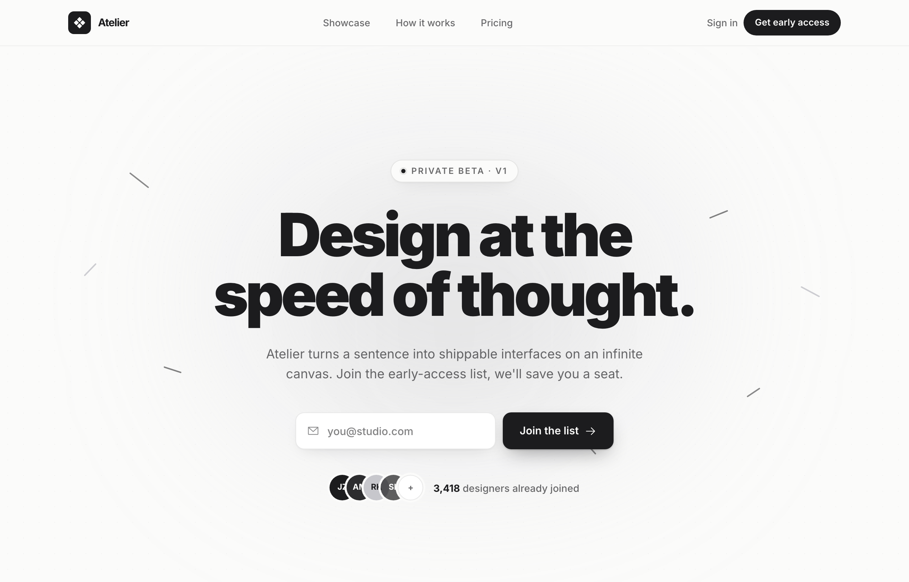

# Atelier · Early Access (waitlist-minimal-graphite)

Minimal monochrome graphite-on-paper waitlist / early-access landing for an AI design tool: a warm off-white ground with near-black ink and one platinum grey (no color accent), a big tight black-weight headline, a centered single-field email + button waitlist form with overlapping social-proof avatars, scattered graphite confetti strokes, a logo trust strip, a 3-step how-it-works grid and an inverted full-bleed dark closing CTA.



## Prompt

```text
{"summary": "A minimal, graphite-on-paper waitlist / early-access landing for an AI product design tool ('Atelier'). The whole page is monochrome: a warm off-white paper ground, near-black graphite ink for type and accents, and a single platinum grey. The centered hero is a waitlist capture, a big tight headline over a one-line email + button form with social-proof avatars, surrounded by scattered hand-drawn graphite strokes (monochrome confetti) and soft glows. Below it a logo trust strip, a 3-step 'how it works', a full-bleed dark closing CTA with a second email capture, and a footer. The mood is calm, editorial, premium and confident: lots of negative space, ultra-tight black type, one accent (the ink itself).", "style": {"description": "Strictly monochrome, editorial-minimal SaaS aesthetic. The canvas is warm off-white paper (#fbfbfa). All ink is near-black graphite #1c1c1e with a slightly lighter #2c2c2e for secondary fills and a single platinum grey #c7c7cc for tints; there is no color accent at all, the contrast IS the design. Type is Inter (weights 400-900); the hero headline is black-weight (900) with very tight tracking (-0.05em) and crushed ~0.92 leading, scaling up to ~5.25rem. Body text is graphite at graduated opacities (full for headings, ~65% for body/labels). Surfaces are white (#ffffff) or paper cards with hairline ink borders (ink at 6-10% opacity) and soft, low layered shadows (field-shadow: 0 1px 2px rgba(28,28,30,.04), 0 8px 24px -12px rgba(28,28,30,.18); btn-shadow deeper for the dark pill). The texture system: a faint dot-grain (radial-gradient #1c1c1e 0.5px dots on a 22px cell at ~4% opacity) plus large soft platinum/ink radial glows behind the hero, and 'stroke-deco' scattered short rotated graphite bars (monochrome confetti) replacing the reference's colored marks. Corners are soft (rounded-xl inputs/buttons, rounded-2xl cards, rounded-full pills/avatars). Selection is inverted (ink background, paper text). Everything reads soft, paper-like, confident and uncluttered.", "prompt": "Design a minimal monochrome waitlist / early-access landing page. Use ONLY a graphite-on-paper palette: a warm off-white paper background #fbfbfa, near-black graphite ink #1c1c1e for type, accents, the dark CTA and the primary button, a slightly lighter graphite #2c2c2e for secondary fills, and one platinum grey #c7c7cc for tints; pure white #ffffff for input/card fills. No color accent whatsoever, the black-on-paper contrast is the whole look. Typography is Inter, weights 400 to 900: the hero headline is black (900) with very tight letter-spacing (-0.05em) and ~0.92 line-height, scaling from ~3.4rem to ~5.25rem; section headings are extrabold/black; eyebrows and labels are 12px uppercase with wide ~0.14-0.16em tracking in ink at 65%; body is 14-18px in ink at ~65%. Surfaces are white or paper with hairline borders (ink at 6-10% opacity) and soft low shadows (0 1px 2px rgba(28,28,30,.04), 0 8px 24px -12px rgba(28,28,30,.18)); the primary button is a solid graphite #1c1c1e pill/rect with paper text and a deeper drop-shadow. Background texture: a faint radial-dot grain (#1c1c1e 0.5px dots, 22px cell, ~4% opacity), a couple of large soft radial glows (platinum #c7c7cc at ~30% and ink at ~3%, heavily blurred) behind the hero, and scattered short rotated graphite stroke-bars (2px tall, rounded, ~55% opacity, in #1c1c1e/#2c2c2e/#c7c7cc) as monochrome confetti around the headline. Corners: rounded-xl inputs/buttons, rounded-2xl cards, rounded-full pills and avatars. Inverted text selection (ink bg, paper text). Mood: calm, editorial, premium, high-contrast monochrome, lots of negative space."}, "layout_and_structure": {"description": "A full single-scroll landing: a slim sticky glass nav, a tall centered hero/waitlist section, a logo trust strip, a 3-step 'how it works' grid, a full-bleed dark closing CTA, and a footer. The hero is centered in a narrow max-w-3xl column (eyebrow pill, headline, subcopy, a one-row email+button form, then a social-proof avatar stack + count) over a full-bleed textured background with glows and scattered graphite strokes. The other sections center their content in a max-w-6xl container. The defining structural moves: the centered single-field waitlist form with overlapping social-proof avatars, and the monochrome scattered-stroke hero background.", "prompts": [{"part": "Sticky glass nav", "prompt": "A sticky top header, full width, z-50, with a 1px bottom border in ink at 6% and a translucent paper background (#fbfbfa at 80%) with a strong backdrop blur. Inner row max-w-6xl, 64px (h-16) tall, space-between, ~24-32px side padding. Left: the logo = a 32px graphite (#1c1c1e) rounded-lg tile holding a paper-colored diamonds icon (ph:diamonds-four-fill) next to a 15px bold 'Atelier' wordmark with very tight tracking. Center (md+ only): three nav links 'Showcase', 'How it works', 'Pricing' in 13.5px medium ink/65 that darken to full ink on hover. Right: a 'Sign in' text link (ink/65, sm+ only) and a 'Get early access' button = a solid graphite #1c1c1e rounded-full pill with paper text, 13px semibold, that scales up ~3% on hover."}, {"part": "Hero background (monochrome texture)", "prompt": "The hero <main> is relative and overflow-hidden over the paper ground. Layer, behind the content and pointer-events-none: (1) a faint dot-grain wash (radial-gradient #1c1c1e 0.5px dots on a 22px cell) at ~4% opacity covering the section; (2) a large soft platinum glow (#c7c7cc at ~30%, ~640x420px, heavily blurred ~120px) centered near the top, and a smaller ink glow (#1c1c1e at ~3%, blurred ~80px) at center; (3) about nine scattered 'stroke-deco' bars: short 2px-tall rounded horizontal bars (18-34px wide) at random rotations (e.g. 38deg, -22deg, -46deg, 28deg, 18deg...), positioned around the headline, colored #1c1c1e / #2c2c2e / #c7c7cc at ~55-90% opacity, reading as quiet monochrome confetti. End the hero with a centered hairline divider (a max-w-6xl 1px line that is a horizontal gradient from transparent to ink/12 to transparent)."}, {"part": "Hero content (the waitlist capture)", "prompt": "Centered in a narrow max-w-3xl column with generous vertical padding (~pt-24 to pt-40, pb-28 to pb-36). Top to bottom: (1) an eyebrow pill, rounded-full, 1px ink/10 border on a paper fill with the soft field-shadow, holding a small live 'ping' dot (a graphite dot with an animated ink/40 ping ring) and the text 'PRIVATE BETA · V1' in 12px semibold uppercase with 0.14em tracking in ink/65. (2) A black-weight headline, max-w-3xl, scaling ~3.4rem to ~5.25rem, tracking -0.05em, ~0.92 leading: 'Design at the speed of thought.' with a line break before 'speed of thought.' on sm+. (3) A subcopy, max-w-xl, 17-18px ink/65, balanced: 'Atelier turns a sentence into shippable interfaces on an infinite canvas. Join the early-access list, we'll save you a seat.' (4) The waitlist form (see its own part). (5) A social-proof row (see its own part)."}, {"part": "Waitlist form (single field + button)", "prompt": "A centered form, max-w-md, that is a single row on sm+ and stacks on mobile, with ~10px gap. Left, a flex-1 email input: 52px tall, rounded-xl, 1px ink/10 border on white, with the soft field-shadow, a leading ph:envelope-simple icon (18px, ink/50) inset on the left and placeholder 'you@studio.com' in ink/55; on focus the border goes ink/30 with a 4px ink/6 focus ring (no default outline). Right, the submit button: 52px tall, rounded-xl, solid graphite #1c1c1e with paper text, 15px semibold, the deeper btn-shadow, reading 'Join the list' with a trailing ph:arrow-right icon that nudges right on hover; the button scales ~2% up on hover and ~1% down on active."}, {"part": "Social proof (avatar stack + count)", "prompt": "Below the form, a centered row with ~14px gap. Left, an overlapping avatar stack (-space-x-3) of five 36px (h-9 w-9) rounded-full avatars, each with a 3px paper ring (avatar-ring): four are initials avatars on graphite tones ('JZ' on ink, 'AM' on ink2 #2c2c2e, 'RK' on platinum #c7c7cc with ink text, 'SL' on ink/70) and the fifth is a white '+' overflow chip with a 1px ink/10 border. Right, a 14px medium ink/65 line: a bold ink '3,418' followed by 'designers already joined'."}, {"part": "Trust strip", "prompt": "A full-bleed section with a 1px bottom border in ink/6 on a white/40 fill. Inner max-w-6xl row, ~40px vertical padding, that stacks on mobile and goes space-between on lg. Left: a 12px semibold uppercase, 0.16em tracking, ink/65 label 'Trusted by builders from'. Right: a wrapping row of five fake company lockups in 15px bold ink/65, each a small Phosphor glyph + name: 'Northwind' (ph:circles-three-fill), 'Vertex' (ph:triangle-fill), 'Lumen' (ph:hexagon-fill), 'Quanta' (ph:square-half-fill), 'Foundry' (ph:asterisk)."}, {"part": "How it works (3-step grid)", "prompt": "A section on the paper ground, max-w-6xl, ~96px vertical padding. A centered header block (max-w-xl): a 12px semibold uppercase 0.16em-tracking ink/65 eyebrow 'From prompt to pixels' and an extrabold/black headline 'Three steps, one canvas.' (4xl to 5xl, tight tracking). Below it a 3-column grid (md+) of step cards: each a white rounded-2xl card with a 1px ink/7 border that gains a soft larger shadow on hover. Each card has a 44px (h-11 w-11) rounded-xl icon tile (card 1 graphite #1c1c1e, card 2 ink2 #2c2c2e, card 3 a platinum/30 fill with a 1px ink/10 border and ink icon), a small bold 0.16em-tracking ink/65 step number ('01'/'02'/'03'), a 19px bold tight-tracking heading ('Describe it' / 'Watch it build' / 'Ship it') and a 14.5px ink/65 body line. Icons: ph:chat-circle-dots, ph:magic-wand, ph:export."}, {"part": "Closing CTA (full-bleed dark)", "prompt": "A full-bleed section that inverts the palette: a solid graphite #1c1c1e ground (overflow-hidden), with an inverted dot-grain at ~6% and a soft platinum/10 glow blurred at the top. Content centered in max-w-3xl, ~96px vertical padding: a black/extrabold paper-colored headline 'Get in before the doors open.' (4xl to 5xl), a max-w-md platinum/70 subcopy 'Early members get lifetime founder pricing and a direct line to the team.', then a second waitlist form (max-w-md, row on sm+): an email input that is 52px, rounded-xl, white/5 fill with a 1px white/15 border and platinum/60 placeholder (on focus white/40 border + a 4px white/10 ring), and a button that is the inverse of the hero one, a solid paper (#fbfbfa) rounded-xl pill with ink text reading 'Reserve my seat' + a ph:arrow-right icon. Below, a 13px platinum/70 reassurance line 'No spam. One launch email, that's the deal.'"}, {"part": "Footer", "prompt": "A footer on the paper ground. Inner max-w-6xl row, ~32px vertical padding, that stacks centered on mobile and goes space-between on sm+. Left: a 24px graphite rounded-md tile with a paper diamonds icon (ph:diamonds-four-fill), a 13px bold tight-tracking 'Atelier' wordmark and a 13px ink/65 '© 2026'. Right: a row of 13px medium ink/65 links 'Privacy', 'Terms' and a 'Follow' link with a leading ph:x-logo icon, all darkening to full ink on hover."}]}, "special_ui_components": ["Monochrome scattered-stroke hero background: ~9 short rotated 2px graphite stroke-bars (in #1c1c1e/#2c2c2e/#c7c7cc at ~55-90% opacity) acting as monochrome confetti, layered over a faint 22px dot-grain wash and large soft platinum/ink radial glows, all pointer-events-none behind the centered hero.", "Single-field waitlist capture: a max-w-md one-row form, a 52px rounded-xl email input with a leading ph:envelope-simple icon and an ink focus-ring, beside a 52px solid-graphite 'Join the list' button with a trailing ph:arrow-right that nudges on hover.", "Overlapping social-proof avatar stack: five 36px rounded-full avatars with 3px paper rings (-space-x-3 overlap), four graphite-tone initials avatars plus a white '+' overflow chip, beside a bold-count 'X designers already joined' line.", "Live 'ping' eyebrow pill: a rounded-full paper pill with a soft field-shadow holding an animated ping dot (graphite dot + an animate-ping ink/40 ring) and a wide-tracked uppercase 'PRIVATE BETA · V1' label.", "Inverted dark closing CTA: the same waitlist form re-skinned on a full-bleed graphite ground (white/5 input with a white border + white focus ring, a solid paper button with ink text), with an inverted dot-grain and a platinum glow.", "Hairline gradient dividers + soft hairline-bordered white cards: 1px borders in ink at 6-10%, soft low layered field-shadows that deepen on hover, and a centered transparent->ink/12->transparent gradient rule closing the hero.", "Strictly monochrome system: every surface, accent and CTA is built from #fbfbfa / #1c1c1e / #2c2c2e / #c7c7cc only, with inverted (ink-on-paper) text selection."], "special_notes": "Keep it STRICTLY monochrome: build everything from the paper #fbfbfa ground, graphite ink #1c1c1e (type, the primary button, the dark CTA section), a secondary #2c2c2e fill, and one platinum grey #c7c7cc; pure white #ffffff only for input/card fills. Do NOT introduce any color accent, the black-on-paper contrast is the entire design (the reference's colored confetti strokes must be recolored to graphite/platinum). Use Inter throughout: the hero headline must be black-weight (900) with very tight tracking (-0.05em) and crushed ~0.92 leading, scaling up to ~5.25rem; eyebrows/labels are 12px uppercase with wide ~0.14-0.16em tracking. Text is graphite at graduated opacities (full headings, ~65% body/labels), never a different hue. The hero is the centerpiece: a centered narrow max-w-3xl column (eyebrow pill -> big headline -> subcopy -> single-row email+button form -> overlapping avatar stack + count) over the textured background (dot-grain + soft platinum/ink glows + scattered graphite strokes). Depth is soft: hairline 1px borders in ink at 6-10%, rounded-xl inputs/buttons and rounded-2xl cards, soft low layered shadows (no hard edges). The page is a full single-scroll landing (sticky glass nav, hero/waitlist, logo trust strip, 3-step how-it-works grid, an inverted full-bleed dark closing CTA repeating the capture, footer); the hero centers in max-w-3xl and the rest in max-w-6xl. Everything must reflow cleanly: the email+button forms stack below sm, the nav center links hide below md and 'Sign in' below sm, the trust strip and how-it-works grid wrap/stack, the headline scales 3.4rem->5.25rem, no horizontal overflow at 390px. Copy is warm and human with zero em-dashes."}
```

**▶ Try it live → [https://superdesign.dev/library/atelier-early-access-waitlist-minimal-graphite](https://p.superdesign.dev/draft/9e290f56-a3b4-48f2-ad8a-67c14e1843db)**

**Use it in your coding agent:** install the [Superdesign skill](https://github.com/superdesigndev/superdesign-skill), then:

```bash
superdesign get-prompts --slugs "atelier-early-access-waitlist-minimal-graphite" --json
```

*0 copies · 2,282 tries · Auth & Login · SaaS · signup, waitlist, early-access, minimal*
