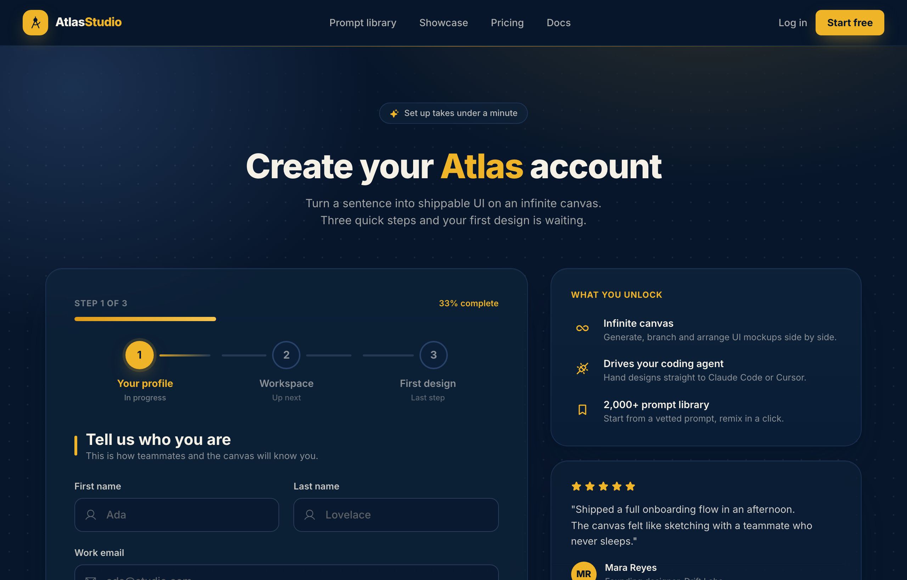

# Atlas Studio — Charting Your Account, Step One of Three

Premium dark-navy multi-step signup / onboarding screen (step 1 of 3) for an AI design tool: a 3-step progress tracker, glassy translucent cards on a midnight-navy ground with soft amber glows, a single warm amber accent, focus-reactive fields, a password strength meter, a role selector, and a 'what you unlock' value panel with a testimonial.



## Prompt

```text
{"summary": "A premium dark-navy multi-step onboarding / signup screen for an AI product design tool ('Atlas Studio'). It is framed as step 1 of 3 with a progress tracker, and pairs the account-creation form on the left with a 'what you unlock' value panel and a testimonial on the right. The mood is calm, trustworthy and high-end: a deep midnight-navy ground washed with soft amber glows and a faint dot grid, cream text, a single warm amber accent, and large rounded glassy cards.", "style": {"description": "Dark, premium SaaS aesthetic. A near-black midnight-navy canvas (#07162b) layered with soft radial amber + steel-blue glows (the .grain wash) and a masked dot grid (#aebfd8 at 10% opacity, 26px). Surfaces are translucent navy cards (navy-800 at ~55% over the glow) with thin 1px navy-600 hairline borders, generous 24px rounded corners and a soft elevated shadow plus subtle backdrop blur. Type is Inter (400-900). The single accent is warm amber (#f0b429): used for the logo tile, the active progress node, the primary CTA, focus rings, icons and 5-star ratings. Text is cream (#f6f1e7) at varied opacities (full for headings, ~65-80% for body, ~35-45% for hints). No second accent color, no hard borders, no heavy gradients on text. Everything reads soft, glassy and deliberate.", "prompt": "Design a premium dark SaaS onboarding screen. Background: a deep midnight navy #07162b, washed with soft radial glows (a warm amber glow #f0b429 at ~16% from the top-right, a steel-blue glow #34527f at ~45% from the top-left, and a darkening vignette toward the bottom), plus a faint dot grid (radial-gradient dots in #aebfd8 at 10% opacity on a 26px cell, masked to fade at top and bottom). Typography is Inter, weights 400 to 900; headings are extrabold (800/900) with tight tracking and ~1.05 leading; body is 13-16px in cream #f6f1e7 at 55-80% opacity. The single accent is warm amber: amber-500 #f0b429 (with amber-400 #f4c44f and amber-600 #de9b18 for the progress bar gradient, amber-300 #f7d070). Surfaces are translucent cards: fill navy-800 #0f263e at ~55% over the glow, 1px hairline border in navy-600 #234066 at ~60% opacity, 24px (rounded-3xl) corners, a soft layered shadow (0 30px 60px -20px rgba(7,22,43,.55)) and ~12px backdrop blur. Inputs (.field) are dark navy at 55% with a 1px steel-blue border #7e96bd at 28%, rounded-xl; on focus the border turns amber #f0b429 with a 4px amber glow ring at 16%. Primary CTA is a solid amber-500 pill with navy-950 #07162b text and an amber drop-shadow (shadow-amber 0 10px 26px -8px rgba(240,180,41,.55)); it lifts -1px on hover. Mood: calm, premium, trustworthy, focused; warm amber against cool deep navy; soft glass, never harsh."}, "layout_and_structure": {"description": "A full-height screen: a slim sticky glass top nav, a full-bleed centered onboarding section, and a footer. The section is centered in a max-w-7xl container with ~20-32px side padding: a centered eyebrow pill, a centered headline + subhead, then a two-column body (lg:grid-cols-[1.55fr_1fr]) with the form card on the left (wider) and a stacked context column on the right (value panel + testimonial + 'log in' line). Below the two columns sits a centered trust strip. Below the lg breakpoint the two columns stack to a single column (form first, then context). The defining structural element is the 3-step progress tracker at the top of the form card.", "prompts": [{"part": "Sticky glass nav", "prompt": "A sticky top header, full width, with a 1px navy-700 bottom border and a translucent navy-950 #07162b background at ~80% with a strong backdrop blur. Inner row max-w-7xl, 64px tall, space-between. Left: the logo = a 36px amber-500 rounded-xl tile with an amber drop-shadow holding a navy compass-tool icon (ph:compass-tool-fill), next to an extrabold wordmark 'Atlas' in cream with 'Studio' in amber. Center (md+ only): four nav links 'Prompt library', 'Showcase', 'Pricing', 'Docs' in 14px cream at 70%, each with an animated amber underline that grows on hover (.navlink). Right: a 'Log in' text link (cream/70, sm+ only) and a 'Start free' button = solid amber-500 pill, navy-950 text, bold 14px, amber shadow, brightens on hover."}, {"part": "Eyebrow + heading", "prompt": "Centered above the form. An eyebrow chip: a rounded-full pill with a 1px navy-600 border on a translucent navy-800 fill with backdrop blur, holding a small amber sparkle icon (ph:sparkle-fill) and the text 'Set up takes under a minute' in 12px cream/75. Below it, a centered headline in extrabold Inter, 4xl scaling to 5xl, tight tracking, ~1.05 leading: 'Create your Atlas account' with the word 'Atlas' in amber. Then a centered subhead, max-w-md, 15-16px cream/65: 'Turn a sentence into shippable UI on an infinite canvas. Three quick steps and your first design is waiting.'"}, {"part": "Progress tracker (the signature element)", "prompt": "At the top of the form card. A row with 'Step 1 of 3' in 12px bold uppercase tracking-wider cream/45 on the left and '33% complete' in 12px semibold amber on the right. Below, a 1.5px-tall rounded progress bar on a dark navy track, filled to one-third with an amber gradient (from amber-600 to amber-400). Below that, a 3-node stepper as a flex row: node 1 = a 40px amber-500 circle with navy-950 '1', an amber shadow and a 4px amber ring at 15% (active), labeled 'Your profile' in bold amber with 'In progress' beneath in cream/45; nodes 2 and 3 = 40px circles with a 2px navy-500 border on dark navy holding '2'/'3' in cream/55, labeled 'Workspace' / 'First design' (cream/55) with 'Up next' / 'Last step' beneath in cream/35. Connector lines between nodes are 3px rounded bars: the segment leaving the active node uses an amber-to-steel gradient, the rest are dim steel-blue at ~22%."}, {"part": "Form card - fields", "prompt": "Inside the left card (rounded-3xl translucent navy, hairline border, soft shadow, backdrop blur, ~24-40px padding). A step heading: a 28px tall amber rounded bar beside an h2 'Tell us who you are' (xl/22px bold cream) and a 13px cream/55 line 'This is how teammates and the canvas will know you.' Then a form: a 2-column row (First name / Last name) of .field inputs, each rounded-xl with a leading ph:user icon and a 13px semibold cream/80 label; placeholders 'Ada' / 'Lovelace' in cream/42. A full-width 'Work email' .field with a leading ph:envelope-simple icon, placeholder 'ada@studio.com', and a 12px helper row 'We will never share this. Used for sign-in and design exports.' prefixed by an amber ph:shield-check icon. A 'Create a password' .field with a leading ph:lock-key icon, a trailing ph:eye toggle, and below it a strength meter = four flex segments (three filled amber, one dim navy) plus a 'Strong' label in amber."}, {"part": "Form card - role select + CTA row", "prompt": "Below the fields. A 'What best describes you?' label, then a 3-column grid of selectable role cards (radio buttons styled with peer-checked): each is a rounded-xl card with a 1px navy-500/40 border on dark navy holding a centered Phosphor icon and a 12.5px semibold cream label: 'Developer' (ph:code), 'Designer' (ph:pen-nib), 'Founder' (ph:rocket-launch). The selected card (Developer) turns its border amber and fills amber at 10%, and its icon goes amber; the others keep cream/55 icons. Below, a CTA row, space-between: a ghost 'Back' button (rounded-xl, 1px navy-500/40 border, cream/55, ph:arrow-left) on the left and a primary 'Continue' button on the right = solid amber-500 pill, navy-950 bold text, amber shadow, a trailing ph:arrow-right-bold icon, lifting -1px on hover."}, {"part": "Form card - SSO", "prompt": "Below the CTA row, inside the form card. A divider: a centered 12px uppercase tracking-wider cream/35 'or continue with' flanked by thin navy-500/30 hairlines. Then a 2-column grid of two ghost SSO buttons: rounded-xl, 1px navy-500/40 border on dark navy at 40%, 14px semibold cream/80, each with a leading icon and label: 'Google' (ph:google-logo-bold) and 'GitHub' (ph:github-logo-fill); both highlight to cream text with a brighter border and faint steel fill on hover."}, {"part": "Right context column", "prompt": "A stacked column to the right of the form (full width below lg). Card 1, 'What you unlock': a rounded-3xl card with a top-to-bottom navy gradient fill, hairline border, soft shadow and blur, headed by a 12px bold uppercase amber label, then a list of three items, each a 32px amber-tinted rounded square icon tile (amber at 12% fill, amber icon: ph:infinity-bold, ph:plugs-connected-bold, ph:bookmark-simple-bold) beside a 14px semibold cream title and a 12.5px cream/55 line: 'Infinite canvas / Generate, branch and arrange UI mockups side by side', 'Drives your coding agent / Hand designs straight to Claude Code or Cursor', '2,000+ prompt library / Start from a vetted prompt, remix in a click'. Card 2, testimonial: a rounded-3xl translucent card with a 5-star amber row (ph:star-fill x5), a 14px cream/85 quote 'Shipped a full onboarding flow in an afternoon. The canvas felt like sketching with a teammate who never sleeps.', and an attribution row = a 36px amber circle avatar with navy initials 'MR' beside 'Mara Reyes' (semibold cream) and 'Founding designer, Drift Labs' (cream/50). Below the cards, a centered 12px line 'Already have an account? Log in' with 'Log in' as an amber link."}, {"part": "Trust strip + footer", "prompt": "Below both columns, centered: a wrapping trust strip in 12.5px cream/45 with three items separated by short vertical dividers, each prefixed by an amber Phosphor icon: 'SOC 2 Type II' (ph:lock-simple-fill), 'No card to start' (ph:credit-card-fill), 'Trusted by 57,000+ builders' (ph:users-three-fill). Footer: a 1px navy-700 top border on solid navy-950, an inner max-w-7xl row (stacks on mobile, space-between on sm+) with the AtlasStudio logo+wordmark on the left, a centered '(c) 2026 Atlas Studio. Design at the speed of thought.' in cream/40, and three social icon links on the right (ph:x-logo-bold, ph:github-logo-bold, ph:discord-logo-bold) that turn amber on hover."}]}, "special_ui_components": ["3-step progress tracker: a 'Step 1 of 3' + '33% complete' label row, a one-third-filled amber-gradient progress bar, and a 3-node stepper where the active node is a filled amber circle with an amber ring and the upcoming nodes are outlined navy circles, joined by 3px connector bars (amber-to-steel leaving the active node, dim steel elsewhere).", "Glassmorphism surface system: translucent navy cards (navy-800 at ~55%) over a radial-glow + dot-grid background, with 1px hairline navy borders, 24px rounded corners, a soft layered drop-shadow and ~12px backdrop blur.", "Focus-reactive .field inputs: dark navy fields with a steel-blue hairline that, on focus, switch the border to amber and add a 4px amber glow ring (instead of a default outline); leading Phosphor icons sit inside each field.", "Password strength meter: four flex segments (three amber, one dim) with a 'Strong' amber label, paired with an eye-toggle icon in the password field.", "peer-checked role selector: a 3-up grid of radio cards (Developer / Designer / Founder) where the checked card flips its border and icon to amber and fills amber at 10%.", "Soft radial 'grain' glow background (layered radial-gradients: warm amber top-right, steel-blue top-left, dark vignette bottom) plus a masked 26px dot grid that fades at the top and bottom edges.", "Amber-underline nav links (.navlink): the underline animates from 0 to full width on hover.", "Amber-shadow primary buttons (shadow-amber) that lift -1px and deepen their glow on hover."], "special_notes": "Keep it to ONE accent (warm amber #f0b429) on the deep-navy ground; do not introduce a second hue. The depth model is soft glass, not hard edges: thin 1px hairline borders, 24px rounded-3xl corners, soft layered shadows and backdrop blur (no thick borders, no hard offset shadows). The mandatory hero element is the 3-step progress tracker (Step 1 of 3, 33% bar, active amber node 1 + outlined nodes 2/3) at the top of the form card, since this is a multi-step onboarding rather than a single signup. Use Inter throughout (extrabold 800/900 for headings, 400-600 for body). Text is cream #f6f1e7 at graduated opacities (full headings, 55-80% body, 35-45% hints) - never pure white. Layout is a wider form (1.55fr) beside a narrower context column (1fr) on desktop, stacking to one column below lg; everything stays centered in a max-w-7xl container with no horizontal overflow at 390px."}
```

**▶ Try it live → [https://superdesign.dev/library/atlas-studio-charting-your-account-step-one-of-three](https://superdesign.dev/library/atlas-studio-charting-your-account-step-one-of-three?utm_source=github&utm_medium=prompt-repo&utm_campaign=prompt-library)**

**Use it in your coding agent:** install the [Superdesign skill](https://github.com/superdesigndev/superdesign-skill), then:

```bash
superdesign get-prompts --slugs "atlas-studio-charting-your-account-step-one-of-three" --json
```

*0 copies · 2,336 tries · Auth & Login · Agency & Studio · signup, onboarding, multi-step, progress-tracker*
