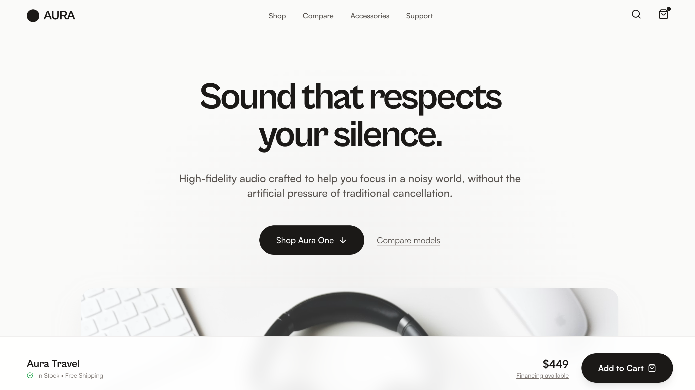

# Aura Audio Showroom

Product Walkthrough is a product-first electronics landing page built around a Showroom Flow layout—product theater followed by guided model selection, scenario-based feature explanations, lightweight comparison, and a confident close—making it best suited for consumer electronics and DTC hardware brands with multiple models or configurations that want a clear, trust-building shopping experience without spec overload or lifestyle clichés.



## Prompt

```text
{
  "summary": "A sophisticated, material-driven 'Showroom' landing page that prioritizes tactile quality and human-centric design. It uses a stone-tone palette, bold editorial headers, and interactive product selection components to create a calm, high-trust shopping experience.",
  "style": {
    "description": "Premium Material-Minimalism. Typography pairs 'Cabinet Grotesk' for high-impact, tight-tracking displays with 'Satoshi' for readable, modern body text. The color palette centers on Stone-50 (#FAF7F5) and Stone-900 (#1C1917) with warm wood (#A67B5B) and cool aluminum (#E2E8F0) accents. Animations are subtle, using 'fade-in-up' transitions (0.8s ease-out) and soft hover scales (1.02x-1.05x) to denote interactivity without flashiness.",
    "prompt": "Create a design system using a neutral, high-end professional palette: Backgrounds in #FAF7F5 (Stone-50) and #F5F5F4 (Stone-100); Primary text in #1C1917 (Stone-900). Typography: Display headings in 'Cabinet Grotesk' (Weight: 800, tracking: -0.05em); Body text in 'Satoshi' (Weight: 400/500/700). UI elements should feature 24px-32px border-radius, 2px borders for interactive states, and soft 'glassmorphism' (backdrop-blur: 12px) for sticky components. Include material textures in imagery: anodized metal, grain-heavy wood, and leather. Animation: Use a 'fade-in-up' entry for all major sections and a smooth cubic-bezier (0.4, 0, 0.2, 1) for card hover transitions."
  },
  "layout_and_structure": {
    "description": "A vertical narrative layout designed as a 'walk-through' showroom experience, starting with atmospheric brand-building and moving toward technical specifications and final purchase reassurance.",
    "prompts": [
      {
        "part": "Header",
        "prompt": "Sticky navigation bar (Height: 80px) with #FAF7F5/80 backdrop-blur. Logo on left (24px, bold display font), centered nav links (14px, medium weight), and search/cart icons on right. Use a tiny dot notification badge on the cart icon."
      },
      {
        "part": "Product Theater (Hero)",
        "prompt": "Atmospheric section with a centered radial gradient (#E7E5E4 to transparent). Large display headline (72px, tracking-tight) with a human-centric focus. Subtext (20px, max-width: 42rem) explaining a problem statement. Include a primary button (Black, rounded-full, 16px padding) and a 'Compare' text link. Below text, a hero image in a 21:9 ratio container with 32px corner radii."
      },
      {
        "part": "Interactive Model Selection",
        "prompt": "Three-card grid. Each card is 480px tall, white background, 32px padding, and 24px rounded corners. Active state card (model-active): 2px Stone-900 border, slight scale-up, and shadow-xl. Cards include: Image in Stone-100 rounded container, Name/Price row, trait description, and a footer section showing a specific icon + 'Key Trait' metadata."
      },
      {
        "part": "Editorial Philosophy",
        "prompt": "Split layout. Left: Text-heavy with section label (horizontal line + text), large 48px heading, and generous line-height paragraphs. Right: A staggered 4-image grid using varied heights (64px, 80px) and a grayscale-to-color hover filter effect on images."
      },
      {
        "part": "Feature Walkthrough",
        "prompt": "Full-width section with #1C1917 background and Stone-100 text. Use a 3-column grid where each column has a square image with 60% opacity, an icon overlay, and a bulleted list using custom checkmark icons to explain use-case scenarios (e.g., Transit, Desk, Deep Work)."
      },
      {
        "part": "Specification Table",
        "prompt": "Minimalist comparison chart. No vertical borders, only horizontal dividers (#E7E5E4). Highlight the 'Featured' product column with a subtle #F5F5F4 background and bold text to guide the user's choice."
      },
      {
        "part": "Sticky Checkout Bar",
        "prompt": "Floating bar at screen bottom. White/90 backdrop-blur with top border. Left: Model name and 'In Stock' status with green icon. Right: Price and large 'Add to Cart' button (rounded-full). This bar updates dynamically based on the 'Model Selection' card choice."
      }
    ]
  },
  "special_ui_components": [
    {
      "component": "Tactile Model Cards",
      "description": "Interactive cards that act as the primary configuration tool for the page.",
      "prompt": "Cards use a white base with transparent 2px borders. On selection, the border switches to #1C1917. Images within cards use 'mix-blend-multiply' on light stone backgrounds to appear integrated into the card surface. Hovering over non-selected cards should trigger a #D6D3D1 border color change."
    },
    {
      "component": "Material Highlight Badge",
      "description": "Small floating informational cards describing physical materials.",
      "prompt": "Positioned over hero or detail images. 24px padding, white/90 background, backdrop-blur, rounded-2xl. Top line: 10px bold uppercase tracking-widest label (e.g., 'MATERIALS'). Bottom line: 14px medium weight description."
    }
  ]
}
```

**▶ Try it live → [https://superdesign.dev/library/aura-audio-showroom](https://superdesign.dev/library/aura-audio-showroom?utm_source=github&utm_medium=prompt-repo&utm_campaign=prompt-library)**

**Use it in your coding agent:** install the [Superdesign skill](https://github.com/superdesigndev/superdesign-skill), then:

```bash
superdesign get-prompts --slugs "aura-audio-showroom" --json
```

*261 copies · 2,479 tries · E-commerce · E-commerce & Retail · shopify, landing page, ecommerce*
