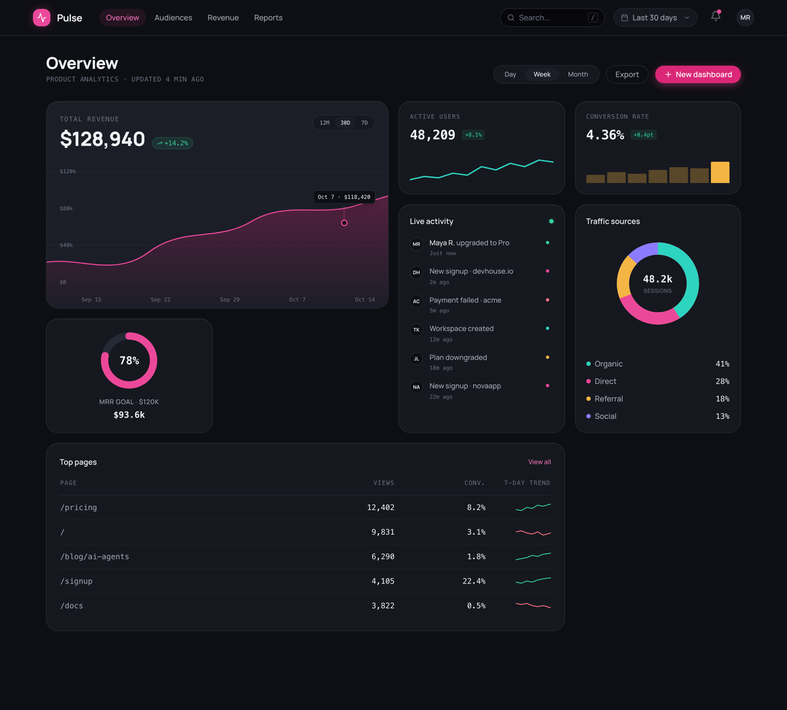

# Bento Dashboard (Dark Graphite Analytics Overview, Fuchsia Accent)

A dark bento analytics dashboard: the in-app "Overview" screen of a product, laid out as a mixed-span bento mosaic on a cool graphite ground with a single fuchsia accent. A slim top bar (logo, Overview / Audiences / Revenue / Reports nav, search, a "Last 30 days" date pill, a bell, an avatar) sits over a bento grid: a 2x2 revenue hero tile (big number, delta pill, a 12M/30D/7D toggle, and a fuchsia area chart with a tooltip anchored above its marker), two KPI stat tiles (active users with a teal sparkline, conversion rate with an amber micro bar chart), a tall live-activity feed, a tall traffic-sources donut with a legend, a fuchsia MRR-goal radial gauge, and a wide "Top pages" table with per-row trend sparklines. Manrope headings, IBM Plex Mono numerals, teal / amber / violet used only as data-viz colors. Fully responsive. Reusable for any SaaS product-analytics, admin, or metrics dashboard.



## Prompt

```text
{
  "summary": "The in-app 'Overview' screen of a product-analytics dashboard called Pulse, laid out as a DARK BENTO MOSAIC (mixed-span tiles) on a cool graphite ground (#0e0f14). NOT a marketing landing page - a real in-product analytics screen. A slim sticky top app bar holds a rounded fuchsia logo tile + 'Pulse' wordmark, a horizontal nav (Overview active as a fuchsia-tinted pill, then Audiences / Revenue / Reports quiet), and on the right a sunken search field, a 'Last 30 days' date-range pill, a bell with a fuchsia dot, and an avatar. A page header row follows: an 'Overview' H1 + a muted mono subtitle 'Product analytics - updated 4 min ago' on the left, and on the right a Day/Week/Month segmented control (Week active), an Export ghost button, and a fuchsia 'New dashboard' button. Then a 4-column bento grid with explicit mixed spans: (1) a Revenue hero tile spanning 2 cols x 2 rows (eyebrow TOTAL REVENUE, big number $128,940, a green +14.2% delta pill, a 12M/30D/7D mini toggle, and a large area chart - a fuchsia line with a fuchsia-to-transparent gradient fill, a left y-axis $0/$40k/$80k/$120k, faint gridlines, an x-axis Sep 15 to Oct 14, and a ringed marker with a small tooltip 'Oct 7 - $118,420' centered above the marker joined by a 1px vertical connector stem, the fill running edge to edge to the final tick); (2) an Active users stat tile (48,209 + a teal sparkline + green +8.1%); (3) a Conversion rate stat tile (4.36% + a 7-bar amber micro bar chart + green +0.4pt); (4) a tall Live activity feed tile spanning 1 col x 2 rows (a 'live' green dot + ~6 events, each an initials avatar chip + text + a colored status dot + a mono timestamp: upgraded to Pro / new signup / payment failed / workspace created / plan downgraded / new signup); (5) a tall Traffic sources tile spanning 1 col x 2 rows (a donut with 4 teal/fuchsia/amber/violet segments, a centered '48.2k / sessions' label, and a 4-row legend Organic 41% / Direct 28% / Referral 18% / Social 13% with right-aligned mono percents); (6) an MRR goal tile (a fuchsia radial progress ring at 78% on a #262a35 track, 'MRR goal - $120k' label, mono $93.6k beneath); (7) a wide Top pages table tile spanning 3 cols x 1 row (columns Page / Views / Conv. / 7-day trend, ~5 rows /pricing, /, /blog/ai-agents, /signup, /docs, mono figures, a tiny per-row trend sparkline that rises green or falls rose, a 'View all' ghost link). On mobile every tile stacks to one column, the charts scale to container width, and the Top pages table scrolls horizontally inside its tile.",
  "style": {
    "description": "Dark bento on a cool graphite ground - flat, precise, 'data console'. The mosaic is built from matte tiles that sit just proud of the ground: each tile is a rounded 22px surface (#16181f, the revenue hero #1b1e27) with a 1px hairline border (#262a35), a faint inset top highlight (inset 0 1px 0 rgba(255,255,255,0.05)) so it reads gently extruded, two soft dark shadows, and a springy translateY(-4px) hover-lift. Colour is disciplined: FUCHSIA #ec4899 (deep #db2777) is the ONE brand chroma - the logo tile, the active nav pill, the primary revenue line + gradient fill, the goal ring, and the primary button. Teal #2dd4bf, amber #f5b544, and violet #8b7cff appear ONLY as data-viz series and donut-segment colours (category-native, never as decoration or background wash). Text is bone #f2f3f7 for headings and cool grey #a6abb8 for body, with muted #6b7180 tracked-caps eyebrows and axis labels. No default indigo/violet gradient background, no gradient-as-decoration, no emoji. Typography pairs Manrope (500-800, tracking-tight bold) for headings and UI with IBM Plex Mono (400-500) for every numeral, tracked-caps label, axis figure, and table cell - the mono is the 'data console' signal and keeps the numbers tabular-aligned.",
    "prompt": "Design the in-app 'Overview' screen of a product-analytics dashboard as a dark bento mosaic on a cool graphite ground #0e0f14. Build it from rounded 22px tiles in #16181f (the revenue hero tile #1b1e27), each with a 1px hairline border #262a35, a faint inset top highlight rgba(255,255,255,0.05), two soft dark shadows (0 12px 30px -14px rgba(0,0,0,.7) and 0 22px 50px -20px rgba(0,0,0,.8)), and a springy translateY(-4px) hover-lift on cubic-bezier(.34,1.4,.64,1). Use fuchsia #ec4899 (deep #db2777) as the ONLY brand accent - logo tile, active nav pill, revenue line + gradient fill, goal ring, primary button - and use teal #2dd4bf, amber #f5b544, violet #8b7cff ONLY as chart series and donut segments, never as a background wash. Text: bone #f2f3f7 headings, cool grey #a6abb8 body, muted #6b7180 tracked-caps eyebrows and axis. Type: Manrope for headings and UI, IBM Plex Mono for every number, label, axis figure, and table cell. No indigo/violet gradient background, no decorative gradients, no emoji. Keep it a real in-product analytics screen, not a marketing landing page."
  },
  "layout_and_structure": {
    "description": "A slim sticky top app bar over a page header row, then a 4-column bento grid (max-width ~1320px, centered, 18px gaps) with explicit mixed spans: a 2x2 revenue hero, two 1x1 KPI tiles, a 1x2 tall live-activity feed, a 1x2 tall traffic-sources donut, a 1x1 MRR goal gauge, and a 3x1 wide top-pages table. Responsive: 4 columns on desktop, 2 columns on tablet (the revenue hero spans full width), and one column on mobile where every tile stacks, the charts scale to 100% width, and the top-pages table scrolls horizontally inside its tile. The top-bar center nav links hide below md.",
    "prompts": [
      {
        "part": "Top app bar",
        "prompt": "A slim sticky top bar (bg #0e0f14 at 85% + backdrop-blur, a hairline bottom border). Left: a rounded fuchsia logo tile with a small pulse/activity glyph + a 'Pulse' Manrope wordmark, then a horizontal nav - 'Overview' active as a pressed fuchsia-tinted pill, 'Audiences' / 'Revenue' / 'Reports' quiet grey (these center links hide below md). Right: a sunken search field with a magnifier + a '/' hint, a 'Last 30 days' date-range pill with a calendar glyph + chevron, a round bell button with a fuchsia notification dot, and a circular avatar with initials."
      },
      {
        "part": "Page header row",
        "prompt": "Below the bar: left, an 'Overview' Manrope 800 H1 over a muted IBM Plex Mono subtitle 'PRODUCT ANALYTICS - UPDATED 4 MIN AGO'. Right, a segmented Day / Week / Month control (Week active as an inner pressed pill), an 'Export' ghost button, and a fuchsia 'New dashboard' button with a plus. Wrap gracefully on small screens."
      },
      {
        "part": "Revenue hero tile (2x2)",
        "prompt": "The large bento tile spanning 2 columns x 2 rows in #1b1e27. Header: an eyebrow 'TOTAL REVENUE', a big Manrope number $128,940 with a green delta pill '+14.2%', and a sunken 12M / 30D(active) / 7D mini-toggle. Plot: a fuchsia line (#ec4899, 2px) with a soft fuchsia-to-transparent gradient area fill, a left y-axis ($0 / $40k / $80k / $120k), faint horizontal gridlines, and an x-axis (Sep 15, Sep 22, Sep 29, Oct 7, Oct 14). Put a ringed fuchsia marker on the line at Oct 7 with a small mono tooltip 'Oct 7 - $118,420' centered ABOVE it, joined by a 1px vertical connector stem. The SVG carries a viewBox so the fill never seams and the last point sits on the final tick."
      },
      {
        "part": "KPI stat tiles (1x1 x2)",
        "prompt": "Two 1x1 tiles. Active users: eyebrow 'ACTIVE USERS', a big mono 48,209, a green '+8.1%' delta pill, and a teal (#2dd4bf) mini-sparkline pinned along the bottom. Conversion rate: eyebrow 'CONVERSION RATE', a big mono 4.36%, a green '+0.4pt' delta pill, and a 7-bar amber (#f5b544) micro bar chart along the bottom with the final bar the brightest."
      },
      {
        "part": "Live activity feed tile (1x2 tall)",
        "prompt": "A tall tile spanning 1 column x 2 rows. Header 'Live activity' + a small green 'live' dot. A vertical feed of ~6 events, each a row: a circular initials avatar chip, a title + faint mono timestamp ('Just now', '2m ago', ...), and a right-aligned status dot coloured by type (green upgraded, fuchsia new signup, rose payment failed, teal workspace created, amber plan downgraded). The feed scrolls inside the tile."
      },
      {
        "part": "Traffic sources donut tile (1x2 tall)",
        "prompt": "A tall tile spanning 1 column x 2 rows. Header 'Traffic sources'. A thick donut ring with 4 segments (teal / fuchsia / amber / violet) and a centered '48.2k / SESSIONS' label, above a 4-row legend (a colour dot + name + a right-aligned mono percent): Organic 41%, Direct 28%, Referral 18%, Social 13%."
      },
      {
        "part": "MRR goal gauge tile (1x1)",
        "prompt": "A 1x1 tile with a centered radial progress ring: a fuchsia arc filling ~78% over a #262a35 track, a big '78%' in the middle, a 'MRR GOAL - $120K' tracked-caps label beneath, and a mono '$93.6k' current figure."
      },
      {
        "part": "Top pages table tile (3x1 wide)",
        "prompt": "A wide tile spanning 3 columns x 1 row. Header 'Top pages' + a fuchsia 'View all' ghost link. A compact table with columns Page / Views / Conv. / 7-DAY TREND and ~5 rows (/pricing, /, /blog/ai-agents, /signup, /docs) - the page path in mono, right-aligned mono Views and Conv. figures, and a tiny inline trend sparkline per row (green rising or rose falling). On mobile the table keeps a min-width and scrolls horizontally inside the tile so columns never crush."
      }
    ]
  },
  "special_ui_components": [
    {
      "component": "Bento tile",
      "description": "The core mixed-span surface used for every panel in the mosaic.",
      "prompt": "A rounded 22px matte surface in #16181f (the revenue hero #1b1e27) with a 1px hairline border #262a35, a faint inset top highlight inset 0 1px 0 rgba(255,255,255,0.05), and two soft dark shadows. On hover it lifts translateY(-4px) on cubic-bezier(.34,1.4,.64,1) and the border warms toward fuchsia. Tiles carry explicit grid spans (2x2 hero, 1x1 stats, 1x2 tall feed/donut, 3x1 wide table) to build the bento mosaic."
    },
    {
      "component": "Anchored chart tooltip with connector",
      "description": "A floating value callout tied to its data marker on the revenue chart.",
      "prompt": "A small mono tooltip ('Oct 7 - $118,420') on a #0e0f14 chip with a hairline border, positioned centered directly ABOVE the marker on the line with a short 1px vertical connector stem reaching down to a ringed fuchsia marker, so it never floats free. On mobile it shifts left (a transform that resets at the sm breakpoint) so the label reads fully instead of clipping at the tile edge."
    },
    {
      "component": "Radial goal gauge",
      "description": "The MRR-goal progress ring.",
      "prompt": "An SVG radial progress ring: a fuchsia #ec4899 arc filling ~78% of the circle over a #262a35 track, with a large '78%' centered inside and a tracked-caps 'MRR GOAL - $120K' label plus a mono current figure beneath."
    },
    {
      "component": "Delta pill",
      "description": "The up/down change indicator on KPI tiles.",
      "prompt": "A small full-round pill with a tiny triangle glyph and a percent; green (#34d399) for positive deltas set on a soft green-tinted ground, rose (#fb7185) for negative."
    },
    {
      "component": "Micro data-viz (sparkline / micro-bars)",
      "description": "The bottom-anchored mini charts inside the KPI and table tiles.",
      "prompt": "Inline SVG micro charts: a teal (#2dd4bf) polyline sparkline for active users, a 7-bar amber (#f5b544) micro bar chart for conversion (the final bar brightest), and a tiny per-row trend sparkline in the top-pages table coloured green when rising or rose when falling. Each SVG carries a viewBox and scales to its container width."
    },
    {
      "component": "Live activity feed row",
      "description": "One event line in the tall activity tile.",
      "prompt": "A row with a circular initials avatar chip, a title + a faint IBM Plex Mono timestamp, and a right-aligned status dot coloured by event type (green upgrade, fuchsia signup, rose payment-failed, teal workspace, amber downgrade). Rows stack in a vertical feed that scrolls inside the tile."
    },
    {
      "component": "Horizontally scrollable data table",
      "description": "Keeps the dense Top pages table usable on mobile.",
      "prompt": "Wrap the table body in a horizontal-scroll container with a preserved min-width (~500px) so on narrow screens the four columns keep their spacing and the user scrolls sideways inside the tile instead of the columns crushing or the page overflowing."
    }
  ]
}
```
