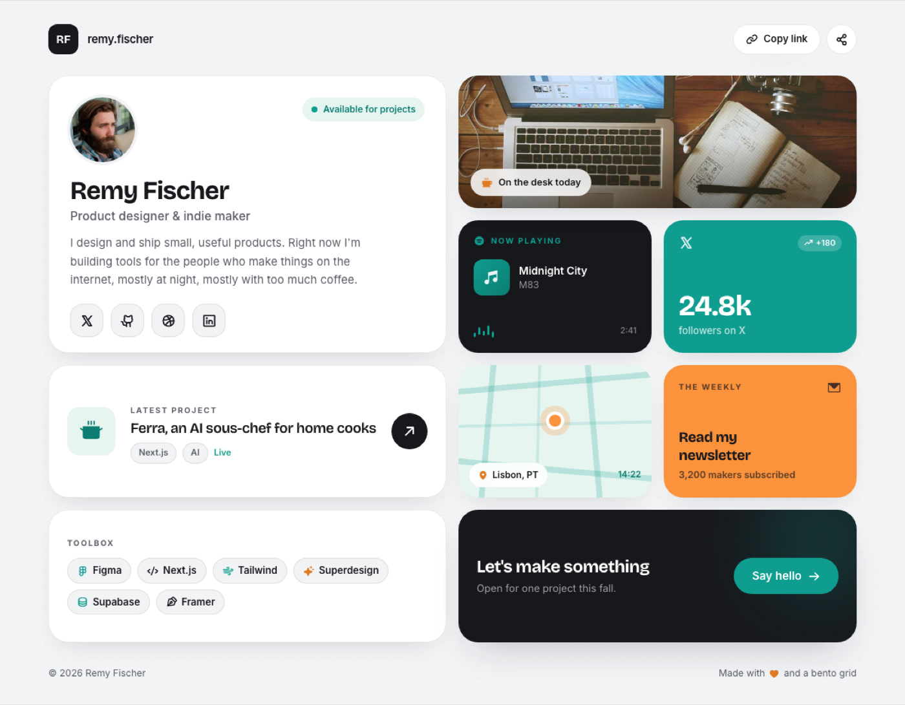

# Bento Grid Portfolio (Personal Link-in-Bio Profile)

A clean, modern bento-grid personal portfolio / link-in-bio profile page on a cool paper-grey canvas with a disciplined teal (#0f9d8f) and apricot (#fb923c) accent duo and charcoal ink. A slim top bar sits over a mixed-span bento grid that tiles into a 4x4: a 2x2 profile tile (avatar, name, role, bio, an availability pill and four social buttons) anchors a workspace photo tile, a dark now-playing tile with a live CSS equalizer, a teal follower-stat tile, a featured-project tile, a teal-tint map tile with a location pin, an apricot subscribe tile, a toolbox chip tile, and a charcoal 'Say hello' contact tile. Bricolage Grotesque display plus Inter body, Phosphor icons; every tile lifts on hover. Reusable for any personal site, portfolio, or link-in-bio profile.



## Prompt

```text
{"summary": "A clean, modern bento-grid personal portfolio / link-in-bio profile page ('bento.me' style) for an indie maker or developer, built as a mixed-span bento grid on a cool paper-grey canvas. A slim top bar (a monogram tile + wordmark left, a 'Copy link' pill and a share button right) sits above the signature bento: a 4-column grid that tiles into a 4x4. A 2x2 white profile tile anchors it (a circular avatar, an 'Available for projects' teal pill, the name in a display face, a role line, a short bio, and a row of four rounded social icon buttons). Around it: a 2-wide workspace photo tile with a glass 'On the desk today' chip; a dark charcoal Now-Playing tile (a 'NOW PLAYING' label, an album thumb, track + artist, and a CSS equalizer with a timestamp); a teal follower-stat tile (a big '24.8k' with a '+180' trend chip and a 'followers on X' caption); a 2-wide featured-project tile (a tinted icon thumb, a 'LATEST PROJECT' label, a title, tech tags, and a circular arrow button); a teal-tint map tile (an inline-SVG street grid with an apricot location pin and a 'Lisbon, PT / 14:22' strip); an apricot newsletter tile ('Read my newsletter' + a subscriber count); a 2-wide white toolbox tile (a wrap of tech chips with tiny icons); and a 2-wide charcoal email-CTA tile ('Let's make something' + a teal 'Say hello' button with a soft teal glow). A small footer closes it. Every tile lifts on hover. The palette is cool paper-grey plus a disciplined teal and apricot accent duo, set in Bricolage Grotesque (display) and Inter (body), with Phosphor icons.", "style": {"description": "Clean, modern, confident bento aesthetic on a cool paper-grey canvas (#f2f3f5) carrying a faint 24px dotted grid. The accent system is deliberately disciplined: a single teal (#0f9d8f, deep #0b7d72, tint #e7f5f1) as the primary color and a single warm apricot (#fb923c, deep #e07a1f) as the lone contrast pop, anchored by a near-black charcoal ink (#17181c) and a muted grey (#5b5e68) for secondary text. This is NOT a candy-multicolor bento: most tiles are white with a faint hairline border (rgba(23,24,28,0.09)); color pops are rationed to exactly one teal tile, one apricot tile, and two charcoal tiles, so the page reads modern-restrained, never busy. Everything is built from big friendly rounded-[26px] tiles, full-pill buttons and chips, generous padding, and two soft layered shadows (soft = 0 14px 34px -18px rgba(20,22,28,0.18), lift = 0 22px 50px -22px rgba(20,22,28,0.28)). Type is a two-face system: Bricolage Grotesque (600/700/800) for the name, tile headings and big stat numbers (characterful, tracking-tight), and Inter (400/500/600) for body and labels; uppercase tracked (0.16em) micro-labels ('NOW PLAYING', 'LATEST PROJECT', 'TOOLBOX', 'THE WEEKLY') act as tile eyebrows. Icons are Phosphor (ph:*-bold / -fill) via Iconify. Tiles lift on hover: translateY(-4px) via a springy cubic-bezier(.34,1.56,.64,1) over .35s. Keep copy warm, human, first-person, and free of em-dashes.", "prompt": "Build a clean, modern bento-grid personal profile page (link-in-bio style) on a cool paper-grey canvas, all rounded and confident. Load Bricolage Grotesque (600/700/800) and Inter (400/500/600) from Google Fonts. Configure a Tailwind palette: canvas #f2f3f5, ink #17181c, inksoft #5b5e68, line rgba(23,24,28,0.09), teal #0f9d8f, tealdeep #0b7d72, tealtint #e7f5f1, apricot #fb923c, apricotdeep #e07a1f. Set body bg-canvas with a faint dotted grid (radial-gradient dots rgba(23,24,28,0.035) 1px on a 24px tile). Define two shadows: soft = 0 14px 34px -18px rgba(20,22,28,0.18) and lift = 0 22px 50px -22px rgba(20,22,28,0.28). Center everything in a max-w-[1120px] container. Tiles use rounded-[26px]; buttons and chips are full pills. Give every tile a '.tile' class that lifts on hover (translateY(-4px) via transition cubic-bezier(.34,1.56,.64,1) .35s). Discipline the color: most tiles are white with a border-line hairline; ration the saturated fills to ONE teal tile, ONE apricot tile, and TWO charcoal (bg-ink) tiles. Set the person's name in Bricolage Grotesque 700 (force it with an explicit font-size, e.g. 34px, and !important if a host stylesheet overrides bare headings) and big stat numbers in Bricolage 700; use Inter for body and 10.5px uppercase tracked (0.16em) tile eyebrows. Icons are Phosphor (ph:*-bold / -fill) via Iconify. Keep all copy first-person, warm, and free of em-dashes; use sample name / links / numbers so it ships with no bundled data."}, "layout_and_structure": {"description": "A single centered column (max-w-[1120px]) with a slim top bar, the bento grid, and a small footer. The grid is grid-cols-1 on mobile and md:grid-cols-4 with auto-rows-[176px] and gap-4, tiling into a 4x4. Source/placement order and spans: (1) profile tile md:col-span-2 md:row-span-2, (2) photo tile md:col-span-2, (3) now-playing tile 1x1, (4) stat tile 1x1, (5) featured-project tile md:col-span-2, (6) map tile 1x1, (7) newsletter tile 1x1, (8) toolbox tile md:col-span-2, (9) email-CTA tile md:col-span-2. On mobile every tile becomes a single full-width row (spans reset) so nothing clips.", "prompts": [{"part": "Top bar", "prompt": "A flex items-center justify-between header. Left: a brand lockup, a 10x10 rounded-xl bg-ink text-white grid-place-items-center Bricolage 700 'RF' monogram tile with shadow-soft, then a 15px font-semibold tracking-tight 'remy.fischer' wordmark. Right: a 'Copy link' pill (h-10 px-4 rounded-full bg-white border border-line 13px font-semibold with a ph:link-bold icon, hover:-translate-y-0.5) and a 10x10 rounded-full bg-white border border-line share button (ph:share-network-bold), both shadow-soft."}, {"part": "Profile tile (anchor, 2x2)", "prompt": "A .tile md:col-span-2 md:row-span-2 bg-white border border-line rounded-[26px] shadow-soft p-7 flex-col. Top row (items-start justify-between): an 86x86 rounded-full avatar photo with a 4px ring in the canvas color, and an 'Available for projects' pill (h-8 px-3 rounded-full bg-tealtint text-tealdeep 12px font-semibold with a 2x2 teal status dot). Then the name in Bricolage 700 at ~34px tracking-tight (force the size against host CSS), a 16px font-medium inksoft role line ('Product designer & indie maker'), and a 15px leading-relaxed inksoft bio (max-w ~26rem, two or three sentences, first-person, warm). Pinned to the bottom (mt-auto): a row of four 11x11 rounded-2xl bg-canvas border border-line social icon buttons (ph:x-logo-bold, ph:github-logo-bold, ph:dribbble-logo-bold, ph:linkedin-logo-bold) that invert to bg-ink text-white on hover."}, {"part": "Photo tile (2-wide)", "prompt": "A .tile md:col-span-2 rounded-[26px] shadow-soft relative overflow-hidden. A full-bleed object-cover workspace / lifestyle photo (a desk flatlay, a laptop, a studio) with an absolute top-down black/45 -> transparent gradient for chip legibility. Bottom-left: a glass caption chip (h-9 px-3.5 rounded-full bg-white/85 backdrop-blur 12.5px font-semibold) with a small apricot ph:coffee-fill icon and an honest caption that does NOT claim a specific subject ('On the desk today')."}, {"part": "Now-playing tile (dark, 1x1)", "prompt": "A .tile bg-ink text-white rounded-[26px] shadow-soft p-5 flex-col. Top: a teal row (a ph:spotify-logo-fill icon + a 10.5px uppercase tracked 'NOW PLAYING' label). Middle: a 12x12 rounded-xl teal->tealdeep gradient album thumb (ph:music-notes-fill) beside a truncating track title (14px font-semibold) and artist (12.5px white/55). Bottom (mt-auto, items-center justify-between): a CSS equalizer of 4-5 teal bars animating scaleY on staggered delays, and a white/45 timestamp ('2:41')."}, {"part": "Stat tile (teal, 1x1)", "prompt": "A .tile bg-teal text-white rounded-[26px] shadow-soft p-5 flex-col justify-between. Top row: a white/85 ph:x-logo-bold icon and a bg-white/20 rounded-full '+180' trend chip (ph:trend-up-bold). Bottom: a Bricolage 700 ~38px leading-none tracking-tight number ('24.8k') and a 13px white/75 caption ('followers on X')."}, {"part": "Featured-project tile (2-wide)", "prompt": "A .tile md:col-span-2 bg-white border border-line rounded-[26px] shadow-soft p-6 flex items-center gap-5. Left: a 16x16 rounded-2xl bg-tealtint tile with a large tealdeep Phosphor glyph matching the project (e.g. ph:cooking-pot-fill). Middle (flex-1 min-w-0): a 10.5px uppercase tracked inksoft 'LATEST PROJECT' eyebrow, a Bricolage 600 ~19px project title, and a chip row (two bg-canvas border border-line tech tags + a teal 'Live' label). Right: a 12x12 rounded-full bg-ink text-white circular arrow button (ph:arrow-up-right-bold, hover:-translate-y-0.5)."}, {"part": "Map tile (teal-tint, 1x1)", "prompt": "A .tile bg-tealtint rounded-[26px] shadow-soft relative overflow-hidden. A full-tile inline SVG (viewBox 0 0 200 200, preserveAspectRatio slice) drawing a stylized street grid: a few thick teal/22 strokes crossing at angles plus two thinner teal/14 strokes. Centered: an apricot location pin (a 4x4 rounded-full bg-apricot with a 4px white ring and shadow-lift over a soft apricot/25 halo ring). Bottom strip (items-center justify-between): a glass 'Lisbon, PT' chip (bg-white/90 backdrop-blur, ph:map-pin-fill in apricotdeep) and a tealdeep local-time label ('14:22')."}, {"part": "Newsletter tile (apricot, 1x1)", "prompt": "A .tile bg-apricot text-ink rounded-[26px] shadow-soft p-5 flex-col justify-between. Top row: a 10.5px uppercase tracked ink/70 'THE WEEKLY' label and a ph:envelope-simple-fill icon. Bottom: a Bricolage 700 ~19px two-line title ('Read my / newsletter') and a 12.5px font-semibold ink/70 subscriber count ('3,200 makers subscribed')."}, {"part": "Toolbox tile (2-wide)", "prompt": "A .tile md:col-span-2 bg-white border border-line rounded-[26px] shadow-soft p-6 flex-col justify-center. A 10.5px uppercase tracked inksoft 'TOOLBOX' eyebrow, then a flex-wrap gap-2 of tech chips (bg-canvas border border-line rounded-full px-3 py-1.5, 13px font-semibold), each with a tiny Phosphor icon (Figma, Next.js, Tailwind, Superdesign, Supabase, Framer), accent icons colored teal or apricotdeep."}, {"part": "Email-CTA tile (dark, 2-wide) + footer", "prompt": "A .tile md:col-span-2 bg-ink text-white rounded-[26px] shadow-lift p-6 flex items-center justify-between gap-4 relative overflow-hidden, with an absolute blurred teal/20 glow blob top-right. Left: a Bricolage 700 ~23px 'Let's make something' + a 13.5px white/60 line ('Open for one project this fall.'). Right: a teal full-pill 'Say hello' button (h-12 px-6, 15px font-semibold, ph:arrow-right-bold, hover:-translate-y-0.5). FOOTER: a small flex justify-between row in 12.5px inksoft ('(c) 2026 [Name]' left, a warm 'Made with [heart] and a bento grid' note right)."}]}, "special_ui_components": [{"component": "Mixed-span bento grid", "description": "The signature surface: a 4-column grid of very-rounded tiles that tiles into a 4x4 via one 2x2 anchor and several 2-wide and 1x1 tiles.", "prompt": "A grid grid-cols-1 md:grid-cols-4 with auto-rows-[176px] and gap-4. Place a 2x2 profile tile top-left, a 2-wide photo tile beside it, then 1x1 tiles (now-playing, stat, map, newsletter) and 2-wide tiles (project, toolbox, CTA) filling the rest so the grid resolves to a clean 4x4. On mobile it collapses to one column and every span resets to full width."}, {"component": "Bento profile anchor tile", "description": "The 2x2 identity card that grounds the grid.", "prompt": "A white 2x2 tile: a circular avatar with a canvas-colored ring and an availability status pill on the same row, then the name in a display face, a role line, a short first-person bio, and a bottom-pinned row of four rounded-2xl social icon buttons that invert on hover."}, {"component": "Now-playing tile with CSS equalizer", "description": "A dark tile showing a currently-playing track with a live animated equalizer.", "prompt": "A bg-ink tile: a teal 'NOW PLAYING' eyebrow, a gradient album thumb beside a truncating track + artist, and a bottom equalizer of 4-5 teal bars animating scaleY on staggered delays (freeze at varied heights for a still) with a small timestamp."}, {"component": "Stat pop tile", "description": "A single saturated tile carrying one hero metric.", "prompt": "A solid teal tile with a platform icon and a small '+trend' chip up top, and a big display-weight number over a caption at the bottom ('24.8k' / 'followers on X')."}, {"component": "Inline-SVG map tile with pin", "description": "A location card drawn entirely in CSS + SVG (no map tiles or external images).", "prompt": "A teal-tint tile with a full-bleed inline-SVG stylized street grid (a few teal strokes crossing at angles), a centered apricot location pin with a white ring and a soft halo, and a bottom strip with a 'City, CC' glass chip and a local-time label."}, {"component": "Featured-project link tile", "description": "A 2-wide row linking to the maker's latest work.", "prompt": "A white 2-wide tile: a tinted rounded icon thumb, a 'LATEST PROJECT' eyebrow, a project title, a chip row of tech tags plus a 'Live' label, and a circular arrow-up-right button on the right."}, {"component": "Rationed accent system", "description": "The anti-candy discipline that keeps the bento reading modern, not busy.", "prompt": "Keep most tiles white with a hairline border and ration the saturated fills to exactly one teal tile, one apricot tile, and two charcoal tiles, so color reads as deliberate punctuation rather than a rainbow."}, {"component": "Springy hover-lift", "description": "A '.tile' interaction giving every tile a tactile lift.", "prompt": "A '.tile' class that on hover does translateY(-4px) via a springy cubic-bezier(.34,1.56,.64,1) transition over .35s, so tiles lift toward the cursor."}]}
```

**▶ [Try it live →](https://superdesign.dev/library/bento-grid-portfolio-personal-link-in-bio-profile?utm_source=github&utm_medium=prompt-repo&utm_campaign=prompt-library)**

**Use it in your coding agent:** install the [Superdesign skill](https://github.com/superdesigndev/superdesign-skill), then:

```bash
superdesign get-prompts --slugs "bento-grid-portfolio-personal-link-in-bio-profile" --json
```

*0 copies · 0 tries · Portfolios · Personal & Portfolio · portfolio, personal-website, link-in-bio, bio-link*
