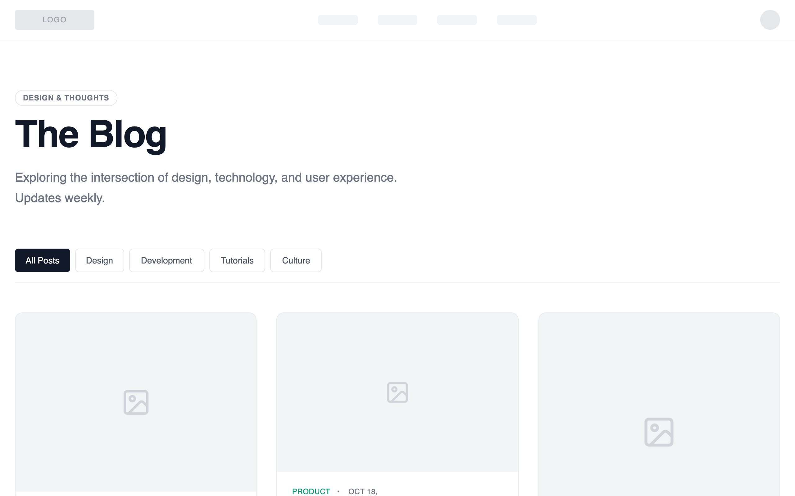

# Blog Page - Editorial Grid Magazine

A grid-based blog layout with visual hierarchy: featured posts are larger, secondary posts arranged in a balanced grid. Emphasizes scanning and visual entry points rather than linear reading.

Best suited for
Lifestyle brands, design-led companies, storytelling-focused content with strong visuals.



## Prompt

```text
{
  "summary": "A sophisticated wireframe-style blog UI utilizing a three-column masonry grid, high-contrast typography, and a neutral palette with tactical color accents for content categories.",
  "style": {
    "description": "The style is 'High-End Wireframe'—focused on structure and hierarchy. It uses the 'General Sans' typeface for a modern, geometric feel. The palette is predominantly grayscale (#FFFFFF, #F3F4F6, #111827) with semantic accent colors (#2563EB for Design, #9333EA for Code) to differentiate categories. Layout elements use thin borders (#E5E7EB) and subtle hover transitions to imply interactivity without visual clutter.",
    "prompt": "### Core Aesthetics\n- **Typography**: Primary font 'General Sans'. Headings use `font-semibold` with `tracking-tight`. Body text uses `leading-relaxed`. Meta-info uses `text-xs`, `uppercase`, and `tracking-wider`.\n- **Color Palette**:\n  - Background: `#FFFFFF` (Main), `#F9FAFB` (Footer/Alt sections).\n  - Text: Primary `#111827`, Secondary/Body `#6B7280`, Muted/Placeholder `#9CA3AF`.\n  - Borders: Default `#E5E7EB`, Hover `#9CA3AF`.\n  - Accent Colors: Blue `#2563EB`, Purple `#9333EA`, Emerald `#059669`, Orange `#EA580C`, Pink `#DB2777`.\n- **Interactions**: All transitions use `transition-duration: 200ms` and `transition-timing-function: cubic-bezier(0.4, 0, 0.2, 1)`. Cards should transition border-color and internal title color on hover.\n- **Iconography**: Use Lucide-style line icons (1.5px stroke weight) in a muted `#D1D5DB` color."
  },
  "layout_and_structure": {
    "description": "The layout follows a centered 1280px (max-w-7xl) container with a standard navigation, a bold editorial header, a category filter bar, and a masonry-style multi-column grid.",
    "prompts": [
      {
        "part": "Navigation",
        "prompt": "Create a thin navigation bar with a bottom border `#E5E7EB`. Include a logo placeholder (128x32px, bg `#F3F4F6`) on the left, four skeletal links on the right (64x16px, bg `#F9FAFB`), and a circular profile placeholder (32x32px) on the far right."
      },
      {
        "part": "Editorial Header",
        "prompt": "Hero section with a max-width of 672px (max-w-2xl). Top-aligned pill badge with text 'Design & Thoughts' (border `#E5E7EB`, text-xs). Main title 'The Blog' at `font-size: 60px` (text-6xl) with `font-weight: 600`. Subtitle in text-xl `#6B7280` with a 1.625 line-height. Margin-bottom: 64px."
      },
      {
        "part": "Category Filter",
        "prompt": "A horizontal flex-row of buttons with a bottom border. Active state: background `#111827`, text `#FFFFFF`. Inactive state: white background, border `#E5E7EB`, text `#4B5563`. Include a small horizontal gap of 8px (gap-2)."
      },
      {
        "part": "Masonry Grid",
        "prompt": "Implement a CSS column-based masonry grid. Desktop: 3 columns, Tablet: 2 columns, Mobile: 1 column. Gap between columns and rows: 32px (gap-8). Use `break-inside-avoid` to ensure cards do not split between columns."
      },
      {
        "part": "Footer",
        "prompt": "Minimal background `#F9FAFB` with a top border. Centered content containing a 32x32px square placeholder and copyright text in `#9CA3AF` at `text-sm`."
      }
    ]
  },
  "special_ui_components": [
    {
      "component": "Masonry Blog Card",
      "description": "Standard blog card with varying image heights and semantic hover states.",
      "prompt": "A card container with border-radius `12px` (rounded-xl) and border `#E5E7EB`. Top section is a placeholder image box with `bg-gray-100` and a centered icon. Height should vary between 160px, 256px, and 384px to create the masonry effect. Body contains: 1. Meta-line with category (semantic color) and date. 2. Title (`text-xl` or `text-2xl`) that changes color to match the category accent on card hover. 3. 2-3 line excerpt in `#6B7280`. 4. Author footer with a 32px avatar placeholder and read-time."
    },
    {
      "component": "Text-Only Quote Card",
      "description": "A variant card for editorial quotes without an image.",
      "prompt": "A `bg-gray-50` card with no top image. Minimum height 300px. Features a large Lucide quote icon in `#D1D5DB`. Centered typography for the quote: `text-3xl`, `font-bold`, `line-height: 1.25`. Includes a signature line with a 32px horizontal divider leading into the author's name in `text-sm font-medium`."
    },
    {
      "component": "Load More Button",
      "description": "A structural action button with subtle micro-interactions.",
      "prompt": "Centered button with `px-8 py-3`, border-radius `8px`, and border `#E5E7EB`. Flex container with text and a 'chevron-down' or 'arrow-down' icon. On hover, background shifts to `#F9FAFB` and border to `#D1D5DB`."
    }
  ]
}
```

**▶ Try it live → [https://superdesign.dev/library/blog-page-editorial-grid-magazine](https://superdesign.dev/library/blog-page-editorial-grid-magazine?utm_source=github&utm_medium=prompt-repo&utm_campaign=prompt-library)**

**Use it in your coding agent:** install the [Superdesign skill](https://github.com/superdesigndev/superdesign-skill), then:

```bash
superdesign get-prompts --slugs "blog-page-editorial-grid-magazine" --json
```

*20 copies · 2,032 tries · Blog & Editorial · E-commerce & Retail · shopify, ecommerce, layout, blog*
