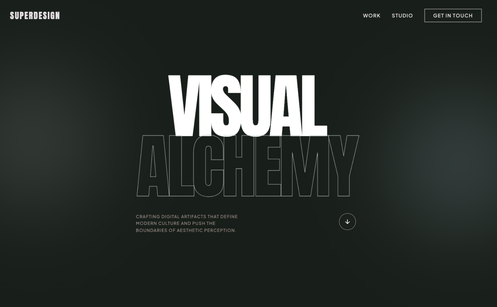

# Bold Editorial Design Style

A premium, bold editorial design system characterized by high-contrast brutalist typography and a sophisticated dark navy and sage color palette. Optimized for creative agencies, design portfolios, luxury architecture, and high-end digital studios. Features include 'Anton' display headers, a custom crosshair cursor, floating ambient gradients, asymmetric masonry layouts, and smooth scroll-triggered reveal animations. The aesthetic balances minimalist white space with massive, impactful type and subtle micro-interactions like mix-blend-mode navigation and grayscale-to-color image transitions.



## Prompt

```text
{
  "summary": "Create a high-end, premium portfolio system using a dark navy base (#171e19), massive Anton display typography, and an asymmetric layout. The design should feel editorial and cinematic, utilizing generous negative space, smooth CSS transitions, and high-contrast sections.",
  "style": {
    "description": "The style is a mix of Brutalist typography and luxury minimalism. It uses Anton (uppercase, heavy) for all primary headings and Plus Jakarta Sans for clean, legible body text. The primary colors are Navy (#171e19) and Sage (#b7c6c2), supported by Cyan (#d5f4f9) and Taupe (#9f8d8b). Interactions focus on fluid motion (cubic-bezier(0.16, 1, 0.3, 1)) and depth through blurred floating shapes and hover-reveal masks.",
    "prompt": "Apply a design system with the following specifications: Colors: Navy (#171e19), Sage (#b7c6c2), White (#ffffff), Taupe (#9f8d8b), Beige (#d7c5b2), Cyan (#d5f4f9), Soft Blue (#bbe2f5), and Charcoal (#302b2f). Typography: Primary headings in 'Anton', uppercase, tracking-tighter, with font-sizes ranging from 8xl to 18vw. Body text in 'Plus Jakarta Sans' (weights 300, 400, 600). Elements: Use 1px borders, crosshair cursor style, and mix-blend-mode: difference for fixed navigation. Animations: Floating ambient blurs using 120px blur radius, and scroll reveals with transform: translateY(10px) and opacity transition over 1000ms. Hover states: Scale 1.1x on images, circular 'View' buttons with 0.5s cubic-bezier timing."
  },
  "layout_and_structure": {
    "description": "The layout uses a multi-section structure alternating between dark and light backgrounds. It features a full-screen hero, an asymmetric masonry portfolio grid, a featured project section with offset imagery, and a massive footer.",
    "prompts": [
      {
        "part": "Navigation",
        "prompt": "Fixed top bar, full width, 32px-48px padding. Mix-blend-mode: difference. Logo in Anton font, 2xl, tracking-widest. Nav links in small (12px) uppercase tracking-widest font. 'Get in Touch' button with 1px white border, transitioning to white background on hover."
      },
      {
        "part": "Hero Section",
        "prompt": "Full viewport height. Background: Navy (#171e19). Include two floating, blurred circles (Sage and Soft Blue) at 20% opacity. Central text: Anton font, size 18vw, leading 0.85, uppercase. Second line of text uses '.text-outline' (1px Sage stroke, transparent fill). Bottom row: Small uppercase Taupe text (max-width 320px) on the left, bouncing arrow icon in a circular border on the right."
      },
      {
        "part": "Portfolio Grid",
        "prompt": "Background: White (#ffffff). Heading: 'Selected Works' in Anton, 9xl, Navy. Grid: 2-column masonry; even-numbered items should have a 4rem (64px) top margin. Project cards: 3:4 or 4:5 aspect ratio images. On hover: Image scales 1.1x and a Navy 60% overlay appears with a white circular 'View' tag in the center."
      },
      {
        "part": "Featured Asymmetric Section",
        "prompt": "Background: Navy. Two-column layout. Left: Grayscale image with a Cyan decorative background square (#d5f4f9, 20% opacity) offset by -48px. Right: Sage colored 'Anton' label, followed by a 7xl heading and Taupe body text. Include an arrow icon link that shifts +8px right on hover."
      },
      {
        "part": "Capabilities Section",
        "prompt": "Background: Light Gray (#fafafa). Split 12-column grid. Columns 1-4: 'Capabilities' label in Taupe, followed by a list where items have a 40px horizontal line prefix that extends to 64px on hover. Columns 5-12: Large 6xl light-weight heading with italicized accent words in Taupe."
      },
      {
        "part": "Testimonial Carousel",
        "prompt": "Background: Charcoal (#302b2f). Features a decorative quotation mark in the background (Navy, 30rem size, 30% opacity). Main quote: Anton font, 5xl, uppercase. Bio section: 64px colored circular avatar and Anton-style name title."
      },
      {
        "part": "Footer",
        "prompt": "Background: Navy. Massive 'Let's Create' heading in Anton (9xl). Email link in Sage, size 4xl, underlined with 8px offset. Footer bottom: 1px top border (White, 10% opacity), copyright on left, legal links on right, all in 12px uppercase tracking-widest typography."
      }
    ]
  },
  "special_ui_components": [
    {
      "component": "Hover Reveal Viewport",
      "description": "A circular 'View' badge that appears on image hover.",
      "prompt": "Inside a relative container with overflow-hidden, create an absolute inset-0 overlay with background navy/60 and opacity-0. On parent hover, transition opacity to 100. Center a 96px x 96px white circle containing 'VIEW' in Anton font, 14px, tracking-widest."
    },
    {
      "component": "Ambient Background Orbs",
      "description": "Slow-moving, blurred decorative background elements.",
      "prompt": "Create 384px (w/h) div elements with 120px Gaussian blur. Set opacity to 20%. Apply a CSS animation 'float' moving translateY from 0 to -20px over 6 seconds with ease-in-out infinite loop."
    },
    {
      "component": "Mix-Blend Navigation",
      "description": "Navigation that changes color based on the background it passes over.",
      "prompt": "Apply 'mix-blend-mode: difference' to the fixed nav container. Ensure navigation items are white so they invert to black over white backgrounds and stay white over dark backgrounds."
    }
  ]
}
```

**▶ Try it live → [https://superdesign.dev/library/bold-editorial-design-style](https://superdesign.dev/library/bold-editorial-design-style?utm_source=github&utm_medium=prompt-repo&utm_campaign=prompt-library)**

**Use it in your coding agent:** install the [Superdesign skill](https://github.com/superdesigndev/superdesign-skill), then:

```bash
superdesign get-prompts --slugs "bold-editorial-design-style" --json
```

*765 copies · 1,660 tries · navy, sage, portfolio, landing page, style*
