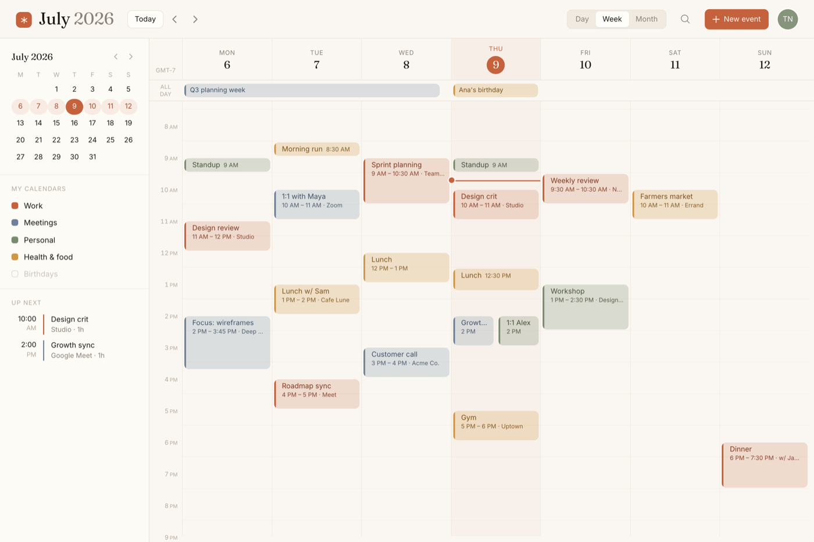

# Calendar UI: Warm Editorial Week Planner

A warm editorial take on the calendar UI: an ivory week-planner scheduler with a serif month title, muted color-coded events, and a terracotta "today" marker. The layout is a full 7-day week time-grid (hourly rows, an all-day row, a live current-time line, and side-by-side blocks for conflicts) beside a left sidebar holding a mini-month picker, a "My calendars" color-dot checklist, and an "Up next" agenda. One warm accent (terracotta) over cream, four muted event families (terracotta, sage, dusty blue, amber), and a Fraunces-serif + Inter-sans pairing give it a "paper planner meets modern software" feel. Copy this calendar app design for any scheduler, booking tool, planning dashboard, or agenda view that wants to feel human and premium instead of cold and generic. Responsive: reflows to a single-day timeline on mobile.



## Prompt

```text
{
  "summary": "A warm, editorial week-view calendar / scheduling app on a light ivory canvas (a 'paper planner meets modern software' register that deliberately avoids the cold cold-blue calendar cliché). A sticky top bar holds a small terracotta rounded-square mark + a serif month title ('July 2026'), a 'Today' pill with prev/next week arrows, a Day/Week/Month segmented switcher, a search icon, a terracotta 'New event' button, and an avatar. A 264px left sidebar stacks a mini-month picker (today = filled terracotta circle, the current week gently tinted), a 'My calendars' checklist of color-dot rows (Work / Meetings / Personal / Health & food / Birthdays, one shown disabled), and an 'Up next' mini-agenda (time on the left, a colored rule + title/meta on the right). The main area is a 7-day week grid: a day-header row (weekday label over a serif date, today's column tinted with the date in a terracotta pill and a 'GMT-7' timezone chip in the gutter), an all-day row where multi-day items span columns (a 3-day 'Q3 planning week' band, a single-day 'Ana's birthday'), and a scrollable hourly time grid (~7 AM-9 PM) filled with ~19 realistic color-coded event blocks of varying duration. Events are soft tinted blocks with a solid 3px left accent bar, a bold title, and a muted time/meta line; overlapping events split side-by-side (Thu 2 PM 'Growth sync' | '1:1 Alex'); a 2px terracotta current-time line with a dot crosses only today's column.",
  "style": {
    "description": "Warm editorial minimalism for productivity software. A cream/ivory canvas (#faf7f2) with warm near-black ink (#1a1714) and warm greys (#8b8178) instead of the usual white + cold grey. Exactly ONE saturated accent, terracotta (#c4623d), used sparingly for the highest-signal elements only: the 'today' marker, the primary 'New event' button, and the live current-time line. Event blocks use a small, restrained, warm-forward palette of four muted families (terracotta / sage / dusty blue / amber) as soft tinted fills with a solid left accent bar and darkened family-colored text, never neon or fully saturated. The signature is a type pairing: a serif DISPLAY face (Fraunces) for the month title, date numerals, and section headers against a clean sans (Inter) for weekday labels, hour ticks, and event text. Hairlines are 1px in warm low-contrast greys; rhythm is generous and calm. The overall feel is a high-end paper planner rendered as software: legible above all, distinctive, and human.",
    "prompt": "Design a light calendar/scheduler on a warm IVORY canvas (#faf7f2), NOT white and NOT a cold-blue theme. Text is warm near-black (#1a1714) with warm-grey secondary labels (#8b8178). Use exactly ONE saturated accent, terracotta (#c4623d), and spend it only on the 'today' marker, the primary button, and the current-time line. Color-code events with four MUTED warm families (terracotta, sage #7a8a6f, dusty blue #6f8299, amber #cf9749) as soft tinted blocks with a solid 3px left accent bar and darkened family-colored text; never use neon or saturated fills. Pair a serif display face (Fraunces) for the month title / date numerals / section headers with a sans (Inter) for weekday labels, hour ticks, and event text. Keep 1px warm hairlines, generous spacing, and a calm paper-planner register. Do NOT use indigo/violet/blue, gradients, or centered-everything layouts."
  },
  "layout_and_structure": {
    "description": "A full-viewport desktop app in three regions: (1) a sticky top bar (brand mark + serif month title left; Today + week arrows; a right cluster of Day/Week/Month switcher, search, a terracotta 'New event' button, and an avatar), (2) a fixed 264px left sidebar (mini-month picker, 'My calendars' checklist, 'Up next' agenda), and (3) a main week view sharing a ~58px left hour gutter across three stacked rows: a 7-column day-header row, an all-day row that spans multi-day items, and a scrollable hourly time grid holding absolutely-positioned event blocks. Reflows: at ≤1023px the sidebar hides and the week grid goes full width; at <640px the week grid is replaced by a single-day timeline for today. The top bar is sticky; the time grid scrolls between the header and the viewport edge.",
    "prompts": [
      {
        "part": "Top bar",
        "prompt": "A sticky top bar (~68px, ivory at ~90% + backdrop blur, 1px bottom hairline). Left: a small terracotta rounded-square mark (an asterisk glyph) next to a serif month title where the month is ink and the year is a lighter weight ('July' + '2026'), then a 'Today' pill and ‹ › week-nav arrows. Push the rest right: a Day / Week / Month segmented switcher (the active segment is a raised panel chip), a search icon, a terracotta 'New event' button with a plus icon, and a circular avatar with initials."
      },
      {
        "part": "Left sidebar",
        "prompt": "A 264px left column (panel tint, right hairline). Top: a mini-month grid (Mon-first, weekday initials, today a filled terracotta circle, the current week tinted with soft terracotta pills, a serif 'July 2026' header with ‹ › arrows). Middle: a 'MY CALENDARS' eyebrow over a checklist of rows, each a small rounded color dot + label (Work=terracotta, Meetings=dusty blue, Personal=sage, Health & food=amber, Birthdays shown as a disabled outline dot). Bottom: an 'UP NEXT' eyebrow over 2-3 agenda rows (a stacked time on the left, then a colored left rule and a title + meta)."
      },
      {
        "part": "Day-header + all-day rows",
        "prompt": "Above the grid, a 7-column day-header row sharing the hour gutter: each column shows an uppercase weekday label (MON) over a serif date numeral; today's column has a subtle terracotta tint and its date sits in a filled terracotta pill; the gutter cell shows a small 'GMT-7' timezone chip. Below it, a hairline-bounded all-day row where multi-day events render as chips spanning N columns (e.g. a 3-day 'Q3 planning week' band) and single-day all-day items (e.g. 'Ana's birthday') sit in one column."
      },
      {
        "part": "Week time grid",
        "prompt": "A scrollable time grid: a ~58px left hour gutter (labels ~7 AM-9 PM, faint, tabular figures) and 7 relative day columns divided by 1px column hairlines, with hour hairlines every row and lighter half-hour sub-lines. Today's column has a faint terracotta wash. Auto-scroll to ~8 AM on load. Populate with ~15-20 realistic events across the four families so the week feels lived-in."
      },
      {
        "part": "Event blocks + conflicts",
        "prompt": "Each event is an absolutely-positioned rounded block: top = (start - dayStart) * hourHeight, height = duration * hourHeight, a soft family-tinted fill, a solid 3px family-colored left accent bar, a bold ~12.5px title, and a muted ~10.5px time/meta line ('10 AM - 11 AM · Zoom'). Very short blocks collapse to a single title + start time. Overlapping events split into side-by-side columns with a small gutter (e.g. Thu 2 PM shows 'Growth sync' next to '1:1 Alex')."
      },
      {
        "part": "Current-time indicator",
        "prompt": "Across only today's column, draw a 2px terracotta line at top = (now - dayStart) * hourHeight, with a 10px terracotta dot (ringed in ivory) at the left edge; keep it above the grid but below interactive chrome and non-interactive. Place it in an empty gap so it never collides with an event block's edge."
      }
    ]
  },
  "special_ui_components": [
    {
      "component": "Week time-grid with hour gutter",
      "description": "The core 7-day scheduling grid: a shared left hour gutter plus seven relative day columns with hour and half-hour hairlines.",
      "prompt": "Build a scrollable grid with a fixed ~58px left hour gutter (labels ~7 AM-9 PM) and 7 equal day columns divided by 1px hairlines. Draw hour lines every row and lighter half-hour sub-lines. Give today's column a faint terracotta wash and auto-scroll to the morning on load."
    },
    {
      "component": "Duration-scaled event block",
      "description": "A tinted event block whose height encodes duration, with a solid left accent bar and title + meta.",
      "prompt": "Absolutely position each event: top = (start - dayStart) * hourHeight, height = duration * hourHeight. Fill with a soft family tint, add a solid 3px family-colored left accent bar, a bold title, and a muted time/meta line. Collapse very short blocks to one line (title + start time)."
    },
    {
      "component": "Side-by-side conflict split",
      "description": "Overlapping events share a time column by splitting horizontally.",
      "prompt": "When events overlap in time, divide the day column into N side-by-side sub-columns with a small 2% gutter, each event taking (100 - (N-1)*2)/N % width, so a conflict (e.g. two 2 PM meetings) renders next to each other rather than stacked."
    },
    {
      "component": "Terracotta current-time line",
      "description": "A live 'now' indicator drawn only on today's column.",
      "prompt": "Draw a 2px terracotta horizontal line across today's column at top = (now - dayStart) * hourHeight, with a 10px terracotta dot ringed in the canvas color at the left edge. Keep it non-interactive and above the grid; position 'now' in an empty gap so it doesn't collide with an event edge."
    },
    {
      "component": "Mini-month picker",
      "description": "A compact month grid in the sidebar that marks today and highlights the visible week.",
      "prompt": "A Mon-first 7-column month grid with weekday initials and a serif 'Month Year' header + ‹ › arrows. Mark today as a filled terracotta circle and tint the currently-viewed week's cells with soft terracotta pills so the sidebar and main view stay in sync."
    },
    {
      "component": "Calendar-list checklist",
      "description": "A legend of toggleable calendars, each a color dot + label, that maps to the event colors.",
      "prompt": "Under a 'MY CALENDARS' eyebrow, list rows of a small rounded color dot + a label (Work / Meetings / Personal / Health & food / Birthdays), matching the four event families plus one disabled outline dot. This doubles as the color legend for the grid."
    },
    {
      "component": "All-day spanning row",
      "description": "A row above the grid for all-day and multi-day items that span across day columns.",
      "prompt": "A hairline-bounded all-day row aligned to the 7 day columns: multi-day items render as a single chip spanning N columns (e.g. a 3-day planning band); single-day all-day items occupy one column. Keep chips low-height and muted."
    }
  ]
}
```
