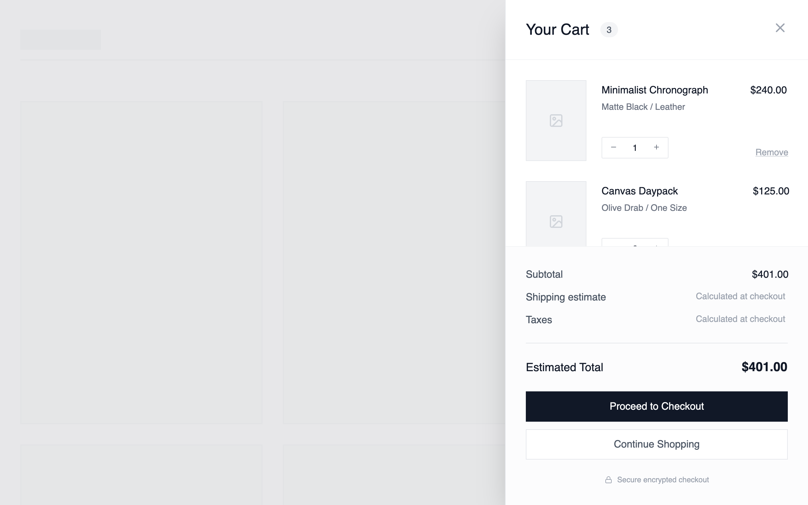

# Cart Drawer- Essential Slide in

A narrow slide-in drawer from the right that lists cart items vertically with quantity controls, subtotal, and a single primary Checkout CTA at the bottom. No secondary content, no distractions.

Best suited for
Fast-purchase flows, single-product stores, brands optimizing for minimal friction and quick checkout.



## Prompt

```text
Minimal wireframe cart drawer that slides in from the right side. Show a clean layout with:

- Header with "Cart" title and close button
- List of cart items with placeholder boxes for image, item title, quantity controls (-, qty, +), and price
- Subtotal section at bottom
- Primary checkout button\
  Use simple gray boxes and borders, no styling or colors. Focus on structure and clear spacing.

Here is a reference implementation:

~~~html
<!DOCTYPE html>
<html lang="en">
<head>
    <meta charset="UTF-8">
    <meta name="viewport" content="width=device-width, initial-scale=1.0">
    <title>Wireframe Cart Drawer</title>
    <script src="https://cdn.tailwindcss.com"></script>
    <script src="https://code.iconify.design/iconify-icon/1.0.7/iconify-icon.min.js"></script>
    <link href="https://api.fontshare.com/v2/css?f[]=general-sans@400,500,600&display=swap" rel="stylesheet">
    <style>
        body {
            font-family: 'General Sans', sans-serif;
        }
        /* Custom scrollbar for wireframe aesthetic */
        .wireframe-scroll::-webkit-scrollbar {
            width: 6px;
        }
        .wireframe-scroll::-webkit-scrollbar-track {
            background: transparent;
        }
        .wireframe-scroll::-webkit-scrollbar-thumb {
            background-color: #e5e7eb;
            border-radius: 20px;
        }
    </style>
</head>
<body>
    <!-- Main Container representing the viewport -->
    <div class="relative min-h-screen w-full bg-white overflow-hidden flex items-center justify-center">
        
        <!-- BACKGROUND CONTENT (Blurred/Dimmed to simulate underlying page) -->
        <div class="absolute inset-0 w-full h-full p-8 grid grid-cols-12 gap-8 opacity-20 pointer-events-none">
            <!-- Header Wireframe -->
            <div class="col-span-12 h-16 border-b-2 border-gray-200 flex justify-between items-center mb-8">
                <div class="w-32 h-8 bg-gray-200"></div>
                <div class="flex gap-4">
                    <div class="w-20 h-4 bg-gray-200"></div>
                    <div class="w-20 h-4 bg-gray-200"></div>
                    <div class="w-20 h-4 bg-gray-200"></div>
                </div>
            </div>
            
            <!-- Content Grid Wireframe -->
            <div class="col-span-12 lg:col-span-8 grid grid-cols-2 gap-8">
                <div class="aspect-[3/4] bg-gray-100 border-2 border-gray-200"></div>
                <div class="aspect-[3/4] bg-gray-100 border-2 border-gray-200"></div>
                <div class="aspect-[3/4] bg-gray-100 border-2 border-gray-200"></div>
                <div class="aspect-[3/4] bg-gray-100 border-2 border-gray-200"></div>
            </div>
            <div class="col-span-12 lg:col-span-4 space-y-4">
                <div class="h-64 w-full bg-gray-100 border-2 border-gray-200"></div>
                <div class="h-32 w-full bg-gray-100 border-2 border-gray-200"></div>
            </div>
        </div>

        <!-- OVERLAY BACKDROP -->
        <div class="absolute inset-0 bg-gray-900/10 backdrop-blur-[2px] z-10 transition-opacity"></div>

        <!-- CART DRAWER -->
        <!-- Placed to the right, sliding in visual -->
        <div class="absolute right-0 top-0 bottom-0 w-full max-w-[480px] bg-white z-20 shadow-2xl flex flex-col border-l border-gray-200 transform transition-transform duration-300 ease-out">
            
            <!-- DRAWER HEADER -->
            <div class="px-8 py-6 border-b border-gray-100 flex items-center justify-between bg-white shrink-0">
                <div class="flex items-center gap-3">
                    <h2 class="text-2xl font-medium text-gray-900">Your Cart</h2>
                    <span class="px-2.5 py-0.5 rounded-full bg-gray-100 text-sm font-medium text-gray-600">3</span>
                </div>
                <button id="close-cart-btn" class="p-2 -mr-2 text-gray-400 hover:text-gray-900 transition-colors group">
                    <iconify-icon icon="lucide:x" class="text-2xl group-hover:rotate-90 transition-transform duration-200"></iconify-icon>
                </button>
            </div>

            <!-- DRAWER CONTENT (Scrollable) -->
            <div class="flex-1 overflow-y-auto wireframe-scroll p-8">
                <div class="space-y-8">
                    
                    <!-- ITEM 1 -->
                    <div class="group flex gap-6">
                        <!-- Image Placeholder -->
                        <div class="w-24 h-32 bg-gray-100 border border-gray-200 flex items-center justify-center shrink-0">
                            <iconify-icon icon="lucide:image" class="text-gray-300 text-2xl"></iconify-icon>
                        </div>
                        
                        <!-- Item Details -->
                        <div class="flex-1 flex flex-col justify-between py-1">
                            <div class="space-y-1">
                                <div class="flex justify-between items-start">
                                    <h3 class="font-medium text-gray-900">Minimalist Chronograph</h3>
                                    <p class="font-medium text-gray-900">$240.00</p>
                                </div>
                                <p class="text-sm text-gray-500">Matte Black / Leather</p>
                            </div>

                            <div class="flex justify-between items-end">
                                <!-- Qty Control -->
                                <div class="flex items-center border border-gray-200 rounded-sm">
                                    <button class="px-3 py-1 hover:bg-gray-50 text-gray-500 transition-colors">
                                        <iconify-icon icon="lucide:minus" class="text-xs"></iconify-icon>
                                    </button>
                                    <span class="px-2 text-sm font-medium text-gray-900 w-8 text-center">1</span>
                                    <button class="px-3 py-1 hover:bg-gray-50 text-gray-500 transition-colors">
                                        <iconify-icon icon="lucide:plus" class="text-xs"></iconify-icon>
                                    </button>
                                </div>
                                
                                <button class="text-sm text-gray-400 hover:text-red-500 underline decoration-gray-300 hover:decoration-red-200 underline-offset-4 transition-colors">
                                    Remove
                                </button>
                            </div>
                        </div>
                    </div>

                    <!-- ITEM 2 -->
                    <div class="group flex gap-6">
                        <div class="w-24 h-32 bg-gray-100 border border-gray-200 flex items-center justify-center shrink-0">
                            <iconify-icon icon="lucide:image" class="text-gray-300 text-2xl"></iconify-icon>
                        </div>
                        
                        <div class="flex-1 flex flex-col justify-between py-1">
                            <div class="space-y-1">
                                <div class="flex justify-between items-start">
                                    <h3 class="font-medium text-gray-900">Canvas Daypack</h3>
                                    <p class="font-medium text-gray-900">$125.00</p>
                                </div>
                                <p class="text-sm text-gray-500">Olive Drab / One Size</p>
                            </div>

                            <div class="flex justify-between items-end">
                                <div class="flex items-center border border-gray-200 rounded-sm">
                                    <button class="px-3 py-1 hover:bg-gray-50 text-gray-500 transition-colors">
                                        <iconify-icon icon="lucide:minus" class="text-xs"></iconify-icon>
                                    </button>
                                    <span class="px-2 text-sm font-medium text-gray-900 w-8 text-center">2</span>
                                    <button class="px-3 py-1 hover:bg-gray-50 text-gray-500 transition-colors">
                                        <iconify-icon icon="lucide:plus" class="text-xs"></iconify-icon>
                                    </button>
                                </div>
                                
                                <button class="text-sm text-gray-400 hover:text-red-500 underline decoration-gray-300 hover:decoration-red-200 underline-offset-4 transition-colors">
                                    Remove
                                </button>
                            </div>
                        </div>
                    </div>

                    <!-- ITEM 3 -->
                    <div class="group flex gap-6">
                        <div class="w-24 h-32 bg-gray-100 border border-gray-200 flex items-center justify-center shrink-0">
                            <iconify-icon icon="lucide:image" class="text-gray-300 text-2xl"></iconify-icon>
                        </div>
                        
                        <div class="flex-1 flex flex-col justify-between py-1">
                            <div class="space-y-1">
                                <div class="flex justify-between items-start">
                                    <h3 class="font-medium text-gray-900">Analog Notebook Set</h3>
                                    <p class="font-medium text-gray-900">$36.00</p>
                                </div>
                                <p class="text-sm text-gray-500">Dot Grid / 3-Pack</p>
                            </div>

                            <div class="flex justify-between items-end">
                                <div class="flex items-center border border-gray-200 rounded-sm">
                                    <button class="px-3 py-1 hover:bg-gray-50 text-gray-500 transition-colors">
                                        <iconify-icon icon="lucide:minus" class="text-xs"></iconify-icon>
                                    </button>
                                    <span class="px-2 text-sm font-medium text-gray-900 w-8 text-center">1</span>
                                    <button class="px-3 py-1 hover:bg-gray-50 text-gray-500 transition-colors">
                                        <iconify-icon icon="lucide:plus" class="text-xs"></iconify-icon>
                                    </button>
                                </div>
                                
                                <button class="text-sm text-gray-400 hover:text-red-500 underline decoration-gray-300 hover:decoration-red-200 underline-offset-4 transition-colors">
                                    Remove
                                </button>
                            </div>
                        </div>
                    </div>

                </div>
            </div>

            <!-- DRAWER FOOTER -->
            <div class="border-t border-gray-100 p-8 bg-gray-50/50 space-y-6 shrink-0">
                
                <!-- Subtotals -->
                <div class="space-y-3">
                    <div class="flex justify-between text-gray-600">
                        <span>Subtotal</span>
                        <span class="font-medium text-gray-900">$401.00</span>
                    </div>
                    <div class="flex justify-between text-gray-600">
                        <span>Shipping estimate</span>
                        <span class="text-sm text-gray-400">Calculated at checkout</span>
                    </div>
                    <div class="flex justify-between text-gray-600">
                        <span>Taxes</span>
                        <span class="text-sm text-gray-400">Calculated at checkout</span>
                    </div>
                </div>

                <!-- Divider -->
                <div class="h-px bg-gray-200 w-full"></div>

                <!-- Total -->
                <div class="flex justify-between items-center">
                    <span class="text-lg font-medium text-gray-900">Estimated Total</span>
                    <span class="text-xl font-semibold text-gray-900">$401.00</span>
                </div>

                <!-- Actions -->
                <div class="space-y-3">
                    <button id="checkout-btn" class="w-full bg-gray-900 text-white h-12 flex items-center justify-center font-medium hover:bg-gray-800 transition-colors">
                        Proceed to Checkout
                    </button>
                    <button id="continue-shopping-btn" class="w-full bg-white border border-gray-200 text-gray-600 h-12 flex items-center justify-center font-medium hover:bg-gray-50 hover:border-gray-300 transition-all">
                        Continue Shopping
                    </button>
                </div>

                <!-- Trust/Microcopy -->
                <div class="text-center">
                    <p class="text-xs text-gray-400 flex items-center justify-center gap-2">
                        <iconify-icon icon="lucide:lock" class="text-xs"></iconify-icon>
                        Secure encrypted checkout
                    </p>
                </div>
            </div>

        </div>
    </div>
</body>
</html>
~~~
```

**▶ Try it live → [https://superdesign.dev/library/cart-drawer-essential-slide-in](https://superdesign.dev/library/cart-drawer-essential-slide-in?utm_source=github&utm_medium=prompt-repo&utm_campaign=prompt-library)**

**Use it in your coding agent:** install the [Superdesign skill](https://github.com/superdesigndev/superdesign-skill), then:

```bash
superdesign get-prompts --slugs "cart-drawer-essential-slide-in" --json
```

*7 copies · 2,493 tries · shopify, layout, cart, ecommerce*
