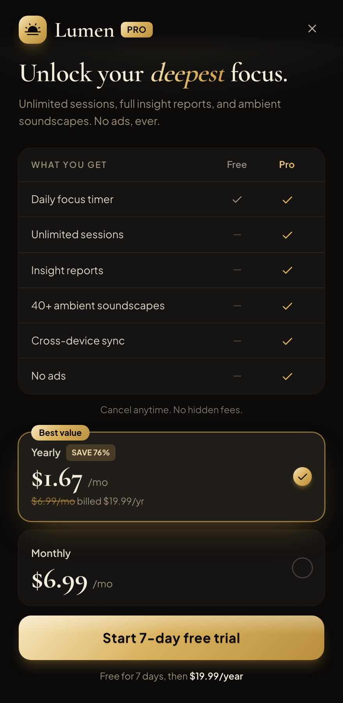

# Champagne Noir Paywall

A premium dark subscription paywall: champagne/gold accents on near-black, an italic-serif value headline, a Free-vs-Pro feature table, a yearly(best-value)/monthly plan toggle, and a gold "Start free trial" CTA.



## Prompt

```text
{
  "summary": "A luxe, trustworthy mobile subscription / premium-upgrade PAYWALL on near-black with champagne-gold accents: a brand + 'PRO' lockup with a close button, an editorial italic-serif value headline + subhead, a Free-vs-Pro feature comparison table with gold checks, two plan cards (Yearly with a 'Best value / save %' badge + selected state, and Monthly), a prominent gold 'Start free trial' CTA, a trust line, and small legal/restore footer links. Reads premium, not pushy.",
  "style": {
    "description": "Premium champagne / 'Champagne Noir': deep charcoal near-black + gold-to-champagne gradient accent, editorial serif display.",
    "prompt": "Deep charcoal near-black frame (#080706 / #0c0b0a / #161412 / #211d18 layers) with a warm gold→champagne gradient accent (champagne #f6e6bd → gold #d9b25f → brass #b98f3e); cream text #f4ecdd, warm-neutral mute #9b8f7c; gold-hairline dividers + a subtle gold radial top glow; the CTA carries a metallic top sheen (brushed-gold feel). Fonts: Cormorant Garamond (refined serif display, italic accent on a key word) + Plus Jakarta Sans (body/CTA). NO orange, NO green, NO slop-indigo — gold is the only accent."
  },
  "layout_and_structure": {
    "description": "Single mobile paywall, vertical: top bar, headline + subhead, comparison table, plan cards, CTA, trust line, footer links.",
    "prompts": [
      {"part": "Top bar", "prompt": "A brand logo tile + a gold 'PRO' pill on the left, a close (×) on the right."},
      {"part": "Headline", "prompt": "An editorial serif headline with one word in italic gold accent (e.g. 'Unlock your deepest focus.'), and a muted 1-2 line subhead."},
      {"part": "Comparison table", "prompt": "A 'What you get' matrix: feature rows with Free vs Pro columns; Pro = gold checkmarks, Free = muted dashes/checks."},
      {"part": "Plan cards", "prompt": "Two selectable plan cards: Yearly (with a 'Best value' badge + 'save %', a per-month price, a strikethrough anchor, billed-annually note, and a selected gold radio) and Monthly (price + radio). One is pre-selected."},
      {"part": "Primary CTA", "prompt": "A full-width gold gradient 'Start 7-day free trial' button (dark label), with a small 'Free for 7 days, then $X/year' line beneath."},
      {"part": "Trust + footer", "prompt": "A 'loved by 200k+' trust line with a small icon; a footer row of muted links: Terms · Privacy · Restore."}
    ]
  },
  "special_ui_components": [
    {"component": "Free-vs-Pro matrix", "description": "Feature comparison.", "prompt": "A two-column comparison table (Free / Pro) with gold check glyphs on the Pro side and muted marks on Free."},
    {"component": "Plan toggle cards", "description": "Yearly vs monthly.", "prompt": "Two bordered plan cards with radio selectors; the yearly card carries a 'Best value' badge and a selected gold ring."}
  ],
  "special_notes": "Gold is the only accent. Keep pricing math consistent (per-month = annual/12; verify the 'save %'). Editorial serif for the one headline, clean sans elsewhere. Responsive at 360/768."
}
```

**▶ Try it live → [https://superdesign.dev/library/champagne-noir-paywall-65a2fd](https://superdesign.dev/library/champagne-noir-paywall-65a2fd?utm_source=github&utm_medium=prompt-repo&utm_campaign=prompt-library)**

**Use it in your coding agent:** install the [Superdesign skill](https://github.com/superdesigndev/superdesign-skill), then:

```bash
superdesign get-prompts --slugs "champagne-noir-paywall-65a2fd" --json
```

*0 copies · 2,397 tries · Pricing Pages · General · mobile app, paywall, subscription, pricing*
