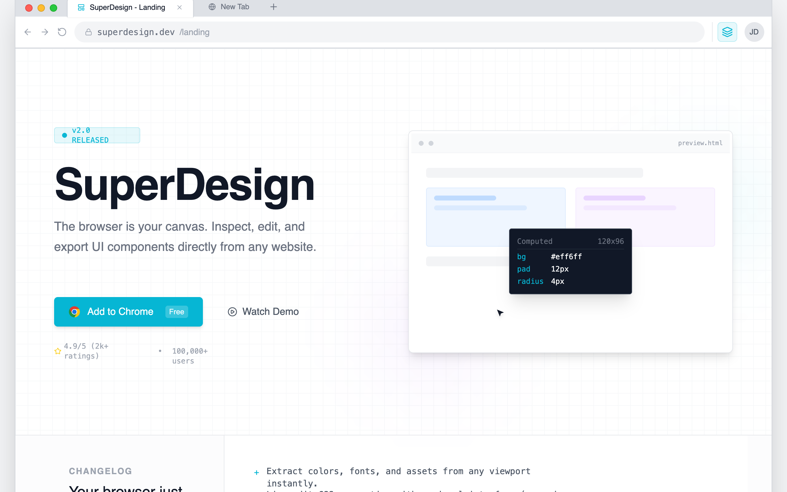

# Chrome Extension Landing Page

A browser-native developer tool aesthetic characterized by a 'system interface' look rather than a marketing landing page. This style features a light-neutral base with a vibrant cyan (#06B6D4) accent, mimicking the layout of Chrome DevTools or a workspace IDE. It uses a combination of Inter for primary readability and JetBrains Mono for technical labels and commands. Suitable for SaaS, developer tools, extensions, and technical platforms requiring a high-density, utility-focused layout with scroll-triggered panel reveals and simulated interactive environments.



## Prompt

```text
{
  "summary": "Create a high-density, technical landing page that simulates a browser workspace. The design must feel like a functional tool using tabbed navigation, sidebar inspectors, address bars, and monospaced data labels, primarily using a clean gray and white palette with sharp cyan highlights.",
  "style": {
    "description": "The style is 'Browser-Core Modernism' featuring high-contrast technical elements. Primary font: Inter (Sans-serif) for body; Secondary font: JetBrains Mono (Monospace) for data and shortcuts. Color Palette: Background #f3f4f6, Panel White #ffffff, Border #e5e7eb, Primary Accent #06B6D4. It includes custom UI scrollbars (10px width, #d1d5db thumb) and a background pattern grid (20px linear-gradient lines). Animations are functional: 0.4s slide-ups and ease-in-out cursor simulations.",
    "prompt": "Apply a 'DevTools' aesthetic using a light neutral base (#f3f4f6). Use 'Inter' for headings (weights 500, 600) and 'JetBrains Mono' for all technical labels and small captions. All interactive elements should use #06B6D4 for active states and hover outlines. Spacing should follow a strict 4px/8px grid system. Borders should be 1px solid #e5e7eb or #d1d5db. Containers should have a subtle shadow-panel effect (0 1px 3px 0 rgba(0,0,0,0.1)). Use a pattern-grid background with #e5e7eb lines every 20px at 30% opacity."
  },
  "layout_and_structure": {
    "description": "A nested viewport structure where the entire website is contained within a simulated browser frame, including tabs, navigation bar, and extension icons.",
    "prompts": [
      {
        "part": "Browser Chrome Frame",
        "prompt": "Top-level container mimicking a browser window. Include a tab bar with macOS-style traffic lights (Red #ff5f57, Yellow #febc2e, Green #28c840). Add an active tab with a white background and an address bar row featuring back/forward icons, a URL input field with a monospace font URL, and an extension area with a cyan-tinted (#06B6D41A) square icon button for the product."
      },
      {
        "part": "Hero Section",
        "prompt": "Split-pane layout. Left: Technical headline (size 72px, leading 0.9) with a pulse-animated version tag 'v2.0 RELEASED'. Primary CTA styled as a Chrome Store button (Cyan background, white text, Chrome icon). Right: A simulated interactive UI window showing a cursor-demo animation moving between card elements, triggering a dark-themed floating inspector tooltip (#111827) that displays CSS properties in cyan monospace text."
      },
      {
        "part": "Release Notes Section",
        "prompt": "A two-column grid with a vertical divider. Left column (300px): 'Changelog' label in uppercase 12px bold gray text. Right column: A monospaced list of features using '+' symbols as bullets in cyan, describing core product updates."
      },
      {
        "part": "Interactive Workspace",
        "prompt": "A three-panel layout resembling an IDE. Left Sidebar (256px): Explorer-style navigation with vertical icons and a 'Shortcuts' footer area showing keybindings in tiny bordered boxes. Center Stage: Large 'pattern-grid' area with a focused UI element surrounded by a cyan selection ring (2px) and pixel-dimension labels (e.g., '1200x400'). Right Sidebar (320px): A multi-section property inspector (Typography, Colors) using dropdowns, toggle buttons, and hex-code labels."
      },
      {
        "part": "README Manifesto",
        "prompt": "A dark-themed container (#0d1117) styled after a GitHub README. Include a top header bar with a filename 'README.md' and a content area with monospaced text, H3 headings starting with '#', and a block of code at the bottom representing an install command."
      },
      {
        "part": "Technical FAQ",
        "prompt": "A centered, narrow-column layout using standard HTML <details> elements for accordions. Use 14px font-size for questions and a muted gray for answers, maintaining the functional, documentation-heavy feel."
      }
    ]
  },
  "special_ui_components": [
    {
      "component": "Property Inspector Grid",
      "description": "High-density data entry UI",
      "prompt": "Build a sidebar section with a grid-cols-[80px_1fr] layout for label-value pairs. Labels use 10px monospaced gray text. Values are small 12px select inputs or color swatches (16px squares with rounded corners). Add a 'drag-to-resize' interaction indicator on text inputs for font sizes."
    },
    {
      "component": "Simulated Selection Box",
      "description": "Visual indicator for 'Inspecting' elements",
      "prompt": "Create a box with a 2px solid cyan (#06B6D4) border and a 4px white offset. Attach a top-left 'tag' label with a cyan background, white monospace text showing the element name (e.g., 'div.card'), and small white text showing dimensions."
    }
  ]
}
```

**▶ Try it live → [https://superdesign.dev/library/chrome-extension-landing-page](https://superdesign.dev/library/chrome-extension-landing-page)**

*592 copies · 2,430 tries · tags: chrome extension, landing page, gray, high contrast, browser native, developer tool, minimalist, macos, chrome, teal accent, blue accent, sass landing, style, product launch*
