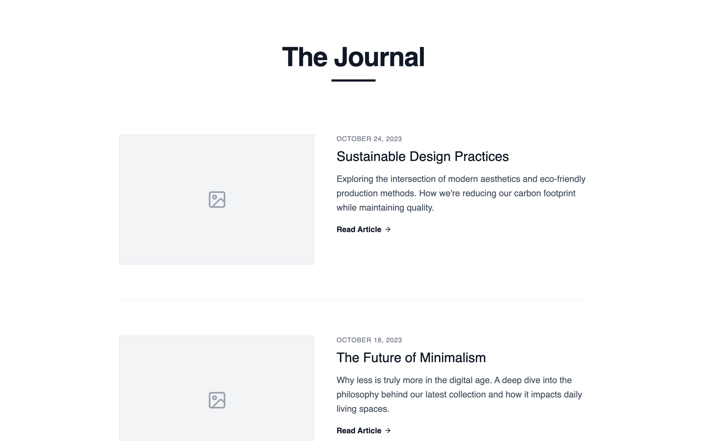

# Chronological Content Feed

A straightforward vertical list of blog posts ordered by date. Each entry includes a thumbnail placeholder, title, excerpt, and metadata. Optimized for reading flow and content discovery over time.

Best suited for
Content marketing blogs, product updates, founder blogs, SEO-driven publishing.



## Prompt

```text
{
  "summary": "Create a clean, minimalist blog index page with a monochromatic editorial aesthetic. Use a centered 896px max-width layout with a primary focus on typography (General Sans), generous vertical spacing, and 3:2 aspect ratio imagery placeholders. The design should feature a vertical list of posts with thin divider lines and a structured pagination system at the bottom.",
  "style": {
    "description": "The style is minimalist and high-contrast, utilizing 'General Sans' as the primary font with weights ranging from 400 to 700. The color palette is strictly grayscale: White (#FFFFFF) background, Dark Gray (#111827) for headings and primary text, and Medium Gray (#4B5563) for body text and metadata. Visual interest is generated through large heading sizes (4xl to 5xl), tracking-tight letter spacing, and subtle hover states like 1px underlines with 4px offsets. Transitions are smooth and subtle, focusing on color and text-decoration changes.",
    "prompt": "Apply a minimalist editorial style using 'General Sans' font family. Background must be #FFFFFF. Text colors: Primary #111827, Secondary #4B5563, Metadata/Dates #6B7280. Headlines should use font-size: 3rem (48px) with -0.025em tracking-tight. Post titles should be 1.5rem (24px) with font-weight: 500. Borders and dividers should be #F3F4F6 or #E5E7EB with a 1px thickness. Images must maintain a 3:2 aspect ratio with a #F3F4F6 light gray background and centered Lucide-style icons in #9CA3AF. Hover effects on titles should trigger a 1px underline with a 4px offset. Animation: all transitions (colors, backgrounds) should use ease-in-out over 200ms."
  },
  "layout_and_structure": {
    "description": "The layout is a single-column container centered on the page with a maximum width of 896px. It follows a top-down hierarchy: a centralized hero header, a vertical list of blog articles separated by horizontal rules, and a functional bottom pagination bar.",
    "prompts": [
      {
        "part": "Page Container",
        "prompt": "Main container is a vertical flex layout with min-height 100vh and white background. Content is constrained within a max-width: 896px (4xl) container, centered horizontally with padding-left and padding-right of 1.5rem (24px). Vertical padding for the whole container should be 5rem (80px) on desktop and 3rem (48px) on mobile."
      },
      {
        "part": "Header Section",
        "prompt": "Center-aligned header at the top. Main title 'The Journal' (or generic blog title) in #111827, font-size: 3rem, font-weight: 600, letter-spacing: tight. Below the title, include a decorative accent: a solid #111827 horizontal bar, width: 5rem (80px), height: 4px, centered. Margin-bottom for the header should be 6rem (96px)."
      },
      {
        "part": "Blog List & Articles",
        "prompt": "Vertical list of 5-6 articles with a gap of 4rem (64px) between items. Each article is a flex container: on mobile, stack elements vertically; on desktop (min-width: 768px), use horizontal flex with items-start and a 2.5rem (40px) gap. Left/Top element: Image placeholder (w-full on mobile, 41.6% width on desktop) with 3:2 aspect ratio, #F3F4F6 background, and 1px #E5E7EB border. Right/Bottom element: Text content containing metadata (Date in uppercase, 12px, tracking-wider, #6B7280), Post Title (24px, medium weight, #111827), and Excerpt (line-clamp to 3 lines, #4B5563, leading-relaxed). End each text block with a 'Read Article' link featuring a right arrow icon."
      },
      {
        "part": "Dividers",
        "prompt": "Place a 1px solid horizontal line (#F3F4F6) between each article component to create a clear visual separation without adding clutter."
      },
      {
        "part": "Pagination Section",
        "prompt": "Positioned at the bottom after a 5rem (80px) margin. Top border 1px solid #E5E7EB. Layout: space-between flex container. Left: 'Previous' link with left arrow. Center: Group of numbered page boxes (32px x 32px), active page is #111827 with white text and 2px border-radius, inactive pages are #4B5563 with hover background #F3F4F6. Right: 'Next' link with right arrow."
      }
    ]
  },
  "special_ui_components": [
    {
      "component": "Interactive Article Heading",
      "description": "A title that utilizes CSS text-decoration-thickness and underline-offset for a sophisticated hover effect.",
      "prompt": "Heading level 2 (h2) in post item. Font-size: 24px, font-weight: 500, color: #111827. On hover of the parent article container, the h2 should apply text-decoration: underline, text-decoration-thickness: 1px, and text-underline-offset: 4px. Transition should be immediate or 150ms."
    },
    {
      "component": "Minimal Image Placeholder",
      "description": "Structured placeholder box representing future photography.",
      "prompt": "Div with aspect-ratio: 3/2. Background-color: #F3F4F6. Border: 1px solid #E5E7EB. Center a Lucide 'image' icon inside using flexbox (justify-center, items-center). Icon color: #9CA3AF. Icon size: 36px."
    }
  ],
  "special_notes": "MUST: Maintain strict 3:2 aspect ratio for all thumbnails to ensure editorial consistency. MUST: Use 'General Sans' or a similar geometric sans-serif to preserve the clean aesthetic. MUST NOT: Use any shadows or gradients; depth should be created solely through border contrasts and grayscale tones. MUST: Ensure the 'Read Article' text and the Arrow icon are perfectly aligned horizontally."
}
```

**▶ Try it live → [https://superdesign.dev/library/chronological-content-feed](https://superdesign.dev/library/chronological-content-feed?utm_source=github&utm_medium=prompt-repo&utm_campaign=prompt-library)**

**Use it in your coding agent:** install the [Superdesign skill](https://github.com/superdesigndev/superdesign-skill), then:

```bash
superdesign get-prompts --slugs "chronological-content-feed" --json
```

*1 copies · 2,292 tries · Blog & Editorial · E-commerce & Retail · shopify, blog, layout, seo*
