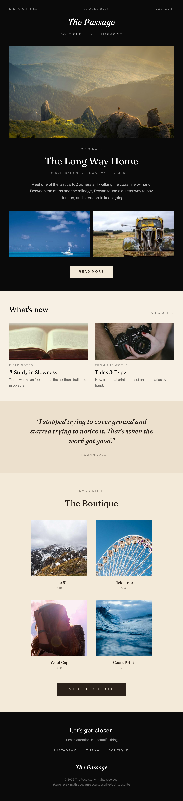

# Cinematic Editorial Newsletter Email

A cinematic, magazine-style editorial newsletter / digest email in a centered 640px column: a black masthead with issue metadata, a centered italic serif wordmark and a Boutique / Magazine nav, a full-bleed art-directed hero photo, an 'Originals' eyebrow + large serif headline + byline, a two-image split, and a cream 'Read more' button, all on black. Below, a warm-cream light section carries a 'What's new' two-up story grid, a deeper-cream pull-quote band, and a spacious 2x2 'Boutique' product grid with an espresso 'Shop' button, closing on a black footer. Fraunces serif display + Archivo tracked caps, black + warm cream + espresso. Reusable for any media, studio, or creator newsletter.



## Prompt

```text
{"summary": "A cinematic, magazine-style editorial newsletter / digest email in a centered ~640px column. It opens on a black masthead: a thin issue-metadata row (Dispatch number / date / volume), a centered italic serif wordmark, and a small Boutique / Magazine nav. The dark hero follows: a full-bleed art-directed landscape photo, an 'Originals' eyebrow, a large serif headline, a tracked byline row, a lead paragraph, a two-image split, and a cream 'Read more' button, all on black. The email then shifts to a unified warm-cream light section: a 'What's new' header with a 'View all' link over a two-up story grid (photo + kicker + serif title + caption), a deeper-cream pull-quote band with a large italic serif quote, and a spacious 2x2 'Boutique' product grid (square photo + serif name + price) with an espresso 'Shop the boutique' button. It closes on a black footer ('Let's get closer.', a small nav, the serif wordmark, and fine print).", "style": {"description": "Cinematic editorial / quiet-luxury magazine aesthetic. A black masthead-hero-footer frame wraps a unified warm-cream light body (no jarring colour shifts). High-contrast serif display (Fraunces, including italics) for the wordmark, headlines, and pull-quote pairs with heavily tracked all-caps Archivo for eyebrows, metadata, kickers, and buttons. Full-bleed art-directed photography carries the mood; buttons are tied to the palette (cream on black, espresso on cream) rather than stark black/white.", "prompt": "Design an editorial newsletter / digest email in a centered max-width 640px column. Use a black (#0a0a0a) masthead, hero, and footer as a frame around a warm-cream light body. Cream ramp: creamLt #f7f0e4 (light section base), cream #f3ead9 (boutique + light buttons), creamDp #ece0cd (pull-quote band); espresso #2a211a for light-section buttons and light-section text. Typography: Fraunces (serif display, 400-700, plus italic) for the wordmark, headlines, and the pull-quote; Archivo (sans, 500-700) UPPERCASE with heavy letter-spacing (~0.22em) for eyebrows, metadata, kickers, bylines, and button labels. Full-bleed photography for the hero, the two-image split, the two story cards, and the four product squares. Keep the light section MONOCHROMATIC warm-cream (do not introduce lilac/pink); vary only the cream tone between blocks. Buttons: 'Read more' = cream on the black hero; 'Shop' = espresso on cream. Email-safe: a centered column, no sticky nav."}, "layout_and_structure": {"description": "Centered ~640px column with a dark frame: (1) black masthead (issue meta row + centered italic wordmark + Boutique/Magazine nav), (2) black hero (full-bleed photo + eyebrow + serif headline + byline + lead + 2-image split + cream Read more), (3) warm-cream 'What's new' section (header + View all + 2-up story grid), (4) deeper-cream pull-quote band, (5) cream 'Boutique' section (2x2 product grid + espresso Shop button), (6) black footer. Reflows cleanly to one column at ~380px; the story and product grids stay 2-up.", "prompts": [{"part": "Masthead", "prompt": "A black band: a thin justified metadata row in tracked Archivo caps ('Dispatch No 51' / '12 June 2026' / 'Vol. XVIII') at white/55, a centered ~30px Fraunces 600 italic wordmark, and a centered nav ('Boutique . Magazine') in tracked Archivo caps at white/70."}, {"part": "Hero", "prompt": "On black: a full-bleed ~320px art-directed landscape photo, then centered content: an 'Originals' tracked-caps eyebrow, a ~34px Fraunces 600 headline (max-w ~440px), a tracked byline row (Conversation . Name . date) at white/50, a ~14px white/70 lead paragraph, a two-column image split (two ~160px photos), and a cream 'Read more' button in tracked Archivo caps."}, {"part": "What's new", "prompt": "On warm cream (creamLt): a header row with a ~26px Fraunces 600 'What's new' and a tracked-caps 'View all ->' link, then a 2-column grid of story cards, each = a ~128px photo, a tracked-caps kicker (e.g. 'Field Notes'), a ~18px Fraunces 600 title, and a ~12.5px ink/60 caption."}, {"part": "Pull quote", "prompt": "A deeper-cream (creamDp) band, centered: a ~23px Fraunces 500 italic quote (max-w ~440px, espresso) and a tracked-caps espresso/55 attribution."}, {"part": "Boutique", "prompt": "On cream: a tracked-caps 'Now online' eyebrow, a ~30px Fraunces 600 'The Boutique', a centered max-w-420px 2x2 grid of products (square photo + ~14px Fraunces 600 name + small price), and an espresso 'Shop the boutique' button in tracked Archivo caps."}, {"part": "Footer", "prompt": "A black band, centered: a ~22px Fraunces 600 'Let's get closer.', a small white/55 line, a tracked-caps nav (Instagram / Journal / Boutique), the ~20px Fraunces italic wordmark, and white/40 fine print with an Unsubscribe link."}]}, "special_ui_components": "Black editorial masthead with an issue-metadata row + centered italic serif wordmark; full-bleed art-directed photo hero with a two-image split; two-up story grid; deeper-cream pull-quote band; spacious 2x2 product grid; palette-tied cream-on-black and espresso-on-cream buttons.", "special_notes": "This is an editorial EMAIL layout: a centered ~640px column, no sticky nav. Uses a generic publication ('The Passage'), sample stories, and placeholder editorial photography so the spec ships without bundled assets; swap the wordmark, photos, stories, and products. The reusable value is the cinematic magazine structure (black masthead/hero/footer framing a warm-cream body, a story grid, a pull-quote band, and a 2x2 boutique) and the Fraunces + Archivo, black + warm-cream + espresso system."}
```
