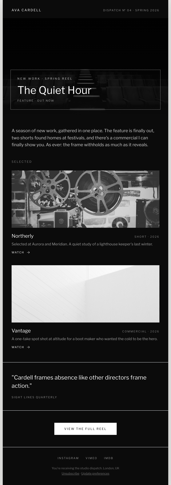

# Cinematic Grayscale Newsletter Email

A premium dark-mode creative newsletter email in a centered 600px column: near-black surface, crisp white Libre Franklin type, and full-bleed grayscale cinematic photography. A masthead + issue meta, a hero photo with a 1px hairline title box over it, an intro, two stacked 'selected work' blocks (grayscale still + title + caption + Watch link), an authority pull-quote, a high-contrast white CTA block, and a monochrome footer with unsubscribe. Reusable for filmmakers, photographers, and creative studios sending a 'new work' digest.



## Prompt

```text
{"summary": "A dark, cinematic creative newsletter / 'new work' digest email in a centered ~600px column on a near-black surface. A small tracked-caps masthead (studio name + issue meta) sits above a full-bleed grayscale hero photo carrying a 1px hairline title box (kicker + oversized headline + caption). An intro paragraph is followed by a 'Selected' list of two stacked work blocks, each a grayscale still, a title with a right-aligned meta label, a one-line caption, and a tracked 'Watch' link. Below: a bordered pull-quote for authority, a high-contrast solid-white CTA block, and a monochrome footer with social links + unsubscribe.", "style": {"description": "Premium editorial dark-mode. Near-black surface, crisp white + muted grey Libre Franklin sans, and desaturated grayscale imagery that pops like a dark theatre. Weight contrast (light 300 body vs 600-800 headings), heavy letter-spacing on caps micro-labels, thin hairline rules and a 1px hairline box as the signature framing device. No accent colour at all.", "prompt": "Design a creative-studio newsletter email in a centered max-width 600px column on a light grey body (#e6e6e4) with a near-black email surface (#0b0b0b) carrying a soft shadow. Typeface: Libre Franklin only (weights 300-800). Palette is monochrome: near-black surface, white text, white/55-white/40 for muted micro-copy, no accent colour. All imagery is grayscale (CSS filter: grayscale(1) contrast(1.06)). Micro-labels are tracked UPPERCASE (letter-spacing .2-.32em) at 10-11px. Headlines are font-800 with tight leading; body is font-300 at ~16px. Signature device: a 1px hairline border box (border-white/40) framing the hero title, echoed by hairline rules (border-white/12) between sections. The single CTA is a solid-white block with near-black tracked-caps label (maximum contrast). Email-safe: a fixed centered column, no sticky nav."}, "layout_and_structure": {"description": "Centered ~600px column: (1) masthead (wordmark + issue meta), (2) grayscale hero photo with a hairline title box overlaid at the bottom, (3) intro paragraph, (4) 'Selected' = two stacked work blocks, (5) bordered pull-quote, (6) solid-white CTA block, (7) monochrome footer with socials + unsubscribe. Reflows to one column at ~380px.", "prompts": [{"part": "Masthead", "prompt": "A row: left = tracked-caps wordmark (studio/author name, 12px 600); right = tracked-caps issue meta ('Dispatch No 04 \u00b7 Spring 2026', 10px, white/55)."}, {"part": "Hero + hairline title box", "prompt": "A ~360px full-width grayscale cinematic photo with a top-to-bottom black gradient scrim; overlaid at the bottom, a 1px hairline (border-white/40) box holding a tracked-caps kicker ('New work \u00b7 Spring reel'), an oversized ~38px font-800 headline, and a tracked-caps caption."}, {"part": "Intro", "prompt": "A single ~16px font-300 white/80 paragraph introducing the season of work."}, {"part": "Selected work (x2)", "prompt": "A tracked-caps 'Selected' label, then two stacked blocks; each = a ~208px grayscale still, a row with an 18px font-600 title + a right-aligned tracked-caps meta label, a ~13.5px white/60 caption, and a tracked-caps 'Watch ->' link."}, {"part": "Pull-quote", "prompt": "A section bordered top+bottom (border-white/12) with a ~21px font-300 italic-feeling quote and a tracked-caps attribution."}, {"part": "CTA + footer", "prompt": "A centered solid-white block CTA with a near-black tracked-caps label ('View the full reel'). Footer: centered tracked-caps social links (Instagram / Vimeo / IMDb) + white/40 fine print with an Unsubscribe link."}]}, "special_ui_components": "1px hairline title box overlaid on a full-bleed grayscale hero; grayscale 'selected work' blocks with title + right-aligned meta + Watch link; bordered pull-quote; maximum-contrast solid-white CTA block on dark.", "special_notes": "Email layout: centered ~600px column, no sticky nav. Generic placeholder brand ('Ava Cardell'/'The Quiet Hour') and stock grayscale photography so the spec is reusable; swap the wordmark, photos, and copy. The reusable value is the dark-cinematic monochrome email system (grayscale imagery + hairline title box + weight-contrast Franklin) and the 'new work digest' structure. Source system: reverse-engineered from a Canva director-portfolio template (measured grayscale + ITC Franklin Gothic)."}
```
