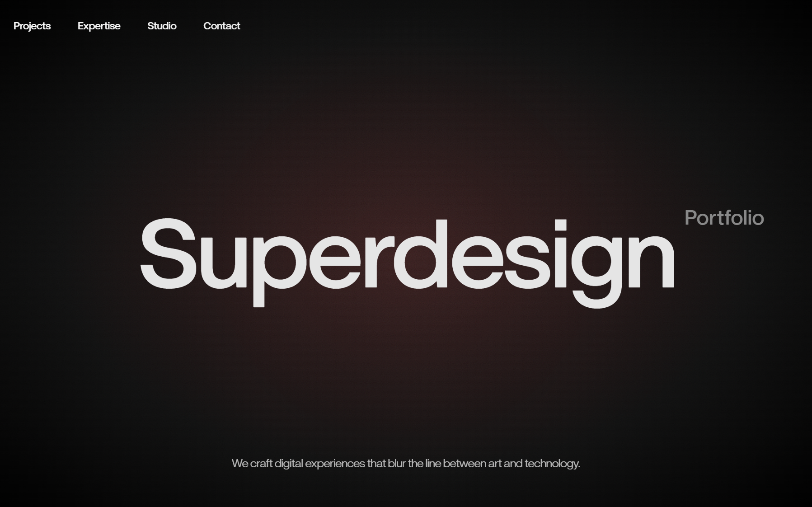

# Cinematic Noir Style

A high-end 'Cinematic Noir' design system characterized by dramatic dark-mode aesthetics, high-contrast editorial typography, and immersive scroll-driven parallax effects. Suitable for creative agencies, luxury fashion, fintech, and high-end portfolios. Features include grain overlays, radial gradients with subtle warm tints, and brutalist-scale headings that blur the line between digital interface and cinematic experience.



## Prompt

```text
{
  "summary": "The Cinematic Noir design system leverages deep blacks, crisp off-whites, and a sophisticated typographic scale to create an immersive, gallery-like experience. It relies heavily on ZTNature's weight variety—from hair-thin italics to heavy blacks—and uses scroll-linked transforms to provide a sense of physical depth.",
  "style": {
    "description": "The style is built on a high-contrast monochromatic palette with a singular pop of red (#ef4444) for selections. Typography uses the ZTNature font family with extreme weight pairings (Thin Italic next to Black). Layouts use generous white (or black) space. Motion is fluid and scroll-bound, utilizing scale and opacity transforms to simulate lens focal shifts.",
    "prompt": "Color Palette: Backgrounds: Deep Black (#000000), Zinc Black (#09090b), Surface Gray (#18181b), Pure White (#FFFFFF), Ghost White (#fafafa). Foreground: Off-White (#e5e5e5), Muted Gray (#888), Deep Black (#000000). Highlight: Red (#ef4444). \nTypography: Font family 'ZTNature'. Headings: 11vw-12vw size, font-weight 900 (Black) or 500 (Medium), tracking -0.03em. Body: 1.25rem (20px) font-weight 300 (Light) or 400 (Regular), tracking tight. Sub-labels: 14px Mono for categories. \nEffects: Noise overlay at 15% opacity using mix-blend-overlay. Radial gradient background: radial-gradient(ellipse at center, rgba(139,69,69,0.4) 0%, rgba(20,20,20,0.8) 60%, rgba(0,0,0,0.95) 100%). \nMotion: Use cubic-bezier(0.16, 1, 0.3, 1) for entrance animations. Scroll-linked transforms: Scale 1.0 -> 1.27 for backgrounds, 1.0 -> 0.89 for hero headings."
  },
  "layout_and_structure": {
    "description": "A vertical narrative structure consisting of a full-screen immersive hero, a high-contrast grid for featured work, a focused minimalist manifesto section, and a heavy-type footer.",
    "prompts": [
      {
        "part": "Navbar",
        "prompt": "Fixed at top-0, w-full, z-50. Use 'mix-blend-difference' to ensure visibility against changing backgrounds. Spacing: px-6, py-8. Links in 18px font-weight 500, tracking tight. Desktop: Horizontal flex with 3rem gap. Mobile: Single Lucide 'Menu' icon."
      },
      {
        "part": "Immersive Hero",
        "prompt": "Height: 100vh (min-h: 857px). Centered stack of elements. Layer 1 (Back): Background image with radial tint and grain, scale linked to scroll (1.0 to 1.27). Layer 2 (Mid): Large heading (12vw) text in #e5e5e5, scale linked to scroll (1.0 to 0.89). Layer 3 (Overlay): Secondary label (32px) positioned absolute 'left-[calc(100%+1rem)]' relative to heading, fading out on scroll. Bottom: Description text (max-w-2xl) in white/70% opacity."
      },
      {
        "part": "Project Grid",
        "prompt": "Background: #FFFFFF. Text: #000000. Padding: py-24, px-6. Heading: 'SELECTED WORKS' in 8vw Black weight, 'WORKS' in italic Thin weight. Grid: 2-column layout with 2rem gaps. Cards: Aspect ratio 16:10, zoom effect on hover, bottom-aligned titles with transition from translateY(1rem) to 0. Hover state reveals a white circular button with an ArrowUpRight icon."
      },
      {
        "part": "Manifesto Section",
        "prompt": "Background: #09090b. Height: 100vh. Centered text: 5vw-7vw font-weight 500, leading-tight. Animation: Text slides up with opacity 0->1. Below text: a horizontal line (#ffffff/30% opacity) that animates its width from 0 to 100% (max-w 320px) on scroll-into-view."
      },
      {
        "part": "Project Contact Footer",
        "prompt": "Background: #fafafa. Padding: py-20, px-6. Top element: Full-width border-b text 'START A PROJECT' at 12vw, Black weight, uppercase. Bottom: 3-column grid. Column 1: Social links with wavy underline hover. Column 2: Contact email (3xl font). Column 3: Rights reserved text aligned bottom-right."
      }
    ]
  },
  "special_ui_components": [
    {
      "component": "Scroll-Linked Zoom Header",
      "description": "A hero text component that creates a 'receding' effect into the screen as the user scrolls down, simulating depth.",
      "prompt": "Container relative, overflow-hidden. Apply Framer Motion `useScroll` to capture Y-axis. Map scroll 0-30% of viewport to a scale of 1.0 to 0.89 on the main 12vw heading. Ensure `transform-style: preserve-3d` and `will-change: transform` are applied for GPU acceleration."
    },
    {
      "component": "Interactive Project Card",
      "description": "A card with a sophisticated reveal animation that shifts metadata and icons simultaneously.",
      "prompt": "Card container: aspect-ratio 4/5 (mobile) or 16/10 (desktop), background #18181b. Image layer: scales 1.05 on hover. Info layer: absolute bottom-0, p-10. Title: 5xl font. On hover: Metadata translates Y from 4px to 0px; Action button (white circle) fades from 0 to 1 opacity with 300ms duration."
    }
  ],
  "special_notes": "MUST: Use 'ZTNature' or a similar high-contrast serif/sans-serif pair with weights from 100 to 900. MUST: Apply a subtle grain overlay to the entire site to achieve the 'Noir' look. MUST: Maintain 'mix-blend-difference' on the navigation to handle the white/black section transitions. DO NOT: Use vibrant colors except for the #ef4444 selection color. DO NOT: Add rounded corners; all edges should be sharp and architectural."
}
```

**▶ Try it live → [https://superdesign.dev/library/cinematic-noir-style](https://superdesign.dev/library/cinematic-noir-style?utm_source=github&utm_medium=prompt-repo&utm_campaign=prompt-library)**

**Use it in your coding agent:** install the [Superdesign skill](https://github.com/superdesigndev/superdesign-skill), then:

```bash
superdesign get-prompts --slugs "cinematic-noir-style" --json
```

*643 copies · 2,317 tries · landing page, page, style*
