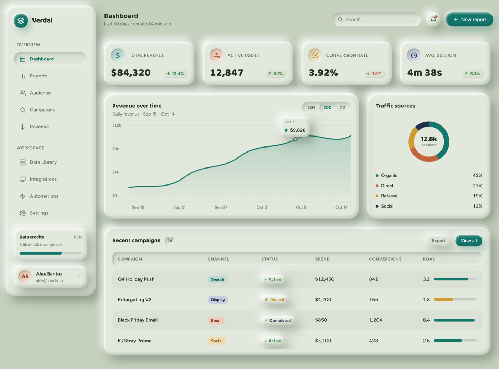

# Claymorphism Analytics Dashboard (Soft Sage Clay UI)

A claymorphism analytics dashboard in mid-tone dusty sage: a puffy sidebar, a four-up KPI stat row with delta pills, a revenue area chart with an anchored tooltip, a traffic-sources donut, and a scrollable campaigns table. Soft pressed-clay surfaces (raised cards, sunken controls), Baloo 2 + Figtree, jewel accents. Fully responsive.



## Prompt

```text
{
  "summary": "A claymorphism analytics dashboard rendered in a soft, mid-tone dusty-sage palette. A two-pane app shell: a puffy left sidebar holds a rounded logo tile + wordmark, an OVERVIEW nav group (Dashboard active, Reports, Audience, Campaigns, Revenue) and a WORKSPACE nav group (Data Library, Integrations, Automations, Settings) as pressed-in clay pills, a 'Data credits 68%' progress meter, and an account chip (avatar + name + email). The main panel opens with a topbar (page title 'Dashboard' + 'Last 30 days' subtitle, a sunken search field, a notification bell with a dot, and a teal 'New report' clay button). Below: a four-up KPI stat row (Total Revenue $84,320, Active Users 12,847, Conversion Rate 3.92%, Avg Session 4m 38s) where each tile has a soft-tinted icon chip and a coloured up/down delta pill. Then a 8/4 split: a 'Revenue over time' area chart (teal line + gradient fill, y-axis $0-$12k, x-axis Sep 15 - Oct 14, a 12M/30D/7D segmented toggle, and a floating clay tooltip 'Oct 7 / $9,820' anchored by a connector stem to a ringed marker on the line) and a 'Traffic sources' donut (12.8k sessions center label; Organic 42% / Direct 27% / Referral 19% / Social 12% legend in teal/rust/brass/navy). Finally a 'Recent campaigns' data table: header row (Campaign, Channel, Status, Spend, Conversions, ROAS) then rows (Q4 Holiday Push / Search / Active, Retargeting V2 / Display / Paused, Black Friday Email / Email / Completed, IG Story Promo / Social / Active) with clay channel tags, status pills, and a ROAS value + progress meter. On mobile the sidebar, KPI grid, and chart/donut stack, and the table scrolls horizontally inside its card.",
  "style": {
    "description": "Claymorphism (soft, puffy, pressed clay) on a genuinely MID-TONE dusty-sage ground, deliberately NOT pastel and NOT candy-bright (both already occupied). The whole UI is one soft-clay material: raised surfaces (cards, KPI tiles, buttons, the account chip) use a dual soft shadow - a dark bottom-right shadow plus a light top-left highlight - to read as gently extruded; inset 'sunken' shadows on the search field, credit meter, segmented toggle, and table header make those read as pressed IN. Corners are generously rounded (24-28px on cards, full-round on pills and meters). Colour is restrained: a desaturated sage ground and surfaces carry the design, dark forest-green ink for text, muted sage-grey for secondary text, and four small JEWEL accents used only for meaning - teal (primary / positive), rust (alert / a donut slice), brass (warning / referral), navy (social). No default indigo/violet, no gradients-as-decoration, no emoji. Typography pairs a rounded friendly display (Baloo 2) for headings and numbers with a clean humanist sans (Figtree) for body and labels - the rounded display echoes the puffy clay geometry.",
    "prompt": "Design an analytics dashboard entirely in a soft claymorphism material on a mid-tone dusty-sage ground (#c5d0be), with clay surfaces #dbe2d5 and #e2e8dc, dark forest ink #26301f, and muted sage-grey #6b7663 for secondary text. Give every raised element (cards, KPI tiles, buttons, avatar, logo tile) a dual soft shadow: a dark bottom-right shadow rgba(88,104,84,.5) at 12px 14px 30px plus a light top-left highlight rgba(255,255,255,.95) at -8px -10px 22px. Give pressed elements (search field, progress meters, the 30D toggle, the table header strip) inset shadows so they read as sunken. Round card corners 24-28px, make pills and meters fully round. Use only four small jewel accents for meaning - teal #14776b (primary/positive), rust #c4643f, brass #cf9b34, navy #22304a - never as background wash. Type: Baloo 2 for headings and big numbers, Figtree for body and labels. No indigo/violet, no decorative gradients, no emoji. Keep it tasteful and restrained so the clay reads as soft physical material, not a toy."
  },
  "layout_and_structure": {
    "description": "A two-pane app shell inside a max-width container: a fixed ~260px left sidebar beside a flexible main column. Main = topbar, then a stacked content region: a four-up KPI stat grid, an 8/4 grid pairing the revenue area chart with the traffic donut, and a full-width campaigns table. Responsive: below the md breakpoint the sidebar drops to a full-width block on top, the KPI grid becomes 2-up, the chart and donut stack to one column, and the campaigns table scrolls horizontally within its clay card.",
    "prompts": [
      {
        "part": "Sidebar",
        "prompt": "A raised clay sidebar (~260px, rounded 28px). Top: a rounded teal logo tile + bold Baloo 2 wordmark. Two nav groups with small tracked-caps labels (OVERVIEW, WORKSPACE); each item is a row with a 18px line icon + label. The active item ('Dashboard') is a pressed-in clay pill in teal; the rest are quiet. Near the bottom: a 'Data credits' block with a percent and a sunken clay progress meter (teal fill ~68%). Bottom: an account chip (circular avatar with initials, name, email, a kebab)."
      },
      {
        "part": "Topbar",
        "prompt": "A header row: left, a Baloo 2 page title 'Dashboard' over a muted 'Last 30 days - updated 4 min ago' subtitle. Right, a sunken clay search field with a magnifier (hidden on mobile), a round raised clay bell button with a rust notification dot, and a teal clay 'New report' button with a plus icon. Wrap gracefully on small screens."
      },
      {
        "part": "KPI stat row",
        "prompt": "A four-up grid (2-up on mobile) of raised clay stat tiles. Each tile: a soft-tinted round icon chip (dollar, users, target, clock), a tracked-caps label (TOTAL REVENUE, ACTIVE USERS, CONVERSION RATE, AVG. SESSION), a large Baloo 2 tabular number ($84,320 / 12,847 / 3.92% / 4m 38s), and a small delta pill (green up '12.4%' / '8.1%' / '5.3%', rust down '1.6%')."
      },
      {
        "part": "Revenue area chart",
        "prompt": "A raised clay card spanning ~2/3 width. Header: 'Revenue over time' + 'Daily revenue - Sep 15 to Oct 14', with a sunken segmented toggle (12M / 30D active / 7D). Plot: a left y-axis ($0, $4k, $8k, $12k), faint horizontal gridlines, a smooth teal line with a soft teal gradient area fill that runs edge to edge (last point sits on the final Oct 14 tick), a ringed marker on the line, and a small raised clay tooltip ('Oct 7' / dot + '$9,820') centered ABOVE the marker with a short vertical connector stem. X-axis date labels beneath."
      },
      {
        "part": "Traffic donut",
        "prompt": "A raised clay card spanning ~1/3 width. A donut chart (thick ring, four segments in teal/rust/brass/navy) with a centered '12.8k / sessions' label, above a legend of four rows (colour dot + name + right-aligned percent): Organic 42%, Direct 27%, Referral 19%, Social 12%."
      },
      {
        "part": "Campaigns table",
        "prompt": "A full-width raised clay card 'Recent campaigns' with a count badge and Export / 'View all' buttons. A sunken clay header strip (Campaign, Channel, Status, Spend, Conversions, ROAS), then rows on alternating clay tints: campaign name, a tinted clay channel tag (Search/Display/Email/Social), a status pill (green dot Active, half-circle Paused, check Completed), tabular Spend and Conversions, and a ROAS value beside a small sunken meter bar. On mobile the whole table scrolls horizontally inside the card (min-width preserved) so columns never crush."
      }
    ]
  },
  "special_ui_components": [
    {
      "component": "Raised clay card / KPI tile",
      "description": "The core puffy surface used for every panel and stat tile.",
      "prompt": "A rounded (24-28px) surface in #e2e8dc with a dual soft shadow - dark bottom-right rgba(88,104,84,.5) 12px 14px 30px plus light top-left highlight rgba(255,255,255,.95) -8px -10px 22px - so it reads as gently extruded clay. No border."
    },
    {
      "component": "Sunken (pressed-in) clay control",
      "description": "Search field, progress meter, segmented toggle, table header - the 'pressed IN' counterpart.",
      "prompt": "A rounded element in #dbe2d5 with INSET shadows - inset 4px 5px 10px rgba(104,118,100,.38) plus inset -3px -4px 9px rgba(255,255,255,.7) - so it reads as pressed into the surface. Use for the search field, credit meter, 30D toggle, and the table header strip."
    },
    {
      "component": "Delta pill",
      "description": "The up/down change indicator on each KPI tile.",
      "prompt": "A small full-round pill with a tiny triangle glyph and a percent; green (#3f8f4a) for positive deltas, rust (#c4643f) for negative, set on a soft-tinted clay ground."
    },
    {
      "component": "Anchored chart tooltip with connector",
      "description": "A floating value callout tied to its data marker.",
      "prompt": "A small raised clay tooltip showing a date label and a coloured dot + value, positioned centered directly ABOVE the marker on the line, with a short 1px vertical connector stem reaching down to the marker ring so it never floats free."
    },
    {
      "component": "Segmented range toggle",
      "description": "The 12M / 30D / 7D chart range switch.",
      "prompt": "A sunken clay pill container holding three text options; the active one (30D) is a pressed-in inner clay pill in teal, the others are quiet muted-grey text."
    },
    {
      "component": "Status + channel pills",
      "description": "The campaigns table's categorical tags.",
      "prompt": "Channel tags are small tinted clay chips (teal for Search, navy for Display, rust for Email, brass for Social). Status pills carry a leading glyph: a green dot for Active, a half-filled circle for Paused, a check for Completed - each on a raised clay chip."
    },
    {
      "component": "Horizontally scrollable data table",
      "description": "Keeps a dense 6-column table usable on mobile.",
      "prompt": "Wrap the table body in a horizontal-scroll container with a preserved min-width so on narrow screens the six columns keep their spacing and the user scrolls sideways inside the card instead of the columns crushing or the page overflowing."
    }
  ]
}
```
