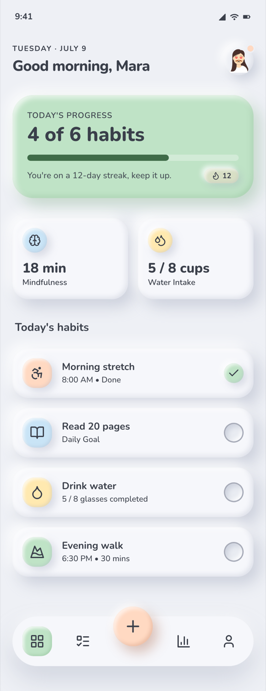

# Claymorphism Mobile App: Pastel Habit Tracker Home

A light claymorphism mobile app home screen for a friendly habit and wellness tracker. Soft, inflated pastel "clay" cards (sage, peach, butter-yellow, sky-blue) on a cool cream-grey ground, with the signature dual soft shadow plus inset highlight that makes every surface look puffy. A rounded Nunito type scale, a tracked-caps date over a single bold greeting, a sage progress hero card with a rounded-cap progress bar and a streak chip, two puffy stat tiles, a scannable habit list with clear done-versus-pending toggle states, and an in-flow floating tab bar with a raised peach round add button. Light mode, real phone proportions, no dark neumorphism and no purple gradient. Reusable for any friendly consumer app home (habit, wellness, mood, budgeting, language learning).



## Prompt

```text
{
  "summary": "A polished LIGHT CLAYMORPHISM mobile app home screen for a friendly habit and wellness tracker ('Sprout'). Real ~390px phone proportions on a cool cream-grey clay ground, built entirely from soft, inflated pastel 'clay' surfaces. Top: an iOS status bar, then a small tracked-caps date eyebrow over a single bold greeting ('Good morning, Mara') with a puffy circular avatar tile (small peach notification dot). A sage-green progress hero card shows 'TODAY'S PROGRESS / 4 of 6 habits', a rounded-cap progress bar, an encouraging streak line, and a small clay streak chip (flame + 12). Below, two puffy stat tiles (a sky-blue brain icon '18 min Mindfulness', a butter-yellow drop '5 / 8 cups Water Intake'). Then a 'Today's habits' list of clay rows, each = a pastel rounded icon tile + title + meta + a right-side toggle (a raised sage check for done, a clearly-ringed inset well for pending). It closes on an in-flow floating pill tab bar (Home / Habits / Stats / Profile) with a raised peach round '+' quick-add button lifted above the bar. Everything uses the claymorphism dual-soft-shadow + inset recipe to look inflated and tactile. Light mode; deliberately NOT dark neumorphism and NO purple gradient.",
  "style": {
    "description": "Light claymorphism / soft inflated pastel UI. A cool cream-grey clay ground, harmonized low-saturation pastels (sage, peach, butter, sky), very large corner radii, a rounded geometric sans, and the signature clay shadow (outer soft drop + outer white highlight + inset pair) so every card and icon reads as puffy and inflated. Charcoal text, never pure black. Left-aligned, calm, friendly.",
    "prompt": "Design a LIGHT claymorphism mobile screen. Ground: cool cream-grey #eef0f5; card surface #f6f7fb (slightly lighter than the ground so the puffiness reads). Palette is harmonized low-saturation pastels, NO purple/indigo anywhere: sage #bfe3c6 (text #3f6b48), peach #ffd9c2 (text #a4593a), butter #ffe9b0 (text #8a6d1f), sky #c9e4f6 (text #3a6a8a); ink text #3a3f4a, muted #8a90a0. Tinted cards/icons pair the pastel fill with its darker shade for legible text (contrast >= 4.5:1). Font: Nunito (800 for greetings/metric numbers, 700 for card titles, 600 tracked labels/meta, 400-500 body). Very large radii: hero card 34px, standard cards 26px, icon tiles 20px, pills 18px, avatars/circles 50%. THE CORE is the clay shadow on every raised surface = an outer soft drop bottom-right (e.g. 10px 12px 24px rgba(163,170,190,.45)) + an outer white highlight top-left (-8px -8px 20px rgba(255,255,255,.9)) + an inset pair (inset -3px -3px 8px rgba(163,170,190,.28), inset 4px 4px 8px rgba(255,255,255,.75)) so it looks inflated. Tinted cards swap the grey drop for a same-hue tinted drop. Pressed/progress states use pure inset (sunken) clay. Keep it light, tactile, calm; NEVER dark neumorphism, NEVER a purple gradient.",
    "prompts": []
  },
  "layout_and_structure": {
    "description": "A single vertical mobile home screen in natural document flow (no fixed overlay clipping content): status bar, header (date eyebrow + single greeting + avatar), sage progress hero card, a two-up stat-tile row, a 'Today's habits' list of clay rows, and an in-flow floating tab bar with a raised '+' FAB. Real ~390-430px phone width, 20px side padding, 16px gaps.",
    "prompts": [
      {
        "part": "Status bar",
        "prompt": "A light iOS-style status bar: time left (9:41), signal / wifi / battery glyphs right, in muted charcoal."
      },
      {
        "part": "Header",
        "prompt": "Left: a small tracked all-caps date eyebrow ('TUESDAY · JULY 9') in muted grey above a single bold Nunito-800 greeting ('Good morning, Mara'). ONE greeting only, never doubled. Right: a puffy circular avatar tile (clay-raised) with a tiny peach notification dot."
      },
      {
        "part": "Progress hero card",
        "prompt": "A large sage-green (#bfe3c6) clay card with a same-hue tinted drop shadow. Inside: a tracked-caps eyebrow 'TODAY'S PROGRESS', a big Nunito-800 '4 of 6 habits', a rounded-cap progress bar (~67% filled in a deeper sage on a pale track), an encouraging line ('You're on a 12-day streak, keep it up.'), and a small clay pill chip bottom-right with a flame glyph + '12'."
      },
      {
        "part": "Stat tiles",
        "prompt": "A two-column row of puffy white clay tiles. Each = a pastel rounded icon tile top-left (tile 1: sky-blue brain), a big Nunito-800 metric ('18 min'), and a muted label ('Mindfulness'). Tile 2: butter-yellow water-drop icon, '5 / 8 cups', 'Water Intake'."
      },
      {
        "part": "Today's habits list",
        "prompt": "A section label 'Today's habits' (Nunito-700), then a vertical list of clay rows. Each row = a pastel rounded icon tile (peach stretch, sky book, butter drop, sage walk), a bold habit title, a muted meta line ('8:00 AM · Done', 'Daily Goal', '5 / 8 glasses completed', '6:30 PM · 30 mins'), and a right-side toggle. Toggle states must be obviously distinct: DONE = a raised sage circle with a check; PENDING = a clearly visible ringed inset clay well (2px mid-grey ring), never a near-invisible pale circle. ALL rows fully visible; add bottom padding so the last row clears the tab bar."
      },
      {
        "part": "Tab bar",
        "prompt": "An in-flow floating pill tab bar (not a fixed overlay that clips content): four icons (Home active in a sage clay tile, Habits, Stats, Profile) with a raised peach (#ffd9c2) round '+' quick-add button lifted above the bar's center. Clay-puffy, with a clear gap between the last list row and the bar."
      }
    ]
  },
  "special_ui_components": [
    {
      "component": "Claymorphism card",
      "description": "The inflated puffy surface used for every raised element.",
      "prompt": "A rounded card (radius 26px, hero 34px) on #f6f7fb with the clay shadow stack: an outer soft drop bottom-right (10px 12px 24px rgba(163,170,190,.45)), an outer white highlight top-left (-8px -8px 20px rgba(255,255,255,.9)), and an inset pair (inset -3px -3px 8px rgba(163,170,190,.28), inset 4px 4px 8px rgba(255,255,255,.75)) so it reads as inflated. Tinted variants swap the grey drop for a same-hue tinted drop."
    },
    {
      "component": "Pastel icon tile",
      "description": "A soft rounded clay chip holding a line icon, color-coded per habit.",
      "prompt": "A ~44px rounded-square tile (radius 20px) filled with a low-saturation pastel (sage / peach / butter / sky), gently raised with a clay shadow, holding a single charcoal or same-hue line icon centered. Used for stat tiles, habit rows, and the active tab."
    },
    {
      "component": "Sage progress hero",
      "description": "The tinted primary card summarizing today's completion.",
      "prompt": "A large sage-green clay card with a tracked-caps eyebrow, a big Nunito-800 count ('4 of 6 habits'), a rounded-cap progress bar filled ~67% in deeper sage on a pale track, an encouraging body line, and a small clay streak chip (flame + number)."
    },
    {
      "component": "Clay toggle states",
      "description": "The done-vs-pending habit checkbox, made unambiguous.",
      "prompt": "DONE = a raised sage-green circle with a white/charcoal check (clay-raised). PENDING = a sunken inset clay well with a clearly visible 2px mid-grey ring, obviously tappable and obviously distinct from done. Never render pending as a near-invisible pale grey circle."
    },
    {
      "component": "Floating clay tab bar with FAB",
      "description": "The bottom navigation, in-flow so it never clips content.",
      "prompt": "An in-flow floating pill (radius 26px) with four evenly-spaced icons and an active state (sage clay tile behind the current icon), plus a raised peach round '+' FAB lifted above the bar's center with its own clay shadow. Place it in natural document flow with a gap above, not as a fixed overlay that hides the last list item."
    }
  ]
}
```

**▶ [Try it live →](https://superdesign.dev/library/claymorphism-mobile-app-pastel-habit-tracker-home?utm_source=github&utm_medium=prompt-repo&utm_campaign=prompt-library)**

**Use it in your coding agent:** install the [Superdesign skill](https://github.com/superdesigndev/superdesign-skill), then:

```bash
superdesign get-prompts --slugs "claymorphism-mobile-app-pastel-habit-tracker-home" --json
```

*0 copies · 0 tries · Mobile Apps · Health & Wellness · claymorphism, claymorphism-ui, claymorphism-app, mobile-app-design*
