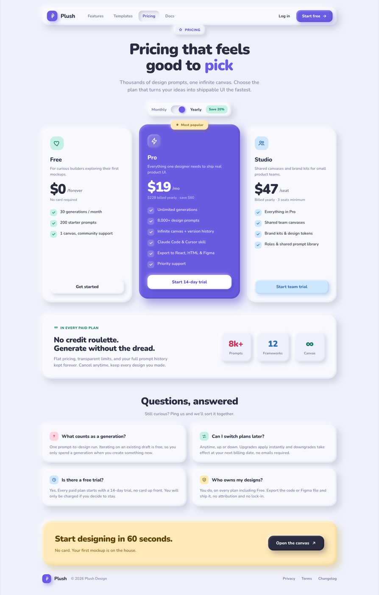

# Claymorphism Pricing Page: Puffy Candy-Clay SaaS Plans

A bright candy-clay (claymorphism / soft-UI) SaaS pricing page: puffy, inflated cards on a cool pale-lilac ground with the signature clay shadow, a Monthly/Yearly billing toggle, three tiers with a highlighted deep-violet Pro plan, an in-every-plan feature strip, and a 2x2 FAQ.



## Prompt

```text
{"summary": "A desktop claymorphism SaaS pricing page in a bright candy palette. Everything is soft, puffy and inflated: on a cool pale-lilac ground (#eef0fb), each raised surface carries the signature clay shadow trio (an outer soft drop bottom-right, an outer white highlight top-left, and an inset highlight/shadow pair) with very large corner radii, so cards, icon tiles and buttons look like pressed clay. Top to bottom: (1) a floating rounded clay nav bar with a violet brand tile + 'Plush' wordmark, center links (Features, Templates, Pricing as a sunken/inset active pill, Docs), and a right-side ghost 'Log in' plus a puffy violet 'Start free' CTA; (2) a centered hero with a puffy 'Pricing' badge, a large Nunito headline 'Pricing that feels good to pick' (the word 'pick' in violet), a muted sub-paragraph, and a Monthly/Yearly billing toggle built as a clay pill with a sliding violet knob and a mint 'Save 20%' chip; (3) a three-tier plan row: Free (mint-tinted clay, $0/forever, 3 features, outline CTA), a highlighted deep-violet Pro card lifted slightly with a butter 'Most popular' chip (white text, $19/mo, '$228 billed yearly \u00b7 save $60', six features, white CTA 'Start 14-day trial'), and Studio (sky-tinted clay, $47/seat, 4 features, sky CTA); each plan card leads with a puffy colored icon tile, a big tabular price block, and a feature list where every row has a small clay check bubble; (4) a wide 'In every paid plan' feature strip with an eyebrow, a headline 'No credit roulette. Generate without the dread.', a blurb, and three puffy stat bubbles (8k+ Prompts, 12 Frameworks, infinite Canvas); (5) a 2x2 FAQ grid of puffy clay cards each with a tinted question icon; (6) a butter-colored footer CTA band 'Start designing in 60 seconds.' with a dark 'Open the canvas' button, then a thin footer row. Bright, friendly, tactile, legible.", "style": {"description": "Bright candy CLAYMORPHISM (soft-UI). A cool pale-lilac ground with slightly-lighter card surfaces so the puffiness reads, harmonized candy tints (mint, coral, sky, butter) each paired with a darker same-hue text for legibility, one saturated deep-violet as the highlighted-plan anchor, a rounded geometric sans (Nunito), and the signature clay shadow on every raised surface so the whole page looks inflated and pressable. Charcoal text, never pure black. Warm, playful, tactile, NOT flat and NOT a purple page gradient.", "prompt": "Design a LIGHT claymorphism (soft-UI) desktop pricing page. Ground: cool pale-lilac #eef0fb; neutral card surface #f8f9ff (slightly lighter than the ground so the puffiness reads). Text: ink #2b2c40 (never pure black), muted #7b7e9a. Candy tints, each with a darker same-hue text for contrast >= 4.5:1: mint #c7f0e4 / text #0f7a66, coral #ffd4de / text #c23a5c, sky #cfe6ff / text #2f6fb0, butter #ffe9b8 / text #8a6510. Use ONE saturated deep-violet #6a5ce0 with WHITE text for the highlighted plan only (never as a full-page background gradient). Font: Nunito (900 for the hero headline and prices, 800 plan names, 700 card titles, 600 tracked labels/meta, 400-500 body). Very large radii: plan cards 34px, standard cards 26px, buttons/pills 18px, icon tiles 16-18px. THE CORE is the clay shadow on every raised surface = an outer soft drop bottom-right (e.g. 10px 12px 24px rgba(163,170,190,.45)) + an outer white highlight top-left (-8px -8px 20px rgba(255,255,255,.9)) + an inset pair (inset -3px -3px 8px rgba(163,170,190,.28), inset 4px 4px 8px rgba(255,255,255,.75)) so it looks inflated; colored cards swap the grey drop for a same-hue tinted drop; sunken/active states (the toggle track, the active nav pill) use a pure inset clay. Draw every icon as inline SVG. Keep it bright, friendly, tactile; NEVER dark neumorphism, NEVER a purple page gradient, NEVER lorem or emoji.", "colors": {"ground": "#eef0fb", "surface": "#f8f9ff", "ink": "#2b2c40", "muted": "#7b7e9a", "mint": "#c7f0e4", "mint_text": "#0f7a66", "coral": "#ffd4de", "coral_text": "#c23a5c", "sky": "#cfe6ff", "sky_text": "#2f6fb0", "butter": "#ffe9b8", "butter_text": "#8a6510", "violet": "#6a5ce0"}, "typography": {"font": "Nunito", "hero": "58px / 900", "price": "52px / 900 tabular-nums", "plan_name": "22px / 800", "body": "15px / 500-600"}}, "layout_and_structure": {"description": "A frameless single-column desktop page on a centered max-w-1200 container, ~40px side padding. Order: (1) floating clay nav bar, (2) centered hero with badge + headline + sub + billing toggle, (3) three-tier plan row (Free / highlighted Pro / Studio) as a 3-column grid where the middle card is lifted, (4) a wide 'in every plan' feature strip, (5) a 2x2 FAQ grid, (6) a footer CTA band + thin footer row. Everything is fully visible in one full-page screenshot; nothing sits behind a fixed element.", "prompts": [{"part": "Floating clay nav", "prompt": "A puffy rounded (24px) nav bar (NOT a flat bar) on the surface color with the full clay shadow, ~64px tall, inside the max-w-1200 container. Left: a violet #6a5ce0 rounded-14 brand tile holding a white inline-SVG mark + a Nunito 'Plush' wordmark (21px/800). Center links (Features, Templates, Pricing, Docs) as muted 700 pills; the active 'Pricing' is a SUNKEN inset-clay pill in violet-deep text. Right: a ghost 'Log in' link + a puffy violet 'Start free' CTA pill with a right-arrow SVG (white text, violet clay shadow)."}, {"part": "Hero + billing toggle", "prompt": "Centered. A puffy pill 'PRICING' badge (uppercase, violet-deep text, star SVG, clay shadow). Below, a big Nunito headline (58px/900, tight tracking) 'Pricing that feels good to pick' with the word 'pick' in violet; scope the size to a class so a host CSS reset cannot shrink it. A muted sub-paragraph (~19px, max-w-560) 'Thousands of design prompts, one infinite canvas. Choose the plan that turns your ideas into shippable UI the fastest.' Then a Monthly/Yearly billing toggle built as a clay pill: a 'Monthly' label, a 58x32 sunken-inset track with a sliding violet knob, a 'Yearly' label (active/ink), and a mint 'Save 20%' chip."}, {"part": "Three-tier plan row", "prompt": "A 3-column grid (roughly 1 : 1.12 : 1), gap ~26px, cards stretched to equal height, the middle Pro card lifted ~14px. Each card: a puffy colored icon tile (52px), a plan name (22px/800), a one-line muted description, a big price block (52px/900 tabular-nums + a small '/period'), a small billed-note line, then a feature list where every row is a 26px clay check bubble + 15px/600 label, and a full-width puffy CTA button at the bottom. FREE = mint-tinted clay, '$0 /forever', 'No card required', 3 features (30 generations/month, 200 starter prompts, 1 canvas community support), outline clay 'Get started'. PRO (highlighted) = deep-violet #6a5ce0 clay card with WHITE text, a butter 'Most popular' chip pinned to its top edge, '$19 /mo' + '$228 billed yearly \u00b7 save $60', 6 features (Unlimited generations, 8,000+ design prompts, infinite canvas + version history, Claude Code & Cursor skill, export to React/HTML/Figma, priority support), a white CTA 'Start 14-day trial'. STUDIO = sky-tinted clay, '$47 /seat', 'Billed yearly \u00b7 3 seats minimum', 4 features (Everything in Pro, shared team canvases, brand kits & design tokens, roles & shared prompt library), a sky CTA 'Start team trial'."}, {"part": "In-every-plan feature strip", "prompt": "A full-width puffy clay card (32px radius), flex row on desktop. Left: a mint-deep eyebrow 'In every paid plan' with an infinity SVG, a headline 'No credit roulette. Generate without the dread.' (29px/900), and a muted blurb about flat pricing, transparent limits, and kept-forever prompt history. Right: three puffy stat bubbles on the ground color (each a mini clay card): '8k+ Prompts' (coral number), '12 Frameworks' (sky number), 'infinite Canvas' (mint infinity)."}, {"part": "FAQ grid", "prompt": "Centered heading 'Questions, answered' (38px/900) + a muted sub-line 'Still curious? Ping us and we'll sort it together.' Below, a 2x2 grid of puffy clay cards (26px radius). Each card: a small tinted question icon tile (rotating coral / mint / sky / butter accents), a bold 17.5px question, and a muted one-sentence answer. Questions: What counts as a generation? / Can I switch plans later? / Is there a free trial? / Who owns my designs?"}, {"part": "Footer CTA band + footer", "prompt": "A butter-colored puffy clay band (34px radius, butter-tinted clay shadow), flex row: left = headline 'Start designing in 60 seconds.' + a muted sub 'No card. Your first mockup is on the house.'; right = a dark ink 'Open the canvas' button with an up-right arrow SVG. Below, a thin footer row: the 'Plush' brand lockup + copyright on the left, muted Privacy / Terms / Changelog links on the right."}]}, "special_ui_components": [{"component": "Clay surface (the core recipe)", "description": "The puffy inflated surface used for every raised element.", "prompt": "Give every card, icon tile, badge and button the stacked clay shadow: an outer soft drop bottom-right (10px 12px 24px rgba(163,170,190,.45)), an outer white highlight top-left (-8px -8px 20px rgba(255,255,255,.9)), and an inset pair (inset -3px -3px 8px rgba(163,170,190,.28), inset 4px 4px 8px rgba(255,255,255,.75)). Use large radii (26-34px on cards, 16-18px on tiles/buttons). Colored surfaces swap the grey drop for a same-hue tinted drop so a violet card casts a violet shadow."}, {"component": "Highlighted plan card", "description": "The 'Most popular' tier that anchors the three-tier row.", "prompt": "One saturated deep-violet #6a5ce0 clay card, lifted ~14px above its neighbors, with WHITE text and a violet-tinted clay shadow. Pin a butter 'Most popular' chip (with a star) to its top edge, centered. Inside: a translucent-white icon tile, the plan name, a big white price, a lighter billed-note, a white feature list with translucent check bubbles, and a WHITE CTA button (violet-deep label). Keep white text only on this deep-violet fill so contrast stays >= 4.5:1."}, {"component": "Billing toggle", "description": "Monthly / Yearly switch built in clay.", "prompt": "A clay pill containing a 'Monthly' label, a 58x32 rounded track with a PURE-INSET (sunken) clay shadow, a sliding ~24px violet knob (with its own soft drop + highlight), a 'Yearly' label in ink for the active side, and a mint 'Save 20%' chip. The sunken track is what sells the tactile clay press."}, {"component": "Clay check bubble", "description": "The per-feature checkmark used in every plan list.", "prompt": "A 26px rounded-9 tile filled with the card's tint (mint / translucent-white on Pro / sky) holding a bold same-hue inline-SVG checkmark, leading each feature row. It reads as a tiny pressed clay button, not a flat tick."}, {"component": "Puffy stat bubble", "description": "The mini metric cards in the feature strip.", "prompt": "A small clay card on the ground color (22px radius, subtle clay shadow) centering a big 900-weight number in an accent color (coral / sky / mint) over a muted 700 label. Use three in a row: 8k+ Prompts, 12 Frameworks, and an infinity glyph for Canvas."}, {"component": "Floating nav pill", "description": "The rounded clay navigation bar with a sunken active link.", "prompt": "A puffy rounded-24 nav bar (NOT a flat top border): brand tile + wordmark on the left, a row of muted link pills in the center where the CURRENT page is a SUNKEN inset-clay pill in accent text, and a ghost link + a puffy accent CTA pill on the right. The inset active pill is the tactile tell that you are on this page."}]}
```

**▶ [Try it live →](https://superdesign.dev/library/claymorphism-pricing-page-puffy-candy-clay-saas-plans?utm_source=github&utm_medium=prompt-repo&utm_campaign=prompt-library)**

**Use it in your coding agent:** install the [Superdesign skill](https://github.com/superdesigndev/superdesign-skill), then:

```bash
superdesign get-prompts --slugs "claymorphism-pricing-page-puffy-candy-clay-saas-plans" --json
```

*0 copies · 0 tries · Pricing Pages · Dev Tools · pricing page, claymorphism, clay-ui, soft-ui*
