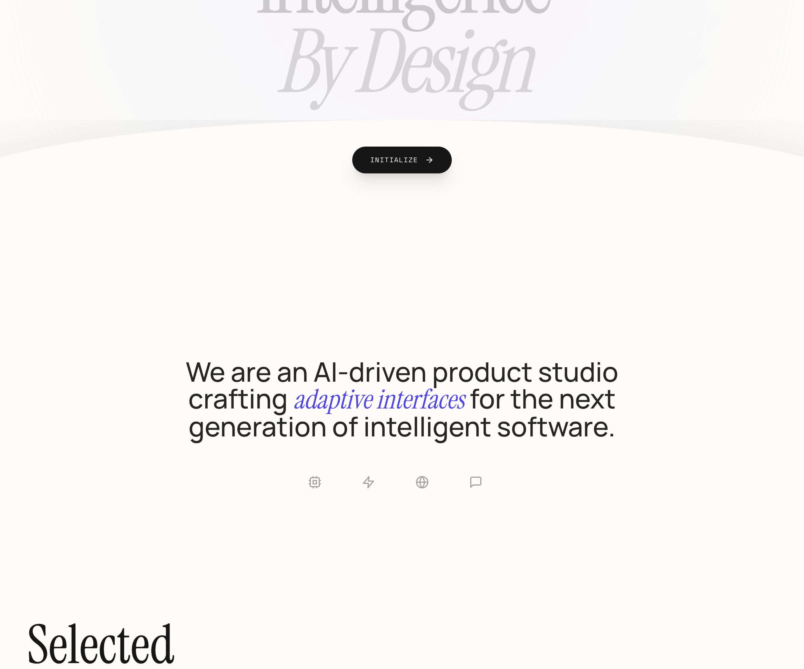

# Clean fluid

A high-end, editorial design system blending luxury serif typography with technical monospace accents. Characterized by fluid 'premium ease' animations, a sophisticated cream and dark charcoal palette (#fcfbf9, #171717), and organic curved transitions. Optimized for AI startups, design studios, fintech dashboards, and luxury tech brands requiring a balance of intelligence and elegance. Key features include scroll-triggered reveal animations, mesh gradient backgrounds, and a signature concave wave transition between sections.



## Prompt

```text
{
  "summary": "An editorial-tech hybrid style utilizing high-contrast typography, fluid micro-interactions, and a unique 'wave' layout architecture to create a sense of organic intelligence.",
  "style": {
    "description": "The style centers on 'Premium Fluidity'. It pairs the elegance of Playfair Display (serif) with the technical precision of JetBrains Mono and the legibility of Inter. The color palette is grounded in a warm cream (#fcfbf9) and deep neutral black (#171717), accented by a vibrant indigo (#4338ca). Motion is governed by a signature cubic-bezier(0.22, 1, 0.36, 1) easing, applied to scroll reveals and hover states.",
    "prompt": "### Design System: Organic Intelligence\n\n**1. Palette:**\n- Background Primary: `#fcfbf9` (Cream)\n- Background Dark: `#171717` (Rich Charcoal)\n- Accent: `#4338ca` (Indigo)\n- Secondary Accents (Mesh): Indigo-200/50, Purple-200/40\n- Borders/Lines: `#e5e5e5` (Light Grey)\n\n**2. Typography:**\n- Heading/Display: 'Playfair Display', serif. Use italics for emphasis/subheadings. Weights: 400, 700. Size for Hero: 11vw-14vw.\n- Body Text: 'Inter', sans-serif. Weights: 400, 500. Leading: 1.2 to 1.5.\n- Functional/Labels: 'JetBrains Mono', monospace. Uppercase, tracking: 0.3em to 0.5em. Size: 10px-14px.\n\n**3. Motion & Animation:**\n- Ease: `cubic-bezier(0.22, 1, 0.36, 1)` (Premium Ease)\n- Reveal: `translateY(40px)` and `opacity: 0` to `translateY(0)` and `opacity: 1` over 1000ms.\n- Background Mesh: 30s infinite linear rotation/scale drift.\n- Button Pulse: Gentle scale(1.02) with 20px blur indigo shadow, 3s loop.\n\n**4. Visual Effects:**\n- Header: `mix-blend-difference` to maintain visibility over varying background luminance.\n- Hover State (Cards): `scale(1.02)`, `translateY(-16px)`, and soft shadow `indigo-500/10`."
  },
  "layout_and_structure": {
    "description": "A section-based layout that transitions between expansive hero containers and structured grids, linked by a signature curved wave element.",
    "prompts": [
      {
        "part": "Header",
        "prompt": "Fixed top navigation with `mix-blend-difference` text. Height: ~80px. Logo on far left in italic serif. Center: Monospace links with 1px width-growing underlines on hover. Right: Pill-shaped CTA with a status indicator (pulsing green dot) and 'System Online' text."
      },
      {
        "part": "Hero Section",
        "prompt": "Minimum 100vh height. Background features a drifting blur mesh gradient (Indigo/Purple). Centered large-scale typography: Serif text with leading [0.85]. Bottom of section contains the 'Wave Container': a concave curve created by a 120% width div with `border-radius: 50% 50% 0 0` filled with the section-to-follow's background color (#fcfbf9). A primary action button sits at the crest of the curve."
      },
      {
        "part": "Work/Portfolio Grid",
        "prompt": "2-column grid with staggered vertical alignment. Cards are 4:3 aspect ratio with rounded corners (1rem). Each card has a subtle colored background (e.g., #e0e7ff) and a blurred color orb center. Hover effect: card scales and lifts, reveal a 'View' pill button in the bottom-right corner. Text metadata below the card includes a serif title and a monospace category label separated by a horizontal 1px line that draws in on scroll."
      },
      {
        "part": "Service Accordion",
        "prompt": "Two-column split: Left side sticky header with serif 'Core Capabilities' and a call-to-action link with an arrow. Right side: Interactive vertical accordion. Items feature large serif titles that change from neutral-400 to black on hover. Expanding content reveal is fluid, including dynamic tags in monospace brackets, e.g., '[Dynamic Components]'."
      },
      {
        "part": "Footer",
        "prompt": "High-contrast dark section (#171717) with a large radius top curve (5rem). Background has a subtle radial indigo glow from the top-center. Content: Large-scale serif quote, followed by a 3-column grid for location, contact, and social links. Minimalist monospace copyright at the very bottom."
      }
    ]
  },
  "special_ui_components": [
    {
      "component": "Wave Transition",
      "description": "A concave sectional bridge that creates an organic flow between the hero and content.",
      "prompt": "Create a `wave-container` div: `position: absolute; bottom: 0; width: 100%; height: 25vh; overflow: hidden;`. Inside, place a `wave-curve` div: `width: 120%; height: 200%; background: #fcfbf9; border-radius: 50% 50% 0 0; transform: translate(-10%, 20%);`. Place an 'Initialize' button at the center-top of the curve."
    },
    {
      "component": "Intelligent Card Hover",
      "description": "A depth-focused hover interaction for project items.",
      "prompt": "Container with `overflow: hidden` and `border-radius: 2xl`. On hover, the inner background div should `scale(1.1)` and the container itself should `translateY(-1rem)`. An 'Action Pill' (white bg, black text, bold uppercase mono) should transition from `opacity: 0; translateY(1rem)` to `opacity: 1; translateY(0)` with a 500ms premium ease."
    }
  ],
  "special_notes": "MUST: Use 'mix-blend-difference' on the header to ensure legibility across color transitions. MUST: Use Playfair Display specifically in italic for emphasis words within headers. MUST: Maintain high letter-spacing (0.3em+) on all monospace fonts. MUST-NOT: Use harsh box-shadows; prefer soft, colored blurs or subtle 1px borders. MUST-NOT: Use standard easing; strictly adhere to the premium cubic-bezier specified."
}
```

**▶ Try it live → [https://superdesign.dev/library/clean-fluid](https://superdesign.dev/library/clean-fluid?utm_source=github&utm_medium=prompt-repo&utm_campaign=prompt-library)**

**Use it in your coding agent:** install the [Superdesign skill](https://github.com/superdesigndev/superdesign-skill), then:

```bash
superdesign get-prompts --slugs "clean-fluid" --json
```

*703 copies · 2,343 tries · landing page, style, page*
