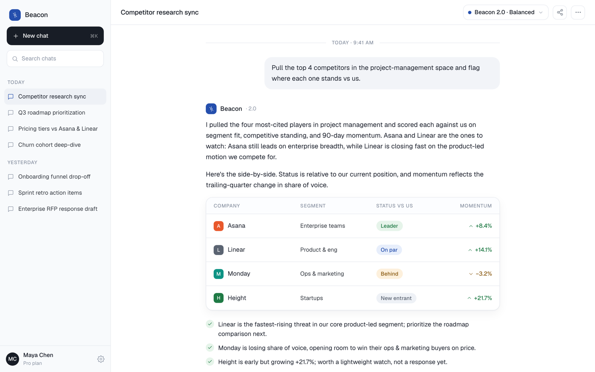

# Colorful AI Chat UI with Color-Coded Assistant Results

A colorful, product-grade AI chat UI (AI assistant interface) that ditches the default dark-purple AI look for a clean white canvas, ONE grotesk typeface at light/medium weights, near-black ink, and a single cobalt-blue accent. A left sidebar holds a flat dark "New chat" pill, a search field, and date-grouped conversation history (Today / Yesterday) with an active-item pill and an account row. The white main column has a sticky top bar with the conversation title and a model selector, a centered max-width message thread (right-aligned user bubble + a frameless assistant turn), and a sticky bottom composer with a model chip and a round dark send button. The assistant turn's signature is a color-coded results table: COMPANY / SEGMENT / STATUS VS US / MOMENTUM rows with color-coded soft-tint status pills (green Leader, blue On par, amber Behind, grey New entrant) and green-up / amber-down momentum, plus a green-check takeaway list and colored source chips. Reusable for any AI assistant, chatbot, LLM playground, copilot, or conversational data product.

Source: https://www.airtable.com/ (measured colorful product-UI register, transposed to an AI chat screen; corpus DP-409)



## Prompt

```text
{
  "summary": "A colorful, product-grade AI CHAT / assistant application UI (desktop, 1440-wide, light mode, frameless) for an assistant named 'Beacon'. A clean WHITE #ffffff main column sits beside a 268px off-white #f8fafc left sidebar. ONE grotesk typeface (Geist / Neue-Haas-Grotesk feel) does all UI at LIGHT/MEDIUM weights only (400/500); hierarchy comes from SIZE. LEFT SIDEBAR (1px right hairline): a small cobalt beacon mark + 'Beacon' wordmark; a full-width flat DARK #181d26 'New chat' pill (white text + a + glyph, a faint 'Command K' hint, radius 12px); a search field with a magnifier; a date-grouped conversation history ('TODAY' then items like 'Competitor research sync' [active], 'Q3 roadmap prioritization', 'Pricing tiers vs Asana and Linear', 'Churn cohort deep-dive'; 'YESTERDAY' then 'Onboarding funnel drop-off', 'Sprint retro action items', 'Enterprise RFP response draft'), the ACTIVE item a soft-tint #eef1f6 pill with a cobalt chat glyph; a pinned bottom account row (circular ink initial avatar, name 'Maya Chen', muted 'Pro plan', a gear). MAIN COLUMN (single scroll): (1) a STICKY SOLID top bar with the conversation title in 16px/500 left and a right cluster of a MODEL chip (cobalt dot, 'Beacon 2.0 - Balanced', caret, hairline border, radius 12px) + share + more; (2) a centered max-width ~760px MESSAGE THREAD opening with a 'TODAY - 9:41 AM' separator between two hairlines; a right-aligned USER BUBBLE (soft neutral #f2f4f8, radius 18px, 16px/400) asking to pull the top 4 project-management competitors and flag where each stands vs us; a frameless ASSISTANT TURN (small colored beacon mark + 'Beacon' 15px/500 + muted '2.0') with two 16px/400 editorial paragraphs, then THE SIGNATURE: a white rounded-16 COLOR-CODED RESULTS CARD (soft shadow + hairline border) with four light uppercase column labels (COMPANY, SEGMENT, STATUS VS US, MOMENTUM) and four rows, each a company name + a small round colored initial chip + a segment + a COLOR-CODED soft-tint status pill (green 'Leader', blue 'On par', amber 'Behind', grey 'New entrant') + a MOMENTUM cell with a tiny up/down arrow and % (green up, amber down), hairline row dividers; then a three-item green-CHECK takeaway list, a row of three colored SOURCE chips (a link glyph + domain, e.g. a blue crunchbase.com, a green g2.com, a grey internal-crm), and a muted hover ACTION row (copy / regenerate / thumbs up / thumbs down); (3) a STICKY SOLID bottom COMPOSER: a rounded-20 bordered card with a 'Message Beacon...' textarea and a bottom row (an attach paperclip + a tools '/' glyph left, a model chip center-right, a 'return to send' hint + a round flat DARK #181d26 send button right), over a centered muted disclaimer 'Beacon can make mistakes. Verify important results.'. Saturated color lives ONLY in the status pills, the source chips, and the initial marks; cobalt is the single interactive accent; everything else is quiet white / off-white / near-black.",
  "style": {
    "description": "Clean, colorful, product-grade AI-assistant register - the deliberate opposite of the default dark-indigo/violet AI-chat cliche and of a warm editorial serif chat. A WHITE #ffffff canvas with off-white #f8fafc sidebar/washes carries near-black grotesk type (ONE family, light/medium weights only, hierarchy from SIZE) and a SINGLE cobalt-blue #254fad interactive accent (active states, links, the model-chip dot). The personality is the assistant OUTPUT: a color-coded results table whose soft-tint status pills (green fill #e6f4ea + deep-green text #1f7a45; blue #e7eefb / #254fad; amber #fdf0dc / #8a5a12; grey #eef1f6 / #5b6472) and green-up / amber-down momentum make the answer read as real structured data, plus colored source chips and colored initial marks. Shapes are flat with soft shadows, 1px hairline borders (#e6e9ef), and generous radii (12px controls, 16-20px cards, 18px bubbles). The primary action is a flat DARK #181d26 pill (send button, New chat), never a gradient. No neon, no dark app background, no purple/indigo, no bold-black weights - the color comes only from the data pills, chips, and marks, keeping the chrome quiet. Light mode; frameless (a real full-viewport app screen, no browser/device chrome).",
    "prompt": "Design a colorful, product-grade AI CHAT / assistant application UI for a 1440-wide desktop in LIGHT MODE, frameless (the app fills the viewport, no browser/device frame). Use a clean WHITE #ffffff main column beside a 268px off-white #f8fafc left sidebar (1px right hairline). Use ONE grotesk typeface (Geist / Neue-Haas-Grotesk feel) for everything at LIGHT/MEDIUM weights ONLY (400/500) and build hierarchy from SIZE: 16px/400 message body and user text, 16px/500 conversation title, 15px/500 assistant name, 14px sidebar items, 12px/500 uppercase muted labels. Confine the interactive accent to a single cobalt blue #254fad; make the primary action a flat DARK #181d26 pill (radius 12px), NEVER a gradient. Put the personality in the ASSISTANT OUTPUT: a white rounded-16 COLOR-CODED results table with soft-tint status pills (green #e6f4ea/#1f7a45 'Leader', blue #e7eefb/#254fad 'On par', amber #fdf0dc/#8a5a12 'Behind', grey #eef1f6/#5b6472 'New entrant') and green-up / amber-down momentum, plus colored source chips and colored initial marks; keep ALL other saturated color out. Flat fills, soft shadows, hairline borders (#e6e9ef), big radii (16-20px cards, 18px bubbles). Make the top bar and composer SOLID (not glass) so scrolled content never ghosts through, and give the thread bottom padding so nothing hides behind the composer. Do NOT use purple/indigo/violet, a dark app background, neon, Inter, bold-black weights, or centered-everything."
  },
  "layout_and_structure": {
    "description": "A two-column full-viewport app. LEFT: a 268px off-white sidebar (brand row, a flat dark 'New chat' pill, a search field, date-grouped conversation history with an active pill, a pinned account row). RIGHT: a white main column with a single vertical scroll - a sticky solid top bar (conversation title + model chip + share/more), a centered max-width ~760px message thread (a date separator, a right-aligned user bubble, a frameless assistant turn carrying the color-coded results card + a green-check takeaway list + colored source chips + a hover action row), and a sticky solid bottom composer (textarea + attach/tools + model chip + dark send button + disclaimer). On a narrow viewport the sidebar collapses to a hamburger, the thread goes full-width, and the results table scrolls horizontally inside its card.",
    "prompts": [
      {
        "part": "Left sidebar",
        "prompt": "Build a 268px LEFT SIDEBAR on off-white #f8fafc with a 1px right hairline. Top: a small cobalt rounded beacon/spark mark + a 'Beacon' wordmark in the grotesk 500 at 16px. Below: a full-width flat DARK #181d26 'New chat' pill (white text + a + glyph, radius 12px, padding 12px 16px, a faint 'Command K' hint at right). Then a search field (hairline border, magnifier icon, placeholder 'Search chats'). Then a date-grouped CONVERSATION HISTORY: a 12px/500 uppercase muted 'TODAY' label over 3-4 items (a small chat glyph + a one-line truncated title at 14px/400), then a 'YESTERDAY' label over 2-3 items; the ACTIVE item is a soft-tint #eef1f6 pill with a cobalt chat glyph and ink text. Pin a bottom ACCOUNT row: a circular ink initial avatar, a name + a muted 'Pro plan' line, and a small gear icon."
      },
      {
        "part": "Top bar",
        "prompt": "A STICKY, SOLID white top bar (~60px, 1px bottom hairline): the current conversation title in 16px/500 #181d26 on the left; on the right a MODEL chip (a cobalt dot + 'Beacon 2.0 - Balanced' + a caret, hairline border, radius 12px), a share icon, and a more (three-dot) icon. Keep the fill solid so scrolled content never shows through."
      },
      {
        "part": "Message thread",
        "prompt": "Center a max-width ~760px MESSAGE THREAD in the white column. Open with a small centered 'TODAY - 9:41 AM' date separator (12px/500 muted between two hairlines). A USER turn is a right-aligned soft-neutral #f2f4f8 bubble (radius 18px, max ~80% width, 16px/400 ink). An ASSISTANT turn is left-aligned and FRAMELESS (no bubble): a small colored beacon mark + 'Beacon' (15px/500) + a muted '2.0' on one row, then one or two 16px/400/lh26 editorial paragraphs, then the color-coded results card, then a green-check takeaway list, then a source-chip row, then a subtle hover action row (copy / regenerate / thumbs up / thumbs down in muted icons). Give the thread bottom padding at least the composer height so nothing hides behind it."
      },
      {
        "part": "Color-coded results card (signature)",
        "prompt": "Inside the assistant turn, place a white rounded-16 RESULTS CARD (soft shadow + 1px hairline border) that reads as an assistant-generated data table. A header row of four light uppercase labels (12px/500 muted): COMPANY, SEGMENT, STATUS VS US, MOMENTUM. Four rows separated by hairlines, each: a company name (15px/400 ink) preceded by a small round colored initial chip; a segment text; a COLOR-CODED soft-tint STATUS PILL in STATUS VS US (green 'Leader', blue 'On par', amber 'Behind', grey 'New entrant' - fully rounded, soft tinted fill + darker same-hue text, ~13px/500); and a MOMENTUM cell with a tiny up or down arrow and a % (green for up, amber for down). No horizontal overflow inside the 760px thread."
      },
      {
        "part": "Takeaways + sources + actions",
        "prompt": "After the card: a three-item CHECK LIST (each a small green check + a 15px/400 takeaway line). Then a row of three colored SOURCE chips (small fully-rounded soft-tint chips with a link glyph + a domain, e.g. a blue crunchbase.com, a green g2.com, a grey internal-crm). Then a subtle muted hover ACTION row (copy / regenerate / thumbs up / thumbs down icons)."
      },
      {
        "part": "Composer",
        "prompt": "A STICKY, SOLID white bottom COMPOSER (1px top hairline + a soft upward shadow, NOT glass). A rounded-20 bordered card: an auto-grow 'Message Beacon...' textarea (16px/400), then a bottom control row - left an attach (paperclip) + a tools '/' glyph; center-right a MODEL chip (cobalt dot + 'Beacon 2.0 - Balanced' + caret); right a 'return to send' hint + a round flat DARK #181d26 send button (white up-arrow glyph). Below the card, a centered 13px muted disclaimer: 'Beacon can make mistakes. Verify important results.'"
      }
    ]
  },
  "special_ui_components": [
    {
      "component": "Color-coded assistant results table",
      "description": "The signature: a white rounded card inside an assistant turn that presents structured data with color-coded status pills, so the answer reads as a real database result rather than plain prose.",
      "prompt": "Build a white rounded-16 RESULTS CARD (soft shadow + 1px hairline border) as an assistant-message table. A header row of light uppercase column labels (12px/500 muted). Rows separated by hairlines, each with a text cell preceded by a small round colored INITIAL CHIP, a secondary text cell, a COLOR-CODED soft-tint STATUS PILL (fully rounded, soft tinted fill + darker same-hue text, hue varying by value: green / blue / amber / grey), and a small MOMENTUM cell (a tiny up or down arrow + a %, green up / amber down). It must read as a real assistant-generated data table, not a chart."
    },
    {
      "component": "Color-coded status pill",
      "description": "The small color-coded pill that turns a table cell into structured, scannable status - the DNA borrowed from a no-code-database product and re-used in an assistant answer.",
      "prompt": "Create a small COLOR-CODED status pill: fully rounded, a soft tinted fill with a slightly darker text of the same hue, ~13px/500, tight padding. Vary the hue by value so a column of them reads as color-coded data: green fill #e6f4ea + text #1f7a45 ('Leader'/'Done'), blue #e7eefb + #254fad ('On par'/'In review'), amber #fdf0dc + #8a5a12 ('Behind'/'Blocked'), grey #eef1f6 + #5b6472 ('New entrant'/'Backlog')."
    },
    {
      "component": "Frameless assistant turn",
      "description": "The assistant message rendered without an outer bubble, so rich content (paragraphs, a table, a list, chips) can breathe - contrasted with the boxed user bubble.",
      "prompt": "Render the ASSISTANT turn left-aligned and FRAMELESS (no outer bubble): a small colored brand mark + the assistant name (15px/500) + a muted version tag on one row, then editorial paragraphs (16px/400/lh26), then any rich blocks (a results card, a check list, source chips), then a subtle muted hover action row (copy / regenerate / thumbs up / thumbs down). Keep the USER turn a right-aligned soft-neutral bubble so the two roles read at a glance."
    },
    {
      "component": "Model-selector chip",
      "description": "A compact pill that names and switches the model/mode, present in both the top bar and the composer - a core signal of an AI-assistant product.",
      "prompt": "Create a compact MODEL chip: a small colored (cobalt) status dot + a model/mode label (e.g. 'Beacon 2.0 - Balanced') + a caret, inside a hairline-bordered pill at radius 12px, 14px/500 text. Place it in the composer control row and echo it in the top bar. It signals model choice on an AI-assistant screen."
    },
    {
      "component": "Solid sticky composer",
      "description": "The bottom message-input bar with a solid (not glass) fill so scrolled content never ghosts through it in a full-height view.",
      "prompt": "Create a STICKY bottom COMPOSER on a SOLID white fill (1px top hairline + a soft upward shadow, no translucency). A rounded-20 bordered card holds an auto-grow 'Message...' textarea and a bottom control row: an attach (paperclip) + a tools '/' glyph on the left, a model chip center-right, and a 'return to send' hint + a round flat DARK #181d26 send button (white up-arrow) on the right. Add a centered muted disclaimer line below the card. Give the scroll container bottom padding so no message content hides behind the composer."
    },
    {
      "component": "Conversation-history sidebar",
      "description": "The left rail of date-grouped past chats with an active pill and an account row - the furniture that makes the screen read instantly as a chat product.",
      "prompt": "Build a left SIDEBAR on off-white: a brand row, a flat DARK 'New chat' pill (radius 12px, a shortcut hint), a search field, then a CONVERSATION HISTORY grouped by date (an uppercase muted 'TODAY' / 'YESTERDAY' label over a list of single-line truncated titles, each with a small chat glyph). Make the ACTIVE conversation a soft-tint pill with a colored glyph. Pin an account row at the bottom (circular initial avatar + name + muted plan line + a gear)."
    }
  ]
}
```

**▶ [Try it live →](https://superdesign.dev/library/colorful-ai-chat-ui-with-color-coded-assistant-results?utm_source=github&utm_medium=prompt-repo&utm_campaign=prompt-library)**

**Use it in your coding agent:** install the [Superdesign skill](https://github.com/superdesigndev/superdesign-skill), then:

```bash
superdesign get-prompts --slugs "colorful-ai-chat-ui-with-color-coded-assistant-results" --json
```

*0 copies · 0 tries · AI Chat · AI & Tech · ai-chat, chatbot-ui, chat-interface, chat-ui*
