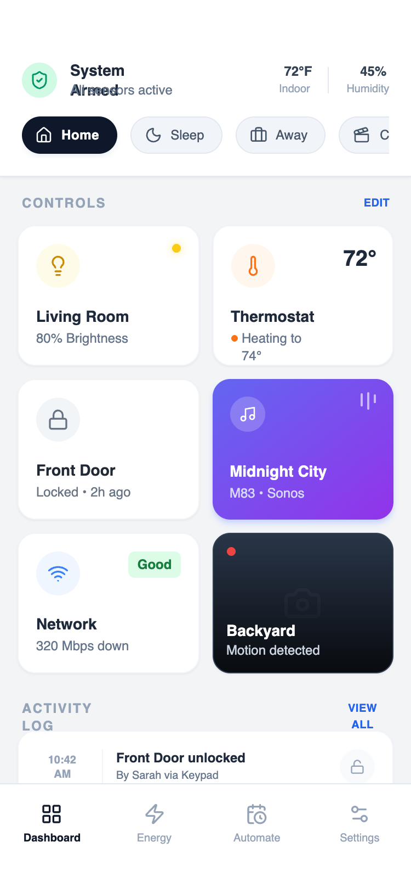

# Compact Control Grid

A dense arrangement of controls using grids and grouped sections. Prioritizes scanability and speed over storytelling.

Best Suitable For
Utilities, device controllers, system tools, internal apps.



## Prompt

```text
{
  "summary": "A sophisticated mobile-first design system optimized for high information density. It utilizes a 2-column modular grid for core controls, a horizontal 'scene' toggle strip for quick state changes, and a detailed activity log for historical data, all anchored by a clean, system-level status header.",
  "style": {
    "description": "Modern high-density aesthetic using the 'Satoshi' font family for crisp readability. The palette is grounded in Slate neutrals (#F2F4F6 background, #1E293B text) with semantic colors for status: Emerald for active/safe (#10B981), Orange for heating/warning (#F97316), and Yellow for lights (#FACC15). Elements use a consistent 16px (2xl) border radius, subtle 1px borders, and micro-interactions like 0.98x scale-down on press.",
    "prompt": "### Visual Style Guide\n- **Typography**: Primary font 'Satoshi'. Headers: 14px bold leading-tight. Subtext/Secondary: 10px-12px medium/bold. Use uppercase with 0.1em tracking for section headers.\n- **Color Palette**:\n  - Background: #F2F4F6\n  - Primary Text: #1E293B (Slate 800)\n  - Secondary Text: #64748B (Slate 500)\n  - Semantic Accents: Emerald (#10B981), Orange (#F97316), Yellow (#FACC15), Blue (#2563EB), Indigo-to-Purple Gradient (#6366F1 to #9333EA).\n- **Borders & Shadows**: 1px solid #E2E8F0 (Slate 200) or #F1F5F9 (Slate 100). Subtle shadow-sm for cards.\n- **Rounding**: 16px (2xl) for cards and modular blocks; pill-shaped (full) for toggles and status chips.\n- **Animations**: \n  - Micro-interaction: `transform: scale(0.98)` on active state (100ms duration).\n  - Pulse: Red dot (#EF4444) for live indicators.\n  - Music Visualizer: 3 vertical bars with staggered infinite bounce animations."
  },
  "layout_and_structure": {
    "description": "A vertically stacked mobile layout consisting of a fixed-width container with three primary zones: a system status header, a scrollable main dashboard, and a bottom navigation bar.",
    "prompts": [
      {
        "part": "Header & Status Strip",
        "prompt": "Top-aligned fixed header (pt-14, pb-4, px-5) on white background. Includes a left-aligned status block (32px icon circle + 2-line text) and a right-aligned environmental block with vertical dividers. Below this, a horizontal scrollable container (`overflow-x-auto`) featuring pill-shaped 'Scene' buttons. Active buttons are #0F172A with white text; inactive are #F1F5F9 with a thin border."
      },
      {
        "part": "Control Grid",
        "prompt": "A 2-column CSS grid with a 12px (3 units) gap. Each cell contains a 'Control Card' with a fixed height of 128px (32 units). Layout within cards: top-left icon circle (40px), optional top-right status indicator (text or dot), and bottom-aligned labels (14px title + 12px status subtext)."
      },
      {
        "part": "Activity Log",
        "prompt": "Full-width section with a white background and 16px border-radius. Items are arranged in rows with a 48px width time-column (formatted as two lines: 10:00 / AM), followed by a 1px vertical divider, a title/subtitle center block, and a right-aligned status icon circle (32px)."
      },
      {
        "part": "Navigation Bar",
        "prompt": "Sticky bottom footer with white background and a top border (#E2E8F0). Grid layout with 4 columns. Each item: 20px icon centered vertically over 10px bold text. Use high-contrast color for the active state and Slate 400 for inactive."
      }
    ]
  },
  "special_ui_components": [
    {
      "component": "Media Control Card",
      "description": "Vibrant gradient card with a mini-visualizer.",
      "prompt": "A 128px height card with a linear gradient from #6366F1 to #9333EA. Top-left: 32px white icon circle at 20% opacity. Top-right: 3 vertical white bars (2px width, variable heights 8px-16px) with staggered bounce animations. Text at bottom: White 14px bold title, 12px medium subtitle at 90% opacity."
    },
    {
      "component": "Live Camera Card",
      "description": "Dark-themed card with live recording indicator.",
      "prompt": "A 128px height card with a #1E293B background. Top-left: A 8px red dot (#EF4444) with a slow infinite pulse. Background contains a large, low-opacity centered icon (e.g., camera). Bottom: A black-to-transparent gradient overlay with white 14px bold text for the location label."
    }
  ],
  "special_notes": "MUST: Maintain tight spacing (12px gap in grids) to achieve 'dense' feel. MUST: Use high-contrast between headers and subtext (Bold 14px vs Medium 10px). DO NOT: Use standard 16px body text as it breaks the information density. MUST: Include a scale-down effect on every clickable modular card for tactile feedback."
}
```

**▶ Try it live → [https://superdesign.dev/library/compact-control-grid](https://superdesign.dev/library/compact-control-grid?utm_source=github&utm_medium=prompt-repo&utm_campaign=prompt-library)**

**Use it in your coding agent:** install the [Superdesign skill](https://github.com/superdesigndev/superdesign-skill), then:

```bash
superdesign get-prompts --slugs "compact-control-grid" --json
```

*11 copies · 2,374 tries · Mobile Apps · General · mobile app, home, layout*
