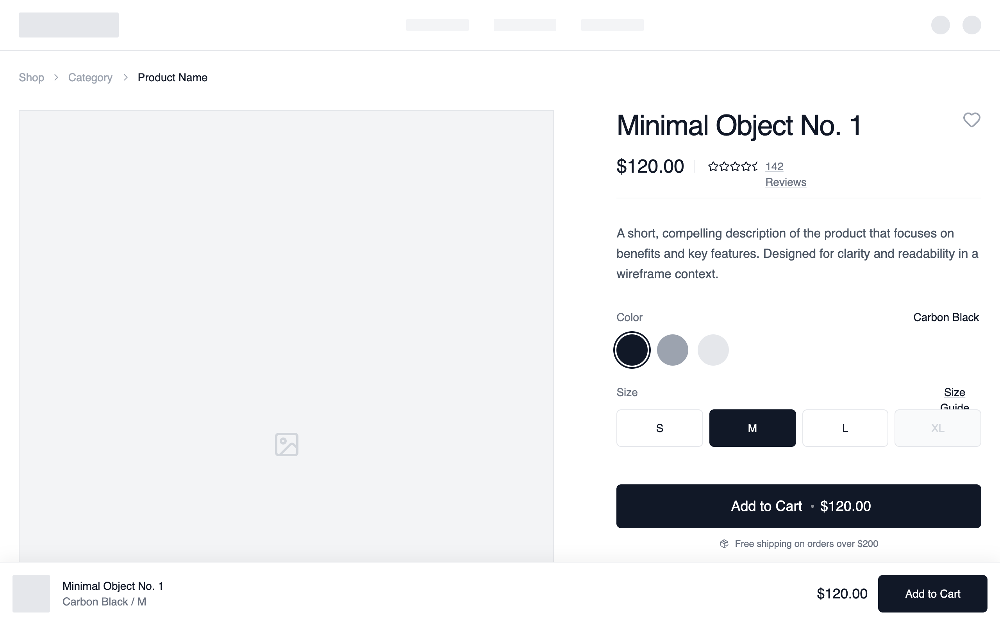

# Conversion-optimised Product Page

Traditional PDP enhanced with a sticky purchase module that remains visible during scroll. Reinforces CTAs with social proof and benefit blocks to reduce hesitation.

Best suited for
High-volume DTC brands, ads-driven traffic, products optimized for CRO.



## Prompt

```text
{
  "summary": "A clean, monochrome e-commerce product layout focused on clarity and conversion. It employs a two-column structure (7:12 ratio) for primary product content, detailed variant selectors, and a floating sticky purchase bar for mobile and desktop visibility.",
  "style": {
    "description": "The design uses a strictly monochrome palette (#FFFFFF, #F5F5F5, #111827) and 'General Sans' typography to create a high-end, editorial feel. It emphasizes clean lines via 1px borders (#E5E7EB) and subtle micro-interactions like 500ms image zooms and ring-offset focus states for interactive elements. Layout follows a strict 1440px grid with variable padding based on screen size (24px to 80px).",
    "prompt": "Create a minimalist monochrome design system. **Colors**: Primary Background: #FFFFFF; Secondary Background (sections/cards): #F9FAFB; Text: #111827; Secondary Text: #6B7280; Borders/Dividers: #E5E7EB; Accents: #111827 (Primary Button), #D1D5DB (Placeholders). **Typography**: Use 'General Sans' (or similar geometric sans). H1: 36px/40px weight 500, tight tracking; H2: 24px weight 500; Body: 16px weight 400, leading 1.6; Labels/Small: 14px weight 500; Captions: 12px. **Spacing**: Base unit 4px. Use 24px (6 units) for standard gaps, 48px (12 units) for section padding, and 96px (24 units) for major vertical breathing room. **Interactive Elements**: Buttons must have 6px border-radius. Product swatches should use a ring-offset-2 effect when active. Hover states for cards should trigger a 1.05 scale transform over 500ms. All borders should be 1px solid unless specified."
  },
  "layout_and_structure": {
    "description": "A top-down flow starting with a functional header, moving into a 2-column product detail section (Gallery 60% / Info 40%), followed by trust-building horizontal strips (Social Proof/Benefits) and ending with a 4-column related products grid.",
    "prompts": [
      {
        "part": "Navigation & Breadcrumbs",
        "prompt": "Design a slim top navigation bar with a centered logo area (32px height) and discrete text links. Below, implement a breadcrumb trail using 14px text in #9CA3AF, separated by 'lucide:chevron-right' icons, with the current page highlighted in #111827 weight 500."
      },
      {
        "part": "Product Main Section",
        "prompt": "Implement a 2-column grid (7:5 ratio). Left Column: A vertical stack of images. Primary image at 4:5 aspect ratio with #F3F4F6 background and 1px border. Below, a 2x2 grid of supporting 4:5 images. Right Column: Sticky container (top: 32px). Include a 36px H1 title, a $120.00 price in 24px, and a star-rating row with an underline-offset-4 review link. Variant section: Color swatches (40x40px circles with 2px ring on active) and size grid (4-column buttons, active state: #111827 background with white text). Add a 56px height CTA button in #111827 with a centered text and price."
      },
      {
        "part": "Social Proof and Benefits",
        "prompt": "Full-width section with #F9FAFB background. Horizontal layout containing a 5-star rating graphic and text 'Rated 4.9/5 by 10,000+ Customers'. Followed by a 4-column benefits grid: Each item features a 48x48px circular light-gray icon container, a 16px medium title, and a 14px grayed-out description (e.g., 'Free Shipping')."
      },
      {
        "part": "Related Products Carousel",
        "prompt": "4-column grid of product cards. Each card: 3:4 aspect ratio image container with a 500ms zoom on hover. Include a 'New' or 'Sold Out' badge in the top-left (12px uppercase). Bottom metadata: Left-aligned title and category (14px), right-aligned price (14px bold)."
      }
    ]
  },
  "special_ui_components": [
    {
      "component": "Sticky Conversion Bar",
      "description": "A fixed bottom bar that captures attention for conversion.",
      "prompt": "Position: fixed bottom-0; Background: #FFFFFF; Border-top: 1px #E5E7EB; Shadow: 0 -4px 20px rgba(0,0,0,0.05). Interior: Max-width 1440px, flex-justify-between. Left side: 48px square product thumbnail + Title/Variant text stack. Right side: Price text + 48px height 'Add to Cart' button."
    },
    {
      "component": "Minimalist Variant Selector",
      "description": "A clean grid for size selection with interactive states.",
      "prompt": "Grid layout (cols-4), gap 8px. Each button: 48px height, 1px border #E5E7EB, font-size 14px, font-medium. Hover state: #F9FAFB background. Active state: #111827 background, white text. Disabled state: #F9FAFB background, #D1D5DB text, cursor-not-allowed."
    }
  ],
  "special_notes": "MUST maintain strict monochrome color usage; do not introduce accent colors other than black/white/gray. MUST use 4:5 and 3:4 aspect ratios for all product imagery to maintain an editorial vertical feel. MUST ensure the sticky purchase bar only appears after the user scrolls past the primary 'Add to Cart' button. DO NOT use heavy drop shadows; use 1px borders for depth instead."
}
```

**▶ Try it live → [https://superdesign.dev/library/conversion-optimised-product-page](https://superdesign.dev/library/conversion-optimised-product-page?utm_source=github&utm_medium=prompt-repo&utm_campaign=prompt-library)**

**Use it in your coding agent:** install the [Superdesign skill](https://github.com/superdesigndev/superdesign-skill), then:

```bash
superdesign get-prompts --slugs "conversion-optimised-product-page" --json
```

*12 copies · 2,310 tries · E-commerce · E-commerce & Retail · shopify, ecommerce, product page, pdp*
