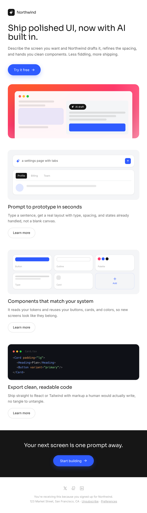

# Coral Gradient Product-Launch Email

A modern product-launch / feature-announcement email in a centered 600px column: a heavy Sora headline with a cobalt pill CTA, a coral-to-pink gradient hero card framing a product-UI vignette, three alternating feature blocks each with a designed mini-UI (a prompt bar to a live preview, a component-token grid, a syntax-highlighted code snippet) and an outline button, a dark closing CTA band, and a minimal legal footer. Sora + Inter, ink on white with a warm coral gradient and a single cobalt accent. Reusable as any SaaS feature or launch announcement email.



## Prompt

```text
{"summary": "A modern product-launch / feature-announcement email, laid out as a centered ~600px single column on a white body. It opens with a small wordmark, then a heavy Sora headline + short subhead and a cobalt pill CTA. Below sits the signature visual: a coral-to-pink gradient hero card framing a browser-chrome product vignette with an 'AI draft' chip. Three alternating feature blocks follow, each pairing a designed mini-UI (a prompt input to a live settings preview, a 6-up component-token grid, a dark syntax-highlighted code snippet) with a heading, one line of copy, and a pill outline button. It closes with a full-width dark CTA band ('Your next screen is one prompt away.') and a minimal centered footer with social glyphs and legal / unsubscribe fine print.", "style": {"description": "Clean, confident modern-SaaS email. White page, near-black ink, one warm coral-to-pink gradient used only on the hero, and a single cobalt accent for CTAs. Heavy geometric-sans headlines (Sora, tight negative tracking) over an Inter body. Pill buttons, generously rounded cards, soft shadows, plenty of whitespace between blocks.", "prompt": "Design a product-launch / feature-announcement email set in a centered max-width 600px column on a light grey body (#e9eaee) with a white email surface carrying a soft shadow. Typography: Sora (weights 700-800) for headlines with tight tracking (tracking-[-0.02em]) and Inter (400-600) for body. Palette: white #ffffff surface, ink #161616 text, mist #f4f5f7 tinted panels, and ONE warm hero gradient radial coral-to-pink (#ff5a2c -> #ff3b6b -> #ff88a6) used only on the hero card; a single cobalt accent #2f5bff for the primary pill CTAs (with a soft cobalt glow shadow 0 6px 18px rgba(47,91,255,.28)). Headline scale ~34px, tight leading (1.06). Buttons: primary = cobalt rounded-full pill with white text + trailing arrow; secondary = rounded-full outline (1px ink/15). Cards use rounded-[14px]-[18px] corners and 1px ink/5 rings. Keep it airy, high-contrast, and email-safe (no sticky nav, no full-bleed app chrome)."}, "layout_and_structure": {"description": "Centered ~600px column, vertical email flow: (1) wordmark lockup, (2) headline + subhead + primary CTA, (3) gradient hero card with a product vignette, (4) three alternating feature blocks (designed mini-UI + heading + copy + outline button), (5) a full-width dark closing CTA band, (6) a minimal centered footer. Everything reflows to a single column at ~360px with no overflow.", "prompts": [{"part": "Header", "prompt": "Top-left brand lockup: a 28px rounded-[7px] ink tile holding a white sparkle glyph beside a 15px Sora 700 wordmark."}, {"part": "Headline block", "prompt": "A ~34px Sora 800 headline (tracking-[-0.02em], leading 1.06), a 15px Inter subhead at ink/70 (max ~2 lines), and a cobalt rounded-full pill CTA 'Try it free' with a trailing arrow."}, {"part": "Gradient hero card", "prompt": "A rounded-[18px] card filled with the coral radial gradient, holding a white 95%-opacity browser panel (three traffic-light dots) with a 2-column mock: a left form column of skeleton lines + a cobalt-tinted block, and a right mist panel carrying a black 'AI draft' chip (sparkle icon), skeleton lines, and a solid cobalt bar."}, {"part": "Feature blocks (x3)", "prompt": "Three stacked blocks, each = a rounded-[14px] visual panel over a 19px Sora 700 heading, one line of ink/65 copy, and a rounded-full outline 'Learn more' button. Visual 1: a white prompt input ('a settings page with tabs' + cobalt send button) above a mini tabbed settings preview. Visual 2: a mist panel with a 6-up grid of white token cards (Button / Outline / Palette / Type / Card / + Add) . Visual 3: a dark #0f1117 code panel (traffic dots + 'Card.tsx') with a short syntax-highlighted JSX snippet in a monospace font."}, {"part": "Closing CTA band", "prompt": "A full-width ink band with a centered 22px Sora 700 white headline and a cobalt rounded-full pill CTA 'Start building'."}, {"part": "Footer", "prompt": "Centered: a row of three ink/40 social glyphs (X / GitHub / LinkedIn), then 11.5px ink/40 legal lines (why-received, postal address, Unsubscribe / Preferences links)."}]}, "special_ui_components": "Coral-gradient hero card with an embedded browser-chrome product vignette + 'AI draft' chip; a prompt-input-to-preview vignette; a 6-up component-token grid; a dark syntax-highlighted code snippet panel; cobalt pill CTA with glow; dark full-width closing CTA band.", "special_notes": "This is an EMAIL layout: a fixed centered ~600px column, no sticky navigation, no app chrome. Content uses a generic placeholder brand ('Northwind') so the spec is reusable; swap the wordmark, copy, and product vignette for your own. The reusable value is the launch-email structure (hero gradient card + alternating designed feature blocks + dark closing band) and the ink-on-white + coral + single-cobalt system."}
```
