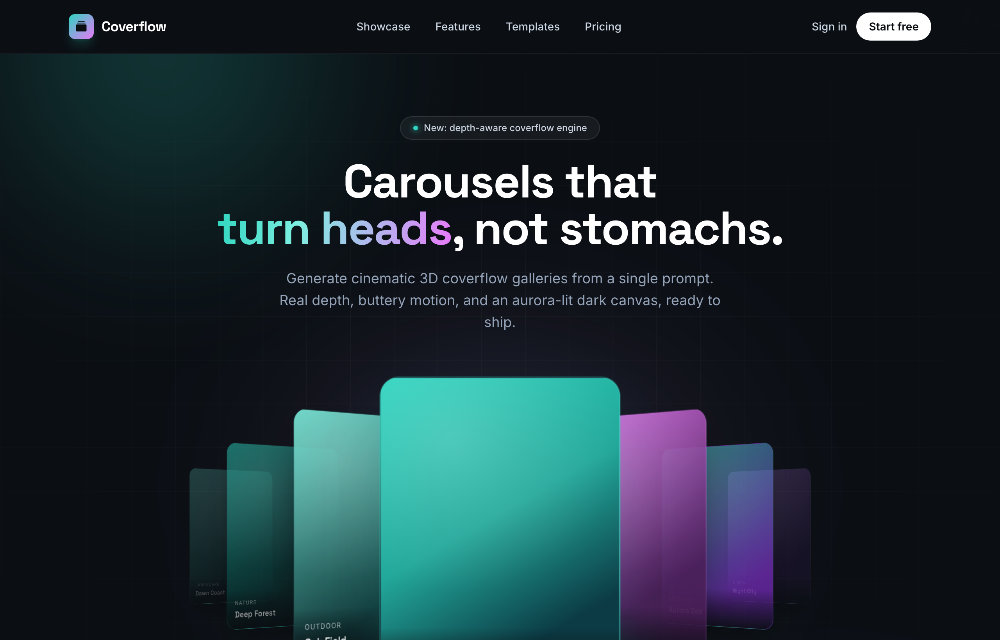

# Coverflow — Carousels that turn heads (dark coverflow aurora)

A dark, aurora-lit 3D coverflow carousel landing page: a sticky frosted-ink nav, then a centered hero (a 'depth-aware coverflow engine' status pill, a big 'Carousels that turn heads, not stomachs.' heading whose 'turn heads' is teal-to-magenta gradient text, and a soft lead) wrapping a real CSS 3D coverflow stage. Seven gradient cards sit on a 1600px perspective stage: the active card faces front with a teal glow ring while neighbours rotate ~42-48deg and recede in Z, scaling and fading by distance, each card carrying a top-left sheen and a bottom gradient label. Below the stage, a round glass prev button, pill dots (active = a wide teal-to-magenta gradient bar), and a next button; clicks, dots, arrows and the left/right keys re-lay the stage. Then a CTA pair, a grayscale logo strip, a 3-up glass feature grid, a 'from prompt to motion' showcase split with a faux terminal card, a gradient-thumb templates grid, a dark gradient CTA, and a social footer. Inter + Space Grotesk fonts, near-black ink #0b0f14 ground, aqua #2dd4bf + magenta #e879f9 accents, glass panels and aurora blobs, Iconify Phosphor icons; responsive geometry drops far cards on small screens and collapses the nav into a hamburger.



## Prompt

```text
{"summary": "A dark, aurora-lit 3D coverflow carousel landing page in a confident, playful product-marketing voice. A sticky frosted-ink top nav (a teal-to-magenta gradient rounded card-stack logo + a 'Coverflow' wordmark, a hidden-on-mobile nav row -- Showcase / Features / Templates / Pricing -- a ghost 'Sign in' link and a solid white 'Start free' pill, plus a mobile hamburger that toggles a slide-down menu) sits above a centered hero: a small 'New: depth-aware coverflow engine' status pill, a big two-line 'Carousels that turn heads, not stomachs.' heading whose 'turn heads' is a teal-to-magenta gradient text, and a muted lead. The hero's centerpiece is a real CSS 3D coverflow: seven absolutely-positioned cards on a 1600px perspective stage, the active card facing front (translated toward the viewer with a teal glow ring) and its neighbours rotated ~42-48deg and pushed back in Z, scaled down and faded by distance, each card a vertical gradient tile with a soft top-left sheen and a bottom gradient label (an uppercase category eyebrow + a Space Grotesk title). Below the stage, a control row of a round glass prev button, a row of pill dots (the active dot a wide teal-to-magenta gradient bar with a glow), and a round glass next button; clicking a card or dot, the arrows, or the left/right arrow keys re-lays out the stage. A CTA pair ('Build your carousel' gradient button + a 'Watch it move' glass button) and a trust line follow. Beneath the hero: a grayscale logo strip, a 3-up glass feature grid (True 3D perspective / 60fps momentum / A11y by default), a split 'From prompt to motion' showcase (copy + checklist + a faux terminal prompt card), a 3-up templates grid of gradient-thumb cards, a dark gradient CTA section, and a social footer. Built on the Tailwind CDN with Inter + Space Grotesk and Iconify Phosphor icons; below ~860px the stage shrinks and drops far cards, and below 480px it shows only the active card plus close neighbours, the nav links collapse into the hamburger menu, and the hero/headings scale down.", "style": {"description": "A premium dark, aurora-lit aesthetic: a near-black blue-ink ground (#0b0f14) lit from the corners by large blurred aurora blobs in a teal-to-magenta family. The two signature accents are aqua/teal (#2dd4bf) and magenta (#e879f9), used together as gradients (logo chip, hero 'turn heads' gradient text, active-card glow, active dot, primary CTA, template thumbs) and individually as section eyebrows and feature-icon tints. Text is light slate (Tailwind slate-200/300/400) on the dark ground; the only light surfaces are the white 'Start free' pill and the white CTA button (with dark #0b0f14 'ink' text on them). Surfaces are 'glass': translucent white panels (linear-gradient of rgba(255,255,255,0.06) to 0.015) with a hairline rgba(255,255,255,0.08) border and a 14px backdrop blur, plus deep drop shadows (0 30px 70px -28px rgba(0,0,0,0.85)); the active coverflow card swaps in a teal glow shadow + teal ring (0 40px 90px -30px rgba(45,212,191,0.35), 0 0 0 1px rgba(45,212,191,0.25)). Depth comes from layered atmosphere: two large corner aurora blobs (teal top-left ~620px, magenta bottom-right ~680px, blur 90px, opacity .5), a central teal-magenta ellipse glow (blur 110px), and a faint 56px grid texture masked to a soft radial vignette around the hero. Corners are generously rounded (rounded-full pills/buttons/dots, rounded-2xl glass cards, 22px coverflow cards, rounded-xl/lg chips). Typography pairs Inter (sans body/UI, weights 400-700) with Space Grotesk (display headings + card titles, weights 500-700), with tight tracking on the big display heading. The overall feel is cinematic and motion-forward: real 3D perspective, smooth cubic-bezier(.22,.61,.36,1) card transitions over .55s, a glowing active slide, and gentle hover scales on the nav buttons.", "prompt": "Use a premium dark, aurora-lit design system on the Tailwind CDN with Inter (body/UI) + Space Grotesk (display) and Iconify Phosphor icons. Extend the Tailwind theme with custom colors `ink` #0b0f14, `ink2` #0e141b, `aqua` #2dd4bf, `magenta` #e879f9, and `fontFamily.sans = ['Inter','system-ui','sans-serif']`, `fontFamily.display = ['Space Grotesk','Inter','sans-serif']`; load Inter (400;500;600;700) + Space Grotesk (500;600;700) from Google Fonts and Iconify 3.1.1 from its CDN. Body is `font-sans text-slate-200 antialiased selection:bg-aqua/30` with `body { background-color:#0b0f14 }` and `html { scroll-behavior:smooth }`. The ground is near-black blue-ink (#0b0f14); the only light surfaces are a white `rounded-full` 'Start free' pill and the white CTA button, both with `text-ink` (#0b0f14) dark text. Use TWO accents as a teal->magenta pair: aqua #2dd4bf and magenta #e879f9, combined as gradients (`bg-gradient-to-br from-aqua to-magenta` logo chip, the hero 'turn heads' `gradient-text` clipped to a `linear-gradient(100deg,#2dd4bf,#7defe0 35%,#e879f9)`, the active coverflow card glow, the active dot `linear-gradient(90deg,#2dd4bf,#e879f9)`, the primary CTA `from-aqua to-magenta`, template thumbs) and individually as section eyebrows (`text-aqua` / `text-magenta` uppercase tracked labels) and feature-icon tints (`bg-aqua/15 text-aqua`, `bg-magenta/15 text-magenta`). Build a reusable `.glass` surface: `background: linear-gradient(160deg, rgba(255,255,255,0.06), rgba(255,255,255,0.015)); border:1px solid rgba(255,255,255,0.08); backdrop-filter: blur(14px)`, used for feature cards, the terminal panel, template cards, nav buttons. Atmosphere: an `.aurora` layer (`absolute inset-0 overflow-hidden pointer-events-none`) whose `::before` is a ~620px teal radial blob top-left and `::after` a ~680px magenta radial blob bottom-right (both `filter: blur(90px); opacity:.5`), an `.aurora-mid` central ~520x320px teal-magenta ellipse (`filter: blur(110px)`), and a `.grid-tex` 56px line grid masked by `radial-gradient(ellipse 90% 62% at 50% 38%, #000 18%, transparent 72%)`. Corners: `rounded-full` pills/buttons/dots, `rounded-2xl` glass cards, `22px` coverflow cards. Shadows: glass cards `0 30px 70px -28px rgba(0,0,0,0.85)`; the active coverflow card `0 40px 90px -30px rgba(45,212,191,0.35), 0 0 0 1px rgba(45,212,191,0.25)`. Type: display headings + coverflow card titles in Space Grotesk (the hero `text-4xl sm:text-6xl font-bold leading-[1.05] tracking-tight`), body/UI in Inter (slate-300/400). Motion: coverflow cards transition `transform .55s cubic-bezier(.22,.61,.36,1), opacity .55s ease, filter .55s ease`; nav buttons scale 1.08 and gain a teal border on hover; the active dot widens to 26px with a teal glow."}, "layout_and_structure": {"description": "A single dark scrolling landing page: sticky nav, a tall hero whose centerpiece is a 3D coverflow stage with controls, then a logo strip, a 3-up feature grid, a 2-col showcase split, a 3-up templates grid, a dark CTA section, and a footer. The `<nav>` is `sticky top-0 z-50 border-b border-white/5 bg-ink/70 backdrop-blur-xl` with a centered `mx-auto max-w-6xl flex items-center justify-between px-6 py-4` row (brand cluster left, `hidden md:flex` link row center, sign-in/Start-free/hamburger right) plus a `hidden md:hidden` slide-down mobile menu. The `<header>` hero is `relative overflow-hidden` and stacks an `.aurora` + `.aurora-mid` + `.grid-tex` backdrop, then a centered `max-w-6xl px-6 pt-16 pb-10 text-center` intro (a glass status pill, the two-line gradient-accent heading, a lead), then a `max-w-5xl px-4 pb-6` coverflow region (a soft teal glow oval behind, the `.coverflow` perspective stage, and a centered control row of prev / dots / next), then a `max-w-6xl px-6 pb-16 text-center` CTA pair + trust line. The coverflow stage is `position:relative; height:440px; perspective:1600px; transform-style:preserve-3d` holding seven `.cf-card` tiles (`position:absolute; top/left 50%; 280x372px; margin offsets to center; border-radius 22px; overflow:hidden`), each JS-injected with a vertical gradient background, a top-left radial sheen, and a bottom `.label` (uppercase category + Space Grotesk title). Sections below share `mx-auto max-w-6xl px-6`: a `border-y border-white/5 bg-ink2/60` logo strip (six Space Grotesk wordmarks), a `py-24` features section (centered eyebrow/heading/lead + a `grid md:grid-cols-3 gap-5` of glass feature cards), a `border-t border-white/5 bg-ink2/50 py-24` showcase split (`grid lg:grid-cols-2` of copy+checklist+CTA vs a glass terminal card), a `py-24` templates section (a header row + a `grid sm:grid-cols-2 lg:grid-cols-3 gap-5` of glass cards with gradient thumbs), a `border-t border-white/5 py-24` CTA section (an `.aurora-mid` glow + a centered `max-w-3xl` heading/lead/button-pair), and a `border-t border-white/5 bg-ink2/60` footer (brand / copyright / social icon row). Responsive: at <=860px the stage is 400px tall with smaller cards and the far cards fade out; at <=480px it is 360px with only the active + immediate neighbours visible; below md the nav links collapse into the hamburger menu and headings/CTAs scale and stack.", "prompts": [{"part": "Sticky frosted-ink top nav + mobile menu", "prompt": "Build `<nav class=\"sticky top-0 z-50 w-full border-b border-white/5 bg-ink/70 backdrop-blur-xl\">` with an inner `mx-auto flex max-w-6xl items-center justify-between px-6 py-4` row. LEFT: a brand anchor `flex items-center gap-2.5` = a `grid h-8 w-8 place-items-center rounded-lg bg-gradient-to-br from-aqua to-magenta shadow-lg shadow-aqua/20` chip holding an 18px `ph:cards-three-fill` Iconify icon colored `text-ink`, plus a `font-display text-lg font-bold tracking-tight text-white` 'Coverflow' wordmark. CENTER: a `hidden md:flex items-center gap-8 text-sm font-medium text-slate-300` link row (Showcase #showcase / Features #features / Templates #templates / Pricing, each `transition hover:text-white`). RIGHT: a `flex items-center gap-3` cluster = a `hidden sm:block text-sm font-medium text-slate-300 hover:text-white` 'Sign in' ghost link, a `rounded-full bg-white px-4 py-2 text-sm font-semibold text-ink transition hover:bg-aqua` 'Start free' pill, and a `md:hidden grid h-9 w-9 place-items-center rounded-lg border border-white/10 bg-white/5` `#menuBtn` hamburger (a `ph:list-bold` icon with `aria-expanded`/`aria-controls`). After the row, a `hidden md:hidden border-t border-white/5 bg-ink/95 backdrop-blur-xl` `#mobileMenu` holding the same links as a stacked `flex flex-col px-6 py-3` list (each `rounded-lg px-2 py-3 hover:bg-white/5 hover:text-white`, plus a `sm:hidden` 'Sign in')."}, {"part": "Hero intro (aurora backdrop + gradient heading)", "prompt": "Build `<header class=\"relative w-full overflow-hidden\">`. Layer the backdrop first: a `.aurora` div, an `.aurora-mid` div, and an `absolute inset-0 grid-tex` div. Then a centered `relative mx-auto max-w-6xl px-6 pt-16 pb-10 text-center sm:pt-20` intro: (1) a status pill `mx-auto mb-6 inline-flex items-center gap-2 rounded-full border border-white/10 bg-white/5 px-4 py-1.5 text-xs font-medium text-slate-300 backdrop-blur` with a tiny `h-1.5 w-1.5 rounded-full bg-aqua shadow-[0_0_8px] shadow-aqua` dot + 'New: depth-aware coverflow engine'; (2) an `<h1 class=\"font-display text-4xl font-bold leading-[1.05] tracking-tight text-white sm:text-6xl\">` reading 'Carousels that' then `<br>` then a `gradient-text` span 'turn heads' then ', not stomachs.'; (3) a `mx-auto mt-5 max-w-xl text-base leading-relaxed text-slate-400 sm:text-lg` lead about generating cinematic 3D coverflow galleries from a single prompt."}, {"part": "3D coverflow stage + controls", "prompt": "Build a `relative mx-auto max-w-5xl px-4 pb-6 sm:px-6` region. Behind the stage place a `pointer-events-none absolute inset-x-0 bottom-16 mx-auto h-24 max-w-2xl rounded-[100%] bg-aqua/10 blur-3xl` glow oval. Then the `<div class=\"coverflow\" id=\"coverflow\">` stage (`position:relative; height:440px; perspective:1600px; transform-style:preserve-3d`) whose `.cf-card` tiles are injected by JS (see special components). Below it, a `mt-7 flex items-center justify-center gap-6` control row: a round `nav-btn glass text-slate-200` `#prev` button (a `ph:caret-left-bold` icon), a `flex items-center gap-2.5` `#dots` container of pill dots, and a round `nav-btn glass` `#next` button (a `ph:caret-right-bold` icon). The `.nav-btn` is `width/height 44px; display:grid; place-items:center; border-radius:9999px` and scales 1.08 with a teal border on hover."}, {"part": "Hero CTA pair + trust line", "prompt": "Below the coverflow, a `relative mx-auto mt-4 max-w-6xl px-6 pb-16 text-center` block: a `flex flex-col items-center justify-center gap-3 sm:flex-row` button row = a primary `group inline-flex items-center gap-2 rounded-full bg-gradient-to-r from-aqua to-magenta px-7 py-3.5 text-sm font-semibold text-ink shadow-xl shadow-aqua/20 hover:shadow-aqua/40` 'Build your carousel' button with a `ph:arrow-right-bold` icon that nudges right on group-hover, plus a glass secondary `inline-flex items-center gap-2 rounded-full border border-white/10 bg-white/5 px-7 py-3.5 text-sm font-semibold text-white backdrop-blur hover:bg-white/10` 'Watch it move' button with a `ph:play-circle` icon. Under it, a `mt-5 text-xs text-slate-400` trust line 'Trusted by 12,000+ product teams · No credit card'."}, {"part": "Logo strip", "prompt": "Build `<section class=\"relative w-full border-y border-white/5 bg-ink2/60\">` with a `mx-auto flex max-w-6xl flex-wrap items-center justify-center gap-x-12 gap-y-5 px-6 py-7` row of six `font-display text-lg font-semibold tracking-tight text-slate-300/90` wordmarks (Lumen, Northwind, Parallax, Halcyon, Vela, Driftwood) reading as a muted trusted-by logo row."}, {"part": "Feature grid (3-up glass cards)", "prompt": "Build `<section id=\"features\" class=\"relative w-full py-24\">` with an `.aurora-mid` glow (`style=\"top:10%;opacity:.4\"`). Center a `mx-auto max-w-2xl text-center` header: a `text-sm font-semibold uppercase tracking-[0.2em] text-aqua` 'The engine' eyebrow, a `mt-3 font-display text-3xl font-bold tracking-tight text-white sm:text-4xl` 'Depth you can feel, motion you can trust' heading, and a `mt-4 text-slate-400` lead. Then a `mt-14 grid gap-5 md:grid-cols-3` of three `glass rounded-2xl p-7` cards, each with a `grid h-11 w-11 place-items-center rounded-xl` icon chip (alternating `bg-aqua/15 text-aqua` / `bg-magenta/15 text-magenta`) holding a 22px Phosphor icon (`ph:cube`, `ph:lightning`, `ph:wheelchair`), a `mt-5 font-display text-lg font-semibold text-white` title (True 3D perspective / 60fps momentum / A11y by default), and a `mt-2 text-sm leading-relaxed text-slate-400` body."}, {"part": "Showcase split (copy + terminal card)", "prompt": "Build `<section id=\"showcase\" class=\"relative w-full border-t border-white/5 bg-ink2/50 py-24\">` with a `mx-auto grid max-w-6xl items-center gap-14 px-6 lg:grid-cols-2`. LEFT column: a `text-sm font-semibold uppercase tracking-[0.2em] text-magenta` 'From prompt to motion' eyebrow, a `mt-3 font-display text-3xl font-bold tracking-tight text-white sm:text-4xl` 'Describe it. Watch it come alive.' heading, a `mt-4 text-slate-400` lead, a `mt-8 space-y-4` checklist of three items (each a `flex items-start gap-3` row with a `grid h-6 w-6 rounded-full bg-aqua/15 text-aqua` (or magenta) `ph:check-bold` chip + a bold-lead sentence: Live theming / Export anywhere / Responsive by design), and a `mt-9 inline-flex items-center gap-2 rounded-full border border-aqua/30 bg-aqua/10 px-6 py-3 text-sm font-semibold text-aqua hover:bg-aqua/20` 'Explore the playground' link with a `ph:arrow-up-right` icon. RIGHT column: a `glass relative rounded-2xl p-1.5` wrapper around a `rounded-xl bg-ink p-5 font-mono text-[13px] leading-relaxed` faux terminal (a `ph:terminal-window` 'prompt' header, a `$ coverflow generate` line, a two-line quoted prompt in slate-500, and a `mt-4 space-y-1.5` result block of teal `✓` lines -- geometry 7 cards 42° tilt / easing cubic-bezier(.22,.61,.36,1) / aurora aqua → magenta -- ending in a magenta `→ rendered in 0.8s`)."}, {"part": "Templates grid (gradient-thumb cards)", "prompt": "Build `<section id=\"templates\" class=\"relative w-full py-24\">` with a `mx-auto max-w-6xl px-6` wrapper. A `flex flex-col items-end justify-between gap-6 sm:flex-row` header row: LEFT a `max-w-xl` block (a `text-sm font-semibold uppercase tracking-[0.2em] text-aqua` 'Starting points' eyebrow + a `mt-3 font-display text-3xl font-bold tracking-tight text-white sm:text-4xl` 'Templates that already move' heading), RIGHT a `text-sm font-semibold text-slate-300 hover:text-aqua` 'Browse all 60+ →' link. Then a `mt-12 grid gap-5 sm:grid-cols-2 lg:grid-cols-3` of three `group glass overflow-hidden rounded-2xl hover:-translate-y-1 hover:border-aqua/30` (or magenta) article cards, each with a `h-40` gradient thumbnail (`bg-gradient-to-br from-aqua/30 via-ink2 to-magenta/20` and variants) and a `p-5` caption (a `font-display text-base font-semibold text-white` title -- Aurora Gallery / Product Reel / Team Faces -- + a `mt-1 text-sm text-slate-400` subtitle)."}, {"part": "Dark CTA section", "prompt": "Build `<section class=\"relative w-full overflow-hidden border-t border-white/5 py-24\">` with an `.aurora-mid` glow (`style=\"top:0;opacity:.55\"`). Center a `relative mx-auto max-w-3xl px-6 text-center` block: a `font-display text-3xl font-bold tracking-tight text-white sm:text-5xl` two-line heading 'Ship a carousel / worth swiping.', a `mx-auto mt-5 max-w-lg text-slate-400` lead, and a `mt-8 flex flex-col items-center justify-center gap-3 sm:flex-row` button pair = a `rounded-full bg-gradient-to-r from-aqua to-magenta px-8 py-3.5 text-sm font-semibold text-ink shadow-xl shadow-magenta/20 hover:shadow-magenta/40` 'Start free' button + a `rounded-full border border-white/10 bg-white/5 px-8 py-3.5 text-sm font-semibold text-white backdrop-blur hover:bg-white/10` 'Book a demo' button."}, {"part": "Social footer", "prompt": "Close with `<footer class=\"relative w-full border-t border-white/5 bg-ink2/60\">` wrapping a `mx-auto flex max-w-6xl flex-col items-center justify-between gap-4 px-6 py-8 sm:flex-row` row. LEFT: a `flex items-center gap-2.5` brand cluster (a `grid h-7 w-7 place-items-center rounded-lg bg-gradient-to-br from-aqua to-magenta` chip with a 15px `ph:cards-three-fill` `text-ink` icon + a `font-display font-bold text-white` 'Coverflow' wordmark). CENTER: a `text-xs text-slate-400` copyright '© 2026 Coverflow Labs. Crafted in the dark.'. RIGHT: a `flex items-center gap-4 text-slate-400` social icon row (`ph:x-logo`, `ph:github-logo`, `ph:dribbble-logo`, each `hover:text-aqua`). Below sm the row stacks to a centered column."}, {"part": "Responsive reflow", "prompt": "Drive the coverflow geometry with breakpoints. At <=860px: `.coverflow` height 400px, `.cf-card` 230x312px with recentred margins, the +/-1 neighbours pull in (`translate3d(±140px,0,-40px) rotateY(∓42deg) scale(.84)`), the +/-2 cards tighten (`±250px,...scale(.66)`), and the +/-3 far cards set `opacity:0`. At <=480px: `.coverflow` height 360px, `.cf-card` 200x272px, only the active and +/-1 cards show (`translate3d(±106px,0,-60px) rotateY(∓40deg) scale(.78); opacity:.7`) while +/-2 and +/-3 are `opacity:0`. In the nav, the link row is `hidden md:flex` (collapsing into the `#menuBtn` hamburger + `#mobileMenu` slide-down below md) and the 'Sign in' link is `hidden sm:block`. The hero heading is `text-4xl sm:text-6xl`, the CTA button rows are `flex-col` then `sm:flex-row`, the templates grid is `sm:grid-cols-2 lg:grid-cols-3`, and the footer is `flex-col` then `sm:flex-row`."}]}, "special_ui_components": [{"name": "CSS 3D coverflow stage (perspective + preserve-3d)", "prompt": "The carousel is a real CSS 3D stage, not a flat slider. `.coverflow` is `position:relative; height:440px; perspective:1600px; transform-style:preserve-3d`. Each `.cf-card` is `position:absolute; top:50%; left:50%; width:280px; height:372px; margin-left:-140px; margin-top:-186px` (so its transform origin is the stage center), `border-radius:22px; overflow:hidden; border:1px solid rgba(255,255,255,0.08); box-shadow:0 30px 70px -28px rgba(0,0,0,0.85); background:#0e141b; will-change:transform`, and transitions `transform .55s cubic-bezier(.22,.61,.36,1), opacity .55s ease, filter .55s ease`. Position classes place each card by its signed distance from the active index: `.cf-pos-0 { transform: translate3d(0,0,140px) rotateY(0) scale(1); opacity:1; z-index:50 }` (active, brought toward the viewer); `.cf-pos-1 { translate3d(168px,0,-40px) rotateY(-42deg) scale(.86); opacity:.92; z-index:40 }` and its mirror `.cf-pos-n1 { translate3d(-168px,0,-40px) rotateY(42deg) scale(.86) }`; `.cf-pos-2`/`-n2` (`±310px,-200px`, rotateY ∓46deg, scale .7, opacity .55); `.cf-pos-3`/`-n3` (`±420px,-360px`, rotateY ∓48deg, scale .56, opacity .22); and `.cf-hidden { translate3d(0,0,-520px) scale(.4); opacity:0 }` for anything farther. So side cards genuinely rotate away and recede in Z while the active card faces front."}, {"name": "Glowing active coverflow card", "prompt": "The active (front) card is visually promoted: in addition to `.cf-pos-0`'s forward translate and full scale/opacity, it overrides its shadow to a teal glow + ring with `.cf-pos-0 { box-shadow: 0 40px 90px -30px rgba(45,212,191,0.35), 0 0 0 1px rgba(45,212,191,0.25) }`, so the centered card reads lit and ringed in aqua against its dimmer, rotated neighbours."}, {"name": "JS-injected gradient cards with sheen + label", "prompt": "Cards are generated in JS from a `slides` array of `{ title, sub, g }` (g = a `linear-gradient(150deg,...)` vertical fill, e.g. 'Dawn Coast'/Landscape teal, the featured 'Moonrise'/Featured true-aqua `linear-gradient(150deg,#2dd4bf 0%,#22a89a 45%,#0c3b45 78%)`, 'Wild Petal'/Macro magenta, 'Aurora Sea'/Abstract teal->purple, 'Night City'/Urban). For each slide, create a `.cf-card` with `card.style.background = s.g`, set `dataset.idx`, and inject innerHTML: a top-left radial sheen (`position:absolute;inset:0;background:radial-gradient(120% 80% at 30% 20%, rgba(255,255,255,0.18), transparent 60%)`) and a bottom `.label` (`position:absolute;left:0;right:0;bottom:0;padding:18px 18px 16px;background:linear-gradient(to top, rgba(7,10,14,0.92), rgba(7,10,14,0.45) 55%, transparent)`) holding an 11px uppercase letter-spaced category in `rgba(255,255,255,0.7)` + a 17px Space Grotesk white title. Each card and dot gets a click handler that sets `active = i` and re-renders. The keyboard listener maps ArrowLeft/ArrowRight to active-1/active+1 (clamped)."}, {"name": "Pill-dot pagination with gradient active bar", "prompt": "Below the stage, a `#dots` row holds one `.dot` per slide: `width/height 8px; border-radius:9999px; background:rgba(255,255,255,0.22); transition: all .35s ease; cursor:pointer`. The active dot is `.dot.active { width:26px; background:linear-gradient(90deg,#2dd4bf,#e879f9); box-shadow:0 0 14px rgba(45,212,191,0.6) }` -- it stretches into a wide teal-to-magenta gradient bar with a teal glow. The render() loop toggles `.active` onto the dot matching the active index; clicking a dot jumps the carousel to that slide."}, {"name": "Coverflow render() layout engine", "prompt": "A single `render()` function lays out the whole stage from one `active` index. It iterates `.cf-card` nodes, computes `d = i - active`, and assigns a position class: `d===0`->cf-pos-0, `d===1`->cf-pos-1, `d===2`->cf-pos-2, `d>=3`->cf-pos-3, `d===-1`->cf-pos-n1, `d===-2`->cf-pos-n2, `d<=-3`->cf-pos-n3 (resetting the className to `'cf-card '+cls` each time). It also toggles the matching `.dot.active`. `#next`/`#prev` clamp `active` to `[0, slides.length-1]` and call render(); ArrowRight/ArrowLeft do the same; clicking a card or dot sets active to that index. `active` starts at 3 so the featured 'Moonrise' card is centered on load."}, {"name": "Glass surface + aurora atmosphere", "prompt": "A reusable `.glass` class gives every panel a frosted look: `background: linear-gradient(160deg, rgba(255,255,255,0.06), rgba(255,255,255,0.015)); border:1px solid rgba(255,255,255,0.08); backdrop-filter: blur(14px)`, used on feature cards, the terminal wrapper, template cards, and the round nav buttons. The dark ground is lit by atmosphere layers: `.aurora` (`absolute inset-0 overflow-hidden pointer-events-none`) whose `::before` is a ~620px teal radial blob top-left and `::after` a ~680px magenta radial blob bottom-right (both `filter: blur(90px); opacity:.5`); `.aurora-mid`, a ~520x320px central teal-magenta ellipse (`filter: blur(110px)`), reused in the features and CTA sections with tweaked top/opacity; and `.grid-tex`, a 56px line grid masked to a soft hero vignette by `mask-image: radial-gradient(ellipse 90% 62% at 50% 38%, #000 18%, transparent 72%)`."}, {"name": "Faux terminal prompt card", "prompt": "The showcase right column is a faux CLI: a `glass relative rounded-2xl p-1.5` wrapper around a `rounded-xl bg-ink p-5 font-mono text-[13px] leading-relaxed` panel. It opens with a slate-600 header (a `ph:terminal-window` icon + a 'prompt' label), a command line `$ coverflow generate` (the `$` in magenta, the command in slate-200), a two-line quoted prompt in slate-500, then a `mt-4 space-y-1.5` result block of teal `✓` lines ('geometry · 7 cards, 42° tilt', 'easing · cubic-bezier(.22,.61,.36,1)', 'aurora · aqua → magenta') closing with a magenta arrow line '→ rendered in 0.8s'. It visually echoes the prompt-to-design product story."}, {"name": "Mobile hamburger slide-down menu", "prompt": "On mobile the nav links collapse behind a `#menuBtn` hamburger (`md:hidden grid h-9 w-9 place-items-center rounded-lg border border-white/10 bg-white/5`, a `ph:list-bold` icon, with `aria-expanded`/`aria-controls=mobileMenu`). A `#mobileMenu` panel (`hidden border-t border-white/5 bg-ink/95 backdrop-blur-xl md:hidden`) holds the same links stacked. JS toggles `#mobileMenu`'s `hidden` class, flips `aria-expanded`, and swaps the icon between `ph:list-bold` and `ph:x-bold`; clicking any menu link closes the menu."}], "special_notes": "Exact tokens (Tailwind config extend): colors `ink` #0b0f14, `ink2` #0e141b, `aqua` #2dd4bf, `magenta` #e879f9; `fontFamily.sans = ['Inter','system-ui','sans-serif']`, `fontFamily.display = ['Space Grotesk','Inter','sans-serif']`. Fonts: Inter (Google Fonts weights 400;500;600;700) + Space Grotesk (500;600;700); Iconify 3.1.1 (Phosphor `ph:` set) from https://code.iconify.design/3/3.1.1/iconify.min.js. Body `font-sans text-slate-200 antialiased selection:bg-aqua/30` with `body { background-color:#0b0f14 }` and `html { scroll-behavior:smooth }`. Two accents only (aqua #2dd4bf + magenta #e879f9), used as gradients and as individual eyebrow/icon tints; the only light surfaces are the white 'Start free' pill and the white CTA button, both `text-ink`. `.glass`: `linear-gradient(160deg, rgba(255,255,255,0.06), rgba(255,255,255,0.015))`, `border:1px solid rgba(255,255,255,0.08)`, `backdrop-filter: blur(14px)`. `.gradient-text`: `linear-gradient(100deg,#2dd4bf 0%,#7defe0 35%,#e879f9 100%)` clipped to text. Atmosphere: `.aurora::before` ~620px teal radial blob top-left, `.aurora::after` ~680px magenta radial blob bottom-right (blur 90px, opacity .5); `.aurora-mid` ~520x320px teal-magenta ellipse (blur 110px); `.grid-tex` 56px line grid masked by `radial-gradient(ellipse 90% 62% at 50% 38%, #000 18%, transparent 72%)`. Coverflow: `.coverflow { height:440px; perspective:1600px; transform-style:preserve-3d }`; `.cf-card { 280x372px; margin-left:-140px; margin-top:-186px; border-radius:22px; background:#0e141b; box-shadow:0 30px 70px -28px rgba(0,0,0,0.85); transition: transform .55s cubic-bezier(.22,.61,.36,1), opacity .55s ease, filter .55s ease }`. Position transforms: pos-0 `translate3d(0,0,140px) rotateY(0) scale(1)` + glow `box-shadow:0 40px 90px -30px rgba(45,212,191,0.35), 0 0 0 1px rgba(45,212,191,0.25)`; pos-1/n1 `±168px,0,-40px rotateY ∓42deg scale .86 opacity .92`; pos-2/n2 `±310px,0,-200px rotateY ∓46deg scale .7 opacity .55`; pos-3/n3 `±420px,0,-360px rotateY ∓48deg scale .56 opacity .22`; cf-hidden `0,0,-520px scale .4 opacity 0`. Dots: `.dot 8px rgba(255,255,255,0.22)`, `.dot.active width:26px; background:linear-gradient(90deg,#2dd4bf,#e879f9); box-shadow:0 0 14px rgba(45,212,191,0.6)`. `.nav-btn 44px round, place-items center`, hover scale 1.08 + teal border. JS: a `slides` array of 7 `{title,sub,g}` objects (featured 'Moonrise' is true-aqua `linear-gradient(150deg,#2dd4bf 0%,#22a89a 45%,#0c3b45 78%)`), each rendered as a `.cf-card` with a top-left radial sheen + a bottom gradient `.label` (uppercase 11px category + 17px Space Grotesk title); `active` starts at 3; a single `render()` maps signed distance->position class and toggles the active dot; `#next`/`#prev` and ArrowRight/Left clamp active to `[0,6]`; card/dot clicks jump. Responsive: <=860px stage 400px, cards 230x312, neighbours pull in, far cards hidden; <=480px stage 360px, cards 200x272, only active+/-1 visible; below md nav links collapse into the hamburger `#mobileMenu`, 'Sign in' is `hidden sm:block`, headings/CTAs scale and stack. This is an original prompt-library product for the placeholder brand 'Coverflow' (faithfully reproducing the build HTML); the library value is the reusable dark aurora-lit CSS-3D coverflow pattern itself -- a perspective stage of rotating, receding gradient cards with a glowing active slide, pill-dot pagination, keyboard + click control, and a responsive geometry that drops far cards on small screens."}
```

**▶ Try it live → [https://superdesign.dev/library/coverflow-carousels-that-turn-heads-dark-coverflow-aurora](https://superdesign.dev/library/coverflow-carousels-that-turn-heads-dark-coverflow-aurora?utm_source=github&utm_medium=prompt-repo&utm_campaign=prompt-library)**

**Use it in your coding agent:** install the [Superdesign skill](https://github.com/superdesigndev/superdesign-skill), then:

```bash
superdesign get-prompts --slugs "coverflow-carousels-that-turn-heads-dark-coverflow-aurora" --json
```

*48 copies · 2,460 tries · carousel, coverflow, 3d-carousel, css-3d, perspective*
