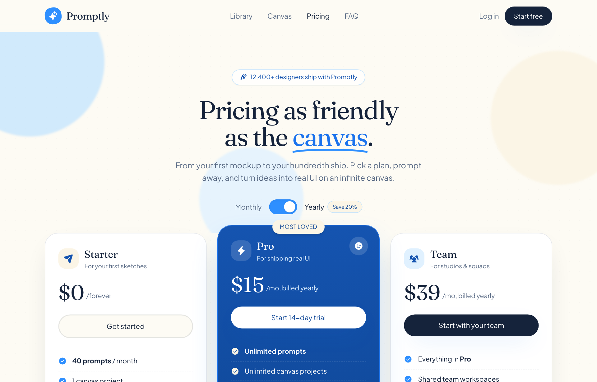

# Cream & Sky Playful SaaS Pricing

A warm, friendly light-mode SaaS pricing page on a cream paper canvas with sky-blue accents, serif display type, rounded cards, a monthly/yearly toggle, and a highlighted middle tier.



## Prompt

```text
{"summary": "A playful, warm light-mode SaaS pricing page: cream paper canvas with a dotted grain, a sky-blue accent system, big Fraunces serif headlines over Plus Jakarta Sans body, and very rounded shapes. Layout is a sticky blurred nav, a centered hero with a squiggle-underlined keyword and a monthly/yearly billing toggle, three pricing tiers with the middle 'Most loved' card highlighted and lifted, a three-up value strip, a gradient CTA band, an accordion FAQ, and a friendly footer. Copy and motifs (tilted icon chips, pastel blobs, smiley mascot) keep it human rather than corporate.", "style": {"description": "A soft, playful, light-mode SaaS aesthetic: a warm cream paper canvas with a subtle dotted-grain texture, a friendly sky-blue accent system, and rounded everything. Big serif display headlines (Fraunces) paired with a clean humanist sans (Plus Jakarta Sans) for body. Generous border radii (28-36px cards, full-pill buttons), pastel decorative blobs floating behind the hero, hand-drawn squiggle underline on a keyword, gentle tilted icon chips, and emoji-adjacent Phosphor glyphs. Warm, human, low-pressure. Shadows are soft and tinted blue, never harsh.", "prompt": "Design a warm, playful light-mode SaaS page. Background is cream paper #fdfbf4 with a faint dotted grain texture (radial-gradient dots, ~22px grid, rgba(21,35,59,0.025)). Primary accent is a full sky-blue ramp: sky-50 #f0f8ff, sky-100 #e0f1ff, sky-200 #bfe2ff, sky-300 #8fcaff, sky-400 #5aadff, sky-500 #2e8fff, sky-600 #1a72ed, sky-700 #1554b0, sky-800 #0f4796, sky-900 #0b3678. Secondary warm cream tones: cream-50 #fdfbf4, cream-100 #fbf5e6, cream-200 #f6ecd2, cream-300 #f0e0b8. Ink (near-black navy) for text #15233b, muted slate #5a6b85 for secondary copy. Typography: display headings in 'Fraunces' serif (weights 400-700, optical-size aware), body and UI in 'Plus Jakarta Sans' (400-800). Use very rounded shapes: cards at 28-36px radius, all buttons fully pill-shaped, icon chips in 16-22px squircles often tilted -6deg/+4deg/12deg. Soft tinted shadows only: soft '0 18px 50px -18px rgba(26,114,237,.28)', card '0 22px 60px -24px rgba(21,35,59,.20)', pop '0 30px 70px -22px rgba(46,143,255,.45)'. Icons are Phosphor (sparkle, confetti, lightning, smiley-wink, check-circle, x-circle, shield-check). Tone is friendly and human, not corporate."}, "layout_and_structure": {"description": "A frameless, responsive single-page pricing layout. Top to bottom: sticky blurred nav, a centered hero with badge + serif headline (with squiggle-underlined keyword) + subcopy + a monthly/yearly billing toggle, then the core pricing region of three side-by-side tier cards with the middle one lifted and highlighted, a reassurance line, a three-up 'every plan includes' value strip, a big gradient CTA band, an accordion FAQ, and a footer. Max content width ~1152px (max-w-6xl), centered, generous vertical rhythm. Fully responsive: the 3 pricing cards reflow 3->2->1 column, the value strip 3->2->1, nav links collapse on mobile, and the sticky header stays pinned on scroll.", "prompts": [{"part": "Sticky nav", "prompt": "A sticky top header (sticky top-0, z-50) with a translucent cream backdrop (bg-cream-50/80 + backdrop-blur-md) and a hairline bottom border (border-ink/5). Inside a centered max-w-6xl row, 68px tall: left = brand lockup (a tilted -6deg sky-500 squircle with a white sparkle icon + the Fraunces wordmark 'Promptly'); center/right = horizontal nav links (Library, Canvas, Pricing [active, ink color], FAQ) hidden on mobile; far right = a ghost 'Log in' link plus a solid ink pill button 'Start free' with soft shadow that turns sky-700 on hover."}, {"part": "Hero / headline", "prompt": "A centered hero on the cream canvas with three soft blurred pastel blobs floating behind it (sky-200, cream-100, sky-100, all blur-2px, absolutely positioned off the edges). Top: a small pill social-proof badge with a confetti icon and copy like '12,400+ designers ship with Promptly' (white/70 bg, sky-200 border, sky-700 text). Then a large two-line Fraunces serif headline ~42px mobile / 56px desktop, tight leading, e.g. 'Pricing as friendly as the canvas.' where the last keyword ('canvas') is sky-600 and carries a hand-drawn SVG squiggle underline. Below, a max-w-xl slate subparagraph. End with the billing toggle (next part)."}, {"part": "Billing toggle", "prompt": "A centered inline toggle row: 'Monthly' label, a custom pill switch (60px wide, 32px tall, sky-500 track, white 24px knob that slides 28px with a springy cubic-bezier transition, default state = yearly/on), then 'Yearly' label followed by a small cream-100 pill badge 'Save 20%' ringed in sky-200 with sky-800 text. The active label is ink-colored, the inactive one is slate. Flipping it swaps tier prices (Pro 15<->19, Team 39<->49) and the '/mo, billed yearly' vs '/mo, billed monthly' caption."}, {"part": "Pricing cards (the core layout)", "prompt": "A three-column pricing grid (grid lg:grid-cols-3, gap-6, items-stretch) that reflows to 1 column on narrow screens. Each card is a tall flex-column with a tilted/colored icon chip + tier name (Fraunces) + one-line descriptor at top, a big Fraunces price ($0 /forever, $15 /mo, $39 /mo) with the unit caption, a full-width pill CTA, then a feature checklist where each row has a sky-500 filled check-circle (or a faded x-circle for an excluded/muted item) and rows are separated by dashed hairline dividers. CARD 1 Starter: white bg, 28px radius, ink/8 border, card shadow; cream icon chip; outline cream CTA 'Get started'; features like '40 prompts / month', '1 canvas project', 'Full prompt library access', 'PNG export', muted 'Community support'. CARD 2 Pro (HIGHLIGHTED, center): sky-700->sky-800 vertical gradient, white text, 30px radius, 'pop' shadow, lifted with negative top margin (lg:-mt-4) so it rises above its neighbors, a sky-600 ring; a cream-100 'MOST LOVED' uppercase badge pinned to the top edge; a small tilted translucent winking-smiley mascot dot in the top-right corner; white pill CTA 'Start 14-day trial'; features in cream-100 checks: 'Unlimited prompts', 'Unlimited canvas projects', 'Coding-agent skill (Claude Code, Cursor)', 'Code + Figma export', 'Priority generation queue'. CARD 3 Team: white bg like Starter; sky-100 icon chip; solid ink pill CTA 'Start with your team'; features 'Everything in Pro', 'Shared team workspaces', 'Brand kits & saved styles', 'Roles & permissions', 'Dedicated support'. Under the grid, a centered slate reassurance line with a shield-check icon: 'No card to start. Cancel any time. Credits never expire.'"}, {"part": "Value strip (every plan includes)", "prompt": "A centered section with a Fraunces H2 ('Every plan ships with the good stuff') + a slate subline, then a three-up feature grid (sm:grid-cols-2 lg:grid-cols-3, reflows to 1 col) of soft pastel cards at 24px radius. Cards alternate sky-50 (ring sky-100) and cream-100 (ring cream-200) backgrounds, each with a tilted 48px squircle icon chip (sky-500 or ink), a Fraunces sub-heading, and a short slate paragraph: 'Infinite canvas', 'Prompt library', 'Works in your editor'. The third card spans full width on the 2-col breakpoint."}, {"part": "CTA band", "prompt": "A full-width rounded (36px) gradient banner (sky-500 -> sky-700, br direction) with white text, 'pop' shadow, and two faint white/cream blurred blobs bleeding off the corners. Centered content: a tilted translucent squircle with a big smiley icon, a Fraunces headline ('Help us make Promptly even friendlier.'), a sky-100 subline, and a button row: a solid white pill CTA 'Start designing free' (sky-700 text) plus a translucent white-outline ghost pill 'Read the FAQ'."}, {"part": "FAQ accordion", "prompt": "A narrow (max-w-3xl) centered FAQ section: Fraunces H2 + slate subline, then a stack of <details> accordion items as white 24px-radius cards with ink/8 border and card shadow. Each summary row has a Fraunces question on the left and a round sky-50 chip with a sky-600 plus icon on the right that rotates 45deg into an x when open (first item open by default). Open body is a slate paragraph. Questions like 'What counts as a prompt?', 'Can I switch plans later?', 'Is the prompt library really free?', 'Do you offer student or OSS discounts?'"}, {"part": "Footer", "prompt": "A footer on a translucent cream-100 band with a top hairline border. A responsive row (column on mobile, row on desktop): brand lockup left (same tilted sparkle squircle + Fraunces wordmark), a wrapping link nav center (Library, Canvas, Pricing, Changelog, Privacy in slate), and a cluster of round white social icon buttons right (X, GitHub, Discord, each with an ink/8 ring, sky-600 on hover). Below, a small slate copyright line with a friendly sign-off ('Made with a little chaos and a lot of love.')."}]}, "special_ui_components": [{"component": "Springy billing toggle", "description": "Custom pill switch that flips monthly<->yearly, animating the knob with a bouncy cubic-bezier(.4,1.2,.5,1) easing and live-swapping prices + billing captions.", "prompt": "Build a 60x32px pill toggle: sky-500 track, 24px white knob, knob translates 28px on 'on' state with a springy cubic-bezier(.4,1.2,.5,1) transition (~280ms). Toggling switches the two paid tier prices (Pro $15<->$19, Team $39<->$49) and the per-card caption between '/mo, billed yearly' and '/mo, billed monthly', and recolors the active Monthly/Yearly label to ink. Default = yearly. Pure JS, no framework."}, {"component": "Squiggle keyword underline", "description": "Hand-drawn SVG squiggle stroke underlining the accent keyword in the serif headline.", "prompt": "Add a hand-drawn wobble underline beneath one sky-600 keyword in the hero headline: an inline absolutely-positioned SVG path (e.g. 'M2 9C40 3 160 3 198 9'), 4px sky-500 stroke, round caps, preserveAspectRatio none so it stretches to the word width, sitting ~8px below the baseline."}, {"component": "Highlighted 'Most loved' tier card", "description": "The center Pro card visually elevated: blue gradient fill, negative top margin lift, pop shadow, an edge-pinned uppercase badge, and a tilted winking-smiley mascot dot.", "prompt": "Make the middle pricing card stand out: sky-700->sky-800 vertical gradient, white text, sky-600 ring, the strong 'pop' tinted shadow, and lift it above its neighbors with a negative top margin (lg:-mt-4). Pin a cream-100 'MOST LOVED' uppercase badge centered on its top edge, and tuck a small 12deg-rotated translucent (white/15 + backdrop-blur) circle holding a winking-smiley icon in the top-right corner."}, {"component": "Tilted icon chips", "description": "Recurring squircle icon containers rotated a few degrees for a playful, hand-placed feel.", "prompt": "Throughout the page use rounded-2xl/rounded-3xl 'squircle' icon chips holding a single Phosphor glyph, deliberately rotated a few degrees (-6deg, -4deg, +4deg, +12deg) for a playful off-grid feel, with soft tinted shadows. Fills vary: sky-500 (white icon), ink (cream icon), cream-100 or sky-100 (sky-700 icon)."}, {"component": "Dashed-divider feature checklist", "description": "Tier feature lists where rows are separated by dashed hairlines, with check / x icons.", "prompt": "Render each plan's features as a vertical list where consecutive rows are separated by a 1px dashed divider (rgba(21,35,59,.10) on light cards, white/18 on the dark Pro card). Each row: a sky-500 (or cream-100 on dark) filled check-circle icon, or a faded ink/20 x-circle + muted text for an excluded/lesser item, then the feature label with key words bolded."}], "special_notes": "Frameless, fully responsive web page (no device/browser chrome). Light mode only; the warmth comes from the cream paper background + dotted grain, not a white card on grey. The signature move is the playful contrast: serious serif display type (Fraunces) over a friendly cream-and-sky palette with tilted chips, pastel blobs, a squiggle underline, and emoji-energy Phosphor icons. Pricing structure = 3 tiers with the middle one highlighted + lifted, a monthly/yearly toggle that recalculates prices, a reassurance line, and an accordion FAQ. Keep all radii large and all shadows soft + blue-tinted. Responsive behavior: pricing cards reflow 3->2->1 column (the lifted Pro card drops its negative margin when stacked), the value strip goes 3->2->1, the nav links hide on mobile while the sticky blurred header stays pinned, and content is capped at ~1152px and centered. Uses Tailwind (CDN) + Phosphor via Iconify; voice is warm and human ('Most loved', 'Made with a little chaos and a lot of love')."}
```

**▶ [Try it live →](https://p.superdesign.dev/draft/f718a8fe-cb58-473d-9627-c5a633692473)**

**Use it in your coding agent:** install the [Superdesign skill](https://github.com/superdesigndev/superdesign-skill), then:

```bash
superdesign get-prompts --slugs "cream-and-sky-playful-saas-pricing" --json
```

*0 copies · 2,415 tries · Pricing Pages · Dev Tools · pricing page, saas, light, cream*
