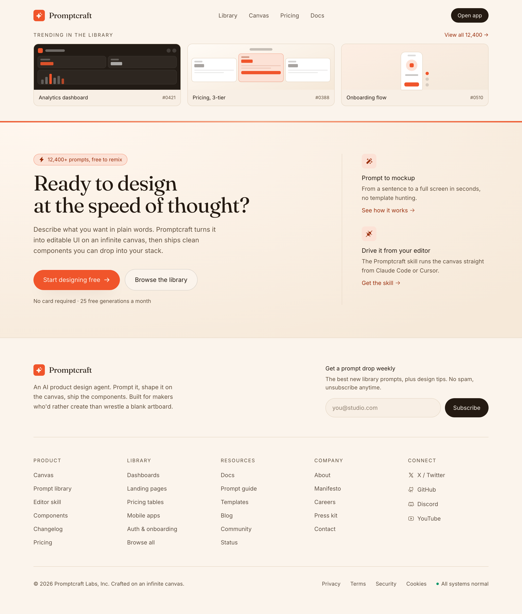

# Cream Paper & Coral Mega Footer

A warm cream-paper mega footer with a coral hairline edge, Fraunces serif CTA band, newsletter capture, a five-column link grid, and a status-pill legal bar.



## Prompt

```text
{"summary": "Build a frameless, full-width CTA band plus mega footer on a warm cream paper background with a coral accent, anchored by a serif headline, a newsletter capture, a five-column link grid, and a status-pill legal bar.", "style": "Warm paper palette: cream base #FBF4EC with a softer #F4E9DB tint, hairline borders #E7D9C7, near-black ink text #241A12, muted brown body #62513F and label brown #5C4D3C. Accent is a warm coral #F0552B with a darker hover #D6431D, a deep rust #9A2F0D for links/eyebrows, and a pale coral wash #FCE2D6 for chips and icon tiles. Fonts (Google Fonts): Fraunces for display headings (optical-size serif, weights 500-600, tight -0.02em tracking) paired with Inter for all UI and body text. Mood: editorial, tactile, hand-made warmth. The CTA band carries a subtle paper grain via a radial cream gradient (radial-gradient from #FFF7EF to #F6E9D9) and a soft inset+drop shadow on the primary pill button. Accent treatment: a 3px coral-to-peach-to-coral gradient hairline pinned to the top edge of the band, pale-coral pill chips, rust text links that underline on hover, and a coral focus ring (2px #F0552B, 2px offset).", "layout_and_structure": "Frameless and full-bleed: sections span the full viewport width with content centered in a max-w 1180px container, 24-32px side padding. Three stacked bands. (1) CTA band: a 3px coral gradient hairline across the very top, then a two-column grid on desktop, minmax(0,1fr) for the headline column and a fixed 360px supporting column, separated by a left hairline; left holds an eyebrow pill, a 40-52px Fraunces serif headline, body copy, two pill CTAs (solid coral primary + outlined cream secondary), and a reassurance line; right holds two stacked feature blurbs each with a rounded icon tile, title, copy, and a rust text link. (2) Footer top row: a two-column grid, brand+description (max 34ch) on the left and a newsletter block on the right (400px), divided by a bottom hairline. (3) Link grid: five columns of titled link lists with uppercase tracked labels. (4) Legal bar: top hairline, copyright on the left and inline legal links plus a status indicator on the right. Responsive reflow: desktop multi-column grids collapse to single column on tablet/mobile, the right CTA column drops its left border and gains a top hairline with top padding, the five-column link grid steps 5 to 3 to 2 columns, the newsletter input+button stacks vertically, and the legal bar stacks from a row into a column.", "special_ui_components": "Eyebrow pill chip (pale coral #FCE2D6, coral border, rust text, lightning icon, prompt count). Two pill CTAs: solid coral primary with arrow icon and soft inset/drop shadow, plus outlined cream secondary. Newsletter capture: a rounded-full email input (cream2 fill, hairline border, muted placeholder) next to a solid ink-to-coral hover Subscribe pill, with helper microcopy. Five titled link columns including a Connect column whose links pair muted Phosphor brand icons (X/Twitter, GitHub, Discord, YouTube) with labels. Legal bar status pill: a small emerald dot with All systems normal text. Icon tiles for the CTA feature blurbs (pale coral square, rust Phosphor icon).", "special_notes": "Frameless: render the bare sections only, no browser chrome, device mockup, or window frame. Full-bleed width with a centered max-w 1180px column; section dividers are full-width hairlines, and the coral accent is a sharp 3px gradient pinned to the band top edge. Keep text WCAG-legible (dark ink #241A12 and brown #62513F on cream, not low-contrast gray). Strictly avoid generic indigo or violet SaaS slop, default Tailwind blue, and pure-white card-on-white flatness: this is a warm paper aesthetic with one decisive coral accent."}
```

**▶ Try it live → [https://superdesign.dev/library/cream-paper-and-coral-mega-footer](https://superdesign.dev/library/cream-paper-and-coral-mega-footer?utm_source=github&utm_medium=prompt-repo&utm_campaign=prompt-library)**

**Use it in your coding agent:** install the [Superdesign skill](https://github.com/superdesigndev/superdesign-skill), then:

```bash
superdesign get-prompts --slugs "cream-paper-and-coral-mega-footer" --json
```

*0 copies · 2,343 tries · Forms & Contact · General · footer, mega-footer, newsletter, cream*
