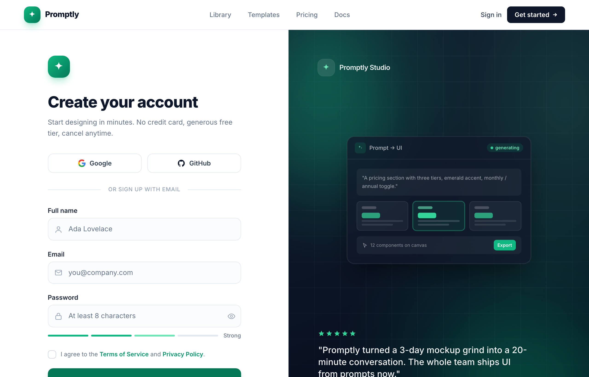

# Create your account · Promptly — split-image emerald sign-up

A two-column desktop sign-up page: focused email + Google/GitHub social form on a bright white left half, dark emerald 'brand-mesh' panel with a floating product mock and testimonial on the right; sticky translucent nav, Inter, slate neutrals with a single emerald accent.



## Prompt

```text
{"summary": "A two-column desktop sign-up page on a white canvas: a focused email/social account-creation form on the left (split into Google/GitHub social buttons, a divider, name/email/password fields with leading icons, a live password-strength meter, a terms checkbox and a full-width emerald CTA) and a dark emerald 'brand-mesh' panel on the right showing a floating product mock and a starred testimonial. A sticky translucent top nav with a gradient logo mark runs full-width above the split. Layout reflows to a single column (form only) below the lg breakpoint.", "style": {"description": "Clean, modern SaaS aesthetic in the Inter typeface, built on a slate neutral scale with a single emerald accent. The left form half is bright white with soft slate-50 input fills; the right half is a dark navy-to-near-black radial 'mesh' with emerald glow blooms and a faint 56px grid masked by a radial fade. Generous rounding (rounded-xl / 2xl), soft layered shadows tinted emerald, and micro-interactions (lift-on-hover CTA, focus ring, floating card, pulsing 'generating' dot).", "prompt": "Design a modern SaaS account-creation screen using the Inter font family (weights 400/500/600/700/800, antialiased, font-feature-settings cv11 + ss01). Use a slate neutral palette (slate-50 #f8fafc, 100 #f1f5f9, 200 #e2e8f0, 300 #cbd5e1, 400 #94a3b8, 500 #64748b, 600 #475569, 700 #334155, 800 #1e293b, 900 #0f172a, 950 #020617) with a single emerald accent (emerald-50 #ecfdf5, 100 #d1fae5, 200 #a7f3d0, 300 #6ee7b7, 400 #34d399, 500 #10b981, 600 #059669, 700 #047857, 800 #065f46, 900 #064e3b). Body text slate-900 on white. The primary CTA is emerald-700 #047857 filled with white text and an emerald-tinted shadow (shadow-lg shadow-emerald-700/30). Use generous border-radius: inputs and the CTA rounded-xl (12px), logo marks rounded-xl/2xl, social buttons rounded-xl, pills rounded-full. Inputs have a 1px slate-200 border on a translucent slate-50/60 fill; on focus the border turns emerald-500 with a 4px rgba(16,185,129,.12) ring and a white fill. Hover the CTA lifts 1px (translateY) with a deeper emerald-800 #065f46 background and a 14px/30px emerald shadow. Keep everything light and airy on the left and dark/luminous on the right."}, "layout_and_structure": {"description": "A full-height page = sticky 64px (h-16) nav + a CSS grid main that is one column on mobile and two columns at lg (grid-cols-[1fr_1.04fr], the brand panel slightly wider). Left = vertically + horizontally centered form column capped at max-w-[420px]; right = a dark aside that only shows at lg and arranges its content top (brand chip) / middle (floating mock) / bottom (testimonial) via flex justify-between with p-12 to p-16 padding.", "prompts": [{"part": "Sticky top nav", "prompt": "A full-width sticky header (sticky top-0, h-16, z-50) with a translucent white background (bg-white/85) + backdrop-blur-xl and a 1px slate-200/70 bottom border. Inner row max-w-[1240px], px-6 to px-8, items-center justify-between. Left: brand lock-up = a 36px (h-9 w-9) rounded-xl logo mark with a from-emerald-500 to-emerald-700 gradient + emerald glow shadow holding a white 4-point sparkle/diamond glyph, beside the word 'Promptly' in 17px extrabold slate-900. Center (md+ only): nav links 'Library / Templates / Pricing / Docs' in 14px medium slate-500 that darken to slate-900 on hover, gap-9. Right: a 'Sign in' text link (slate-600, sm+ only) and a 'Get started' pill button (bg-slate-900, white text, rounded-lg, px-4 py-2, semibold) with a small right-arrow icon."}, {"part": "Left form column", "prompt": "Centered column, max-w-[420px], px-6 to px-12, py-14. Top: a 48px (h-12 w-12) rounded-2xl gradient logo mark (emerald-500 to emerald-700) with the sparkle glyph, mb-8. Then an h1 'Create your account' at 32-34px extrabold tracking-tight slate-900, and a 15px slate-500 subhead 'Start designing in minutes. No credit card, generous free tier, cancel anytime.' Then the social row, divider, form, and a centered footer line."}, {"part": "Social sign-up + divider", "prompt": "A 2-column grid (gap-3) of two equal social buttons: 'Google' (full-color Google G) and 'GitHub' (slate-900 GitHub mark). Each is rounded-xl, 1px slate-200 border, white fill, px-4 py-2.5, 14px semibold slate-700, icon 18px; on hover border darkens to slate-300, fill to slate-50, lifts 1px. Below, a divider row (my-7): a 1px slate-200 line, the centered label 'or sign up with email' in 12px medium uppercase tracking-wider slate-400, another 1px line."}, {"part": "Form fields", "prompt": "A vertical form (space-y-5). Three fields, each = a 14px semibold slate-800 label above a relative input wrapper. Inputs are rounded-xl, 1px slate-200 border on slate-50/60 fill, py-3, with a 18px slate-400 leading icon at left-3.5 (user circle for Full name, envelope for Email, padlock for Password) so text is pl-11; 15px text, slate-500 placeholders ('Ada Lovelace', 'you@company.com', 'At least 8 characters'). The password field also has a trailing 18px eye toggle button (right-3, slate-400 to slate-600 on hover) and is pr-11. Focus state: emerald-500 border + 4px emerald ring + white fill."}, {"part": "Password strength meter", "prompt": "Directly under the password field (mt-2.5), a horizontal row of four equal 1px-tall pill segments (h-1 rounded-full) showing strength: segments 1-2 filled emerald-500 #10b981, segment 3 emerald-300 #6ee7b7, segment 4 empty slate-200, followed by a 12px medium slate-500 label 'Strong'."}, {"part": "Terms + CTA + footer", "prompt": "A consent row: an 18px custom checkbox (appearance-none, rounded-md, slate-300 border; when checked = emerald-500 fill + white check SVG) beside 13px slate-500 text 'I agree to the Terms of Service and Privacy Policy.' with the two policy phrases as emerald-600 semibold links. Then the primary submit CTA: full-width, rounded-xl, bg-emerald-700, 15px semibold white, py-3.5, with a trailing right-arrow icon and an emerald shadow; hover lifts and deepens to emerald-800. Footer (mt-7, centered, 14px slate-500): 'Already have an account?' + a 'Sign in' link in slate-900 with an emerald-500 underline (decoration-2, underline-offset-4)."}, {"part": "Right brand panel", "prompt": "A dark aside (hidden below lg) with a 'brand-mesh' background: layered radial-gradients of emerald (rgba 16,185,129 .30 top-left, 52,211,153 .18 top-right, 5,150,105 .30 bottom-right) over a 160deg linear gradient #0f172a to #0b1424 to #020617. Overlaid: a faint 56px slate grid (rgba 148,163,184,.06 lines) masked by a centered radial fade, plus two large blurred emerald glow orbs (blur-3xl). Content column (relative z-10, p-12 to p-16, flex justify-between): TOP = a brand chip (36px rounded-xl white/10 glass tile with ring-white/15 holding an emerald-300 sparkle, beside 15px semibold white/90 'Promptly Studio'). MIDDLE = the floating product card. BOTTOM = the testimonial."}, {"part": "Floating product-mock card", "prompt": "Centered in the panel middle, a max-w-[400px] glass card that gently floats (7s ease-in-out translateY ±9px). Card = rounded-2xl, 1px white/10 border, bg-slate-900/70, backdrop-blur-xl, ring-white/5, deep black shadow. Header row (border-b white/10): a 24px emerald-tinted tile with an emerald-300 sparkle, label 'Prompt → UI' in 12px white/70, and a right-aligned 'generating' pill (emerald-500/15 bg, emerald-300 text, with a pulsing emerald-400 dot). Body (p-5, space-y-3): a quoted prompt chip on white/5 ('A pricing section with three tiers, emerald accent, monthly / annual toggle.'), then a 3-column grid of mini pricing-tier cards (the middle one highlighted with emerald-400/40 border + emerald ring), then a footer row '12 components on canvas' with an emerald 'Export' chip."}, {"part": "Testimonial block", "prompt": "Panel bottom, max-w-[460px]: a row of 5 emerald-400 filled stars, then a 19px medium white/95 blockquote 'Promptly turned a 3-day mockup grind into a 20-minute conversation. The whole team ships UI from prompts now.' Figcaption row: a 44px circular emerald-gradient avatar with initials 'MR', name 'Maya Reyes' (14px semibold white) + role 'Head of Design · Northwind' (13px white/55), and (xl+ only, left-bordered) a -space-x avatar stack of 3 ring-bordered chips ('JK', 'TS', '+9') beside a '12k+ teams building' caption."}]}, "special_ui_components": ["Sticky translucent (bg-white/85 + backdrop-blur-xl) full-width top nav with a gradient sparkle logo mark and a dark 'Get started' pill", "Two-column responsive split: bright white form (1fr) + dark emerald brand panel (1.04fr), collapsing to form-only below lg", "Icon-leading text inputs (slate-50/60 fill, slate-200 border) with an emerald focus ring (4px rgba(16,185,129,.12)) and white focus fill", "Inline password-strength meter: 4 pill segments (emerald-500 / emerald-300 / slate-200) + 'Strong' label", "Custom appearance-none checkbox that fills emerald-500 with a white check SVG when checked", "Lift-on-hover primary CTA (translateY -1px, deepen to emerald-800, emerald-tinted drop shadow)", "'brand-mesh' dark panel: layered emerald radial gradients + 160deg navy linear gradient + masked 56px grid + blurred emerald glow orbs", "Floating glass product-mock card (CSS floaty keyframes, backdrop-blur) with a pulsing 'generating' status pill and a 3-tier mini pricing preview", "Testimonial with 5 emerald stars, gradient initial avatar, and a -space-x ring-bordered avatar stack ('12k+ teams building')"], "special_notes": "Single-accent system: emerald is the only chromatic color, everything else is the slate neutral scale, so the accent always reads as the action. The dark right panel is purely decorative social proof (hidden < lg) and the form alone must stand on its own when it collapses. Inter is loaded from Google Fonts with cv11/ss01 stylistic sets enabled. All emerald and slate hex values are exact and should be preserved. No em-dashes in any copy; the 'Prompt → UI' arrow and CTA arrows use icon glyphs, not text dashes."}
```

**▶ Try it live → [https://superdesign.dev/library/create-your-account-promptly-split-image-emerald-sign-up](https://superdesign.dev/library/create-your-account-promptly-split-image-emerald-sign-up?utm_source=github&utm_medium=prompt-repo&utm_campaign=prompt-library)**

**Use it in your coding agent:** install the [Superdesign skill](https://github.com/superdesigndev/superdesign-skill), then:

```bash
superdesign get-prompts --slugs "create-your-account-promptly-split-image-emerald-sign-up" --json
```

*0 copies · 2,378 tries · Auth & Login · SaaS · signup, sign-up, create-account, auth*
