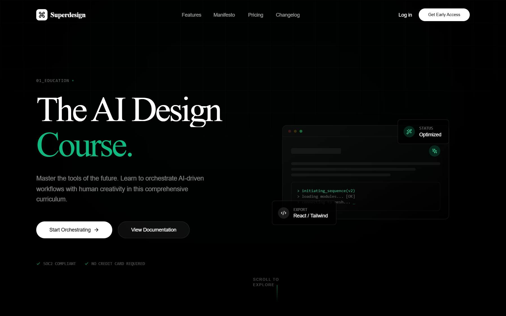

# Cyber Serif Style

A high-end 'Cyber Serif' aesthetic blending classical editorial typography with futuristic tech elements. Features a deep #050505 dark mode palette, neon emerald accents (#10b981), glassmorphism, and sophisticated micro-interactions. Suitable for high-end AI SaaS, creative agencies, fintech portfolios, and developer tools. Includes WebGL-inspired background effects, spotlight hover cards, and staggered scroll-reveal animations.



## Prompt

```text
{
  "summary": "The 'Cyber Serif' style creates a premium, avant-garde digital experience by pairing the elegance of serif display fonts with the high-tech utility of monospace labels and emerald-glow accents. It emphasizes depth through blurred background shapes and motion through shimmer borders and spotlight interaction patterns.",
  "style": {
    "description": "Classical-tech hybrid style. Typography: 'Newsreader' (Serif) for headings (stark, tracking-tighter), 'Inter' (Sans) for readability, and 'Space Grotesk' for technical labels (all-caps, high-tracking). Colors: Primary black (#050505), Accent Emerald (#10b981), Text White (#EBEBEB). Effects: Glassmorphism (blur: 12px), Shimmer borders, and radial-gradient spotlights.",
    "prompt": "Create a design with a background of #050505 and primary text of #EBEBEB. Use 'Newsreader' for display headings (font-weight: 200-800, italic support). Use 'Space Grotesk' for technical metadata (uppercase, tracking: 0.2em, font-size: 10px). Accent color is #10B981 (Emerald). Implement glassmorphism using background: rgba(255, 255, 255, 0.02) and backdrop-filter: blur(12px). Use a subtle border of rgba(255, 255, 255, 0.1) for cards. Animation curves should follow cubic-bezier(0.16, 1, 0.3, 1). Link hovers should feature a 1px emerald underline expanding from width 0 to 100%."
  },
  "layout_and_structure": {
    "description": "Modern vertical layout with high breathing room. Uses a max-width 7xl container with consistent 24px padding. Features a fixed top navigation, a split-screen hero section, a 3-column bento-style feature grid, and a data-driven performance table.",
    "prompts": [
      {
        "part": "Navbar",
        "prompt": "Fixed header with transition from transparent to blurred glass (bg-black/80, backdrop-blur-md) on scroll. Left: Logo with a command icon in a white rounded square that rotates 360deg on hover. Center: Text links with 1px emerald underline hover effect. Right: Pill-shaped CTA button with pulse-glow animation (#10b981)."
      },
      {
        "part": "Hero Section",
        "prompt": "100vh section. Left column: Uppercase tech label with emerald pulse dot. Headline in 'Newsreader' serif at 100px size, tracking-tighter, leading-0.9. Include one italic word in emerald. Body text in light-weight sans-serif (text-white/50). Dual button CTA: one solid white pill with emerald glow, one ghost pill with white border. Right column: Floating abstract UI mockup with glass cards, parallax layers, and animated pulse elements."
      },
      {
        "part": "Feature Grid",
        "prompt": "3-column grid of 'Spotlight Cards'. Each card has 40px padding, rounded-3xl corners, and a 'Shimmer Border'. Inside: An icon in a rounded-2xl container that rotates on card hover. Title in Serif, description in muted sans-serif (text-white/40). Cards should reveal with staggered upward motion on scroll."
      },
      {
        "part": "Benchmark Table",
        "prompt": "A data visualization table with a header row using Space Grotesk 10px text. Rows are separated by 1px borders (rgba(255,255,255,0.05)). Columns alternate between muted white text and vibrant emerald text. Include 'Count-up' animations for numerical values and pulsating check icons."
      },
      {
        "part": "CTA Section",
        "prompt": "Massive serif headline with 'gradient-text' animation (linear-gradient of white and emerald shifting horizontally). Centered layout. Large pill button with a continuous emerald pulse shadow effect."
      }
    ]
  },
  "special_ui_components": [
    {
      "component": "Shimmer Border Card",
      "description": "A card with a moving light effect on the border edge.",
      "prompt": "Create a card with position:relative and a pseudo-element ::after that covers the inset -1px. Background is a 3-color linear gradient (transparent, rgba(16, 185, 129, 0.3), transparent) at 200% size. Animate background-position from 200% to -200% over 4s linearly."
    },
    {
      "component": "Spotlight Cursor Tracking",
      "description": "Card background that illuminates based on mouse position.",
      "prompt": "Implement a ::before pseudo-element on the card with a radial-gradient(600px circle at var(--mouse-x) var(--mouse-y), rgba(16, 185, 129, 0.15), transparent 40%). Set opacity to 0 and transition to 1 on hover. Update --mouse-x/y variables via JavaScript mousemove listener."
    },
    {
      "component": "Morphing Background Glows",
      "description": "Organic, moving blurred blobs for atmosphere.",
      "prompt": "Fixed position div with 384px width/height, bg-emerald-500/10, and blur-100px. Apply an animation that alternates border-radius from '40% 60% 60% 40% / 70% 30% 70% 30%' to '60% 40% 40% 60% / 30% 70% 30% 70%' over 8s."
    }
  ],
  "special_notes": "MUST: Use 'Newsreader' for all main headlines to maintain the editorial feel. MUST: Use #10b981 sparingly as a surgical accent color, never as a large block background. MUST: Ensure all scroll reveals use the specified cubic-bezier for a 'weighted' feel. DO NOT: Use standard rounded corners; use large radii (3xl) or full-pill shapes for buttons. DO NOT: Over-saturate the emerald; maintain the deep black (#050505) as the dominant tone."
}
```

**▶ Try it live → [https://superdesign.dev/library/cyber-serif-style](https://superdesign.dev/library/cyber-serif-style)**

*651 copies · 1,593 tries · tags: style, landing page, page*
