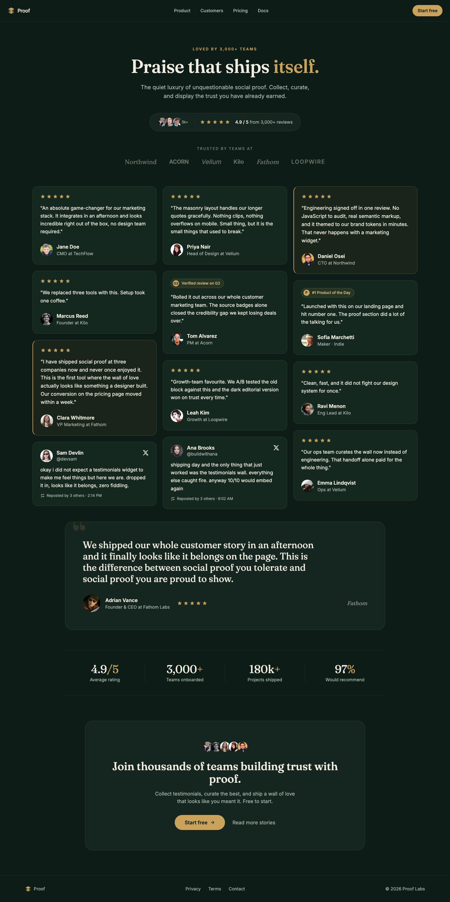

# Dark Editorial Wall of Love Testimonial Section (Forest + Gold)

A premium DARK, editorial "wall of love" testimonials / social-proof SECTION for a SaaS marketing page. A deep forest-green ground with warm cream text and ONE champagne-gold accent (no gradient) carries a Fraunces serif headline ("Praise that ships itself.") over a rating summary cluster (stacked avatars + five gold stars + "4.9 / 5 from 3,000+ reviews") and a monochrome logo trust strip. The centerpiece is a responsive MASONRY wall of quote cards of varying height that mixes plain star cards, gold-ruled featured cards, native X / tweet cards, and review-source badge cards (G2 "Verified review", Product Hunt "#1 Product of the Day"), each with a real avatar + name + role. A full-width SPOTLIGHT quote (an oversized quotation-mark + a big Fraunces quote), a four-up stat band, and a closing CTA finish it. Gold lives only in the stars, badges, buttons, and stat units; everything structural stays forest-green and cream. Reusable for any SaaS, indie, or agency site that wants a credible, remixable dark social-proof section with real faces, star ratings, and source badges.



## Prompt

```text
{
  "summary": "A premium DARK, editorial 'quiet-luxury' WALL OF LOVE / testimonials social-proof SECTION for a desktop SaaS marketing page, built so a SINGLE champagne/brass GOLD accent (#c9a35b fill, #d9bd83 light, #a8823f deep) is the entire chroma against a deep FOREST-GREEN ground (#0e1c17), lifted panels (#14261f), quote cards (#15281f), warm cream ink (#f2ede1 at opacity steps), and cool sage-grey muted (#a9b5ab), with faint gold-tinted (rgba(201,163,91,0.16)) and neutral (rgba(242,237,225,0.08)) hairlines. Type carries hierarchy from FAMILY CONTRAST + size + weight: a characterful DISPLAY SERIF (Fraunces) for the section headline (~52px, 500-600, tight leading) and the spotlight quote (~30px) is the anti-slop taste signal (NOT Inter-only), with a grotesk sans (Inter) for quote text, names, roles, badges, buttons, and stat labels; the eyebrow is uppercase Inter ~12px with 0.22em tracking in gold. STRUCTURE top to bottom: (1) a slim GLASS sticky nav (bg forest/80 + backdrop-blur, hairline bottom): a small gold-marked 'Proof' wordmark left, center links (Product, Customers, Pricing, Docs), a gold 'Start free' pill right. (2) a centered HEADER: a gold uppercase eyebrow ('LOVED BY 3,000+ TEAMS'), a two-line Fraunces headline with one payoff word in gold ('Praise that ships itself.'), a muted subhead, and a RATING CLUSTER in a rounded-full lifted pill (a -space-x row of 3 avatar chips + a '3k+' chip, a divider, five gold stars, '4.9 / 5', 'from 3,000+ reviews'). (3) a 'TRUSTED BY TEAMS AT' monochrome LOGO STRIP of 6 cream/40 wordmarks in mixed weights/styles. (4) THE WALL: a responsive MASONRY (columns-1 md:columns-2 lg:columns-3, gap-5, each card break-inside-avoid mb-5) of 12 quote cards of VARYING height and length in MIXED treatments so no two read alike: (a) plain dark star cards (a row of five 16px gold stars, then the quote in cream #f2ede1 ~15.5px/1.62, then an avatar + bold cream name + muted role/company); (b) two 'featured' cards with a gold left rule (border-l-2 #c9a35b) and a faint gold-tint wash (rgba(201,163,91,0.06)); (c) native X / TWEET cards (avatar + name + @handle + a cream X bird glyph top-right, a lowercase conversational quote, a small 'Reposted by 3 others - 2:14 PM' meta with a repost glyph); (d) a G2 badge card (a pill: a gold 'G2' disc + 'Verified review on G2'); (e) a Product Hunt badge card (a pill: a gold PH disc + '#1 Product of the Day'). (5) a full-width SPOTLIGHT band (rounded-3xl #14261f ring card): a faint OVERSIZED gold quotation-mark glyph top-left, a big Fraunces 30px quote, and a footer row (a 56px avatar + a name + a role + five gold stars + a wordmark). (6) a four-up STAT BAND (grid-cols-2 lg:grid-cols-4 with vertical hairline dividers): big Fraunces cream numerals with a gold unit ('4.9/5' Average rating, '3,000+' Teams onboarded, '180k+' Projects shipped, '97%' Would recommend). (7) a dark CLOSING CTA card: a row of stacked avatars, a white Fraunces 'Join thousands of teams building trust with proof.', a muted line, a gold 'Start free' button (trailing arrow) + a 'Read more stories' text link. (8) a slim footer. The ONLY saturated color is gold, in the star glyphs, the source badges, the eyebrow + payoff word, the buttons, the stat units, and the quote-mark; every other element is cream ink, muted sage, hairline, or a forest-green surface. No gradient, no second hue, no glow. Real human avatars throughout. Fully responsive: the masonry steps 3 -> 2 -> 1 column, the nav collapses its center links, the rating cluster + logo strip + stat band wrap, no horizontal overflow at 390px.",
  "style": {
    "description": "A calm, premium, quiet-luxury DARK editorial aesthetic for a social-proof surface, the opposite of a busy or default-indigo testimonials block. A deep FOREST-GREEN #0e1c17 ground with lifted panels (#14261f) and quote cards (#15281f) carries warm cream ink #f2ede1 (used at opacity steps for hierarchy), cool sage-grey muted #a9b5ab, and faint gold-tinted + neutral hairlines. The single saturated element is a champagne/brass GOLD accent (#c9a35b fill, #d9bd83 light, #a8823f deep), deliberately muted and luxe rather than the bright amber a testimonials block usually reaches for, held to exactly where social proof lives: the five-star glyphs, the review-source badges (G2 / Product Hunt), the eyebrow and the one headline payoff word, the 'Start free' buttons, the stat units, and the oversized quotation-mark. Everything else is strictly cream + sage + forest, so the gold reads as 'ratings' and never as decoration. Type carries hierarchy from FAMILY CONTRAST, size, and weight rather than color: a characterful DISPLAY SERIF (Fraunces) for the section headline and the spotlight quote is the deliberate taste move (a real designer reaches for an editorial serif; an AI defaults to Inter-only), with a grotesk sans (Inter) for quote body, names, roles, badges, and buttons. The shape language is soft and modern: rounded-2xl cards with a faint gold-tinted hairline ring, rounded-full real-photo avatars, and small pill badges, with depth built from one lifted panel step and hairlines only (no heavy drop shadow on the dark ground). The signature is the WALL itself: a masonry of varying-height cards in mixed treatments (plain star / gold-ruled featured / native tweet / G2 / Product Hunt) so the grid reads as a real, heterogeneous stream of proof rather than a uniform template, anchored by one oversized spotlight quote. No gradient anywhere, no second accent hue, no glow: dark, credible, warm-but-restrained, conversion-first.",
    "prompt": "Design a premium DARK, editorial 'quiet-luxury' WALL OF LOVE / testimonials social-proof SECTION for a desktop SaaS marketing page on a deep FOREST-GREEN #0e1c17 ground with lifted panels (#14261f) and quote cards (#15281f), making ONE champagne/brass GOLD accent (#c9a35b fill, #d9bd83 light, #a8823f deep) the entire chroma against warm cream ink (#f2ede1 at opacity steps), cool sage-grey muted (#a9b5ab), and faint gold-tinted + neutral hairlines. Build a two-typeface system where hierarchy comes from FAMILY CONTRAST + size + weight: a characterful DISPLAY SERIF (Fraunces) for the section headline (~52px / 500-600 / tight leading) and the spotlight quote (~30px) is the anti-slop signal (do NOT set everything in Inter), with a grotesk sans (Inter) for the quote body, names, roles, badges, buttons, and stat labels. Confine the gold to exactly where social proof lives: the five-star glyphs, the review-source badges (G2 / Product Hunt), the uppercase eyebrow and the single headline payoff word, the 'Start free' buttons, the stat units, and the oversized quotation-mark, and keep every other element strictly cream + sage + forest-green. Make the centerpiece a responsive MASONRY of quote cards of VARYING height in MIXED treatments (plain dark star cards, two gold-ruled 'featured' cards with a faint gold wash, native X / tweet cards with @handle + a cream X bird + a 'reposted' meta, a G2 'Verified review' badge card, a Product Hunt '#1 Product of the Day' badge card) so it reads as a real heterogeneous stream of proof, each card carrying a rounded-full real-photo avatar + a bold cream name + a muted role/company. Anchor the wall with a rating summary cluster (stacked avatars + five gold stars + '4.9 / 5 from 3,000+ reviews'), a monochrome logo trust strip, one full-width SPOTLIGHT quote (an oversized faint gold quotation-mark + a big Fraunces quote + a large avatar), a four-up stat band with hairline dividers, and a dark closing CTA. Use real human avatars throughout. NO gradient, NO second accent hue, NO glow: dark, credible, warm-but-restrained, conversion-first. Make it fully responsive: the masonry steps 3 -> 2 -> 1 column, the nav collapses, the rating cluster + logo strip + stat band wrap, no horizontal overflow at 390px, and build it in pure CSS with every star / badge / bird / arrow an inline SVG carrying a viewBox (no JavaScript for any visible state)."
  },
  "layout_and_structure": {
    "description": "A real framed page read top to bottom inside a max-w-7xl column with px-6 gutters: a glass sticky nav, a centered header block (eyebrow + Fraunces headline + subhead + rating pill), a monochrome logo strip, THE WALL (a columns-1 md:columns-2 lg:columns-3 masonry of 12 break-inside-avoid quote cards in mixed treatments), a full-width spotlight quote band, a four-up stat band with vertical hairline dividers, a closing CTA card, and a slim footer. It reflows cleanly: the masonry steps 3 -> 2 -> 1 column, the nav hides its center links behind the wordmark + 'Start free', the rating cluster and stat band and logo strip wrap, the CTA buttons stack, and there is no horizontal overflow at 390px.",
    "prompt": "Lay the section out in a max-w-7xl mx-auto px-6 column. TOP: a sticky top-0 z-40 glass nav (bg #0e1c17/80 + backdrop-blur, hairline bottom border) with a gold-marked 'Proof' wordmark left, four center links (Product/Customers/Pricing/Docs, hidden below md) center, and a rounded-full gold 'Start free' button right. HEADER (centered, max-w-3xl): a gold uppercase 0.22em-tracked eyebrow 'LOVED BY 3,000+ TEAMS', a two-line Fraunces headline (~52px, weight 500) with the payoff word in gold, a muted ~18px subhead, and a rounded-full lifted RATING pill (a -space-x-2 row of 3 avatar chips + a '3k+' chip, a vertical hairline divider, five 16px gold stars, then '4.9 / 5' in cream + 'from 3,000+ reviews' in muted). LOGO STRIP: a centered 'Trusted by teams at' label over 6 cream/40 wordmarks in mixed weights/styles, wrapping. THE WALL: a columns-1 md:columns-2 lg:columns-3 gap-5 masonry of 12 cards, each break-inside-avoid mb-5, rounded-2xl with a faint gold-tinted hairline ring, in the five mixed treatments described. SPOTLIGHT: a full-width rounded-3xl #14261f ring card, overflow-hidden, with a faint oversized gold Fraunces quotation-mark absolutely placed top-left and, above it, a big Fraunces quote + a footer row (56px avatar + name + role + five gold stars + a right-aligned wordmark). STAT BAND: a grid-cols-2 lg:grid-cols-4 row bounded by top+bottom hairlines, each cell a big Fraunces cream numeral with a gold unit + a muted label, vertical hairline dividers between cells on lg. CTA: a rounded-3xl #14261f card, centered, with a -space-x stacked-avatar row, a Fraunces headline, a muted line, and a row of a gold 'Start free' button (trailing arrow) + a 'Read more stories' text link that stacks on mobile. FOOTER: a slim hairline-topped row with the wordmark, three links, and a copyright."
  },
  "special_ui_components": [
    {
      "component": "Heterogeneous quote-card masonry",
      "description": "The centerpiece: a CSS-columns masonry of 12 varying-height quote cards in five mixed treatments so no two read alike and the grid reads as a real, heterogeneous stream of proof rather than a uniform template.",
      "prompt": "Build a columns-1 md:columns-2 lg:columns-3 gap-5 masonry; every card is break-inside-avoid mb-5, rounded-2xl, on a #15281f surface with a rgba(201,163,91,0.16) hairline ring. Vary the treatments: (a) plain star cards = a row of five 16px gold (#c9a35b) star SVGs, then a cream #f2ede1 quote at ~15.5px/1.62, then a row of a rounded-full avatar + a bold cream name + a muted #a9b5ab role/company; make some quotes one line and some four lines so heights differ; (b) two 'featured' cards = the same anatomy plus a border-l-2 border-l-[#c9a35b] left rule and a faint rgba(201,163,91,0.06) wash; (c) native X / tweet cards; (d) a G2 badge card; (e) a Product Hunt badge card. No drop shadow (depth comes from the surface step + hairline)."
    },
    {
      "component": "Native X / tweet review card",
      "description": "A quote card styled as a real X post, so the wall mixes formal reviews with authentic social chatter.",
      "prompt": "A #15281f card with a neutral rgba(242,237,225,0.1) hairline. Top row: a rounded-full avatar + a bold cream name + a muted @handle on the left, and a cream X bird glyph (inline SVG with a viewBox) top-right. Then a lowercase, conversational quote in cream ~15.5px/1.62 (no star row, since it is a tweet). Then a small muted meta row: a repost glyph (inline SVG) + 'Reposted by 3 others - 2:14 PM'. Keep the whole card in the same palette so it reads as part of the wall, not an embed."
    },
    {
      "component": "Review-source badge card (G2 / Product Hunt)",
      "description": "Quote cards led by a verified-source pill, the credibility signal that closes the 'is this real' gap.",
      "prompt": "A #15281f card whose header is a small rounded-full pill: a rgba(201,163,91,0.1) fill with a rgba(201,163,91,0.24) ring, holding a gold #c9a35b disc with a bold dark 'G2' or 'P' initial and a #d9bd83 label ('Verified review on G2' or '#1 Product of the Day'). Below the pill, a normal cream quote + avatar + name + role. Use exactly one badge per badge card; keep the gold to the disc + label only."
    },
    {
      "component": "Rating summary cluster",
      "description": "The at-a-glance trust anchor under the headline: a compact pill that fuses faces, stars, and the aggregate score.",
      "prompt": "An inline-flex rounded-full pill on a #14261f fill with a gold-tinted hairline, px-6 py-3: a -space-x-2 row of three rounded-full avatar chips (2px #14261f ring) plus a '3k+' chip, a vertical hairline divider, a row of five 16px gold star SVGs, then a cream '4.9 / 5' beside a muted 'from 3,000+ reviews'. It must wrap gracefully on mobile."
    },
    {
      "component": "Oversized spotlight quote band",
      "description": "A full-width feature quote that breaks the masonry rhythm and gives the section one hero testimonial.",
      "prompt": "A full-width rounded-3xl #14261f ring card, overflow-hidden. Absolutely place a faint oversized Fraunces quotation-mark (a large left double-quote at ~160px, gold at ~15% opacity, pointer-events-none) top-left. Above it (relative), a big Fraunces ~30px cream quote at max-w-3xl, then a wrap-friendly footer row: a 56px rounded-full avatar + a bold cream name + a muted role, a five-gold-star row, and a right-aligned italic Fraunces wordmark."
    },
    {
      "component": "Four-up stat band with hairline dividers",
      "description": "The aggregate proof numbers, set in the display serif so they read as a confident editorial statement.",
      "prompt": "A grid-cols-2 lg:grid-cols-4 row bounded by a top and bottom rgba(242,237,225,0.08) hairline, py-10. Each cell: a big Fraunces ~36px cream numeral with the unit in gold (#c9a35b) inline ('4.9/5', '3,000+', '180k+', '97%'), then a small muted label ('Average rating', 'Teams onboarded', 'Projects shipped', 'Would recommend'). Add a vertical hairline right-border between cells on lg only; keep tabular alignment."
    }
  ]
}
```
