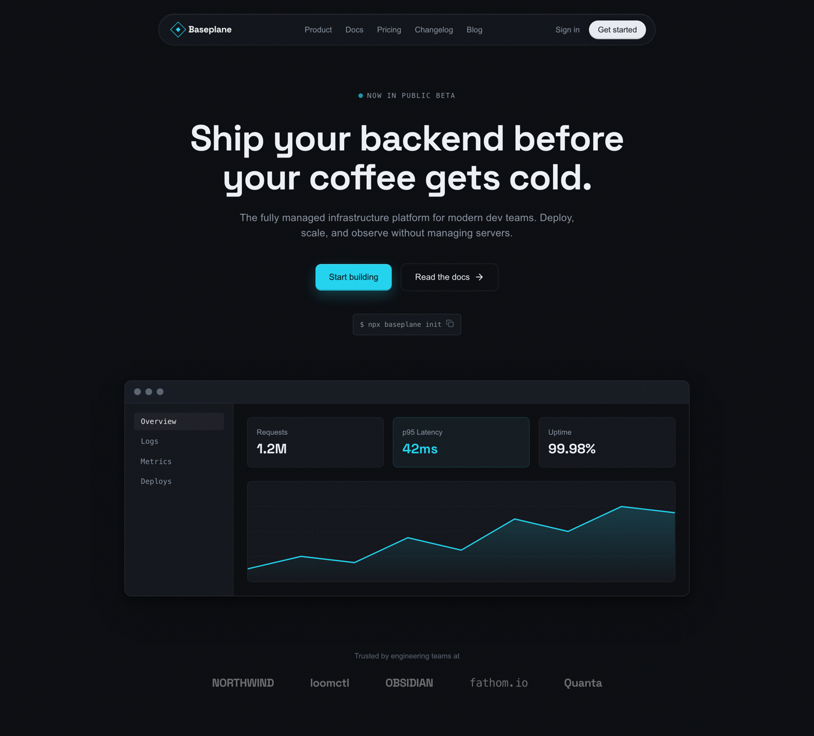

# Dark Minimal Developer-Tool Landing Hero

A premium DARK developer-tool / B2B-SaaS landing-page hero on a cool near-black #0a0c10 canvas with ONE flat electric-cyan #22d3ee accent as the only chroma (no gradient, no glow). Hierarchy comes from a three-face type system: Space Grotesk carries a big two-line white headline, Inter does the muted subtitle and nav, and Space Mono is reserved for the uppercase eyebrow and an install caption. A floating translucent pill nav sits over the hero; a dual CTA row pairs a tactile CYAN keycap-raised "Start building" button with a ghost "Read the docs" pill; and the signature move is a floating product-console mockup (a dashboard fragment with a Requests / p95 / Uptime stat row, one cyan-highlighted metric, and a cyan SVG area+line chart) that gives the hero a copy-worthy payload, closed by a grayscale trusted-by logo strip. Flat and structural, high-contrast, confident restraint. Reusable for any dark dev-tool, SaaS, infra, or observability landing hero with a single cyan accent and an embedded console demo.



## Prompt

```text
{
  "summary": "A premium DARK developer-tool / B2B-SaaS LANDING-PAGE HERO for a single 1440-wide desktop viewport into a scrolling page, on a cool near-black #0a0c10 canvas, built so a SINGLE flat electric-cyan #22d3ee accent is the entire personality against strictly neutral ink. Hierarchy comes from a THREE-FACE type system (family contrast + size + weight, NOT color): Space Grotesk (display) carries the big headline, Inter (grotesk) does the subtitle / nav / body, and Space Mono (monospace) is reserved ONLY for the uppercase eyebrow micro-label and an install caption. TOP CENTER: a FLOATING translucent PILL NAV (a rounded #12151b container at ~80% opacity with backdrop-blur, a 1px hairline rgba(255,255,255,.09) border and an inset top highlight, NOT a full-bleed bar): left a small cyan-outlined diamond logo mark + a white ~600 'Baseplane' wordmark; center muted #8b94a3 14px/500 Inter links (Product, Docs, Pricing, Changelog, Blog); right a muted 'Sign in' link + a small NEAR-WHITE keycap 'Get started' pill (#e8ecf1 fill, dark text, a soft keycap shadow). CENTER HERO STACK, upper-mid, centered, generous whitespace: (1) a Space Mono UPPERCASE eyebrow ('NOW IN PUBLIC BETA', 12px / 0.12em tracking, muted) with a small pulsing CYAN live-dot; (2) a big Space Grotesk H1 at clamp(38px,5vw,64px) / weight 700 / line-height ~1.08 / tight -0.02em tracking in #eef1f5 on TWO lines ('Ship your backend before your coffee gets cold.'); (3) a muted Inter SUBTITLE at 18px / 400 / 0.2px tracking in #8b94a3, max ~600px, ~2 lines; (4) a ROW of two CTAs -- a PRIMARY cyan #22d3ee keycap-raised 'Start building' button (dark #0a0c10 text, 10px radius, a KEYCAP shadow stack: inset top-white + inset bottom-dark highlights + a soft 0 8px 24px rgba(34,211,238,.25) outer glow so it reads physically raised) and a SECONDARY ghost 'Read the docs ->' pill (transparent fill, 1px hairline ring, white text); (5) a Space Mono install caption in a small hairline chip ('$ npx baseplane init' with a copy glyph). SIGNATURE, below the copy: a FLOATING wide product-console MOCKUP -- an elevated #12151b card with a 1px hairline border and a refined multi-layer soft shadow (0 24px 48px -12px rgba(0,0,0,.5) + 0 4px 12px rgba(0,0,0,.3) + an inset top highlight), sitting on a faint NEUTRAL grey radial lift (NOT a colored glow). Inside: a mac-dot header row; a left mono nav rail (Overview active / Logs / Metrics / Deploys); and a main panel with a three-tile stat row (Requests 1.2M, p95 Latency 42ms rendered in the SINGLE cyan accent inside a cyan-ringed tile, Uptime 99.98%) over a compact inline-SVG AREA+LINE chart in cyan (a viewBox matching its coords, the fill reaching the last x tick, faint dashed neutral gridlines). BOTTOM: a 'Trusted by engineering teams at' muted label over a row of 4-5 grayscale low-opacity wordmark logos. ONE accent color only -- electric cyan #22d3ee in the logo mark, the live-dot, the primary CTA, the one highlighted p95 metric, and the chart; every other element is strictly neutral (#eef1f5 ink, #8b94a3 muted, #5b6472 extra-muted, #12151b/#161a22 surfaces, #0a0c10 ground, rgba(255,255,255,.09) hairlines). No gradient (except the chart's subtle cyan area fade), no second hue, no photos, no glow-blade backdrop. Flat and structural everywhere EXCEPT the two deliberate keycap buttons (the primary CTA + the nav 'Get started' pill); a very faint monochrome film-grain overlay adds cinematic depth. Responsive: on a narrow viewport the nav collapses to logo + 'Get started', the headline steps down, the CTAs and stat tiles stack full-width, the console rail collapses to horizontal tabs, and the logo strip wraps -- no horizontal overflow.",
  "style": {
    "description": "Dark, restrained, structural developer-tool marketing aesthetic -- the opposite of a busy or default-indigo product hero. A cool near-black #0a0c10 ground carries off-white #eef1f5 ink, muted #8b94a3 secondary text, faint rgba(255,255,255,.09) hairlines, and elevated #12151b / #161a22 surfaces. The single saturated element is a flat electric-CYAN #22d3ee accent, held to just ~5 touchpoints (the logo mark, a pulsing live-dot, the primary CTA, one highlighted metric, and the chart); everything else is strictly neutral. Type is a three-face system where hierarchy comes from FAMILY CONTRAST + size + weight rather than color: Space Grotesk (a technical-but-characterful grotesk) for the big headline is the deliberate taste move (a real designer reaches past Inter-only), Inter for subtitle / nav / UI, and Space Mono reserved ONLY for the uppercase eyebrow micro-label and small captions. The shape language is flat and structural -- hairline borders, rounded surfaces, generous negative space -- with ONE deliberate exception: the download-style CTAs are tactile and KEYCAP-RAISED (a layered shadow stack of inset top-white + bottom-dark highlights + a soft outer glow) so they feel physically raised off the dark canvas, the hero's signature detail. Chrome floats: a translucent hairline-bordered pill nav at top, a floating product-console card lifted on a refined multi-layer soft shadow over a faint NEUTRAL grey radial lift (never a colored glow -- a colored backdrop glow is the aurora / slop trap), and a muted grayscale trusted-by strip at the bottom. A very faint monochrome film-grain overlay adds cinematic depth. No default purple / indigo / violet gradient, no second accent color, no photos, no glow-blade backdrop -- confident, technical, quiet-premium.",
    "prompt": "Design a premium DARK developer-tool / B2B-SaaS landing-page HERO for a single 1440-wide desktop viewport on a cool near-black #0a0c10 ground, making ONE flat electric-cyan #22d3ee accent the entire personality against strictly neutral ink. Build a three-typeface system where hierarchy comes from FAMILY CONTRAST + size + weight: Space Grotesk for a big centered two-line H1 at clamp(38px,5vw,64px) / weight 700 / line-height ~1.08 / tight -0.02em tracking in #eef1f5 (this grotesk is the taste signal -- do NOT set the headline in Inter), Inter for a quiet 18px / 400 muted #8b94a3 subtitle and all nav / UI, and Space Mono reserved ONLY for an uppercase eyebrow micro-label and an install caption. Confine the accent to ~5 touchpoints only -- the logo mark, a small pulsing live-dot in the eyebrow, the primary CTA, one highlighted metric in the console, and the chart -- and keep every other element strictly neutral (#eef1f5 ink, #8b94a3 muted, #5b6472 extra-muted, #12151b / #161a22 surfaces, rgba(255,255,255,.09) hairlines). Keep everything flat and structural EXCEPT the CTA buttons, which must be tactile and KEYCAP-RAISED: a cyan primary 'Start building' with dark text, 10px radius, and a layered shadow stack (inset top-white + inset bottom-dark highlights + a soft 0 8px 24px rgba(34,211,238,.25) outer glow) so it feels like a physical key, beside a ghost 'Read the docs' pill. Float the chrome: a translucent hairline-bordered pill nav at top, and as the SIGNATURE a floating product-console mockup card -- an elevated #12151b panel with a hairline border and a refined multi-layer soft shadow, on a faint NEUTRAL grey radial lift (never a colored glow) -- containing a mac-dot header, a mono nav rail, a three-tile stat row with exactly ONE cyan-highlighted metric, and a compact inline-SVG area+line chart in cyan (a viewBox matching its coords, the fill reaching the last x tick). Close with a grayscale trusted-by logo strip. NO default purple / indigo / violet gradient, NO aurora or glow-blade backdrop, NO chrome / metallic, NO stock photos, NO dense sticker-collage. Add a very faint monochrome film-grain overlay for depth. Make it fully responsive: fluid widths + a clamp on the headline; at 390px collapse the nav, step the headline down, stack the CTAs and stat tiles, and wrap the logo strip.",
    "keywords": [
      "dark-minimal",
      "restrained",
      "structural",
      "near-black",
      "electric-cyan",
      "single-accent",
      "grotesk",
      "developer-tool",
      "saas-landing",
      "hero"
    ]
  },
  "layout_and_structure": {
    "description": "A vertical scroll on cool near-black, centered and whitespace-heavy: (1) a FLOATING translucent PILL NAV (logo mark + wordmark left, muted center links, a 'Sign in' link + a near-white keycap 'Get started' pill right); (2) a centered HERO STACK -- a Space Mono uppercase eyebrow with a cyan live-dot, a big two-line Space Grotesk white H1, a muted Inter subtitle, a row of two CTAs (a cyan keycap-raised primary + a ghost secondary), and a Space Mono install-command chip; (3) the SIGNATURE floating product-console MOCKUP (a mac-dot header, a mono nav rail, a three-tile stat row with one cyan-highlighted metric, and a cyan SVG area+line chart) lifted on a refined multi-layer soft shadow over a faint neutral radial lift; (4) a 'Trusted by engineering teams at' grayscale logo strip closing the hero. On a narrow viewport the nav collapses to logo + 'Get started', the headline steps down, the CTA row and the console stat tiles stack full-width, the console rail collapses to horizontal tabs, and the logo strip wraps.",
    "prompts": [
      {
        "part": "Floating pill nav",
        "prompt": "Pin a FLOATING translucent PILL NAV near the top center: a rounded-full #12151b container at ~80% opacity with backdrop-blur, a 1px hairline rgba(255,255,255,.09) border and an inset top highlight, NOT a full-bleed bar, max ~880px, w-full with side padding. Left: a small cyan-outlined rotated-45 diamond logo mark next to a white ~600 wordmark ('Baseplane'). Center (hidden on mobile): muted #8b94a3 14px / weight 500 Inter links (Product, Docs, Pricing, Changelog, Blog), the first with a thin cyan underline on hover. Right: a muted 'Sign in' link (hidden on mobile) and a small NEAR-WHITE keycap 'Get started' pill (#e8ecf1 fill, #12151b text, a soft keycap shadow) -- the one raised chrome element in the nav."
      },
      {
        "part": "Eyebrow + headline + subtitle",
        "prompt": "Center a Space Mono UPPERCASE eyebrow ('NOW IN PUBLIC BETA', 12px / 0.12em tracking, muted #8b94a3) with a small pulsing CYAN #22d3ee live-dot to its left. Below it a big Space Grotesk H1 at clamp(38px,5vw,64px) / weight 700 / line-height ~1.08 / tight -0.02em tracking in #eef1f5 on TWO lines (e.g. 'Ship your backend before your coffee gets cold.'), the line break hidden on mobile. Directly below, a centered SUBTITLE in Inter 18px / weight 400 / 0.2px tracking, muted #8b94a3, max ~600px, wrapping to ~2 lines. Do NOT set the headline in Inter -- the grotesk display face is the point."
      },
      {
        "part": "Dual CTA row + install caption",
        "prompt": "Under the subtitle, a ROW of two CTAs (stacked full-width on mobile): a PRIMARY cyan #22d3ee KEYCAP-RAISED 'Start building' button (dark #0a0c10 text, Inter 15px / 500, 10px radius, a keycap shadow stack: inset 0 1px 0 rgba(255,255,255,.25) + inset 0 -2px 0 rgba(0,0,0,.15) + a soft 0 8px 24px rgba(34,211,238,.25) outer glow) so it reads physically raised, and a SECONDARY ghost 'Read the docs ->' pill (transparent fill, 1px hairline rgba(255,255,255,.09) ring, #eef1f5 text, a subtle hover fill). Below the row, a small hairline chip holding a Space Mono 12px muted caption ('$ npx baseplane init') with a copy glyph."
      },
      {
        "part": "Signature floating product-console mockup",
        "prompt": "Below the copy, center a FLOATING wide product-console MOCKUP -- an elevated #12151b card (12px radius, overflow-hidden) with a 1px hairline rgba(255,255,255,.09) border and a refined multi-layer soft shadow (0 24px 48px -12px rgba(0,0,0,.5), 0 4px 12px rgba(0,0,0,.3), inset 0 1px 0 rgba(255,255,255,.05)), sitting on a faint NEUTRAL grey radial lift behind it (radial-gradient of rgba(255,255,255,.04) -> transparent, NEVER a colored glow), max ~1000px, fluid below. HEADER: a #161a22 bar with three neutral mac dots. BODY (a flex that stacks on mobile): a LEFT mono nav rail (#12151b, hairline right border) with 'Overview' active (a faint fill) over muted 'Logs' / 'Metrics' / 'Deploys'; and a MAIN panel (#0a0c10) holding a three-column STAT ROW -- 'Requests' 1.2M (neutral), 'p95 Latency' 42ms rendered in the SINGLE cyan accent inside a cyan-ringed tile with a faint cyan wash, and 'Uptime' 99.98% (neutral) -- over a compact inline-SVG AREA+LINE chart in cyan (viewBox='0 0 800 160', a cyan line path plus a cyan-gradient area fill both reaching x=800 / the last tick, faint dashed neutral gridlines). Every inner element is neutral except the one cyan p95 metric and the cyan chart."
      },
      {
        "part": "Trusted-by strip + build constraints",
        "prompt": "Close the hero with a centered 'Trusted by engineering teams at' muted #5b6472 label over a row of 4-5 FICTIONAL grayscale low-opacity wordmark logos (varied weights / a mix of grotesk and mono so they read as distinct brands), wrapping on a narrow viewport -- do NOT use real brand names. Build in pure CSS + inline SVG, NO JavaScript (freeze-safe + template-faithful). No h-screen / overflow-hidden app-shell wrapper -- the page grows to natural height. Fully responsive at mobile 390px and desktop 1440px with no horizontal overflow: fluid widths + a clamp on the headline, collapse the nav to logo + 'Get started' on mobile, step the headline down, stack the CTA row and the console's stat tiles, collapse the console rail to horizontal tabs, and wrap the logo strip."
      }
    ]
  },
  "special_ui_components": [
    {
      "component": "Floating product-console mockup",
      "description": "The signature move -- an embedded dark dashboard fragment that gives the hero a copy-worthy, remixable payload in place of a decorative backdrop.",
      "prompt": "An elevated #12151b card (12px radius, overflow-hidden) with a 1px hairline border and a refined multi-layer soft shadow (0 24px 48px -12px rgba(0,0,0,.5), 0 4px 12px rgba(0,0,0,.3), inset 0 1px 0 rgba(255,255,255,.05)), floating over a faint NEUTRAL grey radial lift (never a colored glow). Inside: a mac-dot header, a left mono nav rail (one item active on a faint fill, the rest muted), a three-tile stat row with exactly ONE tile rendered in the brand accent inside an accent-ringed tile, and a compact inline-SVG area+line chart in the accent with a viewBox matching its coords and the fill reaching the last x tick over faint dashed neutral gridlines. Keep every inner element neutral except the single accented metric + the chart so it reads calm and real."
    },
    {
      "component": "Single-accent discipline (one cyan)",
      "description": "The restraint engine -- exactly one saturated hue on a near-black ground, held to ~5 touchpoints, everything else strictly neutral.",
      "prompt": "Pick ONE flat, confident accent (electric cyan #22d3ee) and use it in ONLY a handful of places: the logo mark, a small pulsing live-dot in the eyebrow, the primary CTA fill, one highlighted metric in the product console, and the chart stroke + area fill. Never introduce a second hue (no green trend chips, no colored status dots), never a full-page gradient, never a colored backdrop glow (a colored glow is the aurora / slop trap -- use a NEUTRAL grey radial lift for depth instead). Every non-accent element is off-white ink, muted grey, a hairline, an elevated near-black surface, or the near-black ground. This discipline is what makes a dark hero read as premium restraint rather than a generic AI dark-mode template."
    },
    {
      "component": "Grotesk + grotesk + mono type stack",
      "description": "Hierarchy from family contrast -- a characterful display grotesk headline as the taste signal, a neutral grotesk for UI, a mono for technical micro-labels.",
      "prompt": "Set the big hero headline in a technical-but-characterful DISPLAY GROTESK (Space Grotesk) at a large clamped size with tight -0.02em tracking (this is the anti-slop move -- do NOT default to Inter for the headline). Set the subtitle, nav, buttons and body in a neutral grotesk (Inter). Reserve a MONOSPACE (Space Mono) strictly for the uppercase eyebrow micro-label and the install-command caption. Let hierarchy come from family contrast + size + weight rather than color, so the single accent stays the only chroma."
    },
    {
      "component": "Keycap-raised CTA",
      "description": "The one deliberate tactile element on an otherwise flat surface -- a primary button that feels like a physical key.",
      "prompt": "Make the primary CTA feel physically RAISED off the dark canvas with a layered shadow stack rather than a flat fill: an accent fill, dark text, a ~10px radius, plus box-shadow of an inset top-white highlight (inset 0 1px 0 rgba(255,255,255,.25)), an inset bottom-dark highlight (inset 0 -2px 0 rgba(0,0,0,.15)), and a soft colored outer glow (0 8px 24px rgba(accent,.25)); on :active translateY(2px) and soften the shadow so it depresses like a key. Reuse a near-white variant of the same treatment on the small nav 'Get started' pill. These two keycaps are the ONLY non-flat elements in the composition."
    },
    {
      "component": "Floating translucent pill nav",
      "description": "Chrome that floats -- a rounded translucent nav container over the ground rather than a full-bleed bar.",
      "prompt": "A rounded-full container in an elevated near-black at ~80% opacity with backdrop-blur, a 1px hairline border and an inset top highlight (NOT a full-width bar): a small accent-outlined diamond mark + wordmark left, muted center text links (the first with a thin accent underline on hover), and a muted 'Sign in' link + a small near-white keycap 'Get started' pill right. On mobile it collapses to just the logo + the 'Get started' pill."
    }
  ]
}
```

**▶ [Try it live →](https://superdesign.dev/library/dark-minimal-developer-tool-landing-hero?utm_source=github&utm_medium=prompt-repo&utm_campaign=prompt-library)**

**Use it in your coding agent:** install the [Superdesign skill](https://github.com/superdesigndev/superdesign-skill), then:

```bash
superdesign get-prompts --slugs "dark-minimal-developer-tool-landing-hero" --json
```

*0 copies · 0 tries · Landing Pages · Dev Tools · landing page, hero, developer tool, dark mode*
