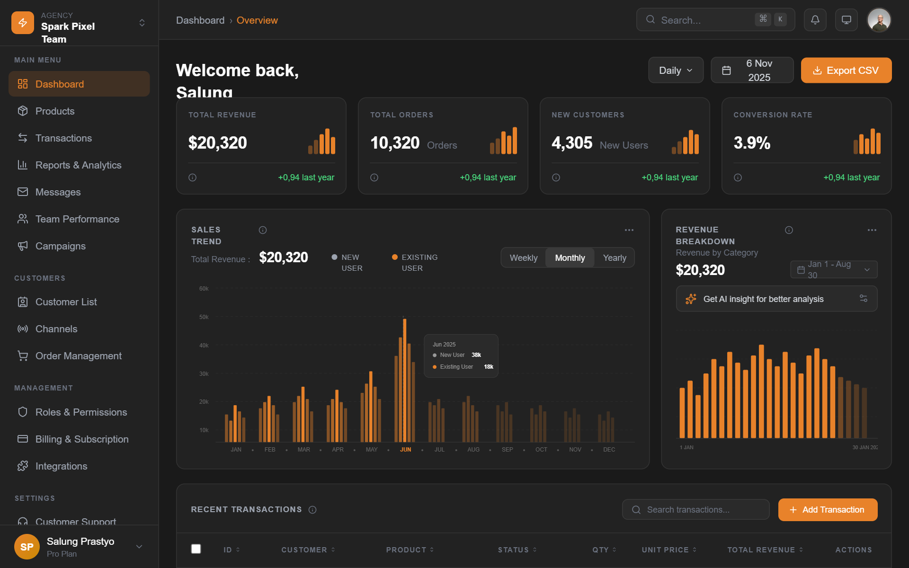

# Dark SaaS Dashboard - Spark Pixel Team

A high-end, dark-themed enterprise SaaS dashboard featuring a sophisticated color palette of deep grays and vibrant amber accents. The design utilizes high-contrast typography with General Sans, a modular bento-grid layout for metrics, and custom SVG-based data visualizations. This style is ideal for fintech, analytics platforms, and professional agency management tools where a premium, data-heavy, yet clean interface is required. It emphasizes visual hierarchy through varying font weights and intentional use of negative space.



## Prompt

```text
{
  "summary": "A professional dark-mode SaaS dashboard with a multi-section sidebar, header with search/notifications, metric cards with sparkline-style mini bars, complex bar charts, and a detailed transaction table. The design uses a #1a1a1a background and #e8822a amber accent to create a modern, high-performance aesthetic.",
  "style": {
    "description": "Modern dark enterprise style using 'General Sans' typography and a tiered dark gray color system. Visuals are characterized by thin borders (#2a2a2a), subtle rounded corners (xl/12px), and high-contrast accenting in amber for primary actions and data highlights. Animations are subtle transitions on hover and focus states.",
    "prompt": "Create a UI with a dark theme background (#1a1a1a). Use 'General Sans' as the primary typeface. Color Palette: Background: #1a1a1a; Surface/Cards: #222222; Borders: #2a2a2a; Primary Accent: #e8822a (Amber); Success: #4ade80; Warning: #fbbf24; Danger: #f87171. Typography: Headings 24px/SemiBold white; Labels 10px/Bold/Uppercase with 0.1em tracking in #666666; Body 14px in #9ca3af. UI Elements: 12px border-radius (xl) for cards, 8px (lg) for buttons. Scrollbars: 6px width, track #1a1a1a, thumb #4a4a4a. Transitions: 200ms ease-in-out for hover states. Shadows: None; use borders for depth."
  },
  "layout_and_structure": {
    "description": "A classic dashboard layout with a fixed-width left sidebar (224px), a sticky top header (56px), and a responsive, scrollable main content area containing a metric grid, data visualizations, and a primary data table.",
    "prompts": [
      {
        "part": "Sidebar",
        "prompt": "Width: 224px (w-56). Background: #222222. Border-right: 1px solid #333333. Logo section: 8x8 rounded-lg amber icon with agency name. Navigation: Grouped by headers ('Main Menu', 'Customers', etc.) in 10px uppercase gray text. Nav links: 14px height, 10px padding, rounded-lg. Active state: background #e8822a at 15% opacity with #e8822a text. Bottom section: User profile card with avatar and 'Pro Plan' badge."
      },
      {
        "part": "Top Header",
        "prompt": "Height: 56px (h-14). Background: #222222. Layout: Flexbox justify-between. Left side: Breadcrumb 'Dashboard › Overview' in 14px gray/amber. Right side: Search bar (224px width, bg #2a2a2a, border #3a3a3a) with keyboard shortcut indicators (⌘ K); Notification/Monitor icons in 32px rounded-lg squares; 36px circular avatar with amber gradient border."
      },
      {
        "part": "Metrics Grid",
        "prompt": "4-column grid with 16px gap. Each card: background #222222, border 1px solid #2a2a2a, padding 16px. Top: Metric title in 10px uppercase gray. Middle: Large white value (24px bold) adjacent to a 'Sparkline' (5 mini vertical bars of varying heights using #e8822a). Bottom: Separator line #2a2a2a, info icon, and percentage change text (green-400)."
      },
      {
        "part": "Charts Section",
        "prompt": "12-column grid. Main Chart (8 cols): Sales Trend. Secondary Chart (4 cols): Revenue Breakdown. Main chart features grouped amber bar graphs with a highlighted vertical 'current month' dashed line and a floating tooltip box (#2a2a2a bg). Secondary chart features a 'Sparkles' icon AI insight bar (bg #2a2a2a, border #3a3a3a) and a mini-bar frequency chart."
      },
      {
        "part": "Data Table",
        "prompt": "Full width card. Header: 'Recent Transactions' with search input and 'Add Transaction' amber button. Table: Border-t on rows (#2a2a2a). Headers: 10px uppercase tracking-widest gray. Row hover: bg-dark-700/50. Columns: Checkbox, ID, Customer (white font-medium), Product, Status (pill style), Qty, Unit Price, Total, Actions (dots icon)."
      }
    ]
  },
  "special_ui_components": [
    {
      "component": "Status Badge Pills",
      "description": "Rounded indicator pills for table statuses.",
      "prompt": "Create a rounded-full pill with 10px bold uppercase text. Style: Success (bg #4ade80/10, text #4ade80, border #4ade80/20); Pending (bg #fbbf24/10, text #fbbf24, border #fbbf24/20); Refunded (bg #f87171/10, text #f87171, border #f87171/20). Each must contain a small 6px circular dot of the same color."
    },
    {
      "component": "AI Insight Bar",
      "description": "Call-to-action bar for AI-driven analytics within a card.",
      "prompt": "Container: flex items-center gap-10px, background #2a2a2a, border #3a3a3a, rounded-lg, padding 10px 12px. Icon: 'lucide:sparkles' in #e8822a. Text: 12px gray-300. End-icon: settings icon in #666666."
    },
    {
      "component": "Metric Sparklines",
      "description": "Vertical bar-style mini charts for quick trend visualization.",
      "prompt": "Container height 40px, layout flex-end, gap 2px. 5 vertical bars (rects), width 6px. Heights vary (30% to 95%). First two bars: #e8822a at 40% opacity. Last three bars: #e8822a at 100% opacity. Rounded-sm corners."
    }
  ],
  "special_notes": "Must maintain strict dark-mode contrast ratios for accessibility. Do not use generic drop shadows; use border-color hierarchy to define layers. All data visualization bars must use consistent #e8822a amber color with varying opacity for depth. Ensure 'General Sans' is imported as the core font to maintain the enterprise aesthetic."
}
```

**▶ Try it live → [https://superdesign.dev/library/dark-saas-dashboard-spark-pixel-team](https://superdesign.dev/library/dark-saas-dashboard-spark-pixel-team?utm_source=github&utm_medium=prompt-repo&utm_campaign=prompt-library)**

**Use it in your coding agent:** install the [Superdesign skill](https://github.com/superdesigndev/superdesign-skill), then:

```bash
superdesign get-prompts --slugs "dark-saas-dashboard-spark-pixel-team" --json
```

*342 copies · 2,420 tries · *
